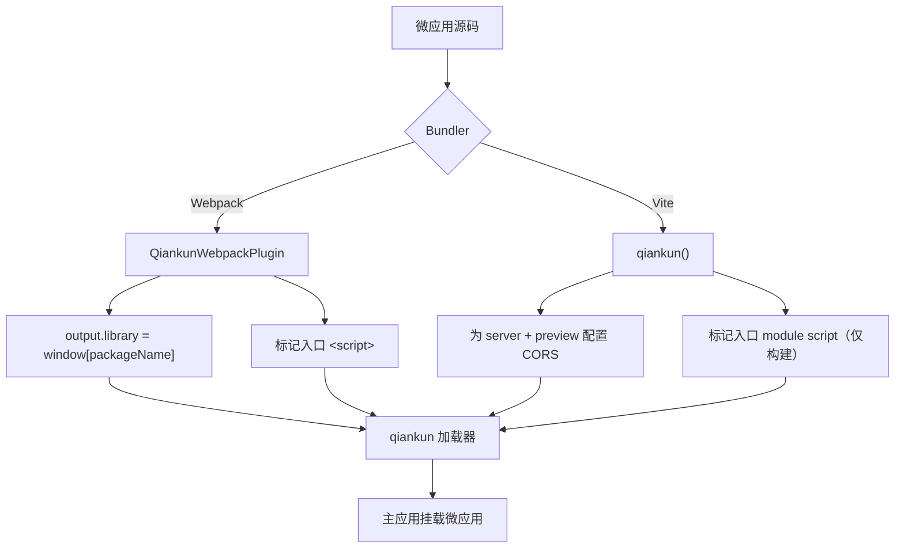

# @qiankunjs/bundler-plugin（Webpack 与 Vite）

用于让微应用产物能被 qiankun 加载的构建期插件。该 package 为每种 bundler 提供一个插件：一个 Webpack 插件，用于修正产物的 library 格式并标记入口 `<script>`；一个 Vite 插件，用于配置 CORS 并标记入口 module script。请将其作为**微应用**的 devDependency 安装 —— 主应用无需安装。

::: info 何时需要该插件
该插件自动完成 qiankun 加载器所依赖的两件事：把应用的 lifecycle 导出暴露到 sandbox 能读取的位置，以及为恰好一个 `<script>` 打上 [HTML-entry 加载器](/zh-CN/concepts/html-entry-loading)所依赖的 `entry` 属性。你也可以手动完成这两件事，但插件能在每次重新构建时保持它们正确无误。
:::

## 安装

```bash
npm install @qiankunjs/bundler-plugin --save-dev
```

Peer dependencies 被声明为**可选**，因此你只需安装自己实际使用的那个 bundler：

| Peer | 版本范围 | 可选 |
| --- | --- | --- |
| `webpack` | `^4.0.0 \|\| ^5.0.0` | 是 |
| `vite` | `>=5.0.0` | 是 |

::: warning 预发布版本
该 package 的版本为 `0.0.1-rc.1`。其 API 精简且形态稳定，但请将其视为发布候选版（release-candidate）。
:::

## 导出

该 package 有三个入口子路径。根路径与 `./webpack` 提供 Webpack 插件；`./vite` 提供 Vite 插件。

| 导入路径 | 导出 | 类型 |
| --- | --- | --- |
| `@qiankunjs/bundler-plugin` | `QiankunWebpackPlugin`（具名**且**默认导出）、`QiankunWebpackPluginOptions`（type） | class |
| `@qiankunjs/bundler-plugin/webpack` | `QiankunWebpackPlugin`（具名且默认导出） | class |
| `@qiankunjs/bundler-plugin/vite` | `qiankun`（具名且默认导出） | function |

```js
// 这三种写法都解析到同一个 Webpack 插件
const { QiankunWebpackPlugin } = require('@qiankunjs/bundler-plugin');
const { QiankunWebpackPlugin } = require('@qiankunjs/bundler-plugin/webpack');
import QiankunWebpackPlugin from '@qiankunjs/bundler-plugin/webpack';

// Vite 插件仅存在于 /vite 子路径下
import { qiankun } from '@qiankunjs/bundler-plugin/vite';
```

::: warning 不会自动探测入口
根路径导入解析到 **Webpack** 插件。不存在合并式或自动探测式的入口 —— Vite 应用必须从 `@qiankunjs/bundler-plugin/vite` 导入。
:::

## Webpack 插件 —— `QiankunWebpackPlugin`

一个标准的 Webpack 插件（实现了 `apply(compiler)`），同时兼容 Webpack 4 与 Webpack 5。它在构建时通过 `compiler.webpack?.version` 探测主版本号 —— 你无需对此进行配置。

```js
new QiankunWebpackPlugin(options?: QiankunWebpackPluginOptions)
```

### 配置项

```ts
interface QiankunWebpackPluginOptions {
  packageName?: string;
}
```

| 配置项 | 类型 | 默认值 | 说明 |
| --- | --- | --- | --- |
| `packageName` | `string` | `./package.json` 的 `name` 字段（缺失或无法读取时为 `''`） | 构建产物将其 lifecycle 导出挂载到的全局名称（`window[packageName]`）。 |

默认值通过读取当前工作目录下的 `package.json` 并返回其 `name` 得到。若该文件无法读取或解析，则名称解析为空字符串。

::: danger 空的 package name 会破坏解析
如果未提供 `packageName` 且 `package.json` 缺失或没有 `name`，则 library 名称会变为 `''`，应用的导出会落到 `window['']` 上，而 qiankun 无法解析它。请显式传入 `packageName`，或确保 `package.json` 有 `name`。

这里使用的名称必须与你在主应用 [registerMicroApps](/zh-CN/api/register-micro-apps) 调用中注册该微应用时所用的 `name` 一致。在示例中，Webpack 应用被注册为 `'webpack-app'`，并以相同的 library 名称构建。
:::

### `apply()` 做了什么

**1. 修正产物的 library 格式。**从而让产物将其 lifecycle 导出挂载到 `window[packageName]` 上 —— 即 [JS 沙箱](/zh-CN/concepts/js-sandbox)所读取的“classic”导出机制。

| | Webpack 5 | Webpack 4 |
| --- | --- | --- |
| `output.library` | `{ name: packageName, type: 'window' }` | `packageName` |
| `output.libraryTarget` | — | `'window'` |
| `output.globalObject` | — | `'window'` |
| `output.jsonpFunction` | — | `` `webpackJsonp_${packageName}` `` |

**2. 标记入口 `<script>`。**它挂接（tap）到 `html-webpack-plugin`，找到入口 chunk 产出的 JS 文件，并为生成的 HTML 中相匹配的 `<script>` 添加布尔属性 `entry`（若找不到匹配项，则回退到最后一个 script 标签）。结果为 `<script ... entry></script>`，加载器据此确定性地挑选入口。

::: warning 入口标记依赖 html-webpack-plugin
入口标记这一步仅在 plugins 数组中存在 `html-webpack-plugin` 时才会执行。若没有它，就不会产出 HTML 可供标记，该步骤会被静默跳过。
:::

该标记是**幂等的**：如果已有任意 script 携带 `entry` 属性，插件就会保持 HTML 原样不动。

### CORS 由你自己负责

与 Vite 插件不同，Webpack 插件**不会**配置 dev server。qiankun 会跨源获取微应用的 HTML 与资源，因此你必须自行为 `devServer` 添加宽松的 CORS。

### 示例：`webpack.config.js`

```js
const HtmlWebpackPlugin = require('html-webpack-plugin');
const { QiankunWebpackPlugin } = require('@qiankunjs/bundler-plugin');

module.exports = (env, argv) => {
  const isProduction = argv.mode === 'production';
  return {
    entry: './src/index.tsx',
    output: {
      publicPath: 'auto',
      clean: true,
      filename: isProduction ? '[name].[contenthash:8].js' : '[name].js',
    },
    plugins: [
      new HtmlWebpackPlugin({ template: './src/index.html' }),
      new QiankunWebpackPlugin(),
    ],
    devServer: {
      port: 7102,
      // qiankun fetches cross-origin — the plugin does NOT set this for you
      headers: { 'Access-Control-Allow-Origin': '*' },
      allowedHosts: 'all',
      hot: true,
    },
  };
};
```

微应用本身导出 lifecycle；在 `window` library target 下，它们会自动落到 `window[packageName]` 上，因此你**无需**手动赋值 `window[...]`：

```tsx [src/index.tsx]
export async function bootstrap() {}
export async function mount(props: { container?: Element }) {
  const el = props.container?.querySelector('#root') ?? document.getElementById('root');
  // ...render into el
}
export async function unmount(props: { container?: Element }) {
  // ...tear down
}

// standalone (not hosted) mode only — the plugin provides the window[...] binding under qiankun
if (!window.__POWERED_BY_QIANKUN__) {
  void bootstrap().then(() => mount({}));
}
```

完整的端到端演示见 [让 Webpack 应用适配 qiankun](/zh-CN/cookbook/prepare-a-webpack-app)。

## Vite 插件 —— `qiankun()`

一个无参数的插件工厂函数。qiankun 在 dev 与生产环境下都通过其 [ESM 沙箱](/zh-CN/concepts/esm-sandbox)**原生加载** Vite 应用 —— 不存在 SystemJS 或 legacy transform。该插件只处理加载相关的衔接工作。

```ts
qiankun(): Plugin
```

::: warning 不接受任何配置项
`qiankun()` 调用时不传任何参数。请勿臆造配置项 —— 它没有任何配置项。
:::

### 它做了什么

**1. 设置宽松的 CORS**，同时作用于 dev server 与 preview server，从而让主应用能够跨源获取入口 HTML 与整个 module graph：

```ts
{
  server:  { cors: true, headers: { 'Access-Control-Allow-Origin': '*' } },
  preview: { cors: true, headers: { 'Access-Control-Allow-Origin': '*' } },
}
```

**2. 标记入口 module script**，通过一个 `transformIndexHtml` 钩子（`order: 'post'`）实现 —— 但**仅作用于构建产出的 HTML**。它找到 src 与入口 chunk 相匹配的 `<script type="module" src=...>`，并为其添加 `entry` 属性（`<script type="module" ... entry>`），若无匹配项则回退到最后一个 module script。与 Webpack 插件一样，它是幂等的，若已存在 `entry` 属性则跳过。

::: info dev 环境刻意不做标记
在 `vite dev` 期间没有构建 chunk，因此该钩子会原样返回 HTML。这样做没问题，有两个原因：ESM 引擎在 dev 时通过应用的 **lifecycle 导出**来解析入口，而且 Vite 在其 dev HTML transform 过程中本就会剥离未知属性。入口标记只在构建时发生。
:::

### 示例：`vite.config.ts`

```ts
import { defineConfig } from 'vite';
import react from '@vitejs/plugin-react';
import { qiankun } from '@qiankunjs/bundler-plugin/vite';

export default defineConfig({
  plugins: [react(), qiankun()],
  server: { port: 7100, strictPort: true },
});
```

CORS 与入口标记都由插件处理；你通常只需设置一个 `server.port`。微应用以原生 ESM 的形式导出其 lifecycle —— 无需 UMD 或 library 封装：

```ts [src/main.tsx]
export async function bootstrap() {}
export async function mount(props: { container?: Element }) {
  const el = props.container?.querySelector('#root') ?? document.getElementById('root');
  // ...render into el
}
export async function unmount(props: { container?: Element }) {
  // ...tear down
}
```

以及 HTML 入口（dev 时按原样提供；构建产出的副本会被插件添加 `entry` 属性）：

```html [index.html]
<div id="root"></div>
<script type="module" src="/src/main.tsx" entry></script>
```

完整配置见 [让 Vite 应用适配 qiankun](/zh-CN/cookbook/prepare-a-vite-app)，以及 [create-qiankun](/zh-CN/ecosystem/create-qiankun) —— 它能脚手架生成一个已内置这套衔接配置的应用。

## Webpack 与 Vite 速览对比

| | Webpack 插件 | Vite 插件 |
| --- | --- | --- |
| 导入 | `@qiankunjs/bundler-plugin`（或 `/webpack`） | `@qiankunjs/bundler-plugin/vite` |
| 调用 | `new QiankunWebpackPlugin({ packageName? })` | `qiankun()`（无配置项） |
| 加载路径 | classic（`window` library） | 原生 ESM 沙箱 |
| 修正产物 library | 是（`window` target） | 否（原生 ESM 导出即 lifecycle） |
| 标记入口 script | 是（需要 `html-webpack-plugin`） | 是，**仅构建产出的 HTML** |
| 配置 CORS | 否 —— 需自行添加到 `devServer` | 是 —— `server` 与 `preview` |



## 注意事项

- **只能有一个入口 script。**如果有超过一个 `<script>` 携带 `entry` 属性，qiankun 的加载器会抛出 `QiankunError`。两个插件都是幂等的，且在已存在 `entry` 属性时跳过，因此请让插件来负责标记，而不要自己另行添加。
- **不要与被覆盖的 library 配置对抗。**Webpack 插件会覆盖 `output.library` / `libraryTarget` / `globalObject`（以及 Webpack 4 上的 `jsonpFunction`）。你所设置的任何冲突的 library 配置都会被替换掉。
- **注册名称必须与 library 名称一致。**`packageName`（Webpack）决定了 qiankun 读取的 `window[...]` 键；它必须等于你传给 [registerMicroApps](/zh-CN/api/register-micro-apps) 的 `name`。
- **以 CORS 提供第三方资源。**qiankun 会跨源获取每一个资源。请将 vendor 库本地化，或从会发送 `Access-Control-Allow-Origin` 的源提供它们 —— 不带 CORS 响应头的公共 CDN 会导致 fetch 失败。
- **本地开发时重新构建插件。**示例消费的是 `@qiankunjs/bundler-plugin` 构建后的 `dist`；如果你修改了插件，请在运行示例前重新构建 packages。
