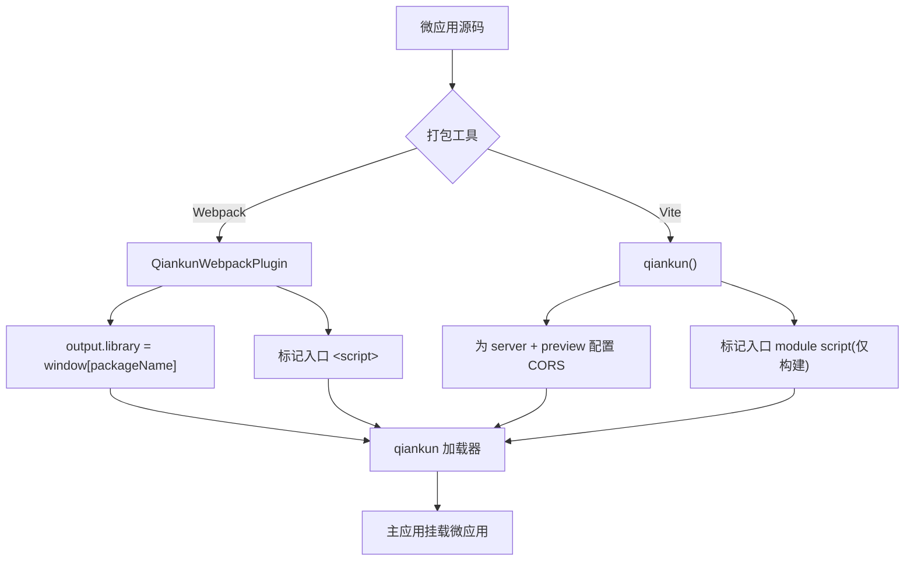

# @qiankunjs/bundler-plugin(Webpack 与 Vite)

构建期插件，负责把微应用的构建产物改造成 qiankun 能加载的样子。这个包按打包工具各提供一个插件：Webpack 插件负责修正输出的 library 格式、给入口 `<script>` 打标记；Vite 插件负责配置 CORS、给入口 module script 打标记。把它装进**微应用**的 devDependency 就行——主应用不需要它。

::: info 什么时候需要这个插件
qiankun 的加载器依赖两件事，插件把它们自动化了：一是把微应用的生命周期导出放到沙箱读得到的地方，二是给恰好一个 `<script>` 打上 `entry` 属性——[HTML entry 加载器](/zh-CN/concepts/html-entry-loading)就认这个属性。这两件事你手动做也能做，但插件的好处是每次重新构建都不会出错。
:::

## 安装

```bash
npm install @qiankunjs/bundler-plugin --save-dev
```

peer 依赖都声明成了 **optional**，所以你只需要装自己实际用的那个打包工具：

| Peer | 版本范围 | 可选 |
| --- | --- | --- |
| `webpack` | `^4.0.0 \|\| ^5.0.0` | 是 |
| `vite` | `>=5.0.0` | 是 |

::: warning 预发布版本
包的版本号是 `0.0.1-rc.1`。API 很小，形态也稳定，但请按 release-candidate 对待。
:::

## 导出

这个包有三个入口子路径。根路径和 `./webpack` 给你的是 Webpack 插件；`./vite` 给你的是 Vite 插件。

| 引入路径 | 导出 | 类型 |
| --- | --- | --- |
| `@qiankunjs/bundler-plugin` | `QiankunWebpackPlugin`(named **和** default)、`QiankunWebpackPluginOptions`(type) | class |
| `@qiankunjs/bundler-plugin/webpack` | `QiankunWebpackPlugin`(named 和 default) | class |
| `@qiankunjs/bundler-plugin/vite` | `qiankun`(named 和 default) | function |

```js
// all three resolve to the SAME Webpack plugin
const { QiankunWebpackPlugin } = require('@qiankunjs/bundler-plugin');
const { QiankunWebpackPlugin } = require('@qiankunjs/bundler-plugin/webpack');
import QiankunWebpackPlugin from '@qiankunjs/bundler-plugin/webpack';

// the Vite plugin lives ONLY at the /vite subpath
import { qiankun } from '@qiankunjs/bundler-plugin/vite';
```

::: warning 入口不会自动识别
根路径引入拿到的是 **Webpack** 插件。没有合并入口，也没有自动识别——Vite 应用必须从 `@qiankunjs/bundler-plugin/vite` 引入。
:::

## Webpack 插件 — `QiankunWebpackPlugin`

一个标准的 Webpack 插件(实现了 `apply(compiler)`),Webpack 4 和 Webpack 5 都能用。它在构建时从 `compiler.webpack?.version` 读出主版本号——你不用去配。

```js
new QiankunWebpackPlugin(options?: QiankunWebpackPluginOptions)
```

### 选项

```ts
interface QiankunWebpackPluginOptions {
  packageName?: string;
}
```

| 选项 | 类型 | 默认值 | 说明 |
| --- | --- | --- | --- |
| `packageName` | `string` | `./package.json` 里的 `name` 字段(读不到就是 `''`) | 构建产物把生命周期导出挂到的全局名(`window[packageName]`)。 |

默认值是这么来的：读当前工作目录下的 `package.json`，取它的 `name`。如果这个文件读不到或者解析不了，名字就是空字符串。

::: danger 空的 package name 会让解析失败
如果不传 `packageName`，而 `package.json` 又不存在或者没有 `name`,library 名就成了 `''`，微应用的导出会落到 `window['']` 上，qiankun 解析不到。要么显式传 `packageName`，要么确保 `package.json` 里有 `name`。

这里用的名字，必须和你在主应用 [registerMicroApps](/zh-CN/api/register-micro-apps) 里给这个微应用注册的 `name` 一致。示例里那个 Webpack 应用注册名是 `'webpack-app'`，构建时用的 library 名也是同一个。
:::

### `apply()` 做了什么

**1. 修正输出的 library 格式。**让构建产物把生命周期导出挂到 `window[packageName]` 上——这就是 [JS 沙箱](/zh-CN/concepts/js-sandbox)读取的那套“经典”导出机制。

| | Webpack 5 | Webpack 4 |
| --- | --- | --- |
| `output.library` | `{ name: packageName, type: 'window' }` | `packageName` |
| `output.libraryTarget` | — | `'window'` |
| `output.globalObject` | — | `'window'` |
| `output.jsonpFunction` | — | `` `webpackJsonp_${packageName}` `` |

**2. 给入口 `<script>` 打标记。**它挂到 `html-webpack-plugin` 上，找到入口 chunk 产出的那个 JS 文件，给生成的 HTML 里匹配上的 `<script>` 加一个布尔属性 `entry`(匹配不到就退而给最后一个 script 标签加)。结果就是 `<script ... entry></script>`，加载器靠它稳定地挑出入口。

::: warning 入口打标记需要 html-webpack-plugin
入口打标记这一步只有在 plugins 数组里有 `html-webpack-plugin` 时才会跑。没有它就没有 HTML 可标记，这一步会被静默跳过。
:::

打标记是**幂等**的：只要已经有某个 script 带了 `entry` 属性，插件就不动这份 HTML。

### CORS 得你自己管

跟 Vite 插件不一样，Webpack 插件**不**帮你配 dev server。qiankun 跨源抓取微应用的 HTML 和各类资源，所以你得自己给 `devServer` 加上宽松的 CORS。

### 示例：`webpack.config.js`

```js
const HtmlWebpackPlugin = require('html-webpack-plugin');
const { QiankunWebpackPlugin } = require('@qiankunjs/bundler-plugin');

module.exports = (env, argv) => {
  const isProduction = argv.mode === 'production';
  return {
    entry: './src/index.tsx',
    output: {
      publicPath: 'auto',
      clean: true,
      filename: isProduction ? '[name].[contenthash:8].js' : '[name].js',
    },
    plugins: [
      new HtmlWebpackPlugin({ template: './src/index.html' }),
      new QiankunWebpackPlugin(),
    ],
    devServer: {
      port: 7102,
      // qiankun fetches cross-origin — the plugin does NOT set this for you
      headers: { 'Access-Control-Allow-Origin': '*' },
      allowedHosts: 'all',
      hot: true,
    },
  };
};
```

微应用本身负责导出生命周期；用了 `window` 的 library target，它们会自动落到 `window[packageName]` 上，所以你**不用**手动去赋值 `window[...]`:

```tsx [src/index.tsx]
export async function bootstrap() {}
export async function mount(props: { container?: Element }) {
  const el = props.container?.querySelector('#root') ?? document.getElementById('root');
  // ...render into el
}
export async function unmount(props: { container?: Element }) {
  // ...tear down
}

// standalone (not hosted) mode only — the plugin provides the window[...] binding under qiankun
if (!window.__POWERED_BY_QIANKUN__) {
  void bootstrap().then(() => mount({}));
}
```

完整的端到端流程见 [让 Webpack 应用接入 qiankun](/zh-CN/cookbook/prepare-a-webpack-app)。

## Vite 插件 — `qiankun()`

一个零参数的插件工厂。qiankun 在开发和生产环境下都**通过它的 [ESM 沙箱](/zh-CN/concepts/esm-sandbox)原生加载** Vite 应用——没有 SystemJS，也没有 legacy transform。这个插件只处理加载相关的杂活。

```ts
qiankun(): Plugin
```

::: warning 不接收任何参数
`qiankun()` 调用时不传参数。别自己臆造选项——它没有选项。
:::

### 它做了什么

**1. 配置宽松的 CORS**，对 dev server 和 preview server 都配，好让主应用能跨源抓取入口 HTML 和整张 module graph:

```ts
{
  server:  { cors: true, headers: { 'Access-Control-Allow-Origin': '*' } },
  preview: { cors: true, headers: { 'Access-Control-Allow-Origin': '*' } },
}
```

**2. 给入口 module script 打标记**，通过一个 `transformIndexHtml` 钩子(`order: 'post'`)完成——但**只在构建产出的 HTML 上做**。它找到 src 匹配入口 chunk 的那个 `<script type="module" src=...>`，给它加上 `entry` 属性(`<script type="module" ... entry>`)，匹配不到就退而给最后一个 module script 加。和 Webpack 插件一样，它是幂等的，已经有 `entry` 属性就跳过。

::: info 开发环境有意不打标记
`vite dev` 期间没有构建 chunk，所以钩子原样返回 HTML。这么做没问题，有两个原因：开发时 ESM 引擎靠微应用的 **lifecycle 导出**来定位入口；而且 Vite 在它的 dev HTML transform 里本来就会把未知属性剥掉。入口打标记只在构建时发生。
:::

### 示例：`vite.config.ts`

```ts
import { defineConfig } from 'vite';
import react from '@vitejs/plugin-react';
import { qiankun } from '@qiankunjs/bundler-plugin/vite';

export default defineConfig({
  plugins: [react(), qiankun()],
  server: { port: 7100, strictPort: true },
});
```

CORS 和入口打标记都由插件包办了，你一般只需要设一个 `server.port`。微应用以原生 ESM 导出生命周期——不需要 UMD，也不需要 library 包装：

```ts [src/main.tsx]
export async function bootstrap() {}
export async function mount(props: { container?: Element }) {
  const el = props.container?.querySelector('#root') ?? document.getElementById('root');
  // ...render into el
}
export async function unmount(props: { container?: Element }) {
  // ...tear down
}
```

HTML 入口(开发时原样提供；构建产出的那份会被插件加上 `entry` 属性):

```html [index.html]
<div id="root"></div>
<script type="module" src="/src/main.tsx" entry></script>
```

完整配置见 [让 Vite 应用接入 qiankun](/zh-CN/cookbook/prepare-a-vite-app)；想直接生成一个已经接好线的应用，见 [create-qiankun](/zh-CN/ecosystem/create-qiankun)。

## Webpack 与 Vite 速览

| | Webpack 插件 | Vite 插件 |
| --- | --- | --- |
| 引入 | `@qiankunjs/bundler-plugin`(或 `/webpack`) | `@qiankunjs/bundler-plugin/vite` |
| 调用 | `new QiankunWebpackPlugin({ packageName? })` | `qiankun()`(无选项) |
| 加载路径 | 经典(`window` library) | 原生 ESM 沙箱 |
| 修正输出 library | 是(`window` target) | 否(原生 ESM 导出本身就是生命周期) |
| 标记入口 script | 是(需要 `html-webpack-plugin`) | 是，**仅构建产出的 HTML** |
| 配置 CORS | 否——自己加到 `devServer` | 是——`server` 和 `preview` |



## 坑

- **入口 script 只能有一个。**如果有超过一个 `<script>` 带 `entry` 属性，qiankun 的加载器会抛 `QiankunError`。两个插件都是幂等的，已经有 `entry` 属性就跳过，所以让插件来负责打标记，别自己再加一个。
- **别跟被覆盖的 library 配置对着干。**Webpack 插件会覆盖 `output.library` / `libraryTarget` / `globalObject`(Webpack 4 上还有 `jsonpFunction`)。你设的任何冲突的 library 配置都会被替换掉。
- **注册名必须和 library 名一致。**`packageName`(Webpack)决定了 qiankun 读取的 `window[...]` 键；它必须等于你传给 [registerMicroApps](/zh-CN/api/register-micro-apps) 的 `name`。
- **第三方资源也要带 CORS 提供。**qiankun 跨源抓取每一个资源。vendor 库要么本地打包进来，要么从一个会发 `Access-Control-Allow-Origin` 的源提供——不带 CORS 头的公共 CDN 会让 fetch 直接失败。
- **本地开发时记得重新构建插件。**示例引用的是 `@qiankunjs/bundler-plugin` 构建出的 `dist`；你改了插件，得先重新 build packages 再跑示例。
