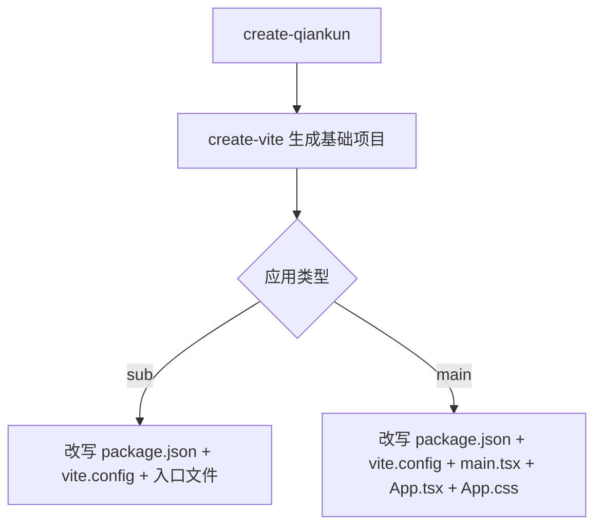
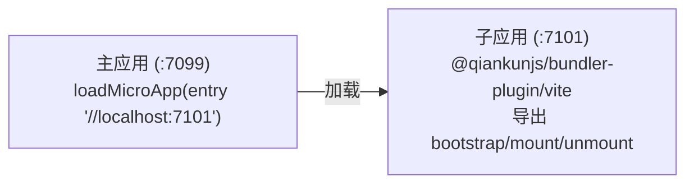

# create-qiankun

`create-qiankun` 是 qiankun 3.0 的官方脚手架。它会生成一个 [Vite](https://vite.dev) 项目——主应用或子应用——并对生成的产物进行改写，从而接入 qiankun。由于 qiankun v3 通过其 [ESM 沙箱](/zh-CN/concepts/esm-sandbox)原生加载 Vite 应用，因此不再需要专门的 SystemJS 或所谓的「qiankun 构建模式」：普通的 `dev`、`build` 和 `preview` 产物开箱即可被加载。

## 用途

脚手架做两件事：

1. 委托上游的 [`create-vite`](https://github.com/vitejs/vite/tree/main/packages/create-vite) 生成一个标准的 React 或 Vue 项目。
2. 覆写一小部分文件（`package.json`、`vite.config.*`、入口文件，以及主应用的 `App.tsx`/`App.css`），使项目开箱即用地支持 qiankun。

生成的子应用暴露了 qiankun 生命周期，同时仍可独立运行。生成的主应用已预先配置好，可加载该子应用。两者的默认端口相互匹配，无需额外配置即可连通。

## 环境要求

- Node.js `>=20.19`（Vite 所需）。

## 调用方式

使用你的包管理器的 create/exec 命令运行脚手架：

::: code-group

```bash [npm]
npx create-qiankun@latest
```

```bash [yarn]
yarn create qiankun@latest
```

```bash [pnpm]
pnpm dlx create-qiankun@latest
```

:::

在不带参数时，CLI 会以交互方式依次询问应用类型、名称，以及（子应用的）模板。你也可以在命令行上传入其中任意一项，从而跳过对应的提问。

```bash
# 生成一个名为 "my-app" 的 React + TypeScript 子应用
npx create-qiankun@latest my-app --type sub --template react-ts

# 生成主应用
npx create-qiankun@latest my-main --type main
```

## CLI 参数与选项

| 参数 | 别名 | 取值 | 默认值 | 适用于 |
| --- | --- | --- | --- | --- |
| `<app-name>`（位置参数） | — | 必须匹配 `/^[a-z0-9-]+$/` | 交互询问 | 两者 |
| `--type` | `-T` | `main` \| `sub` | `sub` | 两者 |
| `--template` | `-t` | `react-ts` \| `react` \| `vue-ts` \| `vue` | 交互询问 | 仅子应用 |

### 应用名称

位置参数形式的应用名称只能包含小写字母、数字和连字符。它会成为 `package.json` 的 `name`，并且对于子应用，它还是生命周期发布所用的全局键（`window[appName]`，见下文）。非法的名称会被拒绝，并提示：

```
App name can only contain lowercase letters, numbers, and hyphens
```

当省略时，提问的默认值为主应用的 `qiankun-main-app` 或子应用的 `qiankun-sub-app`。

### 应用类型

`--type`（或 `-T`）用于选择 `main` 或 `sub`。未指定时默认为 sub。无法识别的取值会以 `Invalid type: ...` 退出。

### 模板

`--template`（或 `-t`）仅用于为**子应用**选择框架模板。可用模板：

| 取值 | 说明 |
| --- | --- |
| `react-ts` | React + TypeScript |
| `react` | React |
| `vue-ts` | Vue + TypeScript |
| `vue` | Vue |

::: warning 主应用始终是 React + TypeScript
模板仅适用于子应用。主应用始终以 `react-ts` 生成。将 `--template` 与 `--type main` 一起传入会直接报错：

```
The --template option is only supported for sub apps.
Please remove --template when using --type main.
```

另请注意，传入 `--template` 意味着这是一个子应用，因此会跳过应用类型的提问。
:::

## 交互式提问

当相关选项未提供时，CLI 会就此发起提问：

- **应用类型** —— 在 `Main App (主应用)` 与 `Sub App (子应用)` 之间进行选择。当传入了 `--type` 或 `--template` 时跳过。
- **应用名称** —— 一个文本输入，按 `/^[a-z0-9-]+$/` 校验。当传入了位置参数名称时跳过。
- **模板** —— 在上述四个模板之间进行选择。仅对子应用显示；当传入了 `--template` 或应用类型为主应用时跳过。

取消任何提问都会打印 `Operation cancelled` 并退出。

## 目标目录（感知 workspace）

在生成之前，CLI 会检查当前目录的**父目录**是否包含 `pnpm-workspace.yaml`：

- 在 pnpm workspace 内部，应用会生成到 `<workspaceRoot>/packages/<app-name>`。
- 否则，生成到 `<cwd>/<app-name>`。

如果目标目录已存在，CLI 会以 `Directory ... already exists` 退出。后续步骤输出中的 `cd` 一行会反映解析后的路径（workspace 内部为 `packages/<app-name>`，否则为 `<app-name>`）。

## 生成内容

基础项目由 `create-vite` 使用其标准模板生成，随后 create-qiankun 覆写特定文件。



### 子应用

子应用的改写分三步进行。

**`package.json`** —— name 被设置为你的应用名称，并添加 qiankun 相关依赖。版本号是固定的字符串，而非解析后的范围（这是一个 RC 阶段的脚手架）：

| 依赖 | 位置 | 版本 |
| --- | --- | --- |
| `qiankun` | `dependencies` | `rc` |
| `@qiankunjs/react` 或 `@qiankunjs/vue` | `dependencies` | `latest` |
| `@qiankunjs/bundler-plugin` | `devDependencies` | `rc` |

框架绑定（[`@qiankunjs/react`](/zh-CN/ecosystem/react) 或 [`@qiankunjs/vue`](/zh-CN/ecosystem/vue)）作为便利项被加入，尽管生成的入口文件并未导入它——它就放在那里供你使用。

**`vite.config.ts`** —— 导入框架插件和 qiankun [bundler 插件](/zh-CN/ecosystem/bundler-plugin)，并将开发服务器端口设置为 `7101`。

::: code-group

```ts [react-ts]
import { defineConfig } from 'vite';
import react from '@vitejs/plugin-react';
import { qiankun } from '@qiankunjs/bundler-plugin/vite';

// https://vite.dev/config/
export default defineConfig({
  plugins: [react(), qiankun()],
  server: {
    // matches the sub-app entry preconfigured in a create-qiankun main app,
    // adjust it per app when you scaffold multiple sub apps
    port: 7101,
  },
});
```

```ts [vue-ts]
import { defineConfig } from 'vite';
import vue from '@vitejs/plugin-vue';
import { qiankun } from '@qiankunjs/bundler-plugin/vite';

// https://vite.dev/config/
export default defineConfig({
  plugins: [vue(), qiankun()],
  server: {
    // matches the sub-app entry preconfigured in a create-qiankun main app,
    // adjust it per app when you scaffold multiple sub apps
    port: 7101,
  },
});
```

:::

**入口文件**（`src/main.tsx` / `src/main.ts`）—— 替换为一个带 qiankun 生命周期的入口。它导出 `bootstrap`、`mount` 和 `unmount`，并在运行于 qiankun 之下时将它们发布到 `window[appName]`；否则自行独立渲染。

::: code-group

```tsx [react]
import React from 'react';
import ReactDOM from 'react-dom/client';
import App from './App';
import './index.css';

const appName = 'my-app';
let root: ReactDOM.Root | undefined;

function render(props: { container?: Element } = {}) {
  const container = props.container?.querySelector('#root') ?? document.getElementById('root');
  if (!container) return;

  root = ReactDOM.createRoot(container);
  root.render(
    <React.StrictMode>
      <App />
    </React.StrictMode>,
  );
}

export async function bootstrap() {
  return Promise.resolve();
}

export async function mount(props: { container?: Element }) {
  render(props);
}

export async function unmount(props: { container?: Element }) {
  if (root) {
    root.unmount();
    root = undefined;
  }
  const container = props.container?.querySelector('#root') ?? document.getElementById('root');
  if (container) {
    container.innerHTML = '';
  }
}

declare global {
  interface Window {
    __POWERED_BY_QIANKUN__?: boolean;
    [key: string]: unknown;
  }
}

if (window.__POWERED_BY_QIANKUN__) {
  window[appName] = { bootstrap, mount, unmount };
} else {
  render();
}
```

```ts [vue]
import { createApp } from 'vue';
import App from './App.vue';
import './style.css';

const appName = 'my-app';
let app: ReturnType<typeof createApp> | undefined;

function render(props: { container?: Element } = {}) {
  const container = props.container?.querySelector('#app') ?? document.getElementById('app');
  if (!container) return;

  app = createApp(App);
  app.mount(container);
}

export async function bootstrap() {
  return Promise.resolve();
}

export async function mount(props: { container?: Element }) {
  render(props);
}

export async function unmount(props: { container?: Element }) {
  if (app) {
    app.unmount();
    app = undefined;
  }
  const container = props.container?.querySelector('#app') ?? document.getElementById('app');
  if (container) {
    container.innerHTML = '';
  }
}

declare global {
  interface Window {
    __POWERED_BY_QIANKUN__?: boolean;
    [key: string]: unknown;
  }
}

if (window.__POWERED_BY_QIANKUN__) {
  window[appName] = { bootstrap, mount, unmount };
} else {
  render();
}
```

:::

::: info
`__POWERED_BY_QIANKUN__` 是 qiankun 在应用运行于容器内期间设置到沙箱 window 上的一个全局变量。入口用它来在独立渲染与生命周期导出之间做出决定。关于这些钩子如何被调用，参见[微应用生命周期与 props](/zh-CN/concepts/lifecycle-and-props)。对于非 TypeScript 模板，会省略 `declare global` 块；其余部分完全相同。

对于子应用，`create-vite` 默认的 `App` 组件被保留原样——你从这里开始构建自己的 UI。
:::

### 主应用

主应用始终是 `react-ts`，并分五步进行改写。

**`package.json`** —— 设置 name，并将版本为 `rc` 的 `qiankun` 加入 `dependencies`。不添加 bundler 插件或框架绑定，因为主应用并不构建微应用 bundle。

**`vite.config.ts`** —— 一份端口为 `7099` 的普通 React 配置。qiankun bundler 插件不会应用到主应用。

```ts
import { defineConfig } from 'vite';
import react from '@vitejs/plugin-react';

export default defineConfig({
  plugins: [react()],
  server: {
    port: 7099,
  },
});
```

**`src/main.tsx`** —— 一个常规的 React 根渲染，后面跟着一段被注释掉的、基于路由的替代方案，使用了 [`registerMicroApps`](/zh-CN/api/register-micro-apps) 与 [`start`](/zh-CN/api/start)：

```tsx
import React from 'react';
import ReactDOM from 'react-dom/client';
import App from './App';
import './index.css';

ReactDOM.createRoot(document.getElementById('root')!).render(
  <React.StrictMode>
    <App />
  </React.StrictMode>,
);

// ============================================================
// Alternative: Route-based micro-app loading
// Uncomment the following code to use registerMicroApps + start
// instead of the manual loadMicroApp approach in App.tsx
// ============================================================
//
// import { registerMicroApps, start } from 'qiankun';
//
// registerMicroApps([
//   {
//     name: 'sub-app',
//     entry: '//localhost:7101',
//     container: '#micro-app-container',
//     activeRule: '/sub-app',
//   },
// ]);
//
// start();
```

**`src/App.tsx`** —— 接线的示范。它使用 [`loadMicroApp`](/zh-CN/api/load-micro-app) 手动加载子应用，跟踪 mount promise 以呈现加载中/错误 UI，并在清理时执行 unmount：

```tsx
import { useEffect, useRef, useState } from 'react';
import { loadMicroApp } from 'qiankun';
import type { MicroApp } from 'qiankun';
import './App.css';

function App() {
  const containerRef = useRef<HTMLDivElement>(null);
  const microAppRef = useRef<MicroApp | null>(null);
  const [loading, setLoading] = useState(false);
  const [error, setError] = useState<string | null>(null);

  useEffect(() => {
    let isUnmounted = false;

    if (!containerRef.current) return;

    setLoading(true);
    setError(null);

    microAppRef.current = loadMicroApp(
      {
        name: 'sub-app',
        entry: '//localhost:7101',
        container: containerRef.current,
      },
      // sandbox is on by default; kept explicit so you know where to configure it.
      // styleIsolation: true additionally scopes the sub-app css with @scope
      { sandbox: true },
    );

    microAppRef.current.mountPromise
      .then(() => {
        if (!isUnmounted) {
          setLoading(false);
        }
      })
      .catch((err: unknown) => {
        if (!isUnmounted) {
          setError(err instanceof Error ? err.message : 'Failed to load micro app');
          setLoading(false);
        }
      });

    return () => {
      isUnmounted = true;
      microAppRef.current?.unmount();
      microAppRef.current = null;
    };
  }, []);

  return (
    <div className="main-app">
      <header className="main-app-header">
        <h1>Qiankun Main App</h1>
      </header>
      <main className="main-app-content">
        {loading && <div className="loading">Loading micro app...</div>}
        {error && <div className="error">Error: {error}</div>}
        <div ref={containerRef} id="micro-app-container" />
      </main>
    </div>
  );
}

export default App;
```

**`src/App.css`** —— header、content、`.loading`/`.error` 状态以及 `#micro-app-container` 的样式。

::: tip styleIsolation 与 @scope
生成的 `App.tsx` 中的注释指向 qiankun 在此处接受的两个选项。`sandbox`（默认为 `true`）启用 [JS 沙箱](/zh-CN/concepts/js-sandbox)；`styleIsolation: true` 则额外通过运行时的 [`@scope`](/zh-CN/concepts/style-isolation) 策略对子应用的 CSS 进行作用域隔离。这是脚手架示例仅设置的两个字段——完整字段集参见 [AppConfiguration](/zh-CN/api/configuration)。
:::

## 主应用与子应用如何连通

两个生成的项目已预先配置为协同工作：



- 子应用在 **7101** 端口上运行自己的 Vite 开发服务器，并暴露 qiankun 生命周期。
- 主应用在 **7099** 端口上运行，并从 `//localhost:7101` 加载子应用。

子应用的默认端口与主应用硬编码的 entry 是有意匹配的。若要生成多个子应用，请更改每个子应用的 `server.port`（生成的 `vite.config` 中的一段注释对此有说明），并在主应用中添加相匹配的 `loadMicroApp`/`registerMicroApps` 条目。参见[运行多个微应用实例](/zh-CN/cookbook/run-multiple-instances)。

## 后续步骤输出

生成完成后，CLI 会打印 `Done!`，随后是需要运行的命令。对于子应用：

```bash
cd my-app
pnpm install
pnpm dev              # Run standalone (loadable by qiankun as-is)
pnpm build            # Build (the ESM output is qiankun-ready)
```

对于主应用，最后两行是普通的 `pnpm dev` / `pnpm build`。当在 pnpm workspace 内部生成时，`cd` 路径为 `packages/<app-name>`。

::: info 没有 SystemJS 构建模式
与 qiankun 2.x 需要 UMD/library 构建配置不同，v3 通过 [ESM 沙箱](/zh-CN/concepts/esm-sandbox)原生加载 Vite 的 ESM 产物。标准的 `dev`、`build` 和 `preview` 产物均已就绪可供 qiankun 使用。若要改造现有应用而非新建脚手架，参见[让 Vite 应用支持 qiankun](/zh-CN/cookbook/prepare-a-vite-app)。
:::

## 相关

- [@qiankunjs/bundler-plugin](/zh-CN/ecosystem/bundler-plugin) —— 子应用所使用的 Vite 与 Webpack 插件。
- [loadMicroApp](/zh-CN/api/load-micro-app) 与 [registerMicroApps](/zh-CN/api/register-micro-apps) —— 生成的主应用中展示的两种加载模式。
- [快速开始](/zh-CN/guide/getting-started)与[教程](/zh-CN/tutorial/index) —— 一步步搭建同样的组合。
