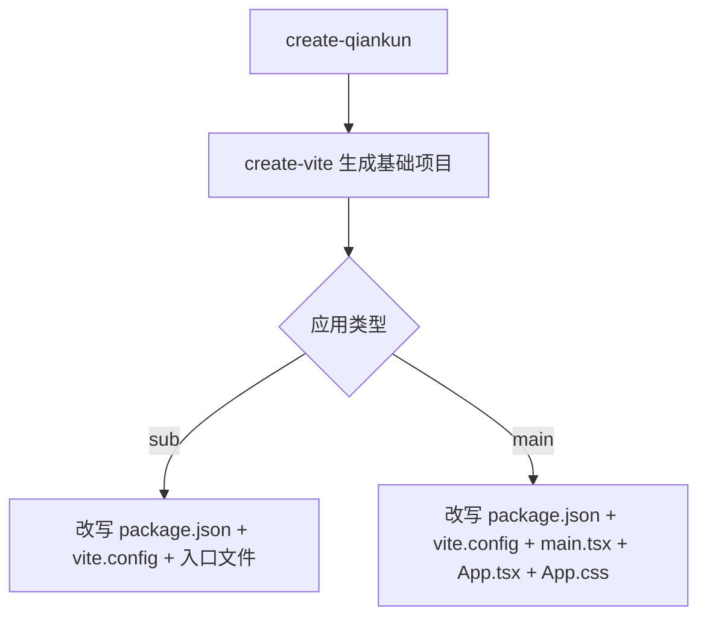
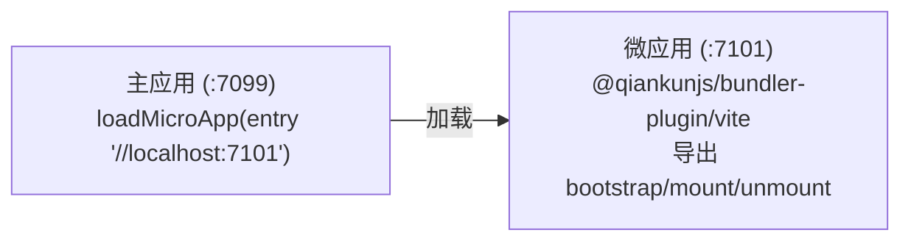

# create-qiankun

`create-qiankun` 是 qiankun 3.0 的官方脚手架。它生成一个 [Vite](https://vite.dev) 项目——主应用或微应用二选一——再对生成的产物做一层改写，把 qiankun 需要的东西接上。qiankun v3 通过 [ESM 沙箱](/zh-CN/concepts/esm-sandbox)原生加载 Vite 应用，所以这里没有单独的 SystemJS 产物，也没有所谓的 "qiankun 构建模式":平常的 `dev`、`build`、`preview` 产出的东西，拿过来就能被加载。

## 它做了什么

脚手架就干两件事：

1. 把生成基础项目的活交给上游的 [`create-vite`](https://github.com/vitejs/vite/tree/main/packages/create-vite)，产出一个标准的 React 或 Vue 项目。
2. 覆写其中一小撮文件(`package.json`、`vite.config.*`、入口文件，主应用还包括 `App.tsx`/`App.css`)，让项目开箱就是 qiankun-ready 的状态。

生成的微应用会导出 qiankun 生命周期，同时保留独立运行的能力。生成的主应用则预先配好了去加载那个微应用。两边的默认端口是对上的，不用再改配置就能连起来。

## 环境要求

- Node.js `>=20.19`(Vite 的要求)。

## 怎么跑

用你的包管理器的 create/exec 命令来跑：

::: code-group

```bash [npm]
npx create-qiankun@latest
```

```bash [yarn]
yarn create qiankun@latest
```

```bash [pnpm]
pnpm dlx create-qiankun@latest
```

:::

不带任何参数时，CLI 会交互式地问你应用类型、名字，以及(微应用的)模板。这些也都可以在命令行上直接给出，对应的那一问就跳过了。

```bash
# scaffold a React + TypeScript sub app named "my-app"
npx create-qiankun@latest my-app --type sub --template react-ts

# scaffold the main app
npx create-qiankun@latest my-main --type main
```

## 命令行参数与选项

| 参数 | 别名 | 取值 | 默认值 | 适用对象 |
| --- | --- | --- | --- | --- |
| `<app-name>`(位置参数) | — | 必须匹配 `/^[a-z0-9-]+$/` | 交互询问 | 两者都用 |
| `--type` | `-T` | `main` \| `sub` | `sub` | 两者都用 |
| `--template` | `-t` | `react-ts` \| `react` \| `vue-ts` \| `vue` | 交互询问 | 仅微应用 |

### 应用名

位置参数里的应用名只能包含小写字母、数字和连字符。它会成为 `package.json` 的 `name`；对微应用来说，它还是生命周期挂载到全局上用的那个键(`window[appName]`，见下文)。名字不合法会被直接拒掉：

```
App name can only contain lowercase letters, numbers, and hyphens
```

不填的话，主应用默认叫 `qiankun-main-app`，微应用默认叫 `qiankun-sub-app`。

### 应用类型

`--type`(或 `-T`)在 `main` 和 `sub` 之间选，不指定时默认是 `sub`。给了它不认识的值会以 `Invalid type: ...` 退出。

### 模板

`--template`(或 `-t`)只对**微应用**选框架模板。可选的有：

| 取值 | 说明 |
| --- | --- |
| `react-ts` | React + TypeScript |
| `react` | React |
| `vue-ts` | Vue + TypeScript |
| `vue` | Vue |

::: warning 主应用一律是 React + TypeScript
模板只对微应用生效。主应用永远按 `react-ts` 生成。把 `--template` 和 `--type main` 一起传是硬报错：

```
The --template option is only supported for sub apps.
Please remove --template when using --type main.
```

另外，传了 `--template` 就等于表明这是个微应用，应用类型那一问也就跳过了。
:::

## 交互式询问

对应的选项没在命令行给出时，CLI 会一项项来问：

- **应用类型** —— 在 `Main App (主应用)` 和 `Sub App (子应用)` 之间选。传了 `--type` 或 `--template` 时跳过。
- **应用名** —— 一个文本输入，按 `/^[a-z0-9-]+$/` 校验。已经给了位置参数名字时跳过。
- **模板** —— 在上面四个模板里选。只有微应用才问；传了 `--template`、或应用类型是主应用时跳过。

任何一问按取消，都会打印 `Operation cancelled` 然后退出。

## 目标目录(认 workspace)

生成之前，CLI 会看当前目录的**父目录**里有没有 `pnpm-workspace.yaml`:

- 在 pnpm workspace 里，应用生成到 `<workspaceRoot>/packages/<app-name>`。
- 否则，生成到 `<cwd>/<app-name>`。

目标目录已经存在的话，CLI 会以 `Directory ... already exists` 退出。后续步骤输出里的那行 `cd`，走的是解析后的实际路径(在 workspace 里是 `packages/<app-name>`，否则是 `<app-name>`)。

## 生成出来的东西

基础项目由 `create-vite` 用它的标准模板产出，然后 create-qiankun 覆写掉特定的几个文件。



### 微应用

微应用分三步改写。

**`package.json`** —— 把 name 设成你的应用名，加上 qiankun 相关依赖。版本号是写死的字符串，不是解析出来的范围(毕竟这是 RC 阶段的脚手架):

| 依赖 | 位置 | 版本 |
| --- | --- | --- |
| `qiankun` | `dependencies` | `rc` |
| `@qiankunjs/react` 或 `@qiankunjs/vue` | `dependencies` | `latest` |
| `@qiankunjs/bundler-plugin` | `devDependencies` | `rc` |

框架绑定([`@qiankunjs/react`](/zh-CN/ecosystem/react) 或 [`@qiankunjs/vue`](/zh-CN/ecosystem/vue))是顺手给你加上的——虽然生成的入口文件并没有 import 它，但放在那儿等你要用的时候直接用。

**`vite.config.ts`** —— import 框架插件和 qiankun 的 [bundler 插件](/zh-CN/ecosystem/bundler-plugin)，并把开发服务器端口设成 `7101`。

::: code-group

```ts [react-ts]
import { defineConfig } from 'vite';
import react from '@vitejs/plugin-react';
import { qiankun } from '@qiankunjs/bundler-plugin/vite';

// https://vite.dev/config/
export default defineConfig({
  plugins: [react(), qiankun()],
  server: {
    // matches the sub-app entry preconfigured in a create-qiankun main app,
    // adjust it per app when you scaffold multiple sub apps
    port: 7101,
  },
});
```

```ts [vue-ts]
import { defineConfig } from 'vite';
import vue from '@vitejs/plugin-vue';
import { qiankun } from '@qiankunjs/bundler-plugin/vite';

// https://vite.dev/config/
export default defineConfig({
  plugins: [vue(), qiankun()],
  server: {
    // matches the sub-app entry preconfigured in a create-qiankun main app,
    // adjust it per app when you scaffold multiple sub apps
    port: 7101,
  },
});
```

:::

**入口文件**(`src/main.tsx` / `src/main.ts`)—— 换成一个导出 qiankun 生命周期的入口。它导出 `bootstrap`、`mount`、`unmount`；在 qiankun 里跑时把它们发布到 `window[appName]` 上，否则就自己独立渲染。

::: code-group

```tsx [react]
import React from 'react';
import ReactDOM from 'react-dom/client';
import App from './App';
import './index.css';

const appName = 'my-app';
let root: ReactDOM.Root | undefined;

function render(props: { container?: Element } = {}) {
  const container = props.container?.querySelector('#root') ?? document.getElementById('root');
  if (!container) return;

  root = ReactDOM.createRoot(container);
  root.render(
    <React.StrictMode>
      <App />
    </React.StrictMode>,
  );
}

export async function bootstrap() {
  return Promise.resolve();
}

export async function mount(props: { container?: Element }) {
  render(props);
}

export async function unmount(props: { container?: Element }) {
  if (root) {
    root.unmount();
    root = undefined;
  }
  const container = props.container?.querySelector('#root') ?? document.getElementById('root');
  if (container) {
    container.innerHTML = '';
  }
}

declare global {
  interface Window {
    __POWERED_BY_QIANKUN__?: boolean;
    [key: string]: unknown;
  }
}

if (window.__POWERED_BY_QIANKUN__) {
  window[appName] = { bootstrap, mount, unmount };
} else {
  render();
}
```

```ts [vue]
import { createApp } from 'vue';
import App from './App.vue';
import './style.css';

const appName = 'my-app';
let app: ReturnType<typeof createApp> | undefined;

function render(props: { container?: Element } = {}) {
  const container = props.container?.querySelector('#app') ?? document.getElementById('app');
  if (!container) return;

  app = createApp(App);
  app.mount(container);
}

export async function bootstrap() {
  return Promise.resolve();
}

export async function mount(props: { container?: Element }) {
  render(props);
}

export async function unmount(props: { container?: Element }) {
  if (app) {
    app.unmount();
    app = undefined;
  }
  const container = props.container?.querySelector('#app') ?? document.getElementById('app');
  if (container) {
    container.innerHTML = '';
  }
}

declare global {
  interface Window {
    __POWERED_BY_QIANKUN__?: boolean;
    [key: string]: unknown;
  }
}

if (window.__POWERED_BY_QIANKUN__) {
  window[appName] = { bootstrap, mount, unmount };
} else {
  render();
}
```

:::

::: info
`__POWERED_BY_QIANKUN__` 是 qiankun 在应用于容器内运行时，往沙箱 window 上设的一个全局标志。入口就靠它来判断：是独立渲染，还是导出生命周期。这几个钩子怎么被调用，见 [微应用生命周期与 props](/zh-CN/concepts/lifecycle-and-props)。非 TypeScript 模板不带那段 `declare global`，其余完全一样。

微应用会保留 `create-vite` 默认的 `App` 组件——你从它开始搭自己的界面。
:::

### 主应用

主应用永远是 `react-ts`，分五步改写。

**`package.json`** —— 设好 name，往 `dependencies` 里加上版本为 `rc` 的 `qiankun`。不加 bundler 插件，也不加框架绑定，因为主应用并不构建微应用的产物。

**`vite.config.ts`** —— 一个普通的 React 配置，端口 `7099`。qiankun 的 bundler 插件不用在主应用上。

```ts
import { defineConfig } from 'vite';
import react from '@vitejs/plugin-react';

export default defineConfig({
  plugins: [react()],
  server: {
    port: 7099,
  },
});
```

**`src/main.tsx`** —— 一个普通的 React 根渲染，后面跟着一段注释掉的、基于路由的备选方案，用的是 [`registerMicroApps`](/zh-CN/api/register-micro-apps) 加 [`start`](/zh-CN/api/start):

```tsx
import React from 'react';
import ReactDOM from 'react-dom/client';
import App from './App';
import './index.css';

ReactDOM.createRoot(document.getElementById('root')!).render(
  <React.StrictMode>
    <App />
  </React.StrictMode>,
);

// ============================================================
// Alternative: Route-based micro-app loading
// Uncomment the following code to use registerMicroApps + start
// instead of the manual loadMicroApp approach in App.tsx
// ============================================================
//
// import { registerMicroApps, start } from 'qiankun';
//
// registerMicroApps([
//   {
//     name: 'sub-app',
//     entry: '//localhost:7101',
//     container: '#micro-app-container',
//     activeRule: '/sub-app',
//   },
// ]);
//
// start();
```

**`src/App.tsx`** —— 接线的样板。它用 [`loadMicroApp`](/zh-CN/api/load-micro-app) 手动加载微应用，盯着 mount 的 promise 来做加载中 / 出错的界面，并在清理时卸载：

```tsx
import { useEffect, useRef, useState } from 'react';
import { loadMicroApp } from 'qiankun';
import type { MicroApp } from 'qiankun';
import './App.css';

function App() {
  const containerRef = useRef<HTMLDivElement>(null);
  const microAppRef = useRef<MicroApp | null>(null);
  const [loading, setLoading] = useState(false);
  const [error, setError] = useState<string | null>(null);

  useEffect(() => {
    let isUnmounted = false;

    if (!containerRef.current) return;

    setLoading(true);
    setError(null);

    microAppRef.current = loadMicroApp(
      {
        name: 'sub-app',
        entry: '//localhost:7101',
        container: containerRef.current,
      },
      // sandbox is on by default; kept explicit so you know where to configure it.
      // styleIsolation: true additionally scopes the sub-app css with @scope
      { sandbox: true },
    );

    microAppRef.current.mountPromise
      .then(() => {
        if (!isUnmounted) {
          setLoading(false);
        }
      })
      .catch((err: unknown) => {
        if (!isUnmounted) {
          setError(err instanceof Error ? err.message : 'Failed to load micro app');
          setLoading(false);
        }
      });

    return () => {
      isUnmounted = true;
      microAppRef.current?.unmount();
      microAppRef.current = null;
    };
  }, []);

  return (
    <div className="main-app">
      <header className="main-app-header">
        <h1>Qiankun Main App</h1>
      </header>
      <main className="main-app-content">
        {loading && <div className="loading">Loading micro app...</div>}
        {error && <div className="error">Error: {error}</div>}
        <div ref={containerRef} id="micro-app-container" />
      </main>
    </div>
  );
}

export default App;
```

**`src/App.css`** —— header、内容区、`.loading`/`.error` 状态，以及 `#micro-app-container` 的样式。

::: tip styleIsolation 与 @scope
生成的 `App.tsx` 里那段注释，指的正是 qiankun 在这里接受的两个选项。`sandbox`(默认 `true`)开启 [JS 沙箱](/zh-CN/concepts/js-sandbox);`styleIsolation: true` 会额外用运行时的 [`@scope`](/zh-CN/concepts/style-isolation) 策略把微应用的样式圈起来。脚手架的示例只设了这两个字段——完整字段见 [AppConfiguration](/zh-CN/api/configuration)。
:::

## 主应用和微应用是怎么连上的

两个生成出来的项目一开始就配好了配合工作：



- 微应用在 **7101** 端口跑自己的 Vite 开发服务器，对外暴露 qiankun 生命周期。
- 主应用在 **7099** 端口跑，从 `//localhost:7101` 加载微应用。

微应用的默认端口和主应用里写死的入口，是特意对上的。要生成多个微应用，把每一个的 `server.port` 改掉(生成的 `vite.config` 里有条注释提醒了这一点)，再在主应用里补上对应的 `loadMicroApp`/`registerMicroApps` 条目。见 [运行多个微应用实例](/zh-CN/cookbook/run-multiple-instances)。

## 下一步该跑什么

生成完，CLI 会打印 `Done!`，后面跟着要跑的命令。微应用是这样：

```bash
cd my-app
pnpm install
pnpm dev              # Run standalone (loadable by qiankun as-is)
pnpm build            # Build (the ESM output is qiankun-ready)
```

主应用最后两行是干净的 `pnpm dev` / `pnpm build`。在 pnpm workspace 里生成时，`cd` 的路径是 `packages/<app-name>`。

::: info 没有 SystemJS 构建模式
qiankun 2.x 需要一份 UMD/library 的构建配置，v3 不一样，它通过 [ESM 沙箱](/zh-CN/concepts/esm-sandbox)原生加载 Vite 的 ESM 产物。平常的 `dev`、`build`、`preview` 产物全都是 qiankun-ready 的。如果你不是新建项目，而是要改造一个已有的应用，见 [让一个 Vite 应用变成 qiankun-ready](/zh-CN/cookbook/prepare-a-vite-app)。
:::

## 相关阅读

- [@qiankunjs/bundler-plugin](/zh-CN/ecosystem/bundler-plugin) —— 微应用用到的 Vite 和 Webpack 插件。
- [loadMicroApp](/zh-CN/api/load-micro-app) 和 [registerMicroApps](/zh-CN/api/register-micro-apps) —— 生成的主应用里展示的两种加载方式。
- [快速上手](/zh-CN/guide/getting-started) 和[教程](/zh-CN/tutorial/) —— 一步步搭出同样的一套。
