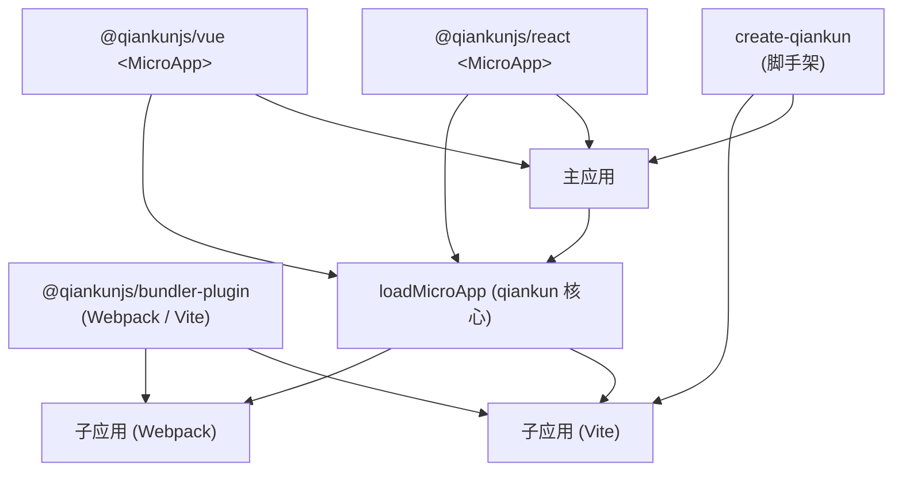

# 生态概览

除了核心的 `qiankun` 包，项目还提供了一小组官方配套包，分别覆盖脚手架、打包工具集成和框架组件绑定。这一页把它们逐个说清楚：各是什么、当前的预发布版本是多少、什么时候该用哪一个。

这些配套包目前都随 qiankun 3.0 以预发布(`rc`)形式发布，在正式版之前 API 还可能有变动。

## 包一览

| 包 | 版本 | 类型 | 什么时候用 |
| --- | --- | --- | --- |
| [`create-qiankun`](/zh-CN/ecosystem/create-qiankun) | `0.0.1-rc.2` | CLI 脚手架 | 想直接生成一个已经接好 qiankun、开箱即跑的主应用或子应用，底子是 Vite。 |
| [`@qiankunjs/bundler-plugin`](/zh-CN/ecosystem/bundler-plugin) | `0.0.1-rc.1` | 构建插件(Webpack + Vite) | 在准备一个微应用的构建产物，好让 qiankun 能加载它——标记入口脚本、修正输出的 library。 |
| [`@qiankunjs/react`](/zh-CN/ecosystem/react) | `0.0.1-rc.14` | React 组件 | 想在 React 里用一个 `<MicroApp>` 组件声明式地挂载微应用，而不是手动调 `loadMicroApp`。 |
| [`@qiankunjs/vue`](/zh-CN/ecosystem/vue) | `0.0.1-rc.2` | Vue 组件 | 想在 Vue(2 或 3)里用 `<MicroApp>` 组件声明式地挂载微应用。 |

::: info 内部包
`@qiankunjs/ui-shared`(`0.0.1-rc.1`)是 React 和 Vue 两个绑定共用的内部包。它定义了公共的 prop 类型，以及围绕 `loadMicroApp` 封装的 `mountMicroApp`/`updateMicroApp`/`unmountMicroApp` 这几个辅助函数。它不打算被应用直接引用——你要么依赖 `@qiankunjs/react`，要么依赖 `@qiankunjs/vue`。
:::

## 每个包各自在哪一环



运行时始终是核心的 `qiankun` 包(`registerMicroApps`、`start`、`loadMicroApp`)。配套包都待在外围：`create-qiankun` 负责起项目，`@qiankunjs/bundler-plugin` 负责收拾子应用的构建产物，`<MicroApp>` 绑定则把 `loadMicroApp` 包成组件，给你一套以组件驱动的挂载方式。

## create-qiankun —— 脚手架

上手最推荐从 `create-qiankun` 走。它会把主应用或子应用生成为一个 Vite 项目，再顺手改一遍生成的文件，把 qiankun 接进去(入口生命周期、Vite 插件、相关依赖)。

```bash
# npm
npx create-qiankun@latest

# yarn
yarn create qiankun@latest

# pnpm
pnpm dlx create-qiankun@latest
```

子应用模板支持 React 和 Vue(带不带 TypeScript 都行)；主应用固定是 React + TypeScript。qiankun v3 通过 ESM 沙箱原生加载 Vite 应用，所以生成的 `dev`/`build`/`preview` 产物本身就能被 qiankun 接住，不需要另搞一套 SystemJS 构建模式。

完整的 CLI 参数和它到底生成了什么，见 [create-qiankun](/zh-CN/ecosystem/create-qiankun)。

## @qiankunjs/bundler-plugin —— 构建集成

`@qiankunjs/bundler-plugin` 负责把微应用的构建产物收拾好，让 qiankun 的 loader 能稳定地认出它的入口。装成 dev 依赖：

```bash
npm install @qiankunjs/bundler-plugin --save-dev
```

包名就是 `@qiankunjs/bundler-plugin`，没有 `@qiankunjs/webpack-plugin` 这个包——两种打包工具都由这一个包通过 subpath exports 来覆盖。

| Import 路径 | Export | Bundler |
| --- | --- | --- |
| `@qiankunjs/bundler-plugin` | `QiankunWebpackPlugin`(具名与默认) | Webpack 4 / 5 |
| `@qiankunjs/bundler-plugin/webpack` | `QiankunWebpackPlugin` | Webpack 4 / 5 |
| `@qiankunjs/bundler-plugin/vite` | `qiankun()`(具名与默认) | Vite(>= 5) |

::: code-group

```js [webpack.config.js]
const HtmlWebpackPlugin = require('html-webpack-plugin');
const { QiankunWebpackPlugin } = require('@qiankunjs/bundler-plugin');

module.exports = {
  plugins: [
    new HtmlWebpackPlugin({ template: './src/index.html' }),
    new QiankunWebpackPlugin(),
  ],
};
```

```ts [vite.config.ts]
import { defineConfig } from 'vite';
import { qiankun } from '@qiankunjs/bundler-plugin/vite';

export default defineConfig({
  plugins: [qiankun()],
});
```

:::

Webpack 插件干两件事：修正输出的 library(让生命周期导出落到 `window[packageName]` 上)，以及在产出的 HTML 里标记入口 `<script>`；它只接受一个 `packageName` 选项。Vite 插件则在构建产出的 HTML 里标记入口 module 脚本，并给 dev 和 preview 配上宽松的 CORS；它不接受任何选项。

完整的选项和行为说明见 [@qiankunjs/bundler-plugin](/zh-CN/ecosystem/bundler-plugin)，配合场景的用法见 [Webpack](/zh-CN/cookbook/prepare-a-webpack-app) 和 [Vite](/zh-CN/cookbook/prepare-a-vite-app) 两篇 cookbook。

## @qiankunjs/react 和 @qiankunjs/vue —— `<MicroApp>` 组件

两个绑定都只对外暴露一个 `MicroApp` 组件，它把 `loadMicroApp` 包了起来。你给它一个 `name` 和一个 `entry`，挂载、随 prop 变化更新、销毁时卸载，这些它都替你处理好了。

::: code-group

```tsx [React]
import { MicroApp } from '@qiankunjs/react';

export default function Page() {
  return <MicroApp name="app1" entry="http://localhost:7101" />;
}
```

```vue [Vue]
<script setup>
import { MicroApp } from '@qiankunjs/vue';
</script>

<template>
  <micro-app name="app1" entry="http://localhost:7101" />
</template>
```

:::

两边共用同一批核心 props——`name`、`entry`、`settings`(一份 [AppConfiguration](/zh-CN/api/configuration))、`lifeCycles`、`autoSetLoading`、`autoCaptureError`、`wrapperClassName`、`className`——再加上可选的 loader 和 error-boundary 定制。往子应用透传额外 prop 时，React 绑定会把任意多出来的 prop 直接转发过去，Vue 绑定则专门用一个 `appProps` 对象来装。React 版 `MicroApp` 要求 `react`/`react-dom` >= 16.9;Vue 版 `MicroApp` 基于 `vue-demi`,Vue 2 和 Vue 3 都支持。

在组件树的某个具体位置挂微应用(手动模式)时，用这两个包就对了。如果是按 URL、按路由来挂载，那还是用核心包里的 [`registerMicroApps`](/zh-CN/api/register-micro-apps) + [`start`](/zh-CN/api/start)。

完整的 props、slots 和 ref 说明见 [React 版 `<MicroApp>`](/zh-CN/ecosystem/react) 和 [Vue 版 `<MicroApp>`](/zh-CN/ecosystem/vue)。

## 相关

- [API 参考总览](/zh-CN/api/index) —— 绑定和插件底下所依赖的核心 `qiankun` 运行时 API。
- [快速上手](/zh-CN/guide/getting-started) —— 安装并跑通你的第一个主应用和微应用。
- [把 Vite 应用接入 qiankun](/zh-CN/cookbook/prepare-a-vite-app) 和 [把 Webpack 应用接入 qiankun](/zh-CN/cookbook/prepare-a-webpack-app) —— 在实际场景里用 bundler-plugin。
