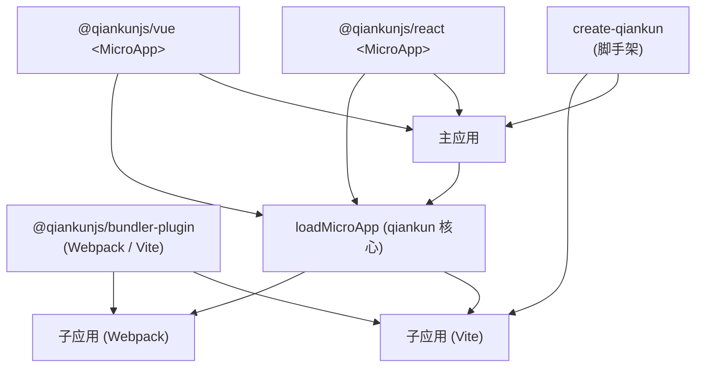

# 生态概览

除了核心的 `qiankun` 包之外，项目还提供了一小组官方配套包，覆盖脚手架、bundler 集成以及框架组件绑定。本页梳理每个包分别是什么、当前的预发布版本，以及在什么场景下应该用到它。

所有配套包都随 qiankun 3.0 以预发布（`rc`）形式发布，在稳定版发布前它们的 API 仍可能发生变动。

## 包一览

| 包 | 版本 | 类型 | 何时用到它…… |
| --- | --- | --- | --- |
| [`create-qiankun`](/zh-CN/ecosystem/create-qiankun) | `0.0.1-rc.2` | CLI 脚手架 | 你想要一个开箱即用、已接入 qiankun 的主应用或子应用，基于 Vite 生成。 |
| [`@qiankunjs/bundler-plugin`](/zh-CN/ecosystem/bundler-plugin) | `0.0.1-rc.1` | 构建插件（Webpack + Vite） | 你正在准备微应用的构建产物，好让 qiankun 能加载它——标记 entry 脚本并修正输出 library。 |
| [`@qiankunjs/react`](/zh-CN/ecosystem/react) | `0.0.1-rc.14` | React 组件 | 你想用 `<MicroApp>` 组件从 React 中声明式地挂载微应用，而不是手动调用 `loadMicroApp`。 |
| [`@qiankunjs/vue`](/zh-CN/ecosystem/vue) | `0.0.1-rc.2` | Vue 组件 | 你想用 `<MicroApp>` 组件从 Vue（2 或 3）中声明式地挂载微应用。 |

::: info 内部包
`@qiankunjs/ui-shared`（`0.0.1-rc.1`）是一个由 React 和 Vue 绑定共享的内部包。它定义了公共的 prop 类型，以及围绕 `loadMicroApp` 的 `mountMicroApp`/`updateMicroApp`/`unmountMicroApp` 辅助函数。它不打算被应用直接引入——请依赖 `@qiankunjs/react` 或 `@qiankunjs/vue`。
:::

## 每个包各自的定位



核心的 `qiankun` 包（`registerMicroApps`、`start`、`loadMicroApp`）始终是运行时。配套包则处于外围：`create-qiankun` 引导项目初始化，`@qiankunjs/bundler-plugin` 准备子应用的构建产物，`<MicroApp>` 绑定则封装 `loadMicroApp`，提供以组件驱动的挂载模型。

## create-qiankun——脚手架

`create-qiankun` 是推荐的上手方式。它会将主应用或子应用生成为一个 Vite 项目，然后修改生成的文件以接入 qiankun（entry 生命周期、Vite 插件以及依赖）。

```bash
# npm
npx create-qiankun@latest

# yarn
yarn create qiankun@latest

# pnpm
pnpm dlx create-qiankun@latest
```

它支持 React 和 Vue 子应用模板（可选是否使用 TypeScript）；主应用固定为 React + TypeScript。由于 qiankun v3 通过其 ESM 沙箱原生加载 Vite 应用，生成的 `dev`/`build`/`preview` 产物本身就已兼容 qiankun——不存在专门的 SystemJS 构建模式。

完整的 CLI 参考以及它生成的内容，请参见 [create-qiankun](/zh-CN/ecosystem/create-qiankun)。

## @qiankunjs/bundler-plugin——构建集成

`@qiankunjs/bundler-plugin` 会准备好微应用的构建产物，让 qiankun 的 loader 能确定性地识别其 entry。将它作为开发依赖安装：

```bash
npm install @qiankunjs/bundler-plugin --save-dev
```

包名是 `@qiankunjs/bundler-plugin`。不存在 `@qiankunjs/webpack-plugin` 这个包——这一个包通过 subpath exports 同时覆盖两种 bundler。

| Import 路径 | Export | Bundler |
| --- | --- | --- |
| `@qiankunjs/bundler-plugin` | `QiankunWebpackPlugin`（具名与默认） | Webpack 4 / 5 |
| `@qiankunjs/bundler-plugin/webpack` | `QiankunWebpackPlugin` | Webpack 4 / 5 |
| `@qiankunjs/bundler-plugin/vite` | `qiankun()`（具名与默认） | Vite（>= 5） |

::: code-group

```js [webpack.config.js]
const HtmlWebpackPlugin = require('html-webpack-plugin');
const { QiankunWebpackPlugin } = require('@qiankunjs/bundler-plugin');

module.exports = {
  plugins: [
    new HtmlWebpackPlugin({ template: './src/index.html' }),
    new QiankunWebpackPlugin(),
  ],
};
```

```ts [vite.config.ts]
import { defineConfig } from 'vite';
import { qiankun } from '@qiankunjs/bundler-plugin/vite';

export default defineConfig({
  plugins: [qiankun()],
});
```

:::

Webpack 插件会修正输出 library（让生命周期导出落到 `window[packageName]` 上），并在产出的 HTML 中标记 entry `<script>`；它接受单个 `packageName` 选项。Vite 插件会在构建出的 HTML 中标记 entry module 脚本，并为 dev 和 preview 配置宽松的 CORS；它不接受任何选项。

完整的选项与行为参考，请参见 [@qiankunjs/bundler-plugin](/zh-CN/ecosystem/bundler-plugin)，以及针对 [Webpack](/zh-CN/cookbook/prepare-a-webpack-app) 和 [Vite](/zh-CN/cookbook/prepare-a-vite-app) 应用的 cookbook 指南。

## @qiankunjs/react 与 @qiankunjs/vue——&lt;MicroApp&gt; 组件

两个绑定都暴露了单个封装 `loadMicroApp` 的 `MicroApp` 组件。你给它一个 `name` 和一个 `entry`，它就会替你处理挂载、prop 变化时的更新，以及卸载时的清理。

::: code-group

```tsx [React]
import { MicroApp } from '@qiankunjs/react';

export default function Page() {
  return <MicroApp name="app1" entry="http://localhost:7101" />;
}
```

```vue [Vue]
<script setup>
import { MicroApp } from '@qiankunjs/vue';
</script>

<template>
  <micro-app name="app1" entry="http://localhost:7101" />
</template>
```

:::

两者共享同一组核心 props——`name`、`entry`、`settings`（一个 [AppConfiguration](/zh-CN/api/configuration)）、`lifeCycles`、`autoSetLoading`、`autoCaptureError`、`wrapperClassName`、`className`——外加可选的 loader 与 error-boundary 定制。React 绑定会将任何额外的 prop 转发给子应用；Vue 绑定则为此使用一个专门的 `appProps` 对象。React 版 `MicroApp` 要求 `react`/`react-dom` >= 16.9；Vue 版 `MicroApp` 基于 `vue-demi` 构建，同时支持 Vue 2 和 Vue 3。

当你需要在组件树的特定位置挂载微应用（手动模式）时，就用它们。对于 URL 驱动、基于路由的挂载，请改用核心包中的 [`registerMicroApps`](/zh-CN/api/register-micro-apps) + [`start`](/zh-CN/api/start)。

完整的 props、slots 与 ref 参考，请参见 [React 版 `<MicroApp>`](/zh-CN/ecosystem/react) 和 [Vue 版 `<MicroApp>`](/zh-CN/ecosystem/vue)。

## 相关内容

- [API 参考概览](/zh-CN/api/index)——绑定和插件所依赖的核心 `qiankun` 运行时 API。
- [快速开始](/zh-CN/guide/getting-started)——安装并运行你的第一个主应用和微应用。
- [让 Vite 应用适配 qiankun](/zh-CN/cookbook/prepare-a-vite-app) 与 [让 Webpack 应用适配 qiankun](/zh-CN/cookbook/prepare-a-webpack-app)——在实际场景中使用 bundler-plugin。
