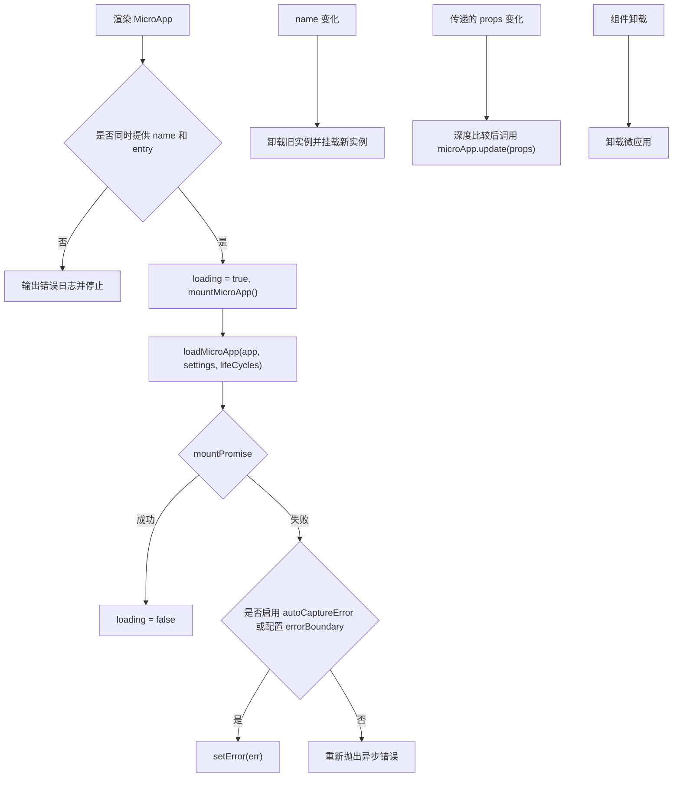

# React `<MicroApp>` 组件（@qiankunjs/react）

`@qiankunjs/react` 提供 `MicroApp` 组件，用于在 React 组件树中挂载 qiankun 微应用。该组件封装了 [`loadMicroApp`](/zh-CN/api/load-micro-app)，并根据 React 组件的生命周期完成微应用的挂载、更新和卸载，无需在业务代码中自行管理实例句柄。

当 React 主应用需要在路由页面或局部面板中以组件形式使用微应用，而不希望通过 [`registerMicroApps`](/zh-CN/api/register-micro-apps) 进行全局注册时，可使用该组件。

## 安装

```bash
npm install @qiankunjs/react@rc qiankun@rc
```

主应用必须安装 `react` 和 `react-dom`，两者的版本均需满足 `>=16.9.0`。

## 基础用法

`name` 和 `entry` 是仅有的两个必填 prop。`entry` 用于指定微应用 HTML 入口的 URL。

```tsx
import { MicroApp } from '@qiankunjs/react';

export default function Page() {
  return <MicroApp name="app1" entry="http://localhost:8000" />;
}
```

组件会渲染一个 `<div>` 作为挂载容器，并在组件卸载时自动卸载微应用。

::: warning `name` 和 `entry` 均为必填项
缺少 `name` 或 `entry` 时，组件仅输出错误日志 `the name and entry of MicroApp is needed`，不会加载微应用，也不会抛出异常。因此，必须同时提供这两个 prop。
:::

## Props

```ts
// 组件导出的类型
export type Props = SharedProps & SharedSlots<React.ReactNode> & Record<string, unknown>;
```

类型末尾的 `Record<string, unknown>` 用于接收任意附加 prop。除下表列出的保留 prop 外，其他 prop 都会原样传递给微应用。React 绑定不提供单独的 `appProps` 属性，附加 prop 本身即为微应用接收的 props。

### 组件 props

| 属性 | 类型 | 默认值 | 说明 |
| --- | --- | --- | --- |
| `name` * | `string` | — | 微应用实例的名称。值发生变化时，组件会卸载当前实例并创建新实例。 |
| `entry` * | `string` | — | 微应用的 HTML 入口地址。 |
| `settings` | [`AppConfiguration`](/zh-CN/api/configuration) | — | 传递给 `loadMicroApp` 的加载器和沙箱配置。 |
| `lifeCycles` | [`LifeCycles`](/zh-CN/api/lifecycles) | — | 由主应用提供的生命周期钩子，如 `beforeLoad`、`beforeMount`。 |
| `autoSetLoading` | `boolean` | `false` | 是否渲染内置加载界面，并在应用挂载完成后自动结束加载状态。 |
| `autoCaptureError` | `boolean` | `false` | 是否使用内置错误边界处理加载错误。 |
| `wrapperClassName` | `string` | — | 附加在包裹元素内置类名之前的自定义类名。仅在启用加载界面或错误边界时生效。 |
| `className` | `string` | — | 附加在挂载容器内置类名之前的自定义类名。 |
| `loader` | `(loading: boolean) => ReactNode` | — | 用于自定义加载界面的渲染函数。 |
| `errorBoundary` | `(error: Error) => ReactNode` | — | 用于自定义错误界面的渲染函数。 |

`*` 表示必填。

除组件过滤的字段外，其他 prop 会在每次渲染时进行深度比较，并传递给微应用。详见[向微应用传递 props](#passing-props-to-the-micro-app)。

::: info 组件过滤的字段
组件自身消费的所有字段——`name`、`entry`、`settings`、`lifeCycles`、`autoSetLoading`、`autoCaptureError`、`loader`、`errorBoundary`、`wrapperClassName` 和 `className`——都会在调用微应用生命周期前从 props 中移除，不会到达微应用。
:::

## 向微应用传递 props {#passing-props-to-the-micro-app}

所有未被组件过滤的 prop 都会传递给微应用的 `bootstrap`、`mount` 和 `update` 生命周期。

```tsx
<MicroApp
  name="app1"
  entry="http://localhost:8000"
  // 作为 props 传递给微应用
  userId={42}
  theme="dark"
  onEvent={(e) => console.log(e)}
/>
```

微应用可通过生命周期函数的 `props` 参数读取这些值：

```ts
export async function mount(props) {
  console.log(props.userId, props.theme);
}
```

这些 prop 发生变化后，组件会使用 Lodash 的 `isEqual` 进行深度比较。如果微应用导出了 `update` 生命周期，且实例状态为 `MOUNTED`，组件会调用 `microApp.update(props)`，不会重新挂载微应用。

::: tip 重新挂载与更新
修改 `name` 会卸载当前实例并创建新实例；修改传递给微应用的其他 prop 只会尝试更新当前实例。如需完全重置实例，可修改 `name`，或为组件设置新的 `key`。组件仅以 `name` 作为重新挂载的依赖，因此仅修改 `entry`、`settings` 或 `lifeCycles` 不会创建新实例。
:::

## 加载状态

内部的 `loading` 状态初始值为 `true`，并在应用的 `mountPromise` 敲定（无论成功还是失败）后被清除。该行为与 `autoSetLoading` 无关：该开关只决定是否渲染内置加载界面，若把状态本身也交由它控制，自定义 `loader` 就会一直转下去。未提供任何加载界面时，该状态不会产生可见效果。

### 内置加载界面

```tsx
<MicroApp name="app1" entry="http://localhost:8000" autoSetLoading />
```

内置加载界面仅提供占位内容，渲染结果为文本 `loading...`。生产环境通常应通过 `loader` 提供自定义加载界面。

### 自定义加载界面

```tsx
<MicroApp
  name="app1"
  entry="http://localhost:8000"
  loader={(loading) => <Spinner spinning={loading} />}
/>
```

自定义 `loader` 可独立生效，且优先级高于内置加载界面，因此无需再配合 `autoSetLoading`。`wrapperClassName` 仅在加载界面或错误界面启用时生效，因为组件只在这两种情况下渲染带定位样式的包裹元素。

## 错误处理

默认情况下，加载、`bootstrap` 和 `mount` 阶段的错误会从异步加载流程中重新抛出。建议启用内置错误界面或提供自定义错误界面，避免产生未处理的 Promise 拒绝。

::: danger 处理异步加载错误
如果既未启用 `autoCaptureError`，也未提供 `errorBoundary`，组件会重新抛出异步加载错误。React 错误边界无法捕获 Promise 回调中的错误，因此应配置组件自身的错误界面。
:::

### 内置错误边界

```tsx
<MicroApp name="app1" entry="http://localhost:8000" autoCaptureError />
```

内置错误边界只渲染一个包含 `error.message` 的 `<div>`。生产环境通常应通过 `errorBoundary` 提供自定义错误界面。

### 自定义错误边界

```tsx
<MicroApp
  name="app1"
  entry="http://localhost:8000"
  errorBoundary={(error) => <ErrorPanel message={error.message} />}
/>
```

### 同时启用加载状态和错误处理

```tsx
<MicroApp
  name="app1"
  entry="http://localhost:8000"
  autoSetLoading
  autoCaptureError
/>
```

完整的错误处理方式参见[处理微应用错误](/zh-CN/cookbook/handle-errors)和 [addErrorHandler / removeErrorHandler](/zh-CN/api/error-handling)。

## 通过 ref 访问运行中的实例

组件使用 `forwardRef` 转发 ref。该 ref 指向当前微应用的实例句柄，即 `@qiankunjs/single-spa` 的 Parcel（对应 `qiankun` 的 `MicroApp` 类型，`@qiankunjs/react` 以 `MicroAppType` 重新导出）。通过该句柄可查询实例状态，也可等待各生命周期 Promise 完成。

```tsx
import { useRef } from 'react';
import { MicroApp } from '@qiankunjs/react';
import { type MicroAppType } from '@qiankunjs/react';

function Page() {
  const microAppRef = useRef<MicroAppType>(undefined);

  const logStatus = () => {
    console.log(microAppRef.current?.getStatus());
  };

  return (
    <>
      <button type="button" onClick={logStatus}>查看状态</button>
      <MicroApp
        name="app1"
        entry="http://localhost:8000"
        autoSetLoading
        ref={microAppRef}
      />
    </>
  );
}
```

### ref 句柄

该句柄实现 single-spa 的 Parcel 接口：

| 成员 | 类型 | 说明 |
| --- | --- | --- |
| `getStatus()` | `() => Status` | 返回当前生命周期状态，取值见下文。 |
| `mount()` | `() => Promise<null>` | 挂载应用。 |
| `unmount()` | `() => Promise<null>` | 卸载应用。 |
| `update?(props)` | `(props) => Promise<unknown>` | 传入新的 props。仅当应用导出 `update` 生命周期时存在。 |
| `loadPromise` | `Promise<null>` | 表示源代码加载阶段完成的 Promise。 |
| `bootstrapPromise` | `Promise<null>` | 表示 `bootstrap` 阶段完成的 Promise。 |
| `mountPromise` | `Promise<null>` | 表示应用挂载阶段完成的 Promise。 |
| `unmountPromise` | `Promise<null>` | 表示应用卸载阶段完成的 Promise。 |

`getStatus()` 返回以下状态之一：`NOT_LOADED`、`LOADING_SOURCE_CODE`、`NOT_BOOTSTRAPPED`、`BOOTSTRAPPING`、`NOT_MOUNTED`、`MOUNTING`、`MOUNTED`、`UPDATING`、`UNMOUNTING`、`UNLOADING`、`SKIP_BECAUSE_BROKEN`、`LOAD_ERROR`。

::: warning 由组件管理生命周期
ref 主要用于查询状态和等待生命周期 Promise。不应通过 ref 直接调用 `mount()` 或 `unmount()`。组件会统一处理挂载、更新和卸载；绕过组件调用这些方法可能破坏内部状态。
:::

## 传递配置

加载器和沙箱相关选项通过 `settings` 传递，其类型为 [`AppConfiguration`](/zh-CN/api/configuration)。

```tsx
<MicroApp
  name="app1"
  entry="http://localhost:8000"
  settings={{ sandbox: { styleIsolation: true } }}
/>
```

`settings` 会原样传给 `loadMicroApp`，组件不会替你填任何默认项。`sandbox.styleIsolation` 的行为参见[样式隔离](/zh-CN/concepts/style-isolation)，`sandbox` 本身的行为参见 [JavaScript 隔离](/zh-CN/concepts/js-sandbox)。

## 生命周期钩子

主应用的生命周期钩子通过 `lifeCycles` 传递，并在当前微应用加载、挂载和卸载的相应阶段执行。每个钩子可以是单个函数或函数数组。

```tsx
<MicroApp
  name="app1"
  entry="http://localhost:8000"
  lifeCycles={{
    beforeMount: async (app) => console.log('before mount', app.name),
    afterMount: async (app) => console.log('mounted', app.name),
  }}
/>
```

完整的钩子列表和签名参见[生命周期钩子](/zh-CN/api/lifecycles)。

## 样式钩子

组件会添加以下两个 CSS 类名，可用于编写自定义样式：

| 元素 | CSS 类名 |
| --- | --- |
| 包裹元素（仅在加载界面或错误边界生效时渲染） | `qiankun-micro-app-wrapper` |
| 挂载容器（始终渲染） | `qiankun-micro-app-container` |

```css
.qiankun-micro-app-wrapper {
  position: relative; /* 组件已设置内联样式，此处可补充布局规则 */
}

.qiankun-micro-app-container {
  min-height: 240px;
}
```

`wrapperClassName` 和 `className` 指定的值会分别添加到以上类名之前，不会替换 qiankun 提供的类名。

## 运行机制



- `name` 是实例重新挂载的标识。修改该值会卸载旧实例并创建新实例。
- 组件会深度比较传递给微应用的 props，并通过 `microApp.update` 更新实例。
- 实例状态为 `MOUNTED` 时，组件会在卸载前设置内部标记，避免卸载开始后继续执行更新。

## 相关内容

- [loadMicroApp](/zh-CN/api/load-micro-app)——组件所封装的核心 API。
- [AppConfiguration](/zh-CN/api/configuration)——`settings` 的类型定义。
- [生命周期钩子](/zh-CN/api/lifecycles)——`lifeCycles` 的类型定义。
- [Vue `<MicroApp>` 组件](/zh-CN/ecosystem/vue)——Vue 绑定通过独立的 `appProps` 对象传递微应用 props。
- [运行多个微应用实例](/zh-CN/cookbook/run-multiple-instances)。
