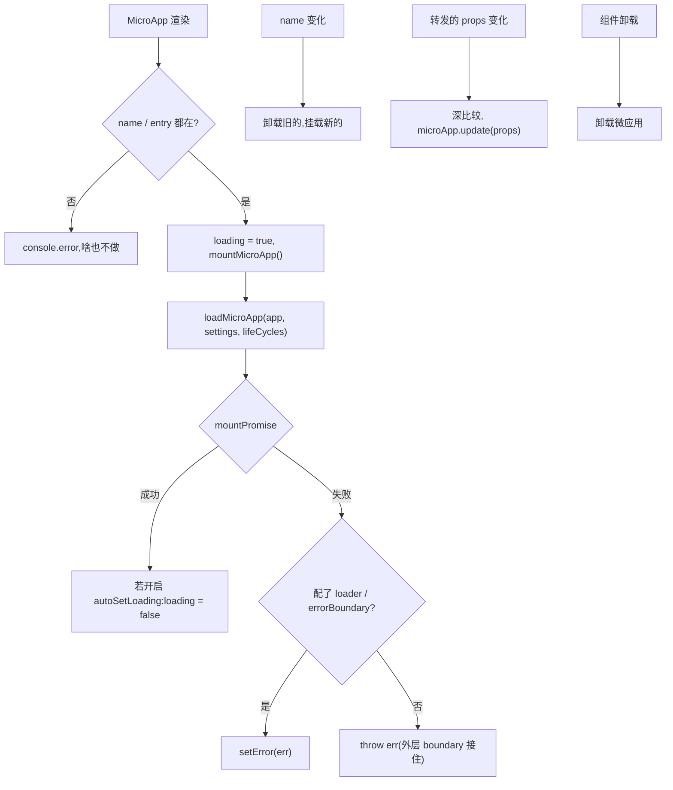

# 面向 React 的 `<MicroApp>` 组件 (@qiankunjs/react)

`@qiankunjs/react` 提供了一个 `MicroApp` 组件，把一个 qiankun 微应用挂到你的 React 组件树里。它封装了 [`loadMicroApp`](/zh-CN/api/load-micro-app)——从挂载、更新到卸载，整个过程都跟着组件的生命周期和重渲染走，你不用自己去碰那套命令式 API。

主应用是个 React SPA，又想把微应用当成一个普通组件塞进去(比如挂在某个路由上，或者某个面板里)，而不是用 [`registerMicroApps`](/zh-CN/api/register-micro-apps) 全局注册——这种场景就用它。

## 安装

```bash
pnpm add @qiankunjs/react qiankun
```

Peer 依赖是 `react` 和 `react-dom`，要求 `>=16.9.0`。

## 基础用法

必填的 props 只有 `name` 和 `entry` 两个，`entry` 填微应用 HTML entry 的 URL。

```tsx
import { MicroApp } from '@qiankunjs/react';

export default function Page() {
  return <MicroApp name="app1" entry="http://localhost:8000" />;
}
```

组件会渲染一个容器 `<div>`，把微应用挂进去；组件卸载时，微应用也跟着自动卸载。

::: warning name 和 entry 必填
`name` 或 `entry` 少了任何一个，组件只会打一行日志 `the name and entry of MicroApp is needed`，然后什么都不做——它不会抛错。所以这两个务必都传上。
:::

## Props

```ts
import { type MicroApp } from 'qiankun';

// The exported component type
type Props = SharedProps & SharedSlots<React.ReactNode> & Record<string, unknown>;
```

末尾那段 `Record<string, unknown>` 是故意留的：**只要不是下面列出的保留 props，你传的任何 prop 都会被原样转发给微应用，当作它的 props**。这里没有单独的 `appProps`——多出来的 props 本身就是微应用的 props。

### 保留 props

| 属性 | 类型 | 默认值 | 说明 |
| --- | --- | --- | --- |
| `name` * | `string` | — | 微应用的唯一名称。改了它会重新挂载一个全新的微应用。 |
| `entry` * | `string` | — | 微应用的 HTML entry URL。 |
| `settings` | [`AppConfiguration`](/zh-CN/api/configuration) | — | 透传给 `loadMicroApp` 的加载器 / 沙箱配置。 |
| `lifeCycles` | [`LifeCycles`](/zh-CN/api/lifecycles) | — | 这个微应用的全局生命周期钩子(`beforeLoad`、`beforeMount` 等)。 |
| `autoSetLoading` | `boolean` | `false` | 渲染内置 loader，并在应用挂载后自动清掉。 |
| `autoCaptureError` | `boolean` | `false` | 渲染内置 error boundary，而不是把加载错误往外抛。 |
| `wrapperClassName` | `string` | — | 加在 wrapper 元素最前面的 class。只有 loader 或 error boundary 生效时才起作用。 |
| `className` | `string` | — | 加在挂载容器元素最前面的 class。 |
| `loader` | `(loading: boolean) => ReactNode` | — | 自定义加载 UI 的 render-prop slot。 |
| `errorBoundary` | `(error: Error) => ReactNode` | — | 自定义错误 UI 的 render-prop slot。 |

`*` = 必填。

其余每个 prop 都会在每次渲染时做深比较，再转发给微应用。见[给微应用传 props](#passing-props-to-the-micro-app)。

::: info 保留字段不会被转发
`name`、`entry`、`settings`、`lifeCycles`、`wrapperClassName`、`className` 这几个是组件自己要用的，在 props 到达微应用之前就被摘掉了。别指望在子应用里能收到它们。
:::

## 给微应用传 props {#passing-props-to-the-micro-app}

任何非保留的 prop 都会转发给微应用，送进它的 `bootstrap`/`mount`/`update` 生命周期。

```tsx
<MicroApp
  name="app1"
  entry="http://localhost:8000"
  // forwarded to the micro-app as props
  userId={42}
  theme="dark"
  onEvent={(e) => console.log(e)}
/>
```

在微应用里，这些值会出现在生命周期的 `props` 上：

```ts
export async function mount(props) {
  console.log(props.userId, props.theme);
}
```

这些 prop 变了之后，组件会用 lodash 的 `isEqual` 做深比较，再对正在运行的应用调 `microApp.update(props)`——微应用不会重新挂载。而且只有应用状态是 `MOUNTED` 时，这次 update 才会真的执行。

::: tip 重新挂载 vs 更新
改 `name` 会挂载一个全新的微应用；改任何被转发的 prop 只触发一次原地 `update`。想彻底重置，就改 `name`(或者给它加个 `key`)。
:::

## 加载状态

内部的 loading 标志初始为 `true`。只有开启了 `autoSetLoading`，它才会随着应用的 `mountPromise`、通过 `setLoading(false)` 自动清掉。要是没配 loader，加载态本来也没东西可渲染，所以这个标志根本看不出效果。

### 内置 loader

```tsx
<MicroApp name="app1" entry="http://localhost:8000" autoSetLoading />
```

内置 loader 只是个占位符，渲染出来就是字面的 `loading...` 几个字。想要真正的 UI，自己传一个 `loader`。

### 自定义 loader

```tsx
<MicroApp
  name="app1"
  entry="http://localhost:8000"
  loader={(loading) => <Spinner spinning={loading} />}
/>
```

传了 `loader` 就不用再配 `autoSetLoading` 了——这个 slot 一旦存在，加载 UI 就被激活。`wrapperClassName` 只有在 loader 或 error boundary 生效时才起作用，因为也只有这时组件才会渲染那个带定位的 wrapper 元素。

## 错误处理

默认情况下，加载、bootstrap、mount 阶段的错误都是**往外抛**的——它不替你吞掉。你得用外层的 React error boundary 去接，或者主动开启内置 / 自定义的错误 UI。

::: danger 没接住的错误会往上冒
既不配 `autoCaptureError`、也不给 `errorBoundary`，加载一旦失败就会在渲染期间抛出来，把这棵子树整个搞崩——除非上层有个 React error boundary 把它接住。
:::

### 内置 error boundary

```tsx
<MicroApp name="app1" entry="http://localhost:8000" autoCaptureError />
```

内置的 boundary 渲染的是一个光秃秃的 `<div>`，里面放着 `error.message`。生产环境的 UI 请自己传一个 `errorBoundary`。

### 自定义 error boundary

```tsx
<MicroApp
  name="app1"
  entry="http://localhost:8000"
  errorBoundary={(error) => <ErrorPanel message={error.message} />}
/>
```

### loading 和 error 一起开

```tsx
<MicroApp
  name="app1"
  entry="http://localhost:8000"
  autoSetLoading
  autoCaptureError
/>
```

错误处理更系统的讲法，见[处理加载与运行时错误](/zh-CN/cookbook/handle-errors)和 [addErrorHandler / removeErrorHandler](/zh-CN/api/error-handling)。

## 通过 ref 拿到运行中的应用

组件是 `forwardRef`。转发出来的 ref 指向正在运行的微应用句柄——一个 single-spa 的 Parcel(也就是 `qiankun` 里的 `MicroApp` 类型)——你可以读它的状态，也可以 await 它的生命周期 promise。

```tsx
import { useRef, useEffect } from 'react';
import { MicroApp } from '@qiankunjs/react';
import { type MicroApp as MicroAppType } from 'qiankun';

function Page() {
  const microAppRef = useRef<MicroAppType>();

  useEffect(() => {
    // e.g. 'MOUNTING' | 'MOUNTED' | 'LOAD_ERROR' | ...
    console.log(microAppRef.current?.getStatus());
  }, []);

  return <MicroApp name="app1" entry="http://localhost:8000" ref={microAppRef} />;
}
```

### ref 句柄

这个句柄就是 single-spa 的 Parcel 接口：

| 成员 | 类型 | 说明 |
| --- | --- | --- |
| `getStatus()` | `() => Status` | 当前的生命周期状态(见下)。 |
| `mount()` | `() => Promise<null>` | 挂载应用。 |
| `unmount()` | `() => Promise<null>` | 卸载应用。 |
| `update?(props)` | `(props) => Promise<unknown>` | 推送新的 props(仅当应用导出了 `update` 生命周期时才有)。 |
| `loadPromise` | `Promise<null>` | 源码加载完成时 resolve。 |
| `bootstrapPromise` | `Promise<null>` | 应用完成 bootstrap 时 resolve。 |
| `mountPromise` | `Promise<null>` | 应用挂载完成时 resolve。 |
| `unmountPromise` | `Promise<null>` | 应用卸载完成时 resolve。 |

`getStatus()` 的返回值是下面之一：`NOT_LOADED`、`LOADING_SOURCE_CODE`、`NOT_BOOTSTRAPPED`、`BOOTSTRAPPING`、`NOT_MOUNTED`、`MOUNTING`、`MOUNTED`、`UPDATING`、`UNMOUNTING`、`UNLOADING`、`SKIP_BECAUSE_BROKEN`、`LOAD_ERROR`。

::: warning 生命周期交给组件管
ref 是用来读状态、await promise 的。别自己去调它的 `mount()`/`unmount()`——挂载 / 更新 / 卸载都由组件管着，它还会防着并发的卸载和重新挂载。你手动去调，容易把这套状态搞乱。
:::

## 传配置

loader 和沙箱相关的选项都走 `settings`，它是一个 [`AppConfiguration`](/zh-CN/api/configuration)。

```tsx
<MicroApp
  name="app1"
  entry="http://localhost:8000"
  settings={{ sandbox: true, styleIsolation: true }}
/>
```

组件在调 `loadMicroApp` 之前，总会强制把 `globalContext: window` 设上，再把你的 `settings` 合并上去。`styleIsolation` 具体开启了什么，见[样式隔离](/zh-CN/concepts/style-isolation);`sandbox` 见 [JS 沙箱](/zh-CN/concepts/js-sandbox)。

## 生命周期钩子

框架层的钩子通过 `lifeCycles` 传。它们会和全局钩子合并(是追加，不是替换)，在这个微应用的加载 / 挂载 / 卸载前后运行。

```tsx
<MicroApp
  name="app1"
  entry="http://localhost:8000"
  lifeCycles={{
    beforeMount: async (app) => console.log('before mount', app.name),
    afterMount: async (app) => console.log('mounted', app.name),
  }}
/>
```

完整的钩子列表和签名见[生命周期钩子](/zh-CN/api/lifecycles)。

## 样式钩子

组件总会挂上两个 class，你可以在 CSS 里针对它们写样式：

| 元素 | Class |
| --- | --- |
| Wrapper(只有 loader 或 error boundary 生效时才渲染) | `qiankun-micro-app-wrapper` |
| 挂载容器(总会渲染) | `qiankun-micro-app-container` |

```css
.qiankun-micro-app-wrapper {
  position: relative; /* already applied inline; add your own layout here */
}

.qiankun-micro-app-container {
  min-height: 240px;
}
```

`wrapperClassName` 和 `className` 会**加在**这两个 class 前面，所以你自己的 class 和 qiankun 的钩子 class 都会在。

## 底层是怎么跑的



- 挂载以 `name` 为 key，改了它就重新挂一个全新的应用。
- prop 更新以转发 props 的深比较为准，走 `microApp.update`。
- 卸载前会先等应用的 `mountPromise`，并且防着并发拆卸，这样重新挂载和多实例才不会乱套。

## 相关

- [loadMicroApp](/zh-CN/api/load-micro-app) —— 这个组件封装的门面 API。
- [AppConfiguration](/zh-CN/api/configuration) —— `settings` 的结构。
- [生命周期钩子](/zh-CN/api/lifecycles) —— `lifeCycles` 的结构。
- [面向 Vue 的 `<MicroApp>` 组件](/zh-CN/ecosystem/vue) —— Vue 版(注意：Vue 是通过专门的 `appProps` 对象传应用 props 的)。
- [同时运行多个微应用实例](/zh-CN/cookbook/run-multiple-instances)
