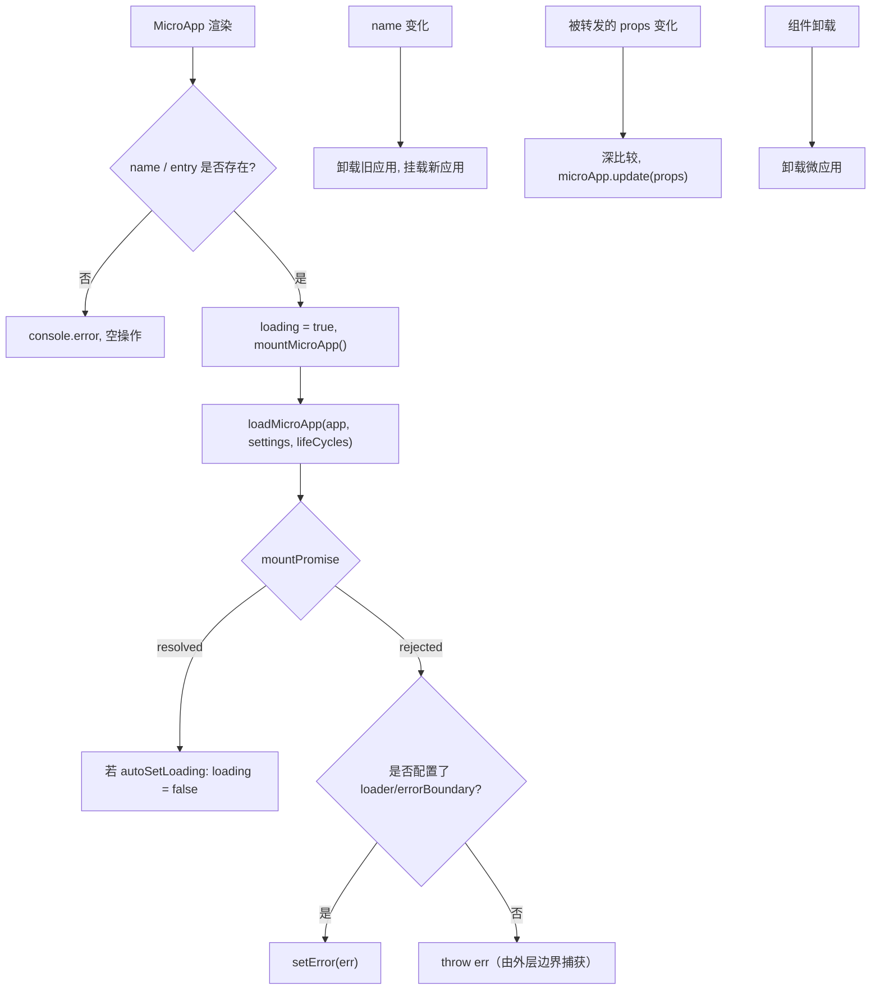

# 面向 React 的 &lt;MicroApp&gt; (@qiankunjs/react)

`@qiankunjs/react` 提供了一个 `MicroApp` 组件，可以把 qiankun 微应用挂载到你的 React 组件树中。它封装了 [`loadMicroApp`](/zh-CN/api/load-micro-app)，在组件的生命周期与重渲染过程中自动管理挂载、更新与卸载，因此你无需手动调用命令式 API。

当主应用是一个 React SPA、且你希望把微应用当作普通组件嵌入（例如挂在某个路由或某个面板里），而不是通过 [`registerMicroApps`](/zh-CN/api/register-micro-apps) 全局注册时，就可以使用这个组件。

## 安装

```bash
pnpm add @qiankunjs/react qiankun
```

Peer 依赖：`react` 与 `react-dom` `>=16.9.0`。

## 基础用法

`name` 与 `entry` 是仅有的两个必填 props。`entry` 是微应用 HTML entry 的 URL。

```tsx
import { MicroApp } from '@qiankunjs/react';

export default function Page() {
  return <MicroApp name="app1" entry="http://localhost:8000" />;
}
```

组件会渲染一个容器 `<div>`，并把微应用挂载到其中。当组件卸载时，微应用会被自动卸载。

::: warning name 与 entry 为必填
如果 `name` 或 `entry` 缺失，组件会打印 `the name and entry of MicroApp is needed` 并且什么都不做——它不会抛出异常。请务必始终同时提供这两个 props。
:::

## Props

```ts
import { type MicroApp } from 'qiankun';

// 导出的组件类型
type Props = SharedProps & SharedSlots<React.ReactNode> & Record<string, unknown>;
```

其中的 `Record<string, unknown>` 是有意为之：**任何你传入的、不属于下面保留 props 的 prop，都会作为 props 转发给微应用**。这里没有独立的 `appProps`——额外的 props 本身就是应用的 props。

### 保留 props

| Prop | 类型 | 默认值 | 说明 |
| --- | --- | --- | --- |
| `name` * | `string` | — | 唯一的微应用名称。修改它会重新挂载一个全新的微应用。 |
| `entry` * | `string` | — | 微应用的 HTML entry URL。 |
| `settings` | [`AppConfiguration`](/zh-CN/api/configuration) | — | 透传给 `loadMicroApp` 的 loader/sandbox 配置。 |
| `lifeCycles` | [`LifeCycles`](/zh-CN/api/lifecycles) | — | 针对该微应用的全局 lifecycle 钩子（`beforeLoad`、`beforeMount` 等）。 |
| `autoSetLoading` | `boolean` | `false` | 渲染内置 loader，并在应用挂载后自动清除它。 |
| `autoCaptureError` | `boolean` | `false` | 渲染内置错误边界，而不是重新抛出加载错误。 |
| `wrapperClassName` | `string` | — | 前置到 wrapper 元素上的类名。仅在启用了 loader 或错误边界时才生效。 |
| `className` | `string` | — | 前置到挂载容器元素上的类名。 |
| `loader` | `(loading: boolean) => ReactNode` | — | 用于自定义加载 UI 的 render-prop 插槽。 |
| `errorBoundary` | `(error: Error) => ReactNode` | — | 用于自定义错误 UI 的 render-prop 插槽。 |

`*` = 必填。

其余每一个 prop 都会在重渲染之间做深比较，并转发给微应用。参见[向微应用传递 props](#passing-props-to-the-micro-app)。

::: info 保留名称无法被转发
由于 `name`、`entry`、`settings`、`lifeCycles`、`wrapperClassName` 和 `className` 会被组件自身消费，它们在 props 到达微应用之前就已被剥离。不要指望在子应用中收到它们。
:::

## 向微应用传递 props

任何非保留 prop 都会被转发给微应用，并交付到它的 `bootstrap`/`mount`/`update` 生命周期中。

```tsx
<MicroApp
  name="app1"
  entry="http://localhost:8000"
  // forwarded to the micro-app as props
  userId={42}
  theme="dark"
  onEvent={(e) => console.log(e)}
/>
```

在微应用内部，这些值会出现在 lifecycle 的 `props` 上：

```ts
export async function mount(props) {
  console.log(props.userId, props.theme);
}
```

当这些 props 变化时，组件会对它们做深比较（lodash `isEqual`），并对正在运行的应用调用 `microApp.update(props)`——微应用不会被重新挂载。只有当应用的状态为 `MOUNTED` 时，update 才会执行。

::: tip 重新挂载 vs 更新
修改 `name` 会重新挂载一个全新的微应用。修改任意被转发的 prop 会触发一次原地 `update`。如果你想要彻底重置，请修改 `name`（或为其设置 `key`）。
:::

## 加载状态

内部的 loading 标志初始为 `true`。它只会被自动清除——在启用了 `autoSetLoading` 时，通过应用 `mountPromise` 上的 `setLoading(false)` 来清除。如果没有配置 loader，加载状态本来也不会渲染任何东西，因此这个标志没有可见效果。

### 内置 loader

```tsx
<MicroApp name="app1" entry="http://localhost:8000" autoSetLoading />
```

内置 loader 是一个占位符，仅渲染字面文本 `loading...`。若需要真正的 UI，请提供自定义的 `loader`。

### 自定义 loader

```tsx
<MicroApp
  name="app1"
  entry="http://localhost:8000"
  loader={(loading) => <Spinner spinning={loading} />}
/>
```

当提供了 `loader` prop 时，你无需 `autoSetLoading`——该插槽的存在本身就会激活加载 UI。`wrapperClassName` 仅在启用了 loader 或错误边界时才生效，因为只有此时组件才会渲染一个带定位的 wrapper 元素。

## 错误处理

默认情况下，load、bootstrap 和 mount 阶段的错误会被**重新抛出**——它们不会被吞掉。你必须用外层的 React 错误边界来捕获它们，或者选择启用内置/自定义的错误 UI。

::: danger 未捕获的错误会向上传播
如果没有 `autoCaptureError` 或自定义 `errorBoundary`，一次失败的加载会在渲染期间抛出，并且会导致子树崩溃，除非有某个祖先 React 错误边界捕获它。
:::

### 内置错误边界

```tsx
<MicroApp name="app1" entry="http://localhost:8000" autoCaptureError />
```

内置边界会渲染一个仅包含 `error.message` 的裸 `<div>`。生产环境的 UI 请提供自定义的 `errorBoundary`。

### 自定义错误边界

```tsx
<MicroApp
  name="app1"
  entry="http://localhost:8000"
  errorBoundary={(error) => <ErrorPanel message={error.message} />}
/>
```

### 同时使用自动加载与错误处理

```tsx
<MicroApp
  name="app1"
  entry="http://localhost:8000"
  autoSetLoading
  autoCaptureError
/>
```

关于错误策略更全面的介绍，参见[处理加载与运行时错误](/zh-CN/cookbook/handle-errors)以及 [addErrorHandler / removeErrorHandler](/zh-CN/api/error-handling)。

## 通过 ref 访问运行中的应用

该组件是一个 `forwardRef`。被转发的 ref 会解析为运行中的微应用句柄——一个 single-spa Parcel（来自 `qiankun` 的 `MicroApp` 类型）——因此你可以读取它的状态并 await 它的 lifecycle promise。

```tsx
import { useRef, useEffect } from 'react';
import { MicroApp } from '@qiankunjs/react';
import { type MicroApp as MicroAppType } from 'qiankun';

function Page() {
  const microAppRef = useRef<MicroAppType>();

  useEffect(() => {
    // e.g. 'MOUNTING' | 'MOUNTED' | 'LOAD_ERROR' | ...
    console.log(microAppRef.current?.getStatus());
  }, []);

  return <MicroApp name="app1" entry="http://localhost:8000" ref={microAppRef} />;
}
```

### ref 句柄

该句柄就是 single-spa 的 Parcel 接口：

| 成员 | 类型 | 说明 |
| --- | --- | --- |
| `getStatus()` | `() => Status` | 当前 lifecycle 状态（见下文）。 |
| `mount()` | `() => Promise<null>` | 挂载应用。 |
| `unmount()` | `() => Promise<null>` | 卸载应用。 |
| `update?(props)` | `(props) => Promise<unknown>` | 推送新的 props（仅当应用导出了 `update` lifecycle 时才存在）。 |
| `loadPromise` | `Promise<null>` | 在源码加载完成时 resolve。 |
| `bootstrapPromise` | `Promise<null>` | 在应用完成 bootstrap 时 resolve。 |
| `mountPromise` | `Promise<null>` | 在应用完成挂载时 resolve。 |
| `unmountPromise` | `Promise<null>` | 在应用完成卸载时 resolve。 |

`getStatus()` 返回以下之一：`NOT_LOADED`、`LOADING_SOURCE_CODE`、`NOT_BOOTSTRAPPED`、`BOOTSTRAPPING`、`NOT_MOUNTED`、`MOUNTING`、`MOUNTED`、`UPDATING`、`UNMOUNTING`、`UNLOADING`、`SKIP_BECAUSE_BROKEN`、`LOAD_ERROR`。

::: warning 让组件掌管 lifecycle
ref 用于读取状态和 await promise。避免手动在其上调用 `mount()`/`unmount()`——组件会为你管理挂载/更新/卸载，并对并发的卸载与重新挂载进行防护。手动调用可能会让这套状态失去同步。
:::

## 传递配置

Loader 与 sandbox 选项通过 `settings` 传入，它是一个 [`AppConfiguration`](/zh-CN/api/configuration)。

```tsx
<MicroApp
  name="app1"
  entry="http://localhost:8000"
  settings={{ sandbox: true, styleIsolation: true }}
/>
```

组件在调用 `loadMicroApp` 之前，总是会强制设置 `globalContext: window`，并把你的 `settings` 合并到其上。关于 `styleIsolation` 能启用什么，参见[样式隔离](/zh-CN/concepts/style-isolation)；关于 `sandbox`，参见 [JS 沙箱](/zh-CN/concepts/js-sandbox)。

## Lifecycle 钩子

通过 `lifeCycles` 传入框架级别的钩子。它们会与任何全局钩子合并（追加，而非替换），并在该微应用的 load/mount/unmount 前后运行。

```tsx
<MicroApp
  name="app1"
  entry="http://localhost:8000"
  lifeCycles={{
    beforeMount: async (app) => console.log('before mount', app.name),
    afterMount: async (app) => console.log('mounted', app.name),
  }}
/>
```

完整的钩子集合与签名，参见 [Lifecycle 钩子](/zh-CN/api/lifecycles)。

## 样式钩子

组件总是会应用两个你可以在 CSS 中定位的类名：

| 元素 | 类名 |
| --- | --- |
| Wrapper（仅在启用了 loader 或错误边界时才渲染） | `qiankun-micro-app-wrapper` |
| 挂载容器（总是渲染） | `qiankun-micro-app-container` |

```css
.qiankun-micro-app-wrapper {
  position: relative; /* already applied inline; add your own layout here */
}

.qiankun-micro-app-container {
  min-height: 240px;
}
```

`wrapperClassName` 与 `className` 会被_前置_到这些类名之前，因此你同时拥有自己的类名和 qiankun 的钩子类名。

## 底层运作方式



- 挂载以 `name` 为键；修改它会重新挂载一个全新的应用。
- Prop 更新以被转发 props 的深比较为键，并通过 `microApp.update` 路由。
- 卸载会在卸载前等待应用的 `mountPromise`，并对并发的拆卸进行防护，从而让重新挂载和多实例保持一致。

## 相关

- [loadMicroApp](/zh-CN/api/load-micro-app) —— 该组件所封装的门面 API。
- [AppConfiguration](/zh-CN/api/configuration) —— `settings` 的结构。
- [Lifecycle 钩子](/zh-CN/api/lifecycles) —— `lifeCycles` 的结构。
- [面向 Vue 的 &lt;MicroApp&gt;](/zh-CN/ecosystem/vue) —— Vue 的对应版本（注意：Vue 通过专门的 `appProps` 对象传递应用 props）。
- [运行多个微应用实例](/zh-CN/cookbook/run-multiple-instances)
