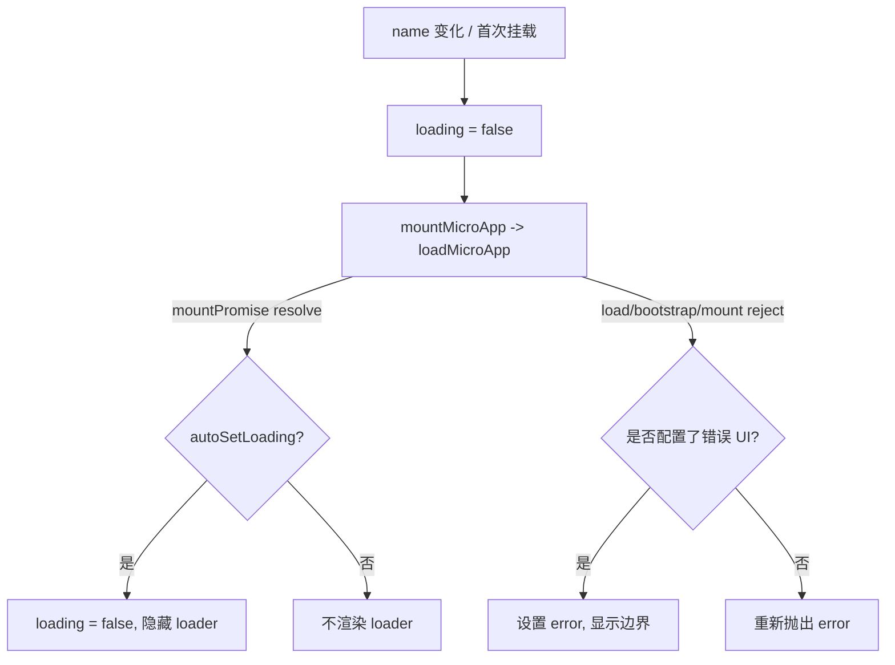

# Vue 的 `<MicroApp>`(@qiankunjs/vue)

`@qiankunjs/vue` 提供一个 `MicroApp` 组件，用声明式的方式加载、挂载、更新、卸载一个 qiankun 微应用——整个生命周期都跟着组件自己的生命周期走。它本质上是对 `qiankun` 门面里 [`loadMicroApp`](/zh-CN/api/load-micro-app) 的一层薄薄的响应式封装。

组件基于 [`vue-demi`](https://github.com/vueuse/vue-demi) 构建，所以同一份构建产物在 Vue 2 和 Vue 3 下都能跑。

## 安装

```bash
npm i @qiankunjs/vue
```

`vue` 是 peer 依赖，版本范围 `^2.0.0 || >=3.0.0`。在 Vue 2 下你还得额外装 `@vue/composition-api`(组件通过 `vue-demi` 用到了 Composition API)。

::: tip 前置条件
`MicroApp` 组件直接调用的是 `loadMicroApp`，所以单用它并不需要 `registerMicroApps` 或 `start`。但如果同一个应用里别处还用了路由驱动的注册方式，那 [`start`](/zh-CN/api/start) 仍然要调。挂载和更新是怎么对应到 single-spa 的，见[微应用生命周期与 props](/zh-CN/concepts/lifecycle-and-props)。
:::

## 基本用法

```vue
<script setup>
import { MicroApp } from '@qiankunjs/vue';
</script>

<template>
  <micro-app name="app1" entry="http://localhost:8000" />
</template>
```

必填的 prop 只有 `name` 和 `entry` 两个。`name` 在所有已挂载的微应用里必须唯一；`entry` 是微应用的 HTML URL。少了任意一个，组件会打一条错误日志然后什么都不做——它不会抛异常。

组件会渲染出一个容器 `<div>`(class 为 `qiankun-micro-app-container`)，微应用就流式写进这个 div 里。除非启用了加载态或错误边界，否则不会多出一层包裹元素——见[加载与错误 UI](#加载与错误-ui)。

## Props

| Prop | 类型 | 默认值 | 说明 |
| --- | --- | --- | --- |
| `name` | `string` | — | **必填。** 唯一的微应用名。 |
| `entry` | `string` | — | **必填。** 微应用的 HTML entry URL。 |
| `settings` | `AppConfiguration` | `{ sandbox: true }` | 转发给 `loadMicroApp` 的 loader / sandbox 配置。见 [AppConfiguration](/zh-CN/api/configuration)。 |
| `lifeCycles` | `LifeCycles` | `undefined` | 全局生命周期钩子(`beforeLoad`、`beforeMount`、`afterMount`、`beforeUnmount`、`afterUnmount`)。它们是以数组方式合并的，所以你的钩子是追加进去，而不是替换掉原有的。见[生命周期钩子](/zh-CN/api/lifecycles)。 |
| `autoSetLoading` | `boolean` | `false` | 微应用加载期间渲染内置的加载指示器。 |
| `autoCaptureError` | `boolean` | `false` | 加载失败时渲染内置的错误边界。 |
| `wrapperClassName` | `string` | `undefined` | 包裹元素上的额外 class。只有启用了加载态或错误边界时才生效。 |
| `className` | `string` | `undefined` | 挂载容器元素上的额外 class。 |
| `appProps` | `object` | `undefined` | 透传给微应用的 props。在 Vue 绑定里，这是往子应用传数据的唯一通道。 |

::: info `settings` 默认值和 React 不一样
Vue 绑定把 `settings` 默认成了 `{ sandbox: true }`，而 [React 绑定](/zh-CN/ecosystem/react)的 `settings` 没有默认值。两个绑定里最终生效的配置都是 `{ globalContext: window, ...settings }`，所以 `window` 永远是全局上下文。不管怎样，`sandbox` 字段在门面层默认就是 `true`。
:::

::: warning 只有 `appProps` 会透传
React 绑定里，`<MicroApp>` 上任何额外的 prop 都会转发给子应用；Vue 绑定**不会**转发任意属性。子应用要收的东西，你必须全都放进 `appProps` 对象里。声明之外的属性一律被忽略。
:::

### `settings`(AppConfiguration)

`settings` 接受的对象和 [`loadMicroApp`](/zh-CN/api/load-micro-app) 的第二个参数完全一致。完整结构见 [AppConfiguration](/zh-CN/api/configuration)，字段就是 `fetch`、`streamTransformer`、`nodeTransformer`、`sandbox`(默认 `true`)、`globalContext`(默认 `window`)、`styleIsolation`(默认 `false`)这几个。

```vue
<template>
  <micro-app
    name="app1"
    entry="http://localhost:8000"
    :settings="{ sandbox: true, styleIsolation: true }"
  />
</template>
```

想给某个微应用单独关掉 JS 沙箱，传 `:settings="{ sandbox: false }"`。见 [JS 沙箱](/zh-CN/concepts/js-sandbox)和[样式隔离](/zh-CN/concepts/style-isolation)。

## 给微应用传 props(`appProps`)

要传给子应用的数据，放进 `appProps`:

```vue
<script setup>
import { reactive } from 'vue';
import { MicroApp } from '@qiankunjs/vue';

const appProps = reactive({ userId: 42, theme: 'dark' });
</script>

<template>
  <micro-app name="app1" entry="http://localhost:8000" :appProps="appProps" />
</template>
```

这些数据会作为微应用所导出生命周期函数的 `props` 参数传进去：

```ts
// 微应用内部
export async function mount(props) {
  console.log(props.userId); // 42
}
```

`appProps` 是**深度侦听**的。改动一个嵌套的值(比如 `appProps.theme = 'light'`)会触发正在运行的实例上的 `microApp.update(props)`——前提是微应用暴露了 `update` 生命周期、状态为 `MOUNTED`、且没有正在被卸载。见[在应用间共享状态与通信](/zh-CN/cookbook/communicate-between-apps)。

::: tip update 只在挂载完成后才触发
`update` 会排在 mount 的 promise resolve 之后串行执行，而且只有 parcel 状态是 `MOUNTED` 时才会跑。微应用还没挂载完就发生的 prop 改动，会被并进首次挂载里，而不会另外产生一次 update。
:::

## 加载与错误 UI

加载指示器和错误边界都是选择性开启的。两者都没开、也没提供插槽时，组件只渲染那个光秃秃的容器 `<div>`。而只要 `autoSetLoading`、`autoCaptureError`、`#loader` 插槽、`#error-boundary` 插槽里出现任意一个，组件就会改为渲染一个包裹元素(class 为 `qiankun-micro-app-wrapper`)，把加载 / 错误节点和容器一起放进去。



### 自动加载与错误捕获

用两个布尔 prop 打开内置指示器：

```vue
<script setup>
import { MicroApp } from '@qiankunjs/vue';
</script>

<template>
  <micro-app
    name="app1"
    entry="http://localhost:8000"
    autoSetLoading
    autoCaptureError
  />
</template>
```

内置的这两个是刻意做得很简陋的：默认 loader 就渲染一段文本 `loading...`，默认错误边界就是一个 `<div>` 里放着 `error.message`。真要上生产，用下面的插槽。

::: info 加载态的初始值
Vue 绑定把 `loading` 初始化为 `false`(React 绑定是从 `true` 开始的)。加载期间这个标志被置为 `true`,mount 的 promise 完成后清掉——但只有开了 `autoSetLoading` 才会被自动清掉。不过没开 `autoSetLoading` 的话，本来也不会渲染任何 loader。
:::

### 自定义 loader 插槽

提供一个 `#loader` 作用域插槽来渲染你自己的指示器。插槽会收到 `{ loading }`，这是个布尔值，加载中为 `true`，加载结束后为 `false`。

```vue
<script setup>
import CustomLoader from '@/components/CustomLoader.vue';
import { MicroApp } from '@qiankunjs/vue';
</script>

<template>
  <micro-app name="app1" entry="http://localhost:8000">
    <template #loader="{ loading }">
      <custom-loader :loading="loading" />
    </template>
  </micro-app>
</template>
```

`#loader` 插槽的优先级高于 `autoSetLoading`——只要提供了插槽，默认 loader 就永远不会用上，你也不用再传 `autoSetLoading`。

### 自定义错误边界插槽

提供一个 `#error-boundary` 作用域插槽来渲染你自己的错误 UI。插槽会收到 `{ error }`，是个 `Error` 实例，而且只有真的发生了错误才会渲染。

```vue
<script setup>
import CustomErrorBoundary from '@/components/CustomErrorBoundary.vue';
import { MicroApp } from '@qiankunjs/vue';
</script>

<template>
  <micro-app name="app1" entry="http://localhost:8000">
    <template #error-boundary="{ error }">
      <custom-error-boundary :error="error" />
    </template>
  </micro-app>
</template>
```

### 没捕获的错误会被重新抛出

如果你**没有**开 `autoCaptureError`，也**没有**提供 `#error-boundary` 插槽，那么 load、bootstrap、mount 阶段的错误会被重新抛出，而不是被吞掉。在 Vue 里，用组件的 `errorCaptured` 钩子或者全局错误处理器去接：

```ts
// 主应用入口
import { createApp } from 'vue';

const app = createApp(App);
app.config.errorHandler = (err, instance, info) => {
  console.error('micro-app error:', err, info);
};
app.mount('#root');
```

::: warning
开了 `autoCaptureError`、或者提供了 `#error-boundary` 插槽，错误处理就从"抛出"切换成了"渲染"。每个微应用只挑一种策略；别对已经路由进错误边界的错误，再去指望外层的 `errorCaptured` 接住它。见[处理加载与运行时错误](/zh-CN/cookbook/handle-errors)。
:::

## 重新挂载与暴露出来的句柄

改动 `name` prop 会拆掉当前微应用、挂上一个全新的实例——`name` 就是(重新)挂载的 watch key。组件销毁时(`onBeforeUnmount`)会自动卸载，而且卸载前会先 await 进行中的 mount promise，让并发的挂载 / 卸载周期保持有序。

正在运行的微应用实例挂在组件实例上，有两个名字 `microApp` 和 `microAppRef`(都指向同一个 [`MicroApp`](/zh-CN/api/types) parcel 句柄)。通过模板 ref 拿到它：

```vue
<script setup>
import { ref, onMounted } from 'vue';
import { MicroApp } from '@qiankunjs/vue';

const microAppComp = ref();

onMounted(() => {
  // parcel 句柄:getStatus()、mountPromise、unmount()、update() 等
  console.log(microAppComp.value?.microApp?.getStatus());
});
</script>

<template>
  <micro-app ref="microAppComp" name="app1" entry="http://localhost:8000" />
</template>
```

这个句柄就是一个 single-spa parcel。它的 `getStatus()` 返回 `NOT_LOADED`、`LOADING_SOURCE_CODE`、`NOT_BOOTSTRAPPED`、`BOOTSTRAPPING`、`NOT_MOUNTED`、`MOUNTING`、`MOUNTED`、`UPDATING`、`UNMOUNTING`、`UNLOADING`、`SKIP_BECAUSE_BROKEN`、`LOAD_ERROR` 之一。完整类型见[类型参考](/zh-CN/api/types)。

::: tip 让组件自己掌管生命周期
优先通过 props(`name`、`appProps`)来驱动微应用，而不是自己去调句柄上的 `unmount()` / `update()`。组件内部会把卸载串行化、并对并发更新做保护；你手动去调，可能和这套内部记账抢跑。
:::

## CSS 钩子

class 名称和 React 绑定完全一致。有两个稳定的钩子始终会加上，你传的 `wrapperClassName` / `className` 会在提供时被拼在前面。

| 元素 | 始终应用的 class | prop 提供的额外 class |
| --- | --- | --- |
| 包裹元素(仅在启用了加载态或错误边界时存在) | `qiankun-micro-app-wrapper` | `wrapperClassName` |
| 挂载容器 | `qiankun-micro-app-container` | `className` |

```css
/* 命中每一个微应用的挂载容器 */
.qiankun-micro-app-container {
  min-height: 320px;
}

/* 命中承载 loader + 错误 UI 的包裹元素 */
.qiankun-micro-app-wrapper {
  position: relative;
}
```

因为包裹元素只在启用了加载态或错误边界时才存在，所以对一个没有加载 / 错误 UI 的普通 `<micro-app>` 来说，`wrapperClassName` 是不起作用的。

## 完整示例

```vue
<script setup>
import { reactive } from 'vue';
import { MicroApp } from '@qiankunjs/vue';
import Spinner from '@/components/Spinner.vue';
import ErrorPanel from '@/components/ErrorPanel.vue';

const appProps = reactive({ userId: 42 });
</script>

<template>
  <micro-app
    name="app1"
    entry="http://localhost:8000"
    :settings="{ sandbox: true, styleIsolation: true }"
    :appProps="appProps"
    wrapperClassName="my-wrapper"
    className="my-container"
  >
    <template #loader="{ loading }">
      <spinner v-if="loading" />
    </template>
    <template #error-boundary="{ error }">
      <error-panel :message="error.message" />
    </template>
  </micro-app>
</template>
```

## 另请参阅

- [React 的 `<MicroApp>`](/zh-CN/ecosystem/react) —— React 绑定，以及它的 prop 模型差在哪。
- [loadMicroApp](/zh-CN/api/load-micro-app) —— 本组件封装的门面 API。
- [AppConfiguration](/zh-CN/api/configuration) —— `settings` 的结构。
- [微应用生命周期与 props](/zh-CN/concepts/lifecycle-and-props) —— mount/update/unmount 的语义。
- [同时运行多个微应用实例](/zh-CN/cookbook/run-multiple-instances) —— 一次挂载多个微应用。
