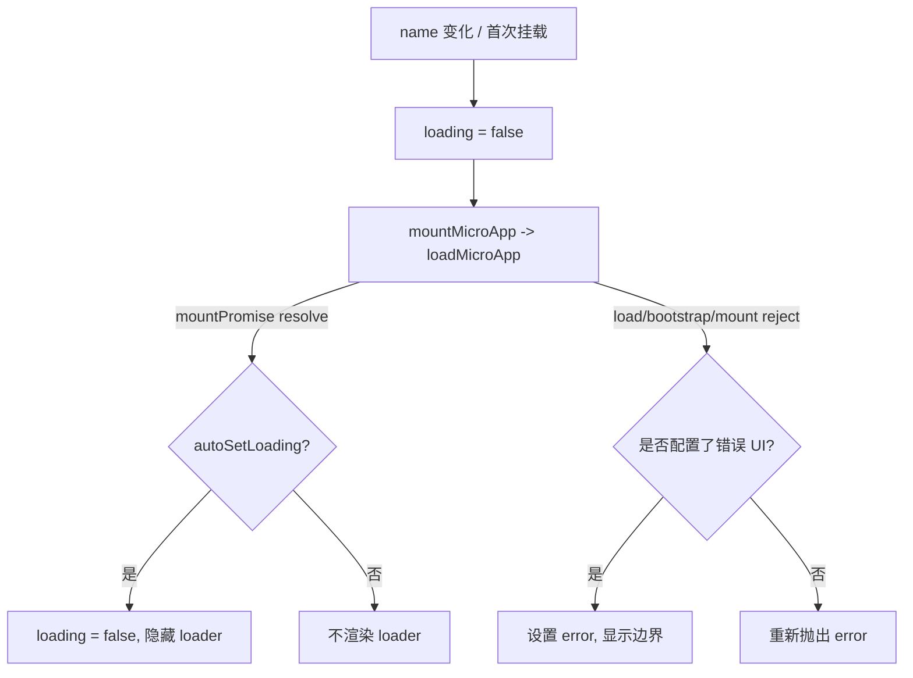

# Vue 版 `<MicroApp>`（@qiankunjs/vue）

`@qiankunjs/vue` 提供了一个 `MicroApp` 组件，以声明式的方式加载、挂载、更新和卸载 qiankun 微应用——整个 lifecycle 都与组件自身的生命周期绑定。它是对 `qiankun` facade 中 [`loadMicroApp`](/zh-CN/api/load-micro-app) 的一层轻量、响应式封装。

该组件基于 [`vue-demi`](https://github.com/vueuse/vue-demi) 构建，因此单一构建产物可同时在 Vue 2 和 Vue 3 下运行。

## 安装

```bash
npm i @qiankunjs/vue
```

`vue` 是一个 peer dependency，版本范围为 `^2.0.0 || >=3.0.0`。在 Vue 2 下你还需要安装 `@vue/composition-api`（组件通过 `vue-demi` 使用 Composition API）。

::: tip 前置条件
`MicroApp` 组件直接调用 `loadMicroApp`，因此使用它无需 `registerMicroApps` 或 `start`。如果你在同一个应用的其他地方还用到了基于路由的注册方式，则仍然需要 [`start`](/zh-CN/api/start)。关于挂载和更新如何映射到 single-spa，参见[微应用的 lifecycle 与 props](/zh-CN/concepts/lifecycle-and-props)。
:::

## 基本用法

```vue
<script setup>
import { MicroApp } from '@qiankunjs/vue';
</script>

<template>
  <micro-app name="app1" entry="http://localhost:8000" />
</template>
```

`name` 和 `entry` 是仅有的两个必填 props。`name` 在所有已挂载的微应用中必须唯一；`entry` 是微应用的 HTML URL。当两者中任意一个缺失时，组件会打印一条错误日志并什么都不做——它不会抛出异常。

组件会渲染一个容器 `<div>`（class 为 `qiankun-micro-app-container`），微应用会被流式写入其中。除非启用了加载态或错误边界，否则不会额外添加包裹元素——参见[加载与错误 UI](#loading-and-error-ui)。

## Props

| Prop | 类型 | 默认值 | 说明 |
| --- | --- | --- | --- |
| `name` | `string` | — | **必填。** 唯一的微应用名称。 |
| `entry` | `string` | — | **必填。** 微应用的 HTML entry URL。 |
| `settings` | `AppConfiguration` | `{ sandbox: true }` | 转发给 `loadMicroApp` 的 loader/sandbox 配置。参见 [AppConfiguration](/zh-CN/api/configuration)。 |
| `lifeCycles` | `LifeCycles` | `undefined` | 全局 lifecycle 钩子（`beforeLoad`、`beforeMount`、`afterMount`、`beforeUnmount`、`afterUnmount`）。它们会被合并进数组，因此你的钩子是被追加的，而非替换。参见 [Lifecycle 钩子](/zh-CN/api/lifecycles)。 |
| `autoSetLoading` | `boolean` | `false` | 微应用加载期间渲染内置的加载指示器。 |
| `autoCaptureError` | `boolean` | `false` | 加载失败时渲染内置的错误边界。 |
| `wrapperClassName` | `string` | `undefined` | 包裹元素上的额外 class。仅在启用了加载态或错误边界时生效。 |
| `className` | `string` | `undefined` | 挂载容器元素上的额外 class。 |
| `appProps` | `object` | `undefined` | 透传给微应用的 props。这是 Vue 绑定中向子应用传递数据的唯一通道。 |

::: info `settings` 默认值与 React 不同
Vue 绑定将 `settings` 默认设为 `{ sandbox: true }`。[React 绑定](/zh-CN/ecosystem/react)则没有 `settings` 默认值。在两种绑定中，最终生效的配置都是 `{ globalContext: window, ...settings }`，因此 `window` 始终是全局上下文。无论如何，`sandbox` 字段在 facade 层面都默认为 `true`。
:::

::: warning `appProps` 是唯一的透传通道
与 React 绑定不同——在 React 中 `<MicroApp>` 上任何额外的 prop 都会转发给子应用——Vue 绑定**不会**转发任意属性。你必须把子应用需要接收的所有内容都放进 `appProps` 对象里。声明之外的任何属性都会被忽略。
:::

### `settings`（AppConfiguration）

`settings` 接受与 [`loadMicroApp`](/zh-CN/api/load-micro-app) 第二个参数相同的对象。完整结构记录在 [AppConfiguration](/zh-CN/api/configuration) 中；字段恰好为 `fetch`、`streamTransformer`、`nodeTransformer`、`sandbox`（默认 `true`）、`globalContext`（默认 `window`）和 `styleIsolation`（默认 `false`）。

```vue
<template>
  <micro-app
    name="app1"
    entry="http://localhost:8000"
    :settings="{ sandbox: true, styleIsolation: true }"
  />
</template>
```

若要为某个特定微应用关闭 JS 沙箱，传入 `:settings="{ sandbox: false }"`。参见 [JS 沙箱](/zh-CN/concepts/js-sandbox)和[样式隔离](/zh-CN/concepts/style-isolation)。

## 向微应用传递 props（`appProps`）

把子应用需要接收的数据放进 `appProps`：

```vue
<script setup>
import { reactive } from 'vue';
import { MicroApp } from '@qiankunjs/vue';

const appProps = reactive({ userId: 42, theme: 'dark' });
</script>

<template>
  <micro-app name="app1" entry="http://localhost:8000" :appProps="appProps" />
</template>
```

这些数据会作为微应用所导出 lifecycle 的 `props` 参数到达微应用：

```ts
// 在微应用内部
export async function mount(props) {
  console.log(props.userId); // 42
}
```

`appProps` 是**深度侦听**的。修改一个嵌套值（例如 `appProps.theme = 'light'`）会在运行中的实例上触发 `microApp.update(props)`，前提是该微应用暴露了 `update` lifecycle、其状态为 `MOUNTED` 且未处于卸载过程中。参见[在应用间共享状态与通信](/zh-CN/cookbook/communicate-between-apps)。

::: tip 更新只在挂载后触发
`update` 会在 mount promise resolve 之后被串行执行，且仅当 parcel 状态为 `MOUNTED` 时才会触发。在微应用完成挂载之前所做的 prop 修改会被折叠进首次挂载，而不会产生一次独立的更新。
:::

## 加载与错误 UI

加载指示器和错误边界都是可选启用（opt-in）的。当两者均未启用且未提供插槽时，组件只会渲染裸露的容器 `<div>`。当 `autoSetLoading`、`autoCaptureError`、`#loader` 插槽或 `#error-boundary` 插槽中任意一项存在时，组件会转而渲染一个包裹元素（class 为 `qiankun-micro-app-wrapper`），在容器旁承载加载/错误节点。



### 自动加载与错误捕获

通过布尔类型的 props 启用内置指示器：

```vue
<script setup>
import { MicroApp } from '@qiankunjs/vue';
</script>

<template>
  <micro-app
    name="app1"
    entry="http://localhost:8000"
    autoSetLoading
    autoCaptureError
  />
</template>
```

这些内置实现有意做得很简单：默认 loader 渲染文本 `loading...`，默认错误边界渲染一个包含 `error.message` 的 `<div>`。对于任何生产级的需求，请使用下面的插槽。

::: info 初始加载状态
Vue 绑定将 `loading` 初始化为 `false`（React 绑定则从 `true` 开始）。该标志在微应用加载期间被置为 `true`，并在 mount promise 上被清除——但只有在启用了 `autoSetLoading` 时才会自动清除。不启用 `autoSetLoading` 时本来也不会渲染任何 loader。
:::

### 自定义 loader 插槽

提供一个 `#loader` 作用域插槽来渲染你自己的指示器。该插槽接收 `{ loading }`，这是一个布尔值，加载期间为 `true`，加载结束后为 `false`。

```vue
<script setup>
import CustomLoader from '@/components/CustomLoader.vue';
import { MicroApp } from '@qiankunjs/vue';
</script>

<template>
  <micro-app name="app1" entry="http://localhost:8000">
    <template #loader="{ loading }">
      <custom-loader :loading="loading" />
    </template>
  </micro-app>
</template>
```

`#loader` 插槽的优先级高于 `autoSetLoading`——如果该插槽存在，默认 loader 就永远不会被使用，你也无需传入 `autoSetLoading`。

### 自定义错误边界插槽

提供一个 `#error-boundary` 作用域插槽来渲染你自己的错误 UI。该插槽接收 `{ error }`，即一个 `Error` 实例，且只有在错误确实发生后才会渲染。

```vue
<script setup>
import CustomErrorBoundary from '@/components/CustomErrorBoundary.vue';
import { MicroApp } from '@qiankunjs/vue';
</script>

<template>
  <micro-app name="app1" entry="http://localhost:8000">
    <template #error-boundary="{ error }">
      <custom-error-boundary :error="error" />
    </template>
  </micro-app>
</template>
```

### 未捕获的错误会被重新抛出

如果你**不**启用 `autoCaptureError` 且**不**提供 `#error-boundary` 插槽，那么 load、bootstrap 和 mount 阶段的错误会被重新抛出，而不是被吞掉。在 Vue 中，可以用组件的 `errorCaptured` 钩子或全局错误处理器来捕获它们：

```ts
// 主应用入口
import { createApp } from 'vue';

const app = createApp(App);
app.config.errorHandler = (err, instance, info) => {
  console.error('micro-app error:', err, info);
};
app.mount('#root');
```

::: warning
启用 `autoCaptureError` 或提供 `#error-boundary` 插槽会将错误处理从“抛出”切换为“渲染”。为每个微应用选择一种策略；不要对已经路由进边界的错误再依赖外层的 `errorCaptured`。参见[处理加载与运行时错误](/zh-CN/cookbook/handle-errors)。
:::

## 重新挂载与暴露的句柄

改变 `name` prop 会拆除当前微应用并挂载一个全新的实例——`name` 是（重新）挂载的 watch key。当组件被销毁时会自动卸载（`onBeforeUnmount`），并且它会在卸载前等待进行中的 mount promise，从而让并发的挂载/卸载周期保持有序。

运行中的微应用实例以两个名字暴露在组件实例上，即 `microApp` 和 `microAppRef`（两者都指向同一个 [`MicroApp`](/zh-CN/api/types) parcel 句柄）。通过模板 ref 来获取它：

```vue
<script setup>
import { ref, onMounted } from 'vue';
import { MicroApp } from '@qiankunjs/vue';

const microAppComp = ref();

onMounted(() => {
  // parcel 句柄：getStatus()、mountPromise、unmount()、update() 等
  console.log(microAppComp.value?.microApp?.getStatus());
});
</script>

<template>
  <micro-app ref="microAppComp" name="app1" entry="http://localhost:8000" />
</template>
```

该句柄是一个 single-spa parcel。它的 `getStatus()` 会返回 `NOT_LOADED`、`LOADING_SOURCE_CODE`、`NOT_BOOTSTRAPPED`、`BOOTSTRAPPING`、`NOT_MOUNTED`、`MOUNTING`、`MOUNTED`、`UPDATING`、`UNMOUNTING`、`UNLOADING`、`SKIP_BECAUSE_BROKEN` 或 `LOAD_ERROR` 之一。完整类型见[类型参考](/zh-CN/api/types)。

::: tip 让组件掌管 lifecycle
优先通过 props（`name`、`appProps`）来驱动微应用，而不是自己在句柄上调用 `unmount()`/`update()`。组件内部会串行化卸载并对并发更新做保护；手动调用可能与这套簿记逻辑产生竞态。
:::

## CSS 钩子

class 名称与 React 绑定完全一致。有两个稳定的钩子始终会被应用，而你的 `wrapperClassName` / `className` 会在提供时被前置追加。

| 元素 | 始终应用的 class | 来自 prop 的额外 class |
| --- | --- | --- |
| 包裹元素（仅在启用了加载态或错误边界时存在） | `qiankun-micro-app-wrapper` | `wrapperClassName` |
| 挂载容器 | `qiankun-micro-app-container` | `className` |

```css
/* 针对每一个微应用的挂载容器 */
.qiankun-micro-app-container {
  min-height: 320px;
}

/* 针对承载 loader + 错误 UI 的包裹元素 */
.qiankun-micro-app-wrapper {
  position: relative;
}
```

由于包裹元素只在启用了加载态或错误边界时才存在，因此对于没有加载/错误 UI 的普通 `<micro-app>`，`wrapperClassName` 不会生效。

## 完整示例

```vue
<script setup>
import { reactive } from 'vue';
import { MicroApp } from '@qiankunjs/vue';
import Spinner from '@/components/Spinner.vue';
import ErrorPanel from '@/components/ErrorPanel.vue';

const appProps = reactive({ userId: 42 });
</script>

<template>
  <micro-app
    name="app1"
    entry="http://localhost:8000"
    :settings="{ sandbox: true, styleIsolation: true }"
    :appProps="appProps"
    wrapperClassName="my-wrapper"
    className="my-container"
  >
    <template #loader="{ loading }">
      <spinner v-if="loading" />
    </template>
    <template #error-boundary="{ error }">
      <error-panel :message="error.message" />
    </template>
  </micro-app>
</template>
```

## 另请参阅

- [React 版 `<MicroApp>`](/zh-CN/ecosystem/react) —— React 绑定及其 prop 模型的差异。
- [loadMicroApp](/zh-CN/api/load-micro-app) —— 该组件所封装的 facade API。
- [AppConfiguration](/zh-CN/api/configuration) —— `settings` 的结构。
- [微应用的 lifecycle 与 props](/zh-CN/concepts/lifecycle-and-props) —— mount/update/unmount 语义。
- [运行多个微应用实例](/zh-CN/cookbook/run-multiple-instances) —— 同时挂载多个微应用。
