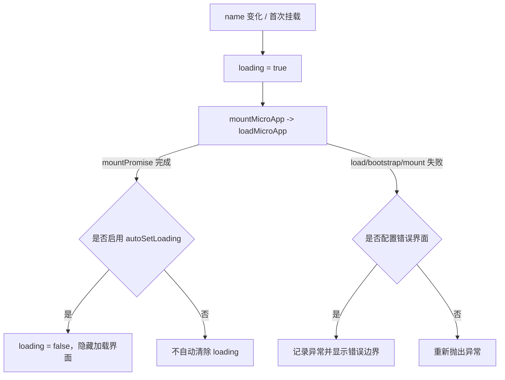

# Vue `<MicroApp>` 组件（@qiankunjs/vue）

`@qiankunjs/vue` 提供 `MicroApp` 组件，用于以声明式方式加载、挂载、更新和卸载 qiankun 微应用。该组件封装了 [`loadMicroApp`](/zh-CN/api/load-micro-app)，并根据 Vue 组件的生命周期管理微应用实例。

组件基于 [`vue-demi`](https://github.com/vueuse/vue-demi) 构建，同一份构建产物同时支持 Vue 2 和 Vue 3。

## 安装

```bash
npm install @qiankunjs/vue@rc qiankun@rc
```

主应用必须安装 `vue`，版本范围为 `^2.0.0 || >=3.0.0`。Vue 2 项目还需要安装 `@vue/composition-api`，因为组件通过 `vue-demi` 使用组合式 API。

::: tip 使用前提
`MicroApp` 组件直接调用 `loadMicroApp`，单独使用时无需调用 `registerMicroApps` 或 `start`。如果同一主应用还使用基于路由的注册方式，则仍需调用 [`start`](/zh-CN/api/start)。挂载和更新操作与 single-spa 生命周期的对应关系参见[微应用生命周期与 props](/zh-CN/concepts/lifecycle-and-props)。
:::

## 基本用法

```vue
<script setup>
import { MicroApp } from '@qiankunjs/vue';
</script>

<template>
  <micro-app name="app1" entry="http://localhost:8000" />
</template>
```

`name` 和 `entry` 是仅有的两个必填 prop。`name` 用于标识当前实例，`entry` 用于指定微应用的 HTML 入口 URL。缺少其中任意一项时，组件仅输出错误日志，不会加载微应用，也不会抛出异常。

组件会渲染一个 `class` 为 `qiankun-micro-app-container` 的 `<div>`，并将微应用内容流式写入该容器。只有启用加载状态或错误边界时，组件才会额外渲染一层包裹元素。详见[加载与错误界面](#loading-and-error-ui)。

## Props

| Prop | 类型 | 默认值 | 说明 |
| --- | --- | --- | --- |
| `name` | `string` | — | **必填。** 微应用实例的名称；值发生变化时会重新挂载。 |
| `entry` | `string` | — | **必填。** 微应用的 HTML 入口 URL。 |
| `settings` | `AppConfiguration` | `{ sandbox: true }` | 传递给 `loadMicroApp` 的加载器和沙箱配置。参见 [AppConfiguration](/zh-CN/api/configuration)。 |
| `lifeCycles` | `LifeCycles` | `undefined` | 由主应用提供的生命周期钩子，包括 `beforeLoad`、`beforeMount`、`afterMount`、`beforeUnmount` 和 `afterUnmount`。每项可传入函数或函数数组。参见[生命周期钩子](/zh-CN/api/lifecycles)。 |
| `autoSetLoading` | `boolean` | `false` | 微应用加载期间渲染内置的加载指示器。 |
| `autoCaptureError` | `boolean` | `false` | 加载失败时渲染内置的错误边界。 |
| `wrapperClassName` | `string` | `undefined` | 包裹元素上的额外 CSS 类名。仅在启用加载状态或错误边界时生效。 |
| `className` | `string` | `undefined` | 挂载容器元素上的额外 CSS 类名。 |
| `appProps` | `object` | `undefined` | 传递给微应用的 props。Vue 绑定仅通过该属性向微应用传递数据。 |

::: info `settings` 的默认值与 React 绑定不同
Vue 绑定的 `settings` 默认值为 `{ sandbox: true }`，[React 绑定](/zh-CN/ecosystem/react)则不设置默认值，不会替你填任何默认项。两者的 `sandbox` 在 qiankun 核心运行时中默认值都为 `true`，因此不额外传值时行为一致。
:::

::: warning 业务数据通过 `appProps` 传递
React 绑定会将 `<MicroApp>` 上的附加 prop 传递给微应用，Vue 绑定则不会传递任意附加属性。业务数据必须放入 `appProps` 对象，未声明的其他属性会被忽略。当前实现还会将 `autoSetLoading`、`autoCaptureError` 和 `appProps` 对象本身传入微应用；业务代码不应依赖这些组件控制字段。
:::

### `settings`（AppConfiguration）

`settings` 与 [`loadMicroApp`](/zh-CN/api/load-micro-app) 的第二个参数结构相同。完整定义参见 [AppConfiguration](/zh-CN/api/configuration)，字段为 `fetch`、`streamTransformer`、`nodeTransformer` 和 `sandbox`（默认值为 `true`）。样式隔离、额外全局变量、孵化上下文和隔离插件均位于 `sandbox` 对象内部。

```vue
<template>
  <micro-app
    name="app1"
    entry="http://localhost:8000"
    :settings="{ sandbox: { styleIsolation: true } }"
  />
</template>
```

如需为特定微应用关闭 JavaScript 沙箱，可传入 `:settings="{ sandbox: false }"`。相关行为参见 [JavaScript 隔离](/zh-CN/concepts/js-sandbox)和[样式隔离](/zh-CN/concepts/style-isolation)。

## 向微应用传递 props（`appProps`）

需要传递给微应用的数据应放入 `appProps`：

```vue
<script setup>
import { reactive } from 'vue';
import { MicroApp } from '@qiankunjs/vue';

const appProps = reactive({ userId: 42, theme: 'dark' });
</script>

<template>
  <micro-app name="app1" entry="http://localhost:8000" :appProps="appProps" />
</template>
```

这些数据会作为 `props` 参数传给微应用导出的生命周期函数：

```ts
// 微应用内部
export async function mount(props) {
  console.log(props.userId); // 42
}
```

组件会**深度侦听** `appProps`。修改嵌套值（例如 `appProps.theme = 'light'`）会尝试更新当前实例。执行更新前，微应用必须导出 `update` 生命周期、处于 `MOUNTED` 状态，并且尚未开始卸载。相关说明参见[应用间共享状态与通信](/zh-CN/cookbook/communicate-between-apps)。

::: tip `update` 仅在挂载完成后执行
组件会等待 `mountPromise` 完成，再按顺序处理更新，并且仅在 Parcel 状态为 `MOUNTED` 时调用 `update`。挂载期间发生的中间状态变化不保证逐次触发更新。
:::

## 加载与错误界面 {#loading-and-error-ui}

加载指示器和错误边界均需显式启用。如果未启用这两项功能，也未提供对应插槽，组件只渲染挂载容器 `<div>`。如果设置了 `autoSetLoading`、`autoCaptureError`、`#loader` 插槽或 `#error-boundary` 插槽中的任意一项，组件会额外渲染 `class` 为 `qiankun-micro-app-wrapper` 的包裹元素，用于容纳加载节点、错误节点和挂载容器。



### 自动加载与错误捕获

通过以下两个布尔 prop 启用内置指示器：

```vue
<script setup>
import { MicroApp } from '@qiankunjs/vue';
</script>

<template>
  <micro-app
    name="app1"
    entry="http://localhost:8000"
    autoSetLoading
    autoCaptureError
  />
</template>
```

内置界面仅提供基础占位内容：默认加载界面渲染文本 `loading...`，默认错误边界渲染包含 `error.message` 的 `<div>`。生产环境通常应使用下文介绍的插槽提供自定义界面。

::: info 加载状态的初始值
Vue 绑定将 `loading` 初始化为 `false`，React 绑定的初始值则为 `true`。微应用开始加载时，该状态会设为 `true`；启用 `autoSetLoading` 后，组件会在 `mountPromise` 完成时将其恢复为 `false`。未启用 `autoSetLoading` 时，组件不会渲染内置加载界面。
:::

### 自定义 `loader` 插槽

可通过 `#loader` 作用域插槽渲染自定义加载指示器。组件会将布尔值 `loading` 直接传给插槽：加载期间为 `true`，加载结束后为 `false`。

```vue
<script setup>
import CustomLoader from '@/components/CustomLoader.vue';
import { MicroApp } from '@qiankunjs/vue';
</script>

<template>
  <micro-app name="app1" entry="http://localhost:8000" autoSetLoading>
    <template #loader="loading">
      <custom-loader :loading="loading" />
    </template>
  </micro-app>
</template>
```

`#loader` 插槽的优先级高于内置加载界面。提供该插槽后，组件不会渲染默认加载界面；仍需设置 `autoSetLoading`，组件才会在 `mountPromise` 完成后自动将 `loading` 设为 `false`。

### 自定义错误边界插槽

可通过 `#error-boundary` 作用域插槽渲染自定义错误界面。组件会将 `Error` 实例直接传给插槽。该插槽仅在发生错误后渲染。

```vue
<script setup>
import CustomErrorBoundary from '@/components/CustomErrorBoundary.vue';
import { MicroApp } from '@qiankunjs/vue';
</script>

<template>
  <micro-app name="app1" entry="http://localhost:8000">
    <template #error-boundary="error">
      <custom-error-boundary :error="error" />
    </template>
  </micro-app>
</template>
```

### 未捕获的错误会重新抛出

如果既未启用 `autoCaptureError`，也未提供 `#error-boundary` 插槽，则 `load`、`bootstrap` 和 `mount` 阶段的错误会从异步加载流程中重新抛出。建议启用组件内置错误界面或提供自定义错误界面，避免产生未处理的 Promise 拒绝。

::: warning
启用 `autoCaptureError` 或提供 `#error-boundary` 插槽后，组件会通过错误界面呈现异常，不再重新抛出。同一微应用应选择一种错误处理方式。详见[处理微应用错误](/zh-CN/cookbook/handle-errors)。
:::

## 重新挂载与实例句柄

组件仅侦听 `name` 的变化来触发重新挂载。修改该 prop 会卸载当前微应用并创建新实例；仅修改 `entry`、`settings` 或 `lifeCycles` 不会创建新实例。组件销毁时，`onBeforeUnmount` 会自动卸载微应用；卸载操作会等待正在进行的 `mountPromise` 完成，以保持挂载和卸载的执行顺序。

可以通过组件实例的 `microApp` 和 `microAppRef` 两个属性访问当前微应用实例，两者均指向同一个 [`MicroApp`](/zh-CN/api/types) Parcel 句柄。可通过模板 ref 访问该句柄：

```vue
<script setup>
import { ref, onMounted } from 'vue';
import { MicroApp } from '@qiankunjs/vue';

const microAppComp = ref();

onMounted(() => {
  // Parcel 句柄：getStatus()、mountPromise、unmount()、update() 等
  console.log(microAppComp.value?.microApp?.getStatus());
});
</script>

<template>
  <micro-app ref="microAppComp" name="app1" entry="http://localhost:8000" />
</template>
```

该句柄是 `@qiankunjs/single-spa`（qiankun 内置的 single-spa fork）的 Parcel。`getStatus()` 返回 `NOT_LOADED`、`LOADING_SOURCE_CODE`、`NOT_BOOTSTRAPPED`、`BOOTSTRAPPING`、`NOT_MOUNTED`、`MOUNTING`、`MOUNTED`、`UPDATING`、`UNMOUNTING`、`UNLOADING`、`SKIP_BECAUSE_BROKEN` 或 `LOAD_ERROR`。完整类型参见[类型参考](/zh-CN/api/types)。

::: tip 由组件管理生命周期
应优先通过 prop（`name`、`appProps`）管理微应用，而不是直接调用句柄上的 `unmount()` 或 `update()`。组件会按顺序执行卸载，并协调并发更新；直接调用句柄方法可能与组件的内部状态发生冲突。
:::

## CSS 钩子

CSS 类名与 React 绑定一致。组件会添加两个稳定的类名，并在提供 `wrapperClassName` 或 `className` 时将自定义值添加到对应类名之前。

| 元素 | 始终应用的类名 | prop 提供的额外类名 |
| --- | --- | --- |
| 包裹元素（仅在启用加载状态或错误边界时存在） | `qiankun-micro-app-wrapper` | `wrapperClassName` |
| 挂载容器 | `qiankun-micro-app-container` | `className` |

```css
/* 所有微应用的挂载容器 */
.qiankun-micro-app-container {
  min-height: 320px;
}

/* 承载加载界面和错误界面的包裹元素 */
.qiankun-micro-app-wrapper {
  position: relative;
}
```

包裹元素仅在启用加载状态或错误边界时存在。因此，如果 `<micro-app>` 未配置加载或错误界面，`wrapperClassName` 不会产生效果。

## 完整示例

```vue
<script setup>
import { reactive } from 'vue';
import { MicroApp } from '@qiankunjs/vue';
import Spinner from '@/components/Spinner.vue';
import ErrorPanel from '@/components/ErrorPanel.vue';

const appProps = reactive({ userId: 42 });
</script>

<template>
  <micro-app
    name="app1"
    entry="http://localhost:8000"
    :settings="{ sandbox: { styleIsolation: true } }"
    :appProps="appProps"
    autoSetLoading
    wrapperClassName="my-wrapper"
    className="my-container"
  >
    <template #loader="loading">
      <spinner v-if="loading" />
    </template>
    <template #error-boundary="error">
      <error-panel :message="error.message" />
    </template>
  </micro-app>
</template>
```

## 相关内容

- [React `<MicroApp>` 组件](/zh-CN/ecosystem/react)——React 绑定及其 prop 传递方式。
- [loadMicroApp](/zh-CN/api/load-micro-app)——组件所封装的核心 API。
- [AppConfiguration](/zh-CN/api/configuration)——`settings` 的类型定义。
- [微应用生命周期与 props](/zh-CN/concepts/lifecycle-and-props)——`mount`、`update` 和 `unmount` 的语义。
- [运行多个微应用实例](/zh-CN/cookbook/run-multiple-instances)——同时挂载多个微应用。
