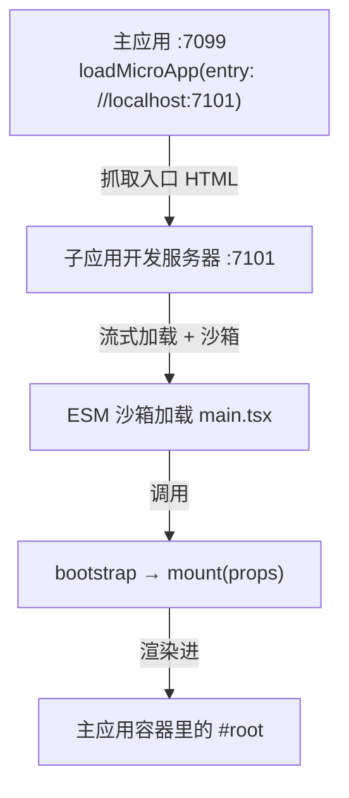

# 快速上手

这篇上手教程用官方脚手架 `create-qiankun`，带你从一个空目录起步，把两个开发服务器跑起来——一个主应用(基座)，在浏览器里加载一个微应用(子应用)。跟完之后，你手上会有一个能跑的微前端，也能看清 qiankun 到底替你接了哪些线。

如果你更想自己一块一块拼起来、把每个环节都摸透，那就走[手把手教程](/zh-CN/tutorial/)那条路。

## 前置要求

- **Node.js `>=20.19`。** 这是 Vite 的要求，而每个脚手架生成的应用都用 Vite 跑开发服务器和构建。
- **一个不太老的浏览器。** qiankun v3 依赖 Proxy、流式 fetch 和动态注入的 import map。Chromium 系浏览器和 Safari 开箱即用。

::: warning Firefox 与 ESM 沙箱
Firefox 目前还不支持动态注入的 import map，而 ESM 沙箱正好依赖它。走 ESM 路径加载的微应用(也就是 Vite 应用)现在在 Firefox 上跑不起来。走经典打包(UMD / window 全局库)方式的微应用不受影响。跟这篇教程时，请用 Chromium 系浏览器或 Safari。
:::

## 用 create-qiankun 起项目

`create-qiankun` 会生成一个 Vite 项目，并把它改造成 qiankun 能接的样子。每个应用跑一次——主应用一次，每个子应用各一次。

用你顺手的包管理器执行：

::: code-group

```bash [npm]
npx create-qiankun@latest
```

```bash [yarn]
yarn create qiankun@latest
```

```bash [pnpm]
pnpm dlx create-qiankun@latest
```

:::

不带参数直接跑，CLI 会进入交互模式，依次问你：

1. **应用类型** —— `Main App (主应用)` 或 `Sub App (子应用)`。什么都不选时默认是子应用。
2. **应用名** —— 会成为 `package.json` 里的 name；对子应用来说，它同时是 `window[appName]` 这个全局键。名字必须匹配 `/^[a-z0-9-]+$/`——只能用小写字母、数字和连字符。默认值分别是 `qiankun-main-app` 和 `qiankun-sub-app`。
3. **模板** —— 只在建子应用时才问：`React + TypeScript`(`react-ts`)、`React`(`react`)、`Vue + TypeScript`(`vue-ts`)或 `Vue`(`vue`)。主应用固定是 React + TypeScript。

::: tip 项目生成在哪
如果当前目录的上一级里有 `pnpm-workspace.yaml`，应用会生成到 `<workspace-root>/packages/<app-name>`；否则就落在 `<cwd>/<app-name>`。CLI 打印出的 `cd` 下一步提示会指向真实路径。目标目录若已存在，CLI 会直接报错停下。
:::

### 建主应用

主应用是承载微应用的基座。它固定是 React + TypeScript，跑在 **7099 端口**。

你也可以把交互提示一次性喂进去，非交互地建：

```bash
npx create-qiankun@latest main-app --type main
```

- `--type` / `-T` —— `main` 或 `sub`。
- 带上位置参数当名字，就跳过问名字那一步。
- `--template` 不能和 `--type main` 一起用(主应用固定是 `react-ts`)。

### 建子应用

子应用就是那个被加载进来的微应用。框架随便挑一个；它跑在 **7101 端口**，而生成出来的主应用默认就指向这个入口。

```bash
npx create-qiankun@latest sub-app --template react-ts
```

- `--template` / `-t` —— `react-ts`、`react`、`vue-ts` 或 `vue`。带了它就意味着建的是子应用。

两条命令在同一个目录下执行，这样两个项目就并排放在一起。

## 装依赖、跑起来

生成出来的每个项目都是独立的 Vite 应用，各有各的依赖。把两个开发服务器都装好、跑起来——开两个终端，或者各自丢到后台。

::: code-group

```bash [sub-app]
cd sub-app
pnpm install
pnpm dev   # serves on http://localhost:7101
```

```bash [main-app]
cd main-app
pnpm install
pnpm dev   # serves on http://localhost:7099
```

:::

先把子应用跑起来，让它的开发服务器就绪，主应用来加载时才能拿到东西，然后打开 **http://localhost:7099**。主应用渲染自己的外壳,并把子应用挂到一个容器元素里。

单独打开子应用 **http://localhost:7101** 的话，它会独立渲染——生成的入口文件在没有 qiankun 驱动时会自渲染(下面细说)。

## 主应用是怎么加载子应用的

生成的 `main-app/src/App.tsx` 在 `useEffect` 里、等容器元素就位之后，用 `loadMicroApp` 手动把子应用挂上去：

```tsx [main-app/src/App.tsx]
import { loadMicroApp, type MicroApp } from 'qiankun';
import { useEffect, useRef } from 'react';

export default function App() {
  const containerRef = useRef<HTMLDivElement>(null);
  const microAppRef = useRef<MicroApp>();

  useEffect(() => {
    microAppRef.current = loadMicroApp(
      { name: 'sub-app', entry: '//localhost:7101', container: containerRef.current! },
      { sandbox: true }, // sandbox on by default; set styleIsolation: true to add CSS @scope isolation
    );

    return () => {
      void microAppRef.current?.unmount();
    };
  }, []);

  return <div ref={containerRef} id="micro-app-container" />;
}
```

要紧的是这三个参数：

| 参数 | 是什么 |
| --- | --- |
| `name` | 微应用的身份标识。它必须和子应用暴露的全局键对上(`window['sub-app']`)。 |
| `entry` | 指向子应用 HTML 入口的 URL 字符串——这里是开发服务器根地址 `//localhost:7101`。 |
| `container` | 应用挂载进去的 `HTMLElement`(v3 里不再是选择器字符串)。 |

`loadMicroApp` 返回一个 `MicroApp` 句柄。清理时一定要调 `unmount()`——上面 effect 的 teardown 就干了这件事，这样重新挂载和多实例才不会出乱子。

::: info loadMicroApp 与 registerMicroApps
`loadMicroApp` 是手动挂载，什么时候挂由你说了算。如果想让 qiankun 按 URL 来激活应用、走路由驱动的挂载，那就改用 [`registerMicroApps`](/zh-CN/api/register-micro-apps) 加 [`start`](/zh-CN/api/start)。生成的 `main-app/src/main.tsx` 里就注释着一段路由驱动写法的示例。完整 API 见 [loadMicroApp](/zh-CN/api/load-micro-app)。
:::

## 脚手架替你接好了什么

`create-qiankun` 的价值在子应用那头的接线。两个文件就能让一个普通 Vite 应用被 qiankun 加载。

### Vite 配置

子应用的 `vite.config.ts` 在框架插件之外加了 qiankun 的 bundler 插件，并把开发端口钉在 7101:

```ts [sub-app/vite.config.ts]
import { qiankun } from '@qiankunjs/bundler-plugin/vite';
import react from '@vitejs/plugin-react';
import { defineConfig } from 'vite';

export default defineConfig({
  plugins: [react(), qiankun()],
  server: { port: 7101 },
});
```

`qiankun()` 不接任何参数。它给开发服务器和 preview 服务器设上宽松的 CORS 头(主应用是跨域去抓入口 HTML 和整张模块图的)，并在构建出的 HTML 里标记入口 `<script>`。v3 里没有 SystemJS，也没有 UMD 构建模式——qiankun 直接通过 [ESM 沙箱](/zh-CN/concepts/esm-sandbox)加载应用原生的 ESM 产物，所以 `dev`、`build`、`preview` 原样就能被 qiankun 接。细节见 [@qiankunjs/bundler-plugin](/zh-CN/ecosystem/bundler-plugin)。

### 入口文件

子应用的 `src/main.tsx` 导出 qiankun 的生命周期函数，只在独立运行时才自渲染：

```tsx [sub-app/src/main.tsx]
import React from 'react';
import ReactDOM from 'react-dom/client';
import App from './App';
import './index.css';

declare global {
  interface Window {
    __POWERED_BY_QIANKUN__?: boolean;
  }
}

let root: ReactDOM.Root | undefined;

function render(props: { container?: Element } = {}) {
  const container = props.container?.querySelector('#root') ?? document.getElementById('root');
  if (!container) return;
  root = ReactDOM.createRoot(container);
  root.render(
    <React.StrictMode>
      <App />
    </React.StrictMode>,
  );
}

export async function bootstrap() {}
export async function mount(props: { container?: Element }) {
  render(props);
}
export async function unmount() {
  root?.unmount();
  root = undefined;
}

if (window.__POWERED_BY_QIANKUN__) {
  window['sub-app'] = { bootstrap, mount, unmount };
} else {
  render();
}
```

让它能在 qiankun 下跑起来的几处关键：

- **`bootstrap` / `mount` / `unmount`** 是 qiankun 调用的[生命周期钩子](/zh-CN/concepts/lifecycle-and-props)。`mount` 收到的 props 里带着基座传下来的 `container`，应用在这个容器内部解析出自己的挂载节点(`props.container?.querySelector('#root')`)；独立运行时则退回到全局 document 上找。
- **`window.__POWERED_BY_QIANKUN__`** 由 qiankun 在运行时于沙箱内注入。有它，模块就把生命周期挂到 `window['sub-app']` 上(经典模式的兜底方式)；没有，它就自己渲染，这样应用单独打开也能用。
- **`unmount`** 把应用彻底拆干净，好让它能被干净地重新挂载。

Vue 子应用的形状是一样的：挂载到 `#app`,`unmount` 里调 `app.unmount()`。



## 下一步

- **自己动手搭一遍。** [手把手教程](/zh-CN/tutorial/)不用脚手架，带你走一遍建[微应用](/zh-CN/tutorial/build-the-micro-app)、建[主应用](/zh-CN/tutorial/build-the-main-app)、再把它们[连起来](/zh-CN/tutorial/run-and-verify)的全过程。
- **搞懂运行时。** 先看[架构概览](/zh-CN/concepts/architecture)，再看 [JS 沙箱](/zh-CN/concepts/js-sandbox)、[HTML 入口流式加载](/zh-CN/concepts/html-entry-loading)和[样式隔离](/zh-CN/concepts/style-isolation)。
- **查 API。** [API 参考](/zh-CN/api/)收录了 [registerMicroApps](/zh-CN/api/register-micro-apps)、[start](/zh-CN/api/start)、[loadMicroApp](/zh-CN/api/load-micro-app) 和 [AppConfiguration](/zh-CN/api/configuration)。
- **改造一个现成的应用。** 参考 cookbook 里的做法，把一个 [Vite 应用](/zh-CN/cookbook/prepare-a-vite-app)或 [Webpack 应用](/zh-CN/cookbook/prepare-a-webpack-app)改造成 qiankun 能接的样子。
