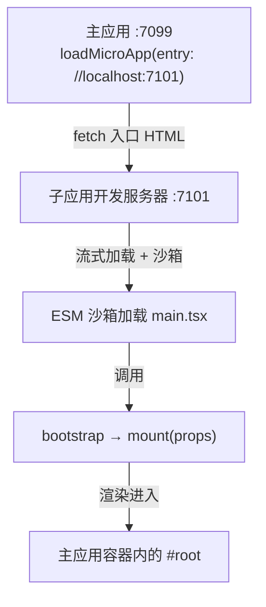

# 快速上手

本教程将带你从一个空目录出发，启动两个开发服务器——一个在浏览器中加载子（微）应用的主（宿主）应用——全程使用官方的 `create-qiankun` 脚手架。完成之后，你将拥有一个可运行的微前端，并清晰地理解 qiankun 为你搭建了哪些内容。

如果你更希望手动组装每一个环节，以理解各个部分是如何协作的，请改为跟随[手把手教程](/zh-CN/tutorial/)。

## 前置条件

- **Node.js `>=20.19`。** 这是 Vite 的要求，而每个脚手架生成的应用都用它作为开发服务器和构建工具。
- **一款现代浏览器。** qiankun v3 依赖 Proxy、流式 fetch 以及动态注入的 import map。基于 Chromium 的浏览器和 Safari 开箱即用。

::: warning Firefox 与 ESM 沙箱
Firefox 尚不支持动态注入的 import map，而 ESM 沙箱正依赖于此。目前通过 ESM 路径加载的微应用（Vite 应用）无法在 Firefox 下运行。经典模式（UMD/window 库）的微应用不受影响。跟随本教程时请使用 Chromium 系浏览器或 Safari。
:::

## 使用 create-qiankun 生成项目

`create-qiankun` 会生成一个 Vite 项目，并对其进行改造，使其可被 qiankun 加载。每个应用运行一次——主应用运行一次，每个子应用各运行一次。

使用你偏好的包管理器来运行它：

::: code-group

```bash [npm]
npx create-qiankun@latest
```

```bash [yarn]
yarn create qiankun@latest
```

```bash [pnpm]
pnpm dlx create-qiankun@latest
```

:::

不带任何参数时，CLI 是交互式的，会依次提示：

1. **应用类型** —— `Main App (主应用)` 或 `Sub App (子应用)`。未选择时默认为子应用。
2. **应用名称** —— 它会成为 `package.json` 的 name，并且对于子应用而言还是 `window[appName]` 的全局键名。它必须匹配 `/^[a-z0-9-]+$/`——只允许小写字母、数字和连字符。默认值分别为 `qiankun-main-app` 和 `qiankun-sub-app`。
3. **模板** —— 仅在子应用时询问：`React + TypeScript`（`react-ts`）、`React`（`react`）、`Vue + TypeScript`（`vue-ts`）或 `Vue`（`vue`）。主应用始终为 React + TypeScript。

::: tip 应用写入的位置
如果当前目录的父目录包含 `pnpm-workspace.yaml`，应用会生成到 `<workspace-root>/packages/<app-name>`。否则会落到 `<cwd>/<app-name>`。打印出来的 `cd` 后续步骤会反映真实路径。如果目标目录已存在，CLI 会报错并停止。
:::

### 创建主应用

主应用是挂载微应用的宿主。它始终为 React + TypeScript，运行在 **7099 端口**。

你可以以非交互方式驱动这些提示：

```bash
npx create-qiankun@latest main-app --type main
```

- `--type` / `-T` —— `main` 或 `sub`。
- 传入位置参数形式的名称会跳过名称提示。
- `--template` 不能与 `--type main` 同时使用（主应用始终为 `react-ts`）。

### 创建子应用

子应用是被加载的微应用。选择任意受支持的框架即可；它运行在 **7101 端口**，也正是生成的主应用所指向的入口。

```bash
npx create-qiankun@latest sub-app --template react-ts
```

- `--template` / `-t` —— `react-ts`、`react`、`vue-ts` 或 `vue`。传入它即隐含表示这是一个子应用。

请在同一个目录下运行这两条命令，让两个项目并排放置。

## 安装并运行

每个生成的项目都是独立的 Vite 应用，拥有各自的依赖。安装并启动两个开发服务器——使用两个终端，或者分别在后台启动。

::: code-group

```bash [sub-app]
cd sub-app
pnpm install
pnpm dev   # serves on http://localhost:7101
```

```bash [main-app]
cd main-app
pnpm install
pnpm dev   # serves on http://localhost:7099
```

:::

先启动子应用，让它的开发服务器在主应用尝试加载它时已经就绪，然后打开 **http://localhost:7099**。主应用会渲染自己的外壳，并在一个容器元素内挂载子应用。

如果你单独打开子应用 **http://localhost:7101**，它会以独立模式渲染——生成的入口文件在没有 qiankun 驱动时会自渲染（下文会进一步说明）。

## 主应用如何加载子应用

生成的 `main-app/src/App.tsx` 在 `useEffect` 中、待容器元素存在后，通过 `loadMicroApp` 命令式地挂载子应用：

```tsx [main-app/src/App.tsx]
import { loadMicroApp, type MicroApp } from 'qiankun';
import { useEffect, useRef } from 'react';

export default function App() {
  const containerRef = useRef<HTMLDivElement>(null);
  const microAppRef = useRef<MicroApp>();

  useEffect(() => {
    microAppRef.current = loadMicroApp(
      { name: 'sub-app', entry: '//localhost:7101', container: containerRef.current! },
      { sandbox: true }, // sandbox on by default; set styleIsolation: true to add CSS @scope isolation
    );

    return () => {
      void microAppRef.current?.unmount();
    };
  }, []);

  return <div ref={containerRef} id="micro-app-container" />;
}
```

关键的三个参数：

| 参数 | 含义 |
| --- | --- |
| `name` | 微应用的身份标识。它必须与子应用暴露的全局键名一致（`window['sub-app']`）。 |
| `entry` | 指向子应用 HTML 入口的 URL 字符串——此处为开发服务器根路径 `//localhost:7101`。 |
| `container` | 应用挂载进入的 `HTMLElement`（在 v3 中不再是选择器字符串）。 |

`loadMicroApp` 返回一个 `MicroApp` 句柄。请务必在清理时调用 `unmount()`——effect 的销毁逻辑正是这么做的，以保证重新挂载和多实例场景保持干净。

::: info loadMicroApp 与 registerMicroApps
`loadMicroApp` 以命令式方式挂载应用——由你决定何时挂载。若需要基于路由挂载，让 qiankun 根据 URL 激活应用，请改用 [`registerMicroApps`](/zh-CN/api/register-micro-apps) + [`start`](/zh-CN/api/start)。生成的 `main-app/src/main.tsx` 包含了一段被注释掉的基于路由方式的示例。完整 API 参见 [loadMicroApp](/zh-CN/api/load-micro-app)。
:::

## 脚手架为你搭建了什么

`create-qiankun` 的价值在于子应用侧的管道搭建。两个文件让一个普通的 Vite 应用可被 qiankun 加载。

### Vite 配置

子应用的 `vite.config.ts` 在框架插件之外加入了 qiankun 的 bundler 插件，并将开发端口固定为 7101：

```ts [sub-app/vite.config.ts]
import { qiankun } from '@qiankunjs/bundler-plugin/vite';
import react from '@vitejs/plugin-react';
import { defineConfig } from 'vite';

export default defineConfig({
  plugins: [react(), qiankun()],
  server: { port: 7101 },
});
```

`qiankun()` 不接受任何参数。它会为开发服务器和预览服务器设置宽松的 CORS 头（主应用会跨源 fetch 入口 HTML 和模块图），并在构建后的 HTML 中标记入口 `<script>`。v3 中不存在 SystemJS 或 UMD 构建模式——qiankun 通过其 [ESM 沙箱](/zh-CN/concepts/esm-sandbox)直接加载应用原生的 ESM 产物，因此 `dev`、`build` 和 `preview` 原样即可被 qiankun 加载。详情参见 [@qiankunjs/bundler-plugin](/zh-CN/ecosystem/bundler-plugin)。

### 入口文件

子应用的 `src/main.tsx` 导出了 qiankun 生命周期函数，并且只在独立运行时才自渲染：

```tsx [sub-app/src/main.tsx]
import React from 'react';
import ReactDOM from 'react-dom/client';
import App from './App';
import './index.css';

declare global {
  interface Window {
    __POWERED_BY_QIANKUN__?: boolean;
  }
}

let root: ReactDOM.Root | undefined;

function render(props: { container?: Element } = {}) {
  const container = props.container?.querySelector('#root') ?? document.getElementById('root');
  if (!container) return;
  root = ReactDOM.createRoot(container);
  root.render(
    <React.StrictMode>
      <App />
    </React.StrictMode>,
  );
}

export async function bootstrap() {}
export async function mount(props: { container?: Element }) {
  render(props);
}
export async function unmount() {
  root?.unmount();
  root = undefined;
}

if (window.__POWERED_BY_QIANKUN__) {
  window['sub-app'] = { bootstrap, mount, unmount };
} else {
  render();
}
```

让它在 qiankun 下正常工作的几个要点：

- **`bootstrap` / `mount` / `unmount`** 是 qiankun 会调用的[生命周期钩子](/zh-CN/concepts/lifecycle-and-props)。`mount` 接收包含宿主 `container` 在内的 props；应用在该容器内解析自己的挂载节点（`props.container?.querySelector('#root')`），独立运行时则回退到全局 document。
- **`window.__POWERED_BY_QIANKUN__`** 由 qiankun 在运行时于沙箱内设置。当其存在时，模块会将其生命周期发布到 `window['sub-app']`（经典模式的回退方案）；否则它会自渲染，从而使应用仍可独立运行。
- **`unmount`** 会将应用彻底销毁，以便干净地重新挂载。

Vue 子应用遵循相同的结构：它挂载到 `#app`，`unmount` 调用 `app.unmount()`。



## 后续步骤

- **自己动手搭建。** [手把手教程](/zh-CN/tutorial/)会带你逐步创建一个[微应用](/zh-CN/tutorial/build-the-micro-app)、一个[主应用](/zh-CN/tutorial/build-the-main-app)，并在不使用脚手架的情况下[将它们连接起来](/zh-CN/tutorial/run-and-verify)。
- **理解运行时。** 先阅读[架构总览](/zh-CN/concepts/architecture)，然后阅读 [JS 沙箱](/zh-CN/concepts/js-sandbox)、[HTML Entry 流式加载](/zh-CN/concepts/html-entry-loading)以及[样式隔离](/zh-CN/concepts/style-isolation)。
- **查阅 API。** [API 参考](/zh-CN/api/)记录了 [registerMicroApps](/zh-CN/api/register-micro-apps)、[start](/zh-CN/api/start)、[loadMicroApp](/zh-CN/api/load-micro-app) 和 [AppConfiguration](/zh-CN/api/configuration)。
- **改造现有应用。** 参见 cookbook 中关于让 [Vite 应用](/zh-CN/cookbook/prepare-a-vite-app)或 [Webpack 应用](/zh-CN/cookbook/prepare-a-webpack-app)适配 qiankun 的实践。
