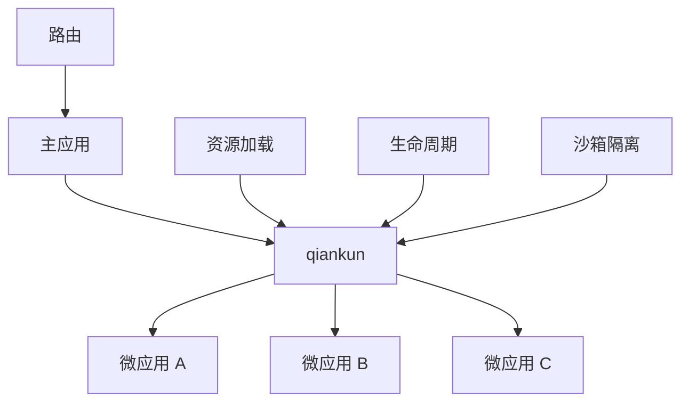

# 什么是 qiankun？

qiankun 是一个基于 [single-spa](https://github.com/single-spa/single-spa) 的微前端实现库，旨在帮助大家能更简单、无痛地构建一个生产可用的微前端架构系统。

## 🎯 核心理念

qiankun 的核心设计理念是**去中心化运行时**，这意味着：

- 主应用和微应用都是独立的应用
- 微应用具有完全的自主权
- 微应用之间互不影响

## 🏗️ 架构图



qiankun 基于以下核心能力：

### 🔄 生命周期管理
每个微应用都有完整的生命周期：
- **bootstrap** - 应用初始化
- **mount** - 应用挂载
- **unmount** - 应用卸载
- **update** - 应用更新（可选）

### 🛡️ 沙箱隔离
- **JS 隔离** - 提供多种沙箱方案，确保应用间 JS 互不影响
- **CSS 隔离** - 通过样式作用域或 Shadow DOM 实现样式隔离

### 📡 资源加载
- **HTML Entry** - 通过 HTML 作为入口加载微应用
- **预加载** - 支持应用资源预加载，提升用户体验
- **缓存** - 智能资源缓存策略

## 💡 什么是微前端？

微前端是一种通过独立发布功能来让多个团队共同构建现代 Web 应用的方式。

### 传统单体应用的问题

```bash
┌─────────────────────────────────────┐
│           单体前端应用               │
│  ┌─────┐ ┌─────┐ ┌─────┐ ┌─────┐    │
│  │模块A│ │模块B│ │模块C│ │模块D│    │
│  └─────┘ └─────┘ └─────┘ └─────┘    │
│       紧密耦合，难以维护             │
└─────────────────────────────────────┘
```

### 微前端架构

```bash
┌─────────────────────────────────────┐
│              主应用                 │
│  ┌─────┐ ┌─────┐ ┌─────┐ ┌─────┐    │
│  │应用A│ │应用B│ │应用C│ │应用D│    │
│  └─────┘ └─────┘ └─────┘ └─────┘    │
│   独立开发、部署，技术栈无关         │
└─────────────────────────────────────┘
```

## 🎯 适用场景

qiankun 特别适合以下场景：

- **大型企业应用** - 多团队协作开发
- **技术栈迁移** - 渐进式升级遗留系统
- **功能模块化** - 功能模块独立开发部署
- **第三方集成** - 集成外部应用或服务

## 🚀 开始使用

准备开始使用 qiankun？查看我们的[快速开始](/zh-CN/guide/quick-start)指南，几分钟内构建你的第一个微前端应用！

## 📚 深入学习

- [核心概念](/zh-CN/guide/concepts) - 理解 qiankun 的设计原理
- [主应用](/zh-CN/guide/main-app) - 如何配置主应用
- [微应用](/zh-CN/guide/micro-app) - 如何改造现有应用 