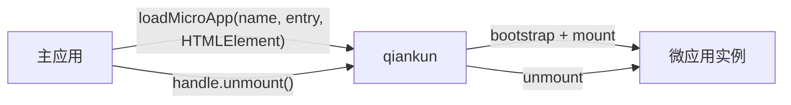

# 什么是 qiankun

qiankun 是一个基于 [single-spa](https://github.com/single-spa/single-spa) 的微前端框架，用于在同一页面中组合多个独立开发、独立部署的前端应用。各应用可以自行选择技术栈，并保持独立的发布流程。

使用 qiankun 时，主应用需要提供微应用的 HTML 入口和用于挂载的 `HTMLElement`。qiankun 负责加载微应用、将其挂载到指定容器，并返回用于管理该实例生命周期的句柄。

## qiankun 解决的问题

微前端和微服务同源，理论基础都是康威定律：系统的架构受制于设计它的组织的沟通结构。当参与一个系统的团队多到沟通成本成为主要矛盾时，把大系统拆成一个个可以独立自治的子系统，让依赖收敛在各自内部，往往比努力改善协作更有效。所以微前端本质上解决的是组织和团队协作带来的工程问题，而不是某个单点的技术问题。

一套合理的微前端架构通常具备这些特点：

- **独立交付。** 每个微应用拥有独立的构建和发布流程。
- **技术栈无关。** React、Vue、Angular 和原生 JavaScript 应用可以共存。
- **运行时组合。** 应用在浏览器中组合，而不是依赖同一次构建。
- **适度隔离。** JavaScript 默认相互隔离；启用样式隔离后，样式也被限制在各自的应用边界内。

反过来说，微前端也会增加部署和运行时的复杂度，并不是所有系统都值得付出这个成本。满足以下几点时，你可能并不需要微前端：

- 系统里的所有组件都由一个小团队开发维护，你们对每个部分都有话语权；
- 直接治理、改造存量系统的收益，大于新老系统混杂带来的成本；
- 系统各部分本身强耦合、自洽、不可分离，拆分的成本高于治理的成本。

这种情况下，普通路由加代码分割通常是更简单的选择。关于「什么时候该用、什么时候不该用微前端」的完整论述，可以读 qiankun 作者的[《你可能并不需要微前端》](https://zhuanlan.zhihu.com/p/391248835)。

## 基本角色

- **主应用**负责页面外壳，并决定微应用的加载、挂载和卸载时机。
- **微应用**是可独立运行的前端应用，并对外提供 `bootstrap`、`mount` 和 `unmount` 生命周期函数。

建议优先使用 [`loadMicroApp`](/zh-CN/api/load-micro-app)。对于页面区域、弹窗和标签页等由业务代码直接管理实例生命周期的场景，该 API 更为合适：

```ts
const microApp = loadMicroApp({
  name: 'sub-app',
  entry: '//localhost:7101',
  container,
});

// 当前页面区域不再需要该微应用时：
await microApp.unmount();
```

其中，`container` 是一个 `HTMLElement`。返回的 `MicroApp` 句柄用于查询状态或卸载该实例。



如果微应用的激活状态完全由 URL 匹配结果决定，可使用基于路由的 [`registerMicroApps`](/zh-CN/api/register-micro-apps) 和 [`start`](/zh-CN/api/start)。这套路由编排与 `loadMicroApp` 相互独立，使用 `loadMicroApp` 并不需要先调用它们。

## 为什么不是 iframe？

如果不考虑体验问题，iframe 几乎是最完美的微前端方案：它提供了浏览器原生的硬隔离，样式隔离、JS 隔离这类问题统统不存在。但它最大的问题也在于这层隔离无法被突破——应用间上下文无法共享，随之带来一系列产品体验问题：

- **URL 不同步。** 刷新后 iframe 内的路由状态丢失，浏览器前进后退按钮失效，页面状态无法通过链接分享。
- **UI 不同步，DOM 结构不共享。** 想象一下屏幕右下角 1/4 区域的 iframe 里弹出一个带遮罩的弹框，还要求它相对整个浏览器窗口居中，并在窗口 resize 时保持居中。
- **全局上下文完全隔离，内存变量不共享。** 应用间通信、数据同步都要额外搭桥，主应用的登录态也难以透传到跨域的子应用里。
- **慢。** 每次进入子应用都是一次浏览器上下文重建、资源重新加载的过程。

这几个问题里，URL 同步好解决，慢可以睁一只眼闭一只眼，但上下文隔离很难解决，DOM 不共享则几乎无解——而后两者恰恰最伤产品体验。

qiankun 因此选择把微应用直接挂载到主页面：各应用共享页面的 `document`，由 [JavaScript 隔离](/zh-CN/concepts/js-sandbox)和可选的[样式隔离](/zh-CN/concepts/style-isolation)在共享环境中重建足够用的隔离。对于需要在多个应用之间保持统一交互与视觉体验的产品，这种方式通常更合适。当然，如果你的场景必须隔离 DOM，或者需要更严格的安全边界，iframe 仍然是合理的选择。更完整的讨论见 qiankun 作者的 [Why Not Iframe](https://www.yuque.com/kuitos/gky7yw/gesexv)。

## 什么时候适合使用 qiankun？

- 多个团队负责同一个产品的不同区域，并需要独立发布。
- 旧系统不能下线，新需求还在来：需要在存量应用上渐进式地集成新功能，而不是推倒重写。
- 不同框架构建的应用需要出现在同一个页面。
- 主应用需要同时挂载多个实例，或在路由页面之外放置微应用。
- 系统中的部件具备清晰的服务边界，希望把复杂度隔离在不同单元中，避免研发节奏差异和代码腐化在系统间传染。

## qiankun 3

qiankun 3 保留了 HTML 入口和生命周期模型，同时重写运行时并新增原生 ESM 支持。从 2.x 升级时，请参阅[从 qiankun 2.x 迁移](/zh-CN/cookbook/migrate-from-2x)，了解默认值和类型的变化。

qiankun 3 运行时需要现代浏览器。使用 ESM 沙箱时，浏览器还必须支持动态注入 import map。确定浏览器兼容范围前，请先查看[浏览器支持](/zh-CN/guide/browser-support)。

可通过[快速上手](/zh-CN/guide/getting-started)运行脚手架示例，或按照[手动教程](/zh-CN/tutorial/)从零搭建主应用和微应用。
