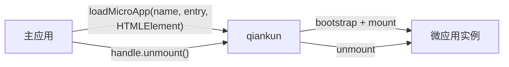

# 什么是 qiankun

qiankun 是一个基于 [single-spa](https://github.com/single-spa/single-spa) 的微前端框架，用于在同一页面中组合多个独立开发、独立部署的前端应用。各应用可以自行选择技术栈，并保持独立的发布流程。

使用 qiankun 时，主应用需要提供微应用的 HTML 入口和用于挂载的 `HTMLElement`。qiankun 负责加载微应用、将其挂载到指定容器，并返回用于管理该实例生命周期的句柄。

## qiankun 解决的问题

当大型产品可以按业务边界拆分，并由不同团队独立开发和部署时，可以考虑采用微前端架构。各团队可以分别维护和发布负责的微应用，也可以独立推进技术栈迁移，无需其他团队同步调整。

一套合理的微前端架构通常具备这些特点：

- **独立交付。** 每个微应用拥有独立的构建和发布流程。
- **技术栈无关。** React、Vue、Angular 和原生 JavaScript 应用可以共存。
- **运行时组合。** 应用在浏览器中组合，而不是依赖同一次构建。
- **适度隔离。** JavaScript 和启用隔离后的样式在各自的应用边界内运行。

微前端也会增加部署和运行时的复杂度。如果单个团队即可维护和发布整个应用，通常应优先考虑普通路由和代码分割。

## 基本角色

- **主应用**负责页面外壳，并决定微应用的加载、挂载和卸载时机。
- **微应用**是可独立运行的前端应用，并对外提供 `bootstrap`、`mount` 和 `unmount` 生命周期函数。

建议优先使用 [`loadMicroApp`](/zh-CN/api/load-micro-app)。对于页面区域、弹窗和标签页等由业务代码直接管理实例生命周期的场景，该 API 更为合适：

```ts
const microApp = loadMicroApp({
  name: 'sub-app',
  entry: '//localhost:7101',
  container,
});

// 当前页面区域不再需要该微应用时：
await microApp.unmount();
```

其中，`container` 是一个 `HTMLElement`。返回的 `MicroApp` 句柄用于查询状态或卸载该实例。



如果微应用的激活状态完全由 URL 匹配结果决定，可使用基于路由的 [`registerMicroApps`](/zh-CN/api/register-micro-apps) 和 [`start`](/zh-CN/api/start)。这是独立的路由编排方式，无需在使用 `loadMicroApp` 前调用。

## 为什么不是 iframe？

iframe 具有独立的文档环境和较强的隔离能力，但也会增加集成成本。路由、浮层、整体页面布局和应用间直接通信都需要额外处理。

qiankun 将微应用直接挂载到主页面。各应用共享页面的 `document`，同时通过 [JavaScript 沙箱](/zh-CN/concepts/js-sandbox)和可选的[样式隔离](/zh-CN/concepts/style-isolation)减少相互影响。对于需要在多个应用之间保持统一交互与视觉体验的产品，这种方式通常更合适。如果必须隔离 DOM，或者需要更严格的安全边界，则应考虑使用 iframe。

## 什么时候适合使用 qiankun？

- 多个团队负责同一个产品的不同区域，并需要独立发布。
- 大型应用需要渐进式迁移。
- 不同框架构建的应用需要出现在同一个页面。
- 主应用需要同时挂载多个实例，或在路由页面之外放置微应用。

## qiankun 3

qiankun 3 保留了 HTML 入口和生命周期模型，同时重写运行时并新增原生 ESM 支持。从 2.x 升级时，请参阅[从 qiankun 2.x 迁移](/zh-CN/cookbook/migrate-from-2x)，了解默认值和类型的变化。

qiankun 3 运行时需要现代浏览器。使用 ESM 沙箱时，浏览器还必须支持动态注入 import map。确定浏览器兼容范围前，请参阅 [ESM 沙箱](/zh-CN/concepts/esm-sandbox)。

可通过[快速上手](/zh-CN/guide/getting-started)运行脚手架示例，或按照[手动教程](/zh-CN/tutorial/)从零搭建主应用和微应用。
