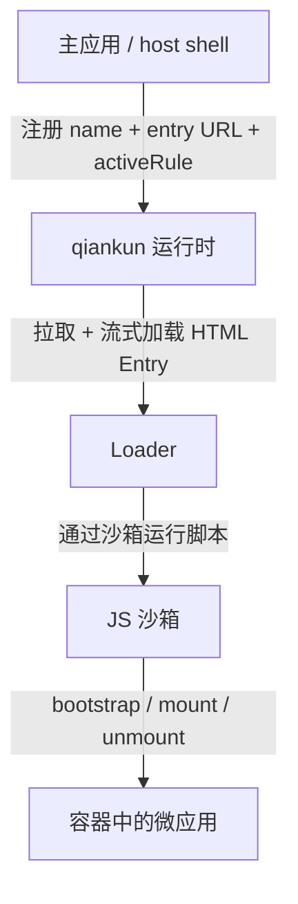

# 什么是 qiankun

qiankun 是一个基于 [single-spa](https://github.com/single-spa/single-spa) 构建的微前端框架。它让多个独立构建、独立部署的前端应用共存于同一个页面上，并在运行时被挂载和卸载——无需把它们重新打包成一个 bundle，也不必放弃那份让它们互不干扰的隔离能力。

## qiankun 解决的问题

一个大型产品往往会成长到超出单一代码库、单一框架版本或单一团队所能舒适掌控的规模。微前端把这样的产品拆分成更小的应用，让它们按各自的节奏发布，而浏览器依然把它们呈现为一个连贯统一的体验。

手动实现这件事的难度远超表面。两个被加载进同一页面的应用共享同一个 `window`、同一个 `document` 以及同一套全局 CSS。它们的脚本会互相覆盖对方的全局变量，它们的定时器和事件监听器在导航后会发生泄漏，它们的样式表也会越过边界相互污染。qiankun 的存在正是为了让"一个页面、多个应用"的模型变得安全：它从各自的 HTML Entry 加载每个微应用，赋予它一份隔离的全局环境视图，并在应用卸载时清理好一切。

qiankun 并不取代你的构建工具、路由或状态库。它是那一层运行时——决定哪个微应用处于激活状态、加载它、隔离它，并在结束时将它拆除。

## 心智模型

一个 qiankun 系统中有两种角色：

- **主应用**（也称 host 或 shell）拥有页面骨架——顶层布局、导航和路由。它运行 qiankun，并决定在给定的 URL 或交互下应该激活哪个微应用。
- 每个**微应用**都是一个普通的前端应用，只是额外导出了三个生命周期函数——`bootstrap`、`mount` 和 `unmount`——以便 qiankun 驱动它。

主应用通过每个微应用的 **HTML Entry** 的 URL 以及页面上一个目标**容器**（container）元素来引用它。qiankun 会拉取那份 HTML，在沙箱中运行微应用的脚本，并调用 `mount(props)` 把它渲染进容器。当微应用不再处于激活状态时，qiankun 会调用 `unmount(props)` 并撤销该应用引入的副作用。



对于路由驱动的应用，你用 [`registerMicroApps`](/zh-CN/api/register-micro-apps) 来接线；对于手动控制的应用，则用 [`loadMicroApp`](/zh-CN/api/load-micro-app)，然后调用 [`start`](/zh-CN/api/start)。这两个 API 都接收微应用的 `name`、它的 `entry` URL 字符串以及 `container` 元素。路由驱动的应用还需要一个 `activeRule`，用来告诉 qiankun 该应用何时应处于激活状态。完整流程请参阅[快速上手](/zh-CN/guide/getting-started)和[教程](/zh-CN/tutorial/index)。

## 何时使用 qiankun

当各自独立维护的前端需要共享同一个页面时，qiankun 就派上用场了：

- **渐进式迁移。** 你希望逐屏重写一个遗留应用——例如把一个 jQuery 或 AngularJS 应用迁移到 React——同时让新旧两部分都在生产环境中保持存活。
- **多团队，一个产品。** 不同团队各自负责一个大型应用中的不同区域，需要按独立的节奏进行构建、测试和部署，而无需共享同一条 monorepo 发布流水线。
- **混合框架或构建工具。** 产品的某些部分是 React，另一些是 Vue，还有一些是纯 HTML。无论各部分是如何构建的，qiankun 都能让它们并肩运行。
- **围绕演进中应用的稳定外壳。** 一个长期存在的 host 提供导航和布局，而内部应用则来来去去。

当单一团队在单一技术栈上交付单一应用时，qiankun 的用处就没那么大了。在那种情况下，一个普通的路由加上组件级别的代码分割会更简单，也不会带来任何隔离成本。当应用之间的边界是组织和部署边界、而不仅仅是 UI 边界时，才应该考虑微前端。

## v3 有哪些新变化

qiankun 3.0 保留了相同的对外模型——通过 HTML Entry 注册或加载微应用，并让它们导出生命周期——但对底层运行时进行了重写。四大支柱在核心概念中有深入介绍：

- **流式 HTML Entry 加载器。** Entry HTML 会随着字节的到达被增量地解析并提交到 DOM，而不是整体缓冲。微应用的 `<head>` 会被虚拟化为容器内的一个 `<qiankun-head>` 元素，从而让它注入的样式和脚本永远不会泄漏到真实的 `document.head` 中。参阅 [HTML Entry 流式加载](/zh-CN/concepts/html-entry-loading)。
- **Proxy 膜 JS 沙箱。** 每个微应用都会得到一份用 `Proxy` 膜构建的隔离 `window`/`document` 视图。全局写入、定时器、事件监听器和 history 变更都会按应用进行追踪，并在卸载时回退。参阅 [JS 沙箱](/zh-CN/concepts/js-sandbox)。
- **基于 `@scope` 的样式隔离。** 样式隔离构建在原生 CSS `@scope` 规则之上。启用后，微应用的样式会被限定在其容器内；外部样式表会被重新拉取，并以限定作用域的 blob-URL `<link>` 形式提供，从而套用同样的包裹逻辑。参阅[样式隔离](/zh-CN/concepts/style-isolation)。
- **原生 ESM 沙箱执行。** qiankun 可以通过同一层沙箱膜运行微应用原生的 `<script type="module">` 图谱——包括开发模式下的 Vite 应用——无需 bundler 步骤，也无需 iframe。参阅 [ESM 沙箱](/zh-CN/concepts/esm-sandbox)。

要全面了解这些部件如何协同工作，请阅读[架构概览](/zh-CN/concepts/architecture)。

## 从 qiankun 2.x 迁移过来

如果你用过 qiankun 2.x，API 的形态是熟悉的，但若干默认值和类型发生了变化。需要提前了解的最重要差异：

| 关注点 | qiankun 2.x | qiankun 3.0 |
| --- | --- | --- |
| `entry` | 字符串 URL 或 `{ scripts, styles }` 对象 | 仅字符串 URL |
| `container` | 选择器字符串或元素 | `HTMLElement` 实例 |
| 沙箱选项 | `sandbox: boolean \| { strictStyleIsolation, experimentalStyleIsolation }` | `sandbox: boolean`（默认 `true`） |
| 样式隔离 | Shadow DOM / 实验性作用域，通过 `sandbox` 对象 | 独立的 `styleIsolation: boolean`，使用 CSS `@scope` |
| 全局状态 | 内置 store（`initGlobalState` / `onGlobalStateChange`） | 无内置 store；通过 `props` 传入你自己的方法 |
| 预取 | `start` 上的 `prefetch` 策略 | 流式加载器自动预加载；`prefetchApps` 已废弃 |
| 框架配置 | 传给 `start` | 通过 `configuration` / `loadMicroApp` 按应用传入 |

::: warning 破坏性变更：entry 与 container 类型
`entry` 现在严格是一个字符串，`container` 现在严格是一个 `HTMLElement`——诸如 `'#subapp'` 这样的 CSS 选择器字符串不再被接受。请传入一个元素，例如 `document.getElementById('subapp')`。
:::

::: info 无内置全局状态 store
qiankun 3.0 不再提供 `initGlobalState`、`setGlobalState` 或 `onGlobalStateChange`。要在应用之间通信，请通过每个应用的 `props` 传入你自己的回调或一个共享 store。参阅[在应用间共享状态与通信](/zh-CN/cookbook/communicate-between-apps)。
:::

关于逐步升级，请参阅[从 qiankun 2.x 迁移](/zh-CN/cookbook/migrate-from-2x)。

## 环境要求与兼容性

qiankun 3.0 的运行时依赖现代浏览器原语。由于它以流式方式加载 HTML Entry、通过 `Proxy` 膜驱动隔离，并从 blob URL 执行脚本，它需要一个支持 `Proxy`、`TransformStream` 和 `URL.createObjectURL` 的浏览器。qiankun 暴露了 [`isRuntimeCompatible`](/zh-CN/api/is-runtime-compatible)，让你可以在启动前探测当前浏览器：

```ts
import { isRuntimeCompatible } from 'qiankun';

if (isRuntimeCompatible()) {
  // safe to registerMicroApps / start
}
```

::: info ESM 沙箱与 Firefox
原生 ESM 沙箱路径依赖动态注入的 import map。Chromium 133+ 和 Safari 18.4+ 原生支持这一特性；Firefox 目前尚未默认启用多个动态 import map，因此在没有额外配置的情况下，ESM 微应用在 Firefox 上不受支持。经典（打包 / UMD）微应用不受影响。详情参阅 [ESM 沙箱](/zh-CN/concepts/esm-sandbox)。
:::

准备好动手了吗？继续前往[快速上手](/zh-CN/guide/getting-started)，或者跟随[教程](/zh-CN/tutorial/index)从零构建一个主应用和一个微应用。
