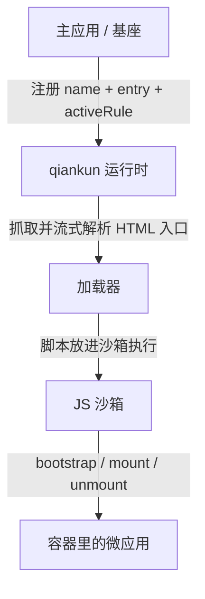

# 什么是 qiankun

qiankun 是一个基于 [single-spa](https://github.com/single-spa/single-spa) 的微前端框架。它让多个独立开发、独立部署的前端应用共存于同一个页面，在运行时按需挂载和卸载——既不用把它们打包进同一个 bundle，也不会因此失去彼此之间的隔离。

一句话：qiankun 负责在浏览器里，把若干个前端应用拼装成一个整体。

## 它解决什么问题

一个产品做大之后，往往会超出单个代码库、单个框架版本、单个团队能舒服掌控的范围。微前端的思路是把产品拆成若干个更小的应用，各自按自己的节奏发布，而在用户眼里它们仍然是一个连贯的页面。

真正动手你会发现，这件事没那么简单。两个应用加载进同一个页面，就共用一个 `window`、一个 `document`、一套全局 CSS。它们的脚本会互相覆盖全局变量，定时器和事件监听在切走之后还赖着不走，样式也会越过边界互相污染。qiankun 存在的意义，就是把"一个页面、多个应用"这件事做稳：每个微应用从自己的 HTML 地址加载，拿到一份隔离的全局环境，卸载时再把它留下的副作用清理干净。

qiankun 不替代你的构建工具、路由或状态库。它是运行时那一层——决定哪个微应用当前该激活，把它加载进来、隔离好，再在合适的时候拆掉。

## 两个角色

一个 qiankun 系统里只有两种角色：

- **主应用**(也叫基座):它拥有页面的外壳——顶层布局、导航、路由。qiankun 跑在主应用里，由它决定某个 URL 或某次交互下，哪个微应用该激活。
- **微应用**:一个普通的前端应用，只是额外导出了 `bootstrap`、`mount`、`unmount` 三个生命周期函数，好让 qiankun 能驱动它。

主应用通过两样东西引用一个微应用：它的 **HTML 入口地址**，和页面上的一个**容器**元素。qiankun 去把那份 HTML 抓回来，在沙箱里运行微应用的脚本，再调用 `mount(props)` 把它渲染进容器。当这个微应用不再需要时，qiankun 调用 `unmount(props)`，把它引入的副作用逐一还原。



接线方式有两种：路由驱动的应用用 [`registerMicroApps`](/zh-CN/api/register-micro-apps) 注册，手动控制的用 [`loadMicroApp`](/zh-CN/api/load-micro-app) 加载，最后调用 [`start`](/zh-CN/api/start)。两个 API 都接收微应用的 `name`、`entry` 地址和 `container` 元素；路由驱动的还多一个 `activeRule`，告诉 qiankun 这个应用什么时候该激活。端到端的流程见 [快速上手](/zh-CN/guide/getting-started) 和[手把手教程](/zh-CN/tutorial/)。

## 什么时候该用它

当几个各自有主的前端需要共处一个页面时，qiankun 就派得上用场：

- **渐进式改造老项目。** 想把一个 jQuery 或 AngularJS 的老应用一屏一屏迁到 React，而迁移期间新旧两半都得在线上跑着。
- **多团队、一个产品。** 不同团队负责一个大应用的不同区域，需要各自构建、测试、发布，而不想被一条共享的发布链绑在一起。
- **框架或构建工具混用。** 产品里有的模块是 React，有的是 Vue，有的是纯 HTML。不管当初怎么构建的，qiankun 都能让它们并排跑。
- **稳定外壳套着不断演进的应用。** 一个长期存在的基座提供导航和布局，里面的应用则来来去去。

反过来，如果就是一个团队、一套技术栈、一个应用，那 qiankun 未必值得。这种情况下普通的路由加组件级代码分割更简单，也没有隔离的开销。微前端真正的价值，是在应用的边界本身就是**组织边界和部署边界**、而不只是 UI 边界的时候。

## v3 有什么不一样

qiankun 3.0 对外的模型没变——照旧按 HTML 入口注册或加载微应用、让它们导出生命周期——但底层的运行时是重写过的：流式 HTML 加载器、基于 `Proxy` 隔离膜的 JS 沙箱、基于原生 CSS `@scope` 的样式隔离，以及原生 ESM 执行。这几块的来龙去脉都放在[核心概念](/zh-CN/concepts/architecture)里讲。

如果你从 2.x 上来，API 的样子还是熟悉的，但若干默认值和类型变了。具体差异和升级步骤，直接看[从 qiankun 2.x 迁移](/zh-CN/cookbook/migrate-from-2x)，这里就不展开了。

## 运行环境

3.0 的运行时依赖一些较新的浏览器能力(`Proxy`、`TransformStream`、`URL.createObjectURL` 等)，所以需要一个不太老的浏览器。qiankun 提供了 [`isRuntimeCompatible`](/zh-CN/api/is-runtime-compatible)，可以在启动前先探一下当前浏览器：

```ts
import { isRuntimeCompatible } from 'qiankun';

if (isRuntimeCompatible()) {
  // 可以放心 registerMicroApps / start
}
```

::: info ESM 沙箱与 Firefox
原生 ESM 沙箱这条路依赖动态注入的 import map。Chromium 133+、Safari 18.4+ 原生支持；Firefox 默认还没放开多个动态 import map，所以在它上面暂时跑不了走 ESM 路径的微应用(比如 Vite 应用)。走经典打包(UMD)方式接入的微应用不受影响。细节见 [ESM 沙箱](/zh-CN/concepts/esm-sandbox)。
:::

想动手了就去[快速上手](/zh-CN/guide/getting-started)，或者跟着[教程](/zh-CN/tutorial/)从零搭一个主应用加一个微应用。
