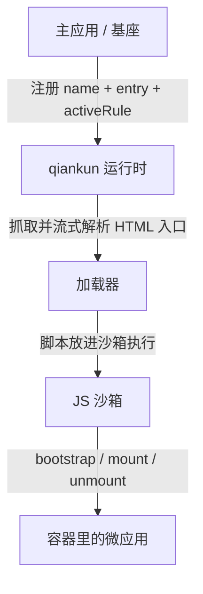

# 什么是 qiankun

qiankun 是一个基于 [single-spa](https://github.com/single-spa/single-spa) 的微前端框架。它让多个独立开发、独立部署的前端应用共存于同一个页面，在运行时按需挂载和卸载——既不用把它们打包进同一个 bundle，也不会因此失去彼此之间的隔离。

一句话：qiankun 负责在浏览器里，把若干个前端应用拼装成一个整体。

## 什么是微前端

微前端（Micro-Frontends）是把后端微服务那套思路搬到前端：一个大型的前端应用，拆成若干个能独立开发、独立部署的小应用，再在运行时组合成一个完整的产品。

大部分前端项目一开始都是一个仓库、一套技术栈、一个团队，这样最省事。问题都是长出来的：代码库越滚越大，新人要花很久才能摸清全貌；参与的人多了，大家挤在同一条发布链上，谁想上线都得排队；技术栈被钉死在了立项那天，三年前选的框架今天想换却牵一发而动全身；有时还得跟历史包袱共存——一个 AngularJS 的老系统，想一点点换成 React，却没法停下来重写。

这些更多是**组织和协作**的问题，而不是纯技术问题。微前端给出的答案是：按团队、按业务把应用拆成互相独立的部分，让每一块都能自己说了算。落到实处，大体认同这么几条：

- **独立开发、独立部署。** 每个微应用有自己的仓库、构建和发布节奏。改一个应用，不需要重新构建、发布其他应用。
- **技术栈无关。** 主应用不该限制微应用用什么框架。React、Vue、Angular 甚至纯 HTML 能同时存在。
- **运行时集成。** 各个应用在浏览器里被组装到一起，而不是在打包阶段被塞进同一个 bundle——这样才谈得上独立部署。
- **相互隔离。** 一个应用的样式、全局变量、运行时错误，不该影响到另一个应用。

微前端解决的是**规模**带来的问题，代价是额外的复杂度。如果你的应用一个团队就能舒服地维护、一套技术栈也够用，那大概率不需要它。当应用的边界开始对应到**团队边界和部署边界**，拆分的收益才真正大过成本。

## 为什么不是 iframe

聊到"在一个页面里隔离多个应用"，几乎所有人第一反应都是 iframe。它天然就有最彻底的隔离——独立的 `window`、`document`、样式和脚本环境，子应用怎么折腾都出不来。

如果 iframe 真够用，qiankun 就没必要存在了。问题在于，那份"彻底的隔离"同时也是它最大的麻烦：隔得太死，反而让"多个应用像一个产品"这件事做不顺。

- **URL 状态不同步。** iframe 内部的路由跳转不会反映到地址栏上：刷新会丢掉子应用的当前位置，浏览器前进 / 后退管不到 iframe 内部的历史，想把某个子页面分享出去也无从谈起。
- **UI 出不了边界。** 一个本该在整个页面居中的弹窗、遮罩，只能在 iframe 这个小框里居中；子应用的下拉菜单、提示气泡一旦超出可视区就被裁掉。
- **加载慢，还容易白屏。** 每加载一个 iframe，浏览器都要重建一整套上下文、重新下载解析执行里面的资源，共用的依赖也没法复用，切换时经常先白屏。
- **隔离过头，通信反而变难。** iframe 把 `document` 也切开了，跨 iframe 通信只能靠 `postMessage`，连传个对象都得序列化；Cookie、`localStorage` 想共享要额外费劲；外层想让 iframe 里的浮层关掉这种再普通不过的联动，都得特意处理。

qiankun 的思路是：该隔离的地方隔离，不该隔离的地方保持通畅。微应用**不**装进 iframe，而是直接挂载到主应用页面的一个容器元素里，和主应用共用同一个 `document`——上面那些由"`document` 被切开"引发的问题就从根上不存在了。隔离则交给运行时：[JS 沙箱](/zh-CN/concepts/js-sandbox)用一层 `Proxy` 隔离膜给每个微应用一份独立的 `window` 视图，[样式隔离](/zh-CN/concepts/style-isolation)基于原生 CSS `@scope` 把样式限定在各自容器里。既拿到了该有的隔离，又没丢掉"它们本来就在同一个页面上"带来的所有便利。

## 两个角色

一个 qiankun 系统里只有两种角色：

- **主应用**（也叫基座）：它拥有页面的外壳——顶层布局、导航、路由。qiankun 跑在主应用里，由它决定某个 URL 或某次交互下，哪个微应用该激活。
- **微应用**：一个普通的前端应用，只是额外导出了 `bootstrap`、`mount`、`unmount` 三个生命周期函数，好让 qiankun 能驱动它。

主应用通过两样东西引用一个微应用：它的 **HTML 入口地址**，和页面上的一个**容器**元素。qiankun 去把那份 HTML 抓回来，在沙箱里运行微应用的脚本，再调用 `mount(props)` 把它渲染进容器。当这个微应用不再需要时，qiankun 调用 `unmount(props)`，把它引入的副作用逐一还原。



接线方式有两种：路由驱动的应用用 [`registerMicroApps`](/zh-CN/api/register-micro-apps) 注册，手动控制的用 [`loadMicroApp`](/zh-CN/api/load-micro-app) 加载，最后调用 [`start`](/zh-CN/api/start)。端到端的流程见 [快速上手](/zh-CN/guide/getting-started) 和[手把手教程](/zh-CN/tutorial/)。

## 什么时候该用它

当几个各自有主的前端需要共处一个页面时，qiankun 就派得上用场：

- **渐进式改造老项目。** 把一个 jQuery 或 AngularJS 的老应用一屏一屏迁到 React，而迁移期间新旧两半都得在线上跑着。
- **多团队、一个产品。** 不同团队负责一个大应用的不同区域，要各自构建、测试、发布，而不想被一条共享的发布链绑住。
- **框架或构建工具混用。** 产品里有的是 React，有的是 Vue，有的是纯 HTML，qiankun 都能让它们并排跑。

反过来，如果就是一个团队、一套技术栈、一个应用，那普通的路由加代码分割更简单，也没有隔离的开销。

## v3 有什么不一样

qiankun 3.0 对外的模型没变——照旧按 HTML 入口注册或加载微应用、让它们导出生命周期——但底层的运行时是重写过的：流式 HTML 加载器、基于 `Proxy` 隔离膜的 JS 沙箱、基于原生 CSS `@scope` 的样式隔离，以及原生 ESM 执行。这几块的来龙去脉都放在[核心概念](/zh-CN/concepts/architecture)里讲。

如果你从 2.x 上来，API 的样子还是熟悉的，但若干默认值和类型变了。具体差异和升级步骤，直接看[从 qiankun 2.x 迁移](/zh-CN/cookbook/migrate-from-2x)。

## 运行环境

3.0 的运行时依赖一些较新的浏览器能力（`Proxy`、`TransformStream`、`URL.createObjectURL` 等），所以需要一个不太老的浏览器。qiankun 提供了 [`isRuntimeCompatible`](/zh-CN/api/is-runtime-compatible)，可以在启动前先探一下当前浏览器：

```ts
import { isRuntimeCompatible } from 'qiankun';

if (isRuntimeCompatible()) {
  // 可以放心 registerMicroApps / start
}
```

::: info ESM 沙箱与 Firefox
原生 ESM 沙箱这条路依赖动态注入的 import map。Chromium 133+、Safari 18.4+ 原生支持；Firefox 默认还没放开多个动态 import map，所以在它上面暂时跑不了走 ESM 路径的微应用（比如 Vite 应用）。走经典打包（UMD）方式接入的微应用不受影响。细节见 [ESM 沙箱](/zh-CN/concepts/esm-sandbox)。
:::

想动手了就去[快速上手](/zh-CN/guide/getting-started)，或者跟着[教程](/zh-CN/tutorial/)从零搭一个主应用加一个微应用。
