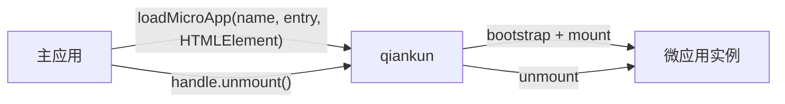

# 什么是 qiankun

qiankun 是一个基于 [single-spa](https://github.com/single-spa/single-spa) 的微前端框架。它让多个独立开发、独立部署的前端应用共存于同一个页面，同时保留各自选择技术栈和发布节奏的能力。

实际使用时，主应用把微应用的 HTML 入口和一个 `HTMLElement` 交给 qiankun。qiankun 负责加载应用、将它挂载进容器，并向主应用返回一个用于管理其生命周期的句柄。

## 它解决什么问题？

当大型产品的业务边界也需要成为开发和部署边界时，微前端才真正有价值。一个团队可以独立维护、发布自己的微应用，也可以逐步迁移技术栈，而不要求其他团队同步调整。

一套合理的微前端架构通常具备这些特点：

- **独立交付。** 每个微应用可以按照自己的节奏构建和发布。
- **技术栈无关。** React、Vue、Angular 和原生 JavaScript 应用可以共存。
- **运行时组合。** 应用在浏览器中组合，而不是依赖同一次构建。
- **适度隔离。** JavaScript，以及启用隔离后的样式，被限制在合适的边界内。

这种架构也会增加部署和运行时复杂度。如果一个团队可以从容地维护和发布一个应用，普通路由配合代码分割通常更简单。

## 两个角色

- **主应用**拥有页面外壳，并决定微应用何时出现。
- **微应用**是一个普通前端应用，同时对外提供 `bootstrap`、`mount` 和 `unmount` 生命周期。

推荐从 [`loadMicroApp`](/zh-CN/api/load-micro-app) 开始。页面区域、弹窗、标签页等由业务代码直接控制生命周期的场景都适合这种方式：

```ts
const microApp = loadMicroApp({
  name: 'sub-app',
  entry: '//localhost:7101',
  container,
});

// 这块页面不再需要微应用时：
await microApp.unmount();
```

这里的 `container` 是一个 `HTMLElement`。返回的 `MicroApp` 句柄用于观察或结束这个具体实例。



如果应用是否激活完全由 URL 匹配决定，qiankun 也提供路由驱动的 [`registerMicroApps`](/zh-CN/api/register-micro-apps) 和 [`start`](/zh-CN/api/start)。它们是另一种编排方式，不是使用 `loadMicroApp` 的前置步骤。

## 为什么不是 iframe？

iframe 拥有独立文档和较强的隔离，但这个边界也会增加集成成本：路由、浮层、整体页面布局和直接通信都需要额外协调。

qiankun 选择把微应用挂载进主页面。应用共享页面的 `document`，同时由 qiankun 提供 [JavaScript 沙箱](/zh-CN/concepts/js-sandbox)和可选的[样式隔离](/zh-CN/concepts/style-isolation)。这种方式更适合需要表现为同一个产品的多个应用。如果最重要的是严格的文档或安全边界，iframe 仍然可能是更合适的选择。

## 什么时候适合使用 qiankun？

- 多个团队负责同一个产品的不同区域，并需要独立发布。
- 大型应用需要渐进式迁移。
- 不同框架构建的应用需要出现在同一个页面。
- 主应用需要同时挂载多个实例，或在路由页面之外放置微应用。

## qiankun 3

qiankun 3 保留 HTML Entry 和生命周期模型，同时重写了运行时并加入原生 ESM 支持。如果你正从 2.x 升级，请通过[从 qiankun 2.x 迁移](/zh-CN/cookbook/migrate-from-2x)了解变化的默认值和类型。

运行时需要现代浏览器。ESM 沙箱应用目前还要求浏览器支持动态注入 import map；确定浏览器目标前请查看 [ESM 沙箱](/zh-CN/concepts/esm-sandbox)。

准备开始时，可以直接跟随[快速上手](/zh-CN/guide/getting-started)，也可以通过[手动教程](/zh-CN/tutorial/)亲自搭建两个应用。
