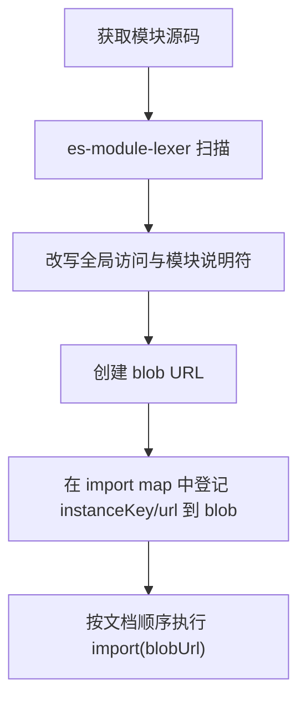

# ESM 沙箱实现

> 本页面向维护者说明 ESM 执行引擎的实现细节。面向使用者的行为见[原生 ESM 支持](/zh-CN/concepts/esm-sandbox)，设计取舍见 [ESM 沙箱 RFC](https://github.com/umijs/qiankun/blob/next/docs/rfcs/esm-sandbox.md)。

现代构建工具可以直接输出原生 ES 模块。以 Vite 开发服务器为例，每个源文件都作为独立模块提供，并由浏览器通过 `import` 和 `export` 加载模块图。此类代码无法使用 Classic 沙箱的执行方式：Classic 沙箱通过 `with (this) { … }` 包装源码，并从入口脚本最后写入的全局变量中读取导出；ESM 强制采用严格模式，禁止使用 `with`，生命周期函数也来自模块导出，而非 `window` 属性。

qiankun v3 使用 `EsmSandboxEngine` 处理原生模块图。该引擎复用 [JavaScript 隔离](/zh-CN/concepts/js-sandbox)中的 Proxy 隔离膜，不依赖 iframe，也不要求将模块打包为 UMD。模块实例化和求值仍由浏览器原生 ESM 加载器负责，因此顶层 `await`、循环依赖、实时绑定（live binding）和变量提升等语义保持不变。

## 与 Classic 执行方式的区别

| | Classic | ESM |
| --- | --- | --- |
| 源码处理 | 使用 `with (this) { … }` 包装并生成 blob | 在模块顶部通过 `const`／`let` 从 `__qk_view` 解构全局属性 |
| 全局覆盖范围 | 显式 `window` 访问，以及沙箱或主应用全局对象中已存在的裸标识符 | 当前模块解构集合中的名称，基准集为 `esmDestructurableGlobals` |
| 隐式全局写入 `foo = 1` | 已存在的全局名称会经过 Proxy；全新且未声明的名称可能写入真实全局对象 | 严格模式抛出 `ReferenceError`，不会进入 `set` trap |
| 生命周期发现 | `sandbox.latestSetProp`，即一次 `window` 写入 | 入口模块的具名导出或默认导出 |
| 重新挂载 | 顶层代码不重新执行，复用已解析的生命周期函数 | 顶层代码不重新执行，`import(sameBlob)` 返回相同的模块命名空间对象 |
| 模块标识 | 直接使用 blob URL | 合成模块说明符 → import map → blob URL |

ESM 引擎不重新实现模块解析，而是组合现有的 [HTML 入口](/zh-CN/concepts/html-entry-loading)加载器、Proxy 隔离膜和浏览器原生模块加载器。其职责集中在资源获取与模块求值之间的源码转换和地址映射。

## 启用条件与脚本分发

只有在 `sandbox` 开启时才会创建 ESM 引擎。`loadApp` 为每个微应用实例同时构造隔离膜和引擎；设置 `sandbox: false` 后，两者均不会创建。

流式加载器根据 DOM 节点类型分发脚本（`packages/shared/src/assets-transpilers/module.ts`）：

- **`<script type="module">`**：无论包含 `src` 还是内联源码，均交给 ESM 引擎。转译器移除 `src`，将原地址保存在 `data-src`，并添加 `data-esm="true"`，以阻止浏览器直接获取或执行原始 URL，从而避免绕过沙箱。
- **`<script type="importmap">`**：由 qiankun 解析。元素类型会改写为 `qiankun-importmap`，防止浏览器将微应用 import map 合并到主应用文档。
- **Classic `<script>` 或 `text/javascript`**：继续由 Classic 转译器处理，即通过 `with (this)` 包装后生成 blob。同一份 HTML 入口可以同时包含 Classic 和 ESM 脚本。

## 模块处理流程

引擎先使用 WASM 词法分析器扫描并改写模块源码，再交给浏览器原生加载器：



处理步骤如下：

1. **获取源码**：通过增强后的 fetch 获取模块。装饰器顺序为 cacheable → retryable → throwable。
2. **扫描模块**：使用 [`es-module-lexer`](https://github.com/guybedford/es-module-lexer) 分析源码。该 WASM 词法分析器会在 `start()` 期间通过 `prepareEsmLexer()` 预初始化。
3. **改写源码**：
   - 将受沙箱管理的全局属性在模块顶部从隔离膜视图中解构，例如 `const { window, document, … } = __qk_view`；
   - 将静态 import 的模块说明符改写为 `` `${instanceKey}/${resolvedUrl}` `` 形式的合成说明符；
   - 将 `import.meta` 替换为保留真实 `url` 的本地对象，并将 `import()` 替换为支持沙箱解析的 `__qk_dynamic_import(...)`。
4. **建立映射**：动态向文档注入 `<script type="importmap">`，将合成模块说明符映射到相应 blob URL。
5. **执行模块**：按照 HTML 文档顺序调用原生 `import(blobUrl)`。

模块实例化始终由浏览器负责，qiankun 仅改写模块源码、依赖地址和全局属性来源。

### 全局属性改写

模块不会运行在 Proxy 词法作用域内。引擎扫描源码，找出属于基准全局集合的标识符，并从隔离膜视图中解构这些属性：

- 稳定对象，例如 `window`、`document` 及基准集合中的其他对象，通过 `const { … } = __qk_view` 绑定。对象本身是代理视图，因此后续属性访问仍可反映实时状态。
- 需要实时绑定的双下划线标记（如 `__VUE_OPTIONS_API__`）通过 `let` 绑定并持续追踪。当沙箱观察到后续全局写入时，已完成求值的模块也能读取新值。

每个实例都通过独立的运行时模块提供这些能力：

```js
import { __qk_view, __qk_resolve, __qk_dynamic_import, __qk_track } from '<instanceKey>/__runtime__';
```

使用导入绑定可以避免暂时性死区（temporal dead zone）导致的 `ReferenceError`，也无需读取真实 `globalThis` 或调用 `eval`。CSP 只需允许 `script-src blob:`，不要求 `'unsafe-eval'`。

## 加载与执行顺序

HTML 流处理阶段与模块求值阶段相互分离：

- **流式处理阶段**：每个模块脚本按文档顺序同步调用一次 `loadModuleScript(...)`。该调用立即启动异步转换，包括 `fetch` 请求、词法分析、源码改写和依赖递归预取，但暂不执行模块。任务会按顺序加入队列。
- **输入流结束后**：加载器调用 `sealAndExecute()`。存在模块脚本时，该方法返回 `true`，用于指示加载器等待 ESM 入口模块的命名空间对象，而不是读取 Classic `latestSetProp`。随后，引擎按顺序等待队列中的记录，更新 import map，并依次调用原生 `import(blobUrl)`。

### 选择入口模块的命名空间对象

所有模块执行完成后，引擎按以下顺序确定生命周期入口：

1. 如果某个模块显式包含 `entry` 属性，则使用该模块的命名空间对象。该模块执行失败会导致整个应用加载失败。
2. 如果未标记 `entry`，则使用第一个包含生命周期对象的已执行模块命名空间；其 `.default` 也会参与判断。这适用于 `export default { bootstrap, mount, unmount }` 形式的 Vite 入口。
3. 如果仍未找到生命周期对象，则使用最后执行的模块命名空间。这适用于 HTML 中仅包含一个 `<script type="module">` 的常见情况。

非入口模块发生异常（包括顶层 `await` 导致的 Promise 拒绝）时，只会输出 `console.error` 并跳过该模块，不会立即使应用加载失败，以兼容 Classic 应用包含非关键模块脚本的情况。显式标记的入口模块执行失败时，入口加载会直接失败；未显式标记入口时，`loadApp` 会校验已选择的成功模块；如果最终仍未找到有效生命周期，此时才判定加载失败。对于路由注册应用，该加载错误会进入 single-spa 全局处理器；对于 `loadMicroApp`，错误会通过实例的生命周期 Promise 返回。

## `import map` 管理

引擎使用两类互不合并的 import map：

- **微应用 import map**：解析 `<script type="importmap">`，建立 `bareSpecifier → 绝对 URL` 的内部映射，仅用于解析当前微应用的裸模块说明符。当前仅支持 `imports`；`scopes` 会被解析并输出警告，但在 v1 中不会生效。
- **运行时 import map**：将 `<instanceKey>/<absoluteUrl>` 映射到浏览器实际加载的 blob URL。

浏览器的原生 import map 作用于整个文档，只能追加，且发生冲突时保留先注册的映射。因此，引擎通过实例键隔离不同实例：

```ts
instanceKey = `__qk_${appName}_${instanceId}_${++instanceSeq}__`;
```

`instanceSeq` 是全局单调递增计数器，且不会复用。因此，已销毁实例使用的键不会与新实例冲突。引擎只向 import map 追加新映射；如果同一模块说明符对应不同目标，会输出 `console.error`，浏览器则继续使用首个映射。

::: info 长期运行页面中的 import map 条目
原生 import map 条目无法从文档中删除。主应用反复加载和卸载微应用时，已失效的映射仍会保留，相关字符串会随页面生命周期持续增长。这是 v1 的已知限制。
:::

## Realm 桥接与重声明检测

改写后的 blob 在真实全局作用域中运行，因此未正确处理的裸 `__qk_*` 标识符可能访问真实全局对象。引擎通过以下机制限制此类访问：

- **Realm 访问器**：用于返回模块对应的隔离膜视图。访问器以当前 qiankun 运行时随机生成的键挂载到 `globalThis`，再通过不可预测的实例令牌索引；该令牌仅写入当前实例的运行时模块 blob。隔离膜还会将 `__qk_*` 属性列入黑名单。用户模块导入以 `__qk_` 开头的合成模块说明符时，引擎会抛出 `QiankunError`。间接访问真实全局对象的表达式（如 `(0, eval)('globalThis')`）仍可能绕过隔离，这与 Classic 沙箱相同，不属于安全保证范围。
- **重声明检测**：注入的 `const { window, … }` 可能与模块顶层已有的 `const window = …` 冲突，并在解析阶段抛出 `SyntaxError`。由于 import map 条目一经注册便无法撤销，引擎会在更新 import map 前先导入探测 blob。探测 blob 将运行时模块说明符替换为未注册目标，用于暴露重声明错误，同时确保模块不会真正求值。引擎提取发生冲突的标识符，加入排除集合后重新改写模块。

## Vite 开发环境处理

ESM 引擎支持直接运行 Vite 开发服务器提供的模块图。微应用配置见 [Vite 接入指南](/zh-CN/cookbook/prepare-a-vite-app)。

- **替换 `/@vite/client`。** 替代实现保留 `updateStyle` 和 `removeStyle`，并通过代理 `document` 将样式写入虚拟 `<head>`；同时返回无操作的热更新上下文，不建立 HMR WebSocket。
- **主动关闭 HMR。** Vite 客户端会在开发服务器启动时将 HMR 服务地址写入代码。若直接执行，它会从沙箱内部建立 WebSocket，并可能触发整页 `location.reload()`。因此 qiankun 主动停用该连接，开发时需要手动刷新页面。
- **React Fast Refresh 依赖执行顺序。** Fast Refresh 要求预引导脚本（preamble）在组件模块之前执行，顺序不正确时无法完成初始化。

::: warning 重新挂载时可能丢失 JavaScript 注入的 CSS
Vite 将 CSS 作为 JavaScript 模块加载，并在模块顶层注入样式。重新挂载不会再次执行模块顶层代码，而卸载会清空虚拟 `<head>`，因此第二次挂载时可能缺少此类样式。该限制已记录在 ESM 沙箱 RFC 中。
:::

## 生命周期与缓存

ESM 沙箱会在挂载和卸载之间保留模块图：

- **重新挂载不会执行模块顶层代码。** `import(sameBlobUrl)` 返回相同的模块命名空间对象，因此模块顶层只执行一次，重新挂载仅再次调用 `mount(props)`。每次挂载所需的应用实例、状态仓库和路由实例都应在 `mount()` 中创建，不应放在模块作用域。Classic 应用也应遵守相同的生命周期约定，因为重新挂载同样会复用已解析的生命周期函数。
- **`dispose()` 绑定到 single-spa `unload`，而非 `unmount`。** 只有 `unload` 才会撤销引擎创建的所有 blob URL 并注销 Realm。`loadMicroApp` 创建的 Parcel 不提供 `unload` 语义，因此 Realm 与模块图会保留到调用方释放相关引用为止。这与 Classic 沙箱缺少显式销毁钩子的限制一致。

```js [micro-app/src/index.js]
let app;

export async function bootstrap() {
  // 仅执行一次，只用于一次性初始化。
}

export async function mount(props) {
  // 每次挂载和重新挂载都会执行，在此创建实例状态。
  app = createApp(props.container);
  app.render();
}

export async function unmount(props) {
  app.unmount();
  app = null;
}
```

完整生命周期约定见[微应用生命周期与 props](/zh-CN/concepts/lifecycle-and-props)。

## 限制

原生模块语义与 Classic 沙箱行为存在以下差异：

- **隐式全局写入会抛出异常。** ESM 严格模式下，未通过 `var` 声明或 `window.` 访问的 `foo = 1` 会抛出 `ReferenceError`，不会进入隔离膜的 `set` trap。
- **只有基准集合中的全局属性经过隔离膜。** 仅 `esmDestructurableGlobals` 子集中、出现在模块解构集合内的名称会由隔离膜提供。无法通过一次快照表示的值类型或访问器属性，例如 `innerWidth`、`devicePixelRatio`、`length`、`name`、`status` 和 `event`，会访问真实全局对象，卸载时也无法由沙箱清理。
- **v1 对带类型的 import 采用原生加载。** `import x from '...' with { type: 'json' | 'css' }` 和 WASM 等资源会直接映射到原始 URL，不提供实例隔离，并输出一次 `console.warn`。这些资源需要正确的 MIME 类型和 CORS。对于带类型的动态 import，相对模块说明符会以 blob URL 为基准进行解析，因此应使用绝对 URL。
- **Firefox 需要额外启用能力。** 多份动态注入的 import map 依赖 `dom.multiple_import_maps.enabled`，而 Firefox 默认关闭该选项。当前运行时不提供兼容实现（shim），需要默认支持 Firefox 的应用应采用 Classic 构建。
- **错误栈需要源码映射还原。** 未捕获错误的 `error.stack` 指向 `blob:<host-origin>/<uuid>`。`//# sourceURL` 只能修改 DevTools 显示名称，不能修改错误栈中的 URL 和行号。生产环境的错误上报需要源码映射（source map），才能将 ESM 微应用栈帧还原到源文件。

## 延伸阅读

- [加载一个微应用实例](/zh-CN/concepts/architecture)：面向使用者的整体运行模型。
- [JavaScript 沙箱实现](/zh-CN/internals/js-sandbox)：ESM 引擎复用的 Proxy 隔离膜。
- [HTML 入口流式加载原理](/zh-CN/internals/streaming-html-entry)：模块脚本的分发流程。
- [运行时编排原理](/zh-CN/internals/runtime-orchestration)：ESM 引擎在完整加载流程中的位置。
- [Vite 接入指南](/zh-CN/cookbook/prepare-a-vite-app)：原生 ESM 微应用的配置。
