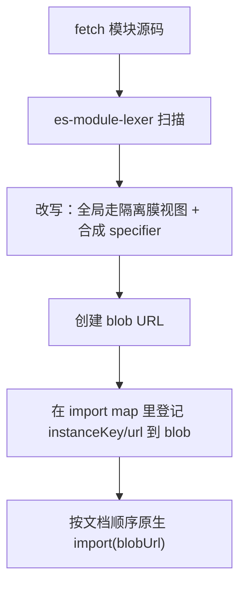

# ESM 沙箱实现

> 本页面向维护者，记录 ESM 执行引擎的实现细节。用户可观察的行为见 [原生 ESM 支持](/zh-CN/concepts/esm-sandbox)，设计取舍见 [ESM 沙箱 RFC](../../rfcs/esm-sandbox.md)。

现在的微应用越来越多地直接产出原生 ES 模块。Vite 的 dev server 会给每个源文件单独发一个 `<script type="module">`，靠 `import`/`export` 把它们串起来，剩下的交给浏览器原生的模块加载器。这种代码在 qiankun 的经典沙箱里根本跑不起来——经典沙箱把源码包进 `with (this) { … }`，再从脚本最后写入的那个全局变量里读出应用的导出；可 ESM 强制严格模式，`with` 直接是个 `SyntaxError`，而生命周期函数来自 `export`，压根不写 `window`。

ESM 沙箱就是 qiankun v3 给出的答案。`EsmSandboxEngine` 让微应用的原生 ES 模块图，走的还是那层 [JS 沙箱](/zh-CN/concepts/js-sandbox)隔离膜——不用打包器，不用 iframe，也不用构建期插件。实例化和求值仍然归原生 ESM 加载器管，所以顶层 `await`、循环依赖、live binding、变量提升这些，行为和没有 qiankun 时一模一样。

## 为什么要单独一套引擎

经典路径和 ESM 路径解决的根本不是同一类问题：

| | 经典 | ESM |
| --- | --- | --- |
| 源码包裹 | `with (this) { … }` blob | 模块顶部 `const/let { … } = __qk_view` 解构 |
| 全局覆盖范围 | 每一个裸标识符 | 只有出现在该模块解构集合里的名字（基准集 = `esmDestructurableGlobals`） |
| 隐式全局写 `foo = 1` | 写进 proxy | 严格模式 `ReferenceError`——根本走不到 set trap |
| 生命周期发现 | `sandbox.latestSetProp`（一次 `window` 写入） | 入口模块的 `export` / `export default { … }` |
| 重新挂载 | 顶层代码不重跑；再次调用已保留的生命周期函数 | 顶层代码不重跑；`import(sameBlob)` 返回同一个 namespace |
| 模块标识 | 直接 blob URL | 合成 specifier → import map → blob URL |

引擎没有另起炉灶去重写一套模块解析，而是复用了三样现成的东西：流式 [HTML 入口加载器](/zh-CN/concepts/html-entry-loading)、`Proxy` 隔离膜、以及浏览器自己的模块加载器。它只是把自己插在 fetch 和求值之间。

## 什么时候会触发

只有开启 `sandbox`（默认就是开）时，这个引擎才存在。它在 `loadApp` 里随每个微应用实例连同隔离膜一起构造出来。一旦 `sandbox: false`，ESM 沙箱和隔离膜就全都没有了。

分发是在加载器的流式管线里按 DOM 节点类型来做的（`packages/shared/src/assets-transpilers/module.ts`）：

- **`<script type="module">`**（带 `src` 或内联）被路由到引擎。transpiler 会把 `src` 属性摘掉、存到 `data-src` 上，再打上 `data-esm="true"` 标记，这样浏览器原生的加载器就永远不会去 fetch 或执行原始 URL——否则那次加载会彻底绕过沙箱。
- **`<script type="importmap">`** 由 qiankun 自己解析。元素的 `type` 会被改写成 `qiankun-importmap`，免得浏览器把子应用的 map 合进宿主文档的 import map。
- **经典 `<script>` / `text/javascript`** 继续走经典 transpiler（也就是 `with (this)` blob 那条路）。同一个 HTML 入口里经典脚本和 ESM 脚本混用是支持的。

## 具体怎么做

对每个模块，引擎先用一个 WASM lexer 驱动一次运行时源码改写，再把结果交给原生加载器：



1. **Fetch**——通过装饰过的 `fetch`（cacheable → retryable → throwable）把模块拿回来。
2. **扫描**——用 [`es-module-lexer`](https://github.com/guybedford/es-module-lexer) 扫一遍，这是个 WASM lexer，在 `start()` 时通过 `prepareEsmLexer()` 预热一次。
3. **改写**源码，使得：
   - 对被沙箱管辖的全局的引用，在模块顶部从隔离膜视图里解构出来（`const { window, document, … } = __qk_view`）；
   - 每个静态 import specifier 被替换成形如 `` `${instanceKey}/${resolvedUrl}` `` 的合成 specifier；
   - `import.meta` 变成一个保留了真实 `url` 的本地对象，`import()` 变成沙箱感知的 `__qk_dynamic_import(...)`。
4. **映射**——通过一份动态注入的、文档级的 `<script type="importmap">`，把每个合成 specifier 映射到对应的 blob URL。
5. **求值**——按文档顺序用原生 `import(blobUrl)` 执行。

因为实例化始终留在原生加载器手里，引擎从头到尾都没有去重新实现一遍模块语义——它只是重定向了每个模块的源码和全局到底从哪儿来。

### 全局是怎么改写的

改写并没有把模块塞进一个 proxy 作用域里。它扫描源码，挑出那些出现在基准全局集里的标识符，只把这些从隔离膜视图里解构出来：

- 稳定对象（`window`、`document` 以及基准集里其余的那些）用 `const { … } = __qk_view` 绑定。对它们的属性访问始终是活的，因为对象本身就是那份被代理的视图。
- 可 live binding 的双下划线标志位（`__X__`，比如 `__VUE_OPTIONS_API__`）用 `let` 绑定并被跟踪，这样当沙箱之后记录到对某个这类全局的写入时，已经求值过的模块也能看到新值。

这段头部是靠 import 一个每实例独立的 runtime 模块来引导的——`import { __qk_view, __qk_resolve, __qk_dynamic_import, __qk_track } from "<instanceKey>/__runtime__"`——而不是去读 `globalThis` 或调 `eval`。用 import binding 可以避开 temporal-dead-zone 的 `ReferenceError`，也让沙箱和 CSP 兼容：唯一多出来的要求是 `script-src blob:`，从不需要 `'unsafe-eval'`。

## 执行顺序

加载和求值是特意围绕 HTML 流拆开的：

- **流式过程中**，每个模块脚本按文档顺序同步调一次 `loadModuleScript(...)`。这会立刻把异步 transpile 启动起来（fetch → lexer → 改写 → 并行递归预取依赖），但把求值推迟。每个任务都排进队列。
- **流结束之后**，加载器调 `sealAndExecute()`。当存在模块脚本时它返回 `true`——这是个信号，告诉加载器该去 await ESM 入口的 namespace，而不是经典的 `latestSetProp`。接着它按顺序 await 每条排队的记录，刷新新的 import-map 条目，再对每个模块依次调原生 `import(blobUrl)`。

### 选出入口 namespace

所有模块都跑完之后，引擎要挑出哪个模块的 namespace 才带着生命周期函数：

1. 如果某个模块显式带了 `entry` 属性，那这个模块的 namespace 就是入口，它一旦失败整个应用都失败。
2. 否则，第一个看起来像生命周期对象（或者它的 `.default` 像）的已执行 namespace 胜出——对应一个 Vite 入口写的 `export default { bootstrap, mount, unmount }`。
3. 再否则，用**最后一个**执行的 namespace，对应只有一个 `<script type="module">` 的 HTML。

一个非入口模块抛错只会 `console.error` 一下，并不会让应用失败——因为一个经典应用可能顺带夹了个多余的模块脚本进来。之后 `loadApp` 会再通过 `getLifecyclesFromExports` 重新校验选中的 namespace，它还能回退到 `window[appName]`。任何模块图里的抛错、或被 reject 的顶层 `await`，都会被接回来送到 single-spa 的错误处理器，而不是冒成一个 `unhandledrejection`。

## import map

引擎会用到两层 import map，而且这两层从不混在一起：

- **子应用自己的 map**（`<script type="importmap">`）被解析成一张内部表（`bareSpecifier → absolute URL`），只用来解析子应用的 bare specifier。只认 `imports` 字段——`scopes` 会被解析、给出告警、然后在 v1 里忽略掉。
- **注入的 runtime map** 把 `<instanceKey>/<absoluteUrl>` 映射到浏览器真正 import 的那个 blob URL。

原生 import map 是文档级的、只增不减、冲突时以先到者为准。所以实例之间的隔离完全押在 instance key 上：

```
instanceKey = `__qk_${appName}_${instanceId}_${++instanceSeq}__`
```

`instanceSeq` 是个全局单调计数器，**从不复用**，所以一个已经退役的 key 绝不会跟一个活着的条目撞上。只有新条目会被追加进去；真要在同一个 specifier 上撞出一个不同的目标，会打一条 `console.error`（浏览器则会不声不响地保留第一个）。

::: info 长期存活的基座会攒下条目
在真实文档里 import-map 条目是不可撤销的，所以一个反复加载、卸载微应用的基座会攒下一堆死条目——在页面的整个生命周期里，字符串会无上限地增长。这是 v1 已知的一个限制。
:::

## realm 桥接与重声明探测

改写后的 blob 跑在真实的全局作用域里，所以一个放错位置的裸 `__qk_*` 引用会碰到真实全局、从隔离膜里逃出去。有两道防线守着这座桥：

- **realm accessor**——它负责返回某个模块的隔离膜视图，被挂在 `globalThis` 上一个每副本、密码学随机的 key 下，再进一步用一个无法猜测的每实例 token 做索引，而这个 token 只内联在该实例自己的 runtime 模块 blob 里。隔离膜还把 `__qk_*` 这类名字拉进黑名单，作为纵深防御。用户代码若试图 import 任何 `__qk_` 前缀的合成 specifier，会被一个 `QiankunError` 拒掉。（像 `(0, eval)('globalThis')` 这类间接逃逸依然可能，这跟经典沙箱里的情况完全一样，而且明确不在防护范围内。）
- **重声明探测**——处理这么个情况：注入的 `const { window, … }` 头部，跟模块自己顶层的 `const window = …` 撞了名，这在解析期就是个 `SyntaxError`。因为 import-map 条目一旦刷进去就不可撤销，引擎必须在刷进去*之前*把它抓住。它会去 import 一个探测 blob，这个 blob 的 runtime specifier 被换成一个从未注册过的目标：解析会把重声明错误暴露出来，而随后的解析注定会失败，所以这个模块实际上永远不会求值。引擎从中提取出闯祸的那个标识符，把它加进一个排除集合，再把模块重新改写一遍。

## Vite dev 的特殊处理

引擎的设计目标之一，就是直接跑 Vite dev server 产出的原生 ESM。子应用怎么配，见 [让 Vite 应用接入 qiankun](/zh-CN/cookbook/prepare-a-vite-app)。

- **`/@vite/client` 被打了桩。** 桩保留了 `updateStyle`/`removeStyle`（经由被代理的 `document` 路由到虚拟 head），但返回一个空操作的 hot context，也从不去开 HMR 的 WebSocket。
- **HMR 是被主动关掉的，不是被动降级。** 真实 Vite client 里 HMR 的 host 是个 serve 期写死的字面量，所以它的 WebSocket *会*从沙箱内部连上，然后触发一次破坏性的整页 `location.reload()`。关掉它是有意为之——开发时，手动改代码、手动刷新。
- **React Fast Refresh** 要求它的 preamble 先于组件模块运行；顺序不对它就没法正确初始化。

::: warning 重新挂载时 CSS-as-JS 可能丢失
Vite 把 CSS 当成 JS 模块来发，在模块顶层注入样式。因为重新挂载不会重跑顶层代码（见下），而卸载又清空了虚拟 head，这类样式在第二次挂载时可能就消失了。这是个已知冲突，记录在 ESM-sandbox RFC 里。
:::

## 生命周期与缓存

ESM 沙箱在挂载/卸载之间保留自己的模块图，这跟经典沙箱比，变了一条很重要的前提：

- **重新挂载不会重跑顶层代码。** `import(sameBlobUrl)` 返回的是*同一个*模块 namespace，所以一个模块的顶层只执行一次——只有 `mount(props)` 会再跑。任何每次挂载需要的状态（应用实例、store、router）都必须在 `mount()` 里创建，不能放在模块作用域。经典应用也应遵循同样的生命周期纪律：qiankun 重挂时同样会复用已发现的生命周期函数，而不会重新执行入口脚本。
- **`dispose()` 挂在 single-spa 的 `unload` 上，而不是 `unmount`。** 彻底拆除——撤销引擎创建过的每一个 blob URL、注销 realm——只在 `unload` 时发生。因为 `loadMicroApp` 出来的 parcel 没有 `unload` 语义，它们的引擎会一直赖着，直到调用方把引用丢掉为止，这跟经典沙箱没有显式销毁钩子是同一个缺口。

```js [micro-app/src/index.js]
let app;

export async function bootstrap() {
  // 只跑一次。只适合放一次性的初始化。
}

export async function mount(props) {
  // 每次（重新）挂载都会跑——每实例的状态在这里创建。
  app = createApp(props.container);
  app.render();
}

export async function unmount(props) {
  app.unmount();
  app = null;
}
```

完整的生命周期约定见 [微应用生命周期与 props](/zh-CN/concepts/lifecycle-and-props)。

## 限制

ESM 沙箱拿一部分经典沙箱的行为，换来了原生模块语义。这些要跟你的子应用作者交代清楚：

- **隐式全局写会抛错。** 在严格模式的 ESM 模块里，`foo = 1` 这种没有 `var`/`window.` 的写法是个 `ReferenceError`——根本走不到隔离膜的 set trap。以前指望隐式全局被沙箱接住的代码，现在会直接坏掉。
- **只有基准集里的全局被隔离膜管。** 只有落在每个模块解构集合里的名字——`esmDestructurableGlobals` 的一个子集——才走隔离膜。那些一次性快照表达不了的、值类型或 getter 类型的全局（`innerWidth`、`devicePixelRatio`、`length`、`name`、`status`、`event` 等）会回退到真实全局，卸载时也清理不掉。
- **带类型的 import 在 v1 里是直通的。** `import x from '...' with { type: 'json' | 'css' }`、WASM 之类，会被直接映射到原始 URL 并原生加载，没有实例隔离，只给一次 `console.warn`。它们要求子应用服务器给出正确的 MIME 类型和 CORS。*带类型的动态* import 里的相对 specifier 会相对 blob URL 去解析——请用绝对 URL。
- **Firefox 需要开个开关。** 多份动态注入的 import map 需要 `dom.multiple_import_maps.enabled`，而它在 Firefox 里默认是关的。当前运行时没有提供 shim 执行路径，因此需要默认支持 Firefox 的应用必须改用 Classic 交付路径。
- **没有 source map，可观测性会退化。** 未捕获错误的 `error.stack` 指向的是 `blob:<host-origin>/<uuid>`；`//# sourceURL` 只改 DevTools 里显示的名字，改不了 stack 里的 URL 和行号。生产的错误上报没法直接把 ESM 子应用的栈帧对回真实文件，所以 source map 在这里就从「锦上添花」变成了「生产必备」。

## 延伸阅读

- [JS 沙箱](/zh-CN/concepts/js-sandbox)——ESM 引擎复用的那层 `Proxy` 隔离膜
- [HTML 入口流式加载](/zh-CN/concepts/html-entry-loading)——分发模块脚本的那条管线
- [架构概览](/zh-CN/concepts/architecture)——这些零件是怎么拼到一起的
- [让 Vite 应用接入 qiankun](/zh-CN/cookbook/prepare-a-vite-app)——原生 ESM 的子应用配置
