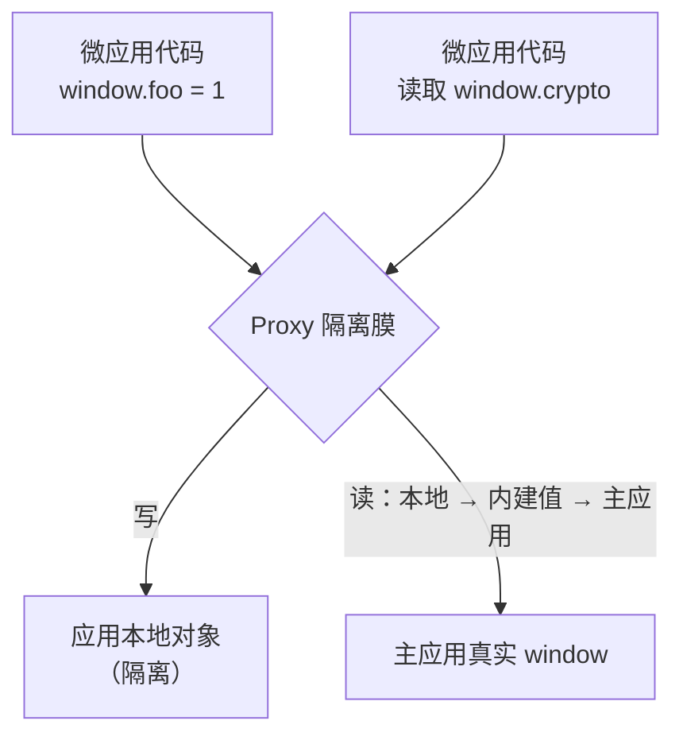

# JavaScript 沙箱实现

> 本页面向维护者说明 JavaScript 沙箱的实现细节。面向使用者的保证、责任与边界见 [JavaScript 隔离](/zh-CN/concepts/js-sandbox)。

多个微应用在同一页面运行时，都可能修改全局属性、注册定时器和事件监听器，或向文档中插入节点。如果不进行隔离，这些操作会影响主应用及其他微应用，并可能在应用卸载后继续存在。JavaScript 沙箱为每个微应用提供独立的虚拟全局作用域，同时追踪部分常见副作用，以便在卸载时执行清理。

本页介绍沙箱的隔离模型、实现组件、明确保留的共享行为和公开配置。应用接入通常无需了解这些实现，因为沙箱默认开启。

## 隔离模型

每个微应用都拥有独立的虚拟 `window`，`globalThis` 和 `self` 也指向同一个对象。该模型对读写操作采用不同策略：

- **显式全局写入保存在应用内部。** 执行 `window.foo = 1` 时，值会写入当前应用的本地对象，不会修改真实 `window`，其他微应用也无法访问。
- **Classic 顶层声明保留在包装函数内。** 顶层 `var foo` 属于隔间的包装函数作用域，不会成为代理 `window` 或真实 `window` 的属性。
- **读取操作可访问主应用全局对象。** 读取当前应用未定义的全局属性时，沙箱依次查询应用本地对象、qiankun 提供的内建值（endowments）和主应用的真实 `window`。因此，微应用仍可访问 `window.localStorage`、`window.crypto` 和 `document` 等浏览器能力。



这种非对称行为可以隔离全局写入，同时保持对浏览器环境的兼容。由于微应用仍可读取未被自身覆盖的主应用全局属性，沙箱只能用于副作用隔离，不能作为运行不可信代码的安全边界。

## 核心组件

沙箱由 `packages/sandbox` 中的隔离膜和隔间共同实现。

### 隔离膜（membrane）

隔离膜（`core/membrane`）是包裹主应用 `window` 的 `Proxy`，内部将真实 `window` 称为孵化上下文（incubator context）。应用访问的 `window` 即该代理对象，读写操作的差异由 Proxy 拦截器（trap）实现。生命周期钩子接收的 `global` 参数也是此代理对象；`__POWERED_BY_QIANKUN__` 和 `__INJECTED_PUBLIC_PATH_BY_QIANKUN__` 等运行时标记同样设置在该对象上。

### 隔间（compartment）

隔离膜可以拦截显式的 `window.x` 访问，但 Classic UMD 脚本还会使用 `React` 等裸全局引用，并包含 `var foo` 等顶层声明。Proxy 无法单独控制词法名称解析，因此隔间（`core/compartment`）会在执行前包装脚本源码。其结构大致如下：

```js
;(function () {
  with (this) {
    const { Array, /* …destructured intrinsics… */ } = this;
    /* 原始脚本源码 */
  }
}).bind(window.__compartment_globalThis__<N>__)();
```

包装后的源码通过 blob URL 执行，`<N>` 为每个实例提供独立的隔间槽位。当某个名称已存在于沙箱本地对象或主应用全局对象时，`with (this)` 会使对应的裸引用经过代理 `window`；顶层声明则保留在包装函数的局部作用域中。

对于全新且未声明的赋值（如 `foo = 1`），隔离膜的 `has` 拦截器不会命中，该写入在非严格模式的 Classic 脚本中可能逃逸到真实全局对象。微应用必须避免隐式全局变量，应显式声明变量或使用 `window.foo`。

只有 Classic 脚本使用隔间。`<script type="module">` 由 [ESM 沙箱实现](/zh-CN/internals/esm-sandbox)处理。ESM 引擎通过 `sandbox.getEsmGlobalsView()` 使用同一份隔离膜视图，但通过词法分析器改写模块源码，而不是使用 `with` 包装。两种执行方式共享当前应用的全局命名空间。

## 全局身份处理

仅重定向 `window.x` 仍不足以完成隔离，因为应用还可以通过 `self`、`globalThis`、`top` 和 `parent` 访问全局对象。沙箱会按下表重新定义这些属性：

| 属性 | 沙箱中的行为 |
| --- | --- |
| `window`、`self` | 返回沙箱 Realm 的全局对象，即隔离膜 |
| `globalThis` | 返回沙箱 Realm 的全局对象 |
| `top`、`parent` | 返回沙箱 Realm 的全局对象；主应用自身位于 iframe 中时除外 |
| `document` | 初始值为真实 `document`，随后由补丁模块（patcher）将相关 DOM 操作重定向到应用容器 |
| `hasOwnProperty`、`eval` | 使用适用于沙箱的实现 |

主应用嵌套在 iframe 中时 `top` 和 `parent` 的特殊行为见[隔离边界](#隔离边界)。

## 副作用管理

除全局属性外，沙箱还通过 `packages/sandbox/src/patchers` 中的**隔离插件**追踪部分有状态副作用。下表列出的是内置预设，自定义插件在其之后运行，协议见[用插件扩展沙箱](/zh-CN/cookbook/sandbox-plugins)。每个插件会覆盖沙箱全局中的一组 API，并返回 `free()` 闭包。卸载时调用 `free()`，用于清理已追踪的副作用并恢复原生函数；`free()` 还会返回重建函数（`rebuild`），供重新挂载时恢复必要的运行时状态。

| 补丁模块 | 处理内容 | 应用阶段 |
| --- | --- | --- |
| `patchInterval` | `setInterval` / `clearInterval`；`free()` 时清理尚未停止的定时器 | 挂载 |
| `patchWindowListener` | `window.addEventListener` / `removeEventListener`；清理残留监听器 | 挂载 |
| `patchHistoryListener` | History API 相关监听器 | 挂载 |
| `patchStandardSandbox`（`dynamicAppend`） | 拦截 `<script>`、`<style>` 和 `<link>` 的 `appendChild`、`insertBefore`，并重定向到应用容器 | `bootstrap` 和挂载 |

微应用实例不再使用时必须执行 `unmount()`。跳过卸载会使补丁模块的 `free()` 无法执行，导致定时器、事件监听器和动态插入的 DOM 节点继续存在，并影响重新挂载或多实例运行。

## 有意共享的全局属性

隔离膜通过 `core/membrane` 中的白名单，将部分全局属性直接写入主应用的真实 `window`：

```ts
const globalVariableWhiteList = ['System', '__cjsWrapper', /* + dev-only */];
```

- `System` 和 `__cjsWrapper` 始终共享，用于处理 SystemJS 通过间接 `eval` 访问全局作用域时的模块解析要求。
- 在 `NODE_ENV` 为 `test` 或 `development`，或设置 `window.__QIANKUN_DEVELOPMENT__` 时，白名单还包含 `__REACT_ERROR_OVERLAY_GLOBAL_HOOK__`、`event`、`$RefreshReg$` 和 `$RefreshSig$`。这些属性供 React／Vite 的 HMR 与错误覆盖层使用。

::: warning 不要使用白名单传递应用状态
白名单属性会写入真实 `window` 并由所有应用共享，但它们仅用于模块加载和开发工具。应用间数据传递应使用 props，详见[应用间共享状态与通信](/zh-CN/cookbook/communicate-between-apps)。
:::

## 原生函数绑定与直接转发

部分浏览器 API 要求调用时的 `this` 为真实 `window`。例如，通过 Proxy 直接调用未绑定的 `fetch` 可能抛出 `Illegal invocation`。沙箱会在应用读取此类函数时，将它们重新绑定到真实 `window`；对应属性记录在 `useNativeWindowForBindingsProps` 集合中。

`requestAnimationFrame` 和 `cancelAnimationFrame` 通过 `whitelistBOMAPIs` 集合直接转发给主应用，沙箱不会追踪或取消尚未执行的回调。微应用创建动画循环后，必须在 `unmount` 中调用 `cancelAnimationFrame`。

## 多实例隔离

每次进入 `loadApp` 都会创建新的 `StandardSandbox`，包含独立的隔离膜和本地对象。因此，无论是同一应用的多个实例，还是不同应用的实例，其全局命名空间都相互独立。

每次加载都会通过按应用计数的 `genInstanceId(appName)` 获取 `instanceId`，从 `1` 开始递增。以下两项机制保证重复实例可以独立运行：

- 隔间的 `<N>` 计数器使每个实例使用不同的 `__compartment_globalThis__<N>__` 槽位，避免包装后的 Classic 脚本相互覆盖。
- 当 `instanceId > 1` 时，`removeWebpackChunkCacheWhenAppHaveMultiInstance` 会清理该应用的 Webpack 代码分块缓存，使后续实例在自己的沙箱中重新执行构建代码，而不是复用首个实例的模块缓存。

::: danger 每个实例都必须卸载
多实例清理依赖各补丁模块的 `free()`。如果遗漏某个实例的卸载，其事件监听器、定时器和动态 DOM 将继续存在，并可能影响后续挂载。通过 `loadMicroApp` 创建的每个实例都应使用对应句柄调用 `unmount()`。
:::

具体用法见[运行多个微应用实例](/zh-CN/cookbook/run-multiple-instances)。

## 沙箱的激活与停用

沙箱状态随 single-spa 的 `mount` 和 `unmount` 变化：

- **挂载时**，`sandbox.active()` 解锁隔离膜，重新执行 `bootstrap` 阶段收集的重建函数，并安装挂载阶段的补丁模块，同时恢复动态样式表。
- **卸载时**，先调用各补丁模块的 `free()` 并保存下次挂载所需的重建函数，再由 `sandbox.inactive()` 锁定隔离膜。锁定期间，应用发起的全局写入会被忽略，开发环境中还会输出警告。

::: info v3 不使用快照差异比较
部分沙箱会在挂载时记录 `window` 属性快照，并在卸载时通过差异比较恢复。qiankun v3 不采用此方式：全局写入从一开始就保存在应用本地对象中，因此无需恢复真实 `window`。代码中虽然存在 `SnapshotSandbox` 枚举值，但并未提供对应实现；`createSandbox` 始终创建 `StandardSandbox`。qiankun v3 要求浏览器支持 `Proxy`，不提供旧版降级实现。
:::

## 隔离边界

使用沙箱前需要了解以下边界：

- **允许读取未被覆盖的主应用全局属性。** 微应用可以读取真实 `window` 中未被自身本地属性覆盖的值。隔离限制全局写入，但不限制此类读取。
- **主应用嵌套时，`top` 和 `parent` 指向外层窗口。** 如果主应用本身位于 iframe 中，`top` 和 `parent` 会返回真实顶层或父级 window，以支持主应用访问外层 frame。
- **间接 `eval` 存在已知限制。** 隔离膜中的间接 `eval` 可能使 SystemJS 访问沙箱外的作用域，因此 `System` 必须列入共享白名单。
- **`onGlobalSet` 只能观察经过隔离膜的写入。** 如果主应用在模块完成求值后直接修改真实 `window`，模块中已经捕获的全局绑定不会更新。

## 公开配置

沙箱通过 [`AppConfiguration`](/zh-CN/api/configuration) 中的 `sandbox` 选项控制：

| 选项 | 类型 | 默认值 | 说明 |
| --- | --- | --- | --- |
| `sandbox` | `boolean` | `true` | 是否开启 JavaScript 沙箱。设为 `false` 后，应用直接使用主应用的真实全局作用域 |

```ts
import { loadMicroApp } from 'qiankun';

const microApp = loadMicroApp(
  {
    name: 'app1',
    entry: 'https://app1.example.com',
    container: document.getElementById('subapp')!,
  },
  {
    sandbox: true, // 默认值，通常可以省略。
  },
);
```

::: warning `sandbox: false` 会同时关闭 ESM 隔离
ESM 沙箱引擎仅在启用 `sandbox` 时创建。关闭沙箱后，ESM 沙箱执行和 Classic 脚本的沙箱导出机制都会停用，微应用将直接共享主应用的真实全局对象。除非存在明确的兼容性要求，否则不应关闭该选项。
:::

::: info 与 qiankun 2.x 的区别
在 v3 中，`sandbox` 的类型是 `boolean | SandboxConfiguration`。2.x 的 `sandbox: { strictStyleIsolation }`、`sandbox: { experimentalStyleIsolation }` 以及基于 Shadow DOM 的样式隔离配置已被移除。CSS 隔离改由布尔选项 [`sandbox.styleIsolation`](/zh-CN/concepts/style-isolation) 控制，并使用 CSS `@scope` 实现。详见[从 qiankun 2.x 迁移](/zh-CN/cookbook/migrate-from-2x)。
:::

## 延伸阅读

- [原生 ESM 支持](/zh-CN/concepts/esm-sandbox)：原生模块应用可依赖的公开行为。
- [加载一个微应用实例](/zh-CN/concepts/architecture)：沙箱在整体运行模型中的位置。
- [ESM 沙箱实现](/zh-CN/internals/esm-sandbox)：`<script type="module">` 如何复用同一隔离膜。
- [样式隔离实现](/zh-CN/internals/style-isolation)：基于 CSS `@scope` 的样式隔离。
- [运行时编排原理](/zh-CN/internals/runtime-orchestration)：沙箱在加载流程中的位置。
- [微应用生命周期与 props](/zh-CN/concepts/lifecycle-and-props)：挂载、卸载及应用自身的清理职责。
- [AppConfiguration](/zh-CN/api/configuration)：应用配置的完整参考。
