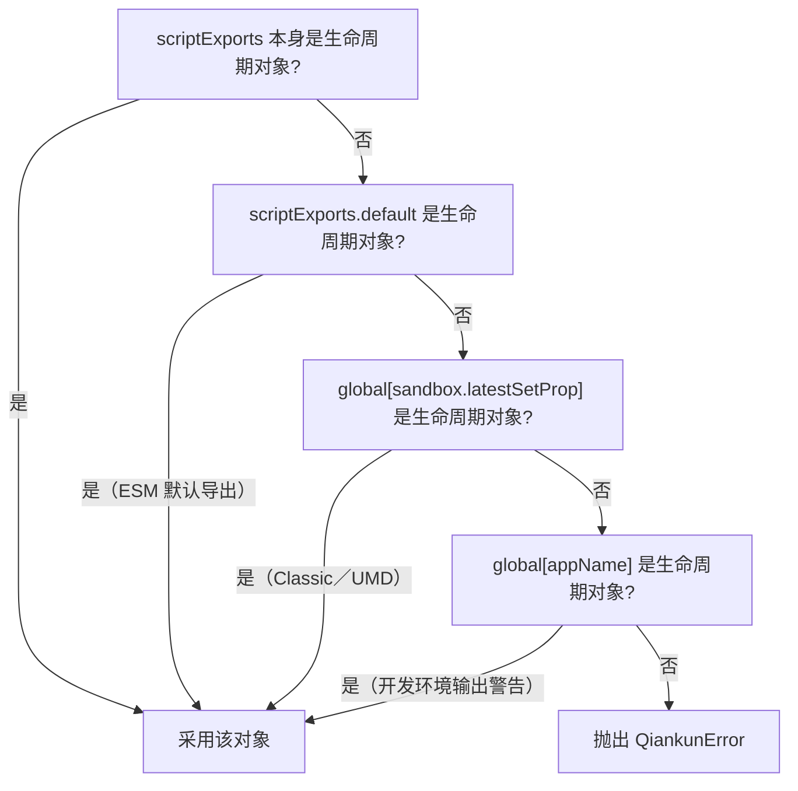
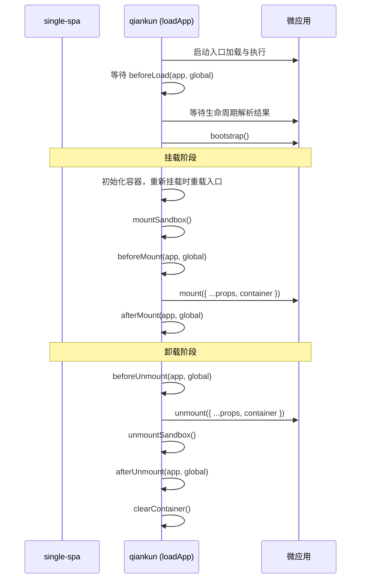

# 生命周期解析原理

> 本页面向维护者说明生命周期发现与编排的实现细节。面向使用者的约定见[微应用生命周期与 props](/zh-CN/concepts/lifecycle-and-props)。

qiankun 通过 HTML 入口加载微应用，而不是直接导入约定的模块。因此，入口脚本执行完成后，qiankun 需要从其导出中解析生命周期函数，并在对应阶段调用这些函数。本页说明微应用的导出约定、生命周期对象的解析顺序、主应用钩子与微应用生命周期的区别，以及 props 和运行时标记的传递方式。

如果只需了解如何在微应用中导出生命周期，请参阅[教程](/zh-CN/tutorial/build-the-micro-app)、[Vite 接入指南](/zh-CN/cookbook/prepare-a-vite-app)或 [Webpack 接入指南](/zh-CN/cookbook/prepare-a-webpack-app)。

## 微应用导出约定

每个微应用都必须提供包含 `bootstrap`、`mount` 和 `unmount` 的生命周期对象，也可以选择提供 `update`：

```ts
export async function bootstrap() {
  // 一次性初始化，仅在首次 mount 前执行一次。
}

export async function mount(props) {
  // 将应用渲染到 props.container。
}

export async function unmount(props) {
  // 销毁应用界面并释放资源。
}

// 可选
export async function update(props) {
  // 在 loadMicroApp 场景中接收更新后的 props。
}
```

qiankun 使用 `isLifecycleObject` 校验对象结构，要求 `bootstrap`、`mount` 和 `unmount` 均为函数。`update` 为可选项，且仅在其类型为函数时才会添加到运行中的 Parcel。

生命周期函数的签名为 `(props) => Promise<void>`。完整类型定义位于 `packages/qiankun/src/types.ts`：

```ts
type MicroAppLifeCycles = FlattenArrayValue<ParcelLifeCycles<{ container: HTMLElement }>>;
// => { bootstrap; mount; unmount; update? }
```

根据入口脚本的执行方式，qiankun 可能以两种形式获得生命周期对象：

- **Classic／UMD**：入口 `<script entry src=...>` 将 `{ bootstrap, mount, unmount, update? }` 赋值给全局变量，qiankun 再从沙箱中读取该变量。
- **ESM**（`<script type="module">`）：入口模块可以具名导出 `bootstrap`、`mount` 和 `unmount`，也可以通过 `export default { bootstrap, mount, unmount }` 默认导出生命周期对象。

两种脚本执行方式分别见 [JavaScript 沙箱实现](/zh-CN/internals/js-sandbox)和 [ESM 沙箱实现](/zh-CN/internals/esm-sandbox)。无论采用哪种方式，最终都需要得到符合上述结构的生命周期对象。

## 生命周期对象的解析顺序

入口脚本执行完成后，`getLifecyclesFromExports`（`packages/qiankun/src/core/loadApp.ts`）按照固定顺序解析生命周期对象，并采用第一个符合要求的结果：



具体顺序如下：

1. **`scriptExports` 本身**：如果入口解析结果已通过 `isLifecycleObject` 校验，则直接采用。此情况对应 ESM 具名导出。
2. **`scriptExports.default`**：用于解析 ESM 的 `export default { bootstrap, mount, unmount }`。
3. **`global[sandbox.latestSetProp]`**：用于 Classic 脚本。`latestSetProp` 记录入口脚本最后一次通过沙箱隔离膜写入的全局属性，因此可以定位 UMD 构建导出的生命周期对象。
4. **`global[appName]`**：使用应用名查询同名全局变量。执行该步骤前，qiankun 会在开发环境输出警告，因为通常只有构建工具的 `output.library` 配置不正确时才需要使用此结果。
5. **均不符合要求**：抛出 `QiankunError`，说明无法通过 `latestSetProp` 或 `window[appName]` 找到生命周期函数。

::: tip 正确配置 Classic 构建的全局库输出
Classic 执行方式要求构建产物以 UMD 全局变量导出生命周期对象。[`@qiankunjs/bundler-plugin`](/zh-CN/ecosystem/bundler-plugin) 会标记入口脚本并修正 `output.library`。ESM 应用不需要此配置，其导出直接从模块命名空间中读取。
:::

## 微应用生命周期与主应用钩子

qiankun 中存在两类用途不同的生命周期函数：

- **微应用生命周期**由微应用实现，包括 `bootstrap`、`mount`、`unmount` 和可选的 `update`。qiankun 负责解析并调用这些函数。
- **主应用生命周期钩子**通过可选的 `LifeCycles` 对象配置，用于观察微应用状态变化。主应用可以将该对象传给 [`loadMicroApp`](/zh-CN/api/load-micro-app) 或 [`registerMicroApps`](/zh-CN/api/register-micro-apps)。

```ts
type LifeCycleFn<T> = (app: LoadableApp<T>, global: WindowProxy) => Promise<void>;

type LifeCycles<T> = {
  beforeLoad?: LifeCycleFn<T> | Array<LifeCycleFn<T>>;
  beforeMount?: LifeCycleFn<T> | Array<LifeCycleFn<T>>;
  afterMount?: LifeCycleFn<T> | Array<LifeCycleFn<T>>;
  beforeUnmount?: LifeCycleFn<T> | Array<LifeCycleFn<T>>;
  afterUnmount?: LifeCycleFn<T> | Array<LifeCycleFn<T>>;
};
```

| | 微应用生命周期 | 主应用钩子（`LifeCycles`） |
| --- | --- | --- |
| 实现方 | 微应用 | 主应用 |
| 函数 | `bootstrap` / `mount` / `unmount` / `update?` | `beforeLoad` / `beforeMount` / `afterMount` / `beforeUnmount` / `afterUnmount` |
| 签名 | `(props) => Promise<void>` | `(app, global) => Promise<void>` |
| 第二个参数 | — | `global`，即沙箱化的 `WindowProxy` |
| 声明位置 | 由入口导出 | 传给 `loadMicroApp` 或 `registerMicroApps` |

主应用钩子的第二个参数是当前应用对应的沙箱 `WindowProxy`，即微应用访问的代理 `window`，不是微应用导出的生命周期对象。完整说明见[生命周期钩子](/zh-CN/api/lifecycles)。

每个钩子既可以是单个函数，也可以是函数数组。qiankun 通过 `execHooksChain` 按顺序执行，内置扩展（addon）钩子位于用户钩子之前。

## 钩子执行顺序

`loadApp` 会先启动入口加载，再执行并等待 `beforeLoad`，随后才等待入口生命周期的解析结果，因此入口加载可能与该钩子重叠。其余钩子位于 Parcel 的 single-spa `mount` 和 `unmount` 队列中，并分别在微应用 `mount`、`unmount` 的前后执行：



`mount` 阶段依次执行：初始化容器或重载入口 HTML、激活沙箱、`beforeMount`、微应用 `mount({ ...props, container })`、`afterMount`。`unmount` 阶段依次执行：`beforeUnmount`、微应用 `unmount({ ...props, container })`、停用沙箱、`afterUnmount`、清空容器。

重新挂载时，qiankun 会重载入口 HTML，但通过 `getPureHTMLStringWithoutScripts` 移除其中的所有 `<script>` 节点，避免重复执行已在首次挂载时运行的脚本。因此，入口 DOM 会重新创建，而 JavaScript 不会重新获取或执行；qiankun 仅对新容器再次调用微应用的 `mount()`。

## 向微应用传递 props

qiankun 不提供内置的跨应用状态库。主应用通过 single-spa 的 `customProps` 向微应用传递数据，qiankun 还会额外注入容器字段。

::: warning v3 不提供 initGlobalState
qiankun 2.x 的全局状态 API，包括 `initGlobalState`、`onGlobalStateChange`、`setGlobalState` 和 `MicroAppStateActions`，已从 v3 中移除。应用间通信应通过 `props` 传递回调或共享对象，也可以使用项目自有的状态仓库或事件总线。详见[应用间共享状态与通信](/zh-CN/cookbook/communicate-between-apps)。
:::

加载应用时可以声明以下 props：

::: code-group

```ts [loadMicroApp]
import { loadMicroApp } from 'qiankun';

const micro = loadMicroApp({
  name: 'app1',
  entry: '//localhost:7100',
  container: document.getElementById('subapp-container')!,
  props: { user: currentUser },
});
```

```ts [registerMicroApps]
import { registerMicroApps } from 'qiankun';

registerMicroApps([
  {
    name: 'app1',
    entry: '//localhost:7100',
    container: document.getElementById('subapp-container')!,
    activeRule: '/app1',
    props: {
      user: currentUser,
      onEvent: (payload) => {
        /* ... */
      },
    },
  },
]);
```

:::

配置中的 `props` 会作为 single-spa `customProps` 传入每次生命周期调用。调用 `mount` 和 `unmount` 时，qiankun 还会注入 `container: HTMLElement`，即微应用应使用的 DOM 容器。生命周期函数最终收到的参数由自定义 props、single-spa 标准 props（如 `name`、`singleSpa` 和 `mountParcel`）以及 qiankun 注入的 `container` 合并而成：

```ts
export async function mount(props) {
  const { container, user } = props;
  // 在 qiankun 提供的容器内渲染，不使用固定的全局选择器。
  root = createRoot(container.querySelector('#root'));
  root.render(<App user={user} />);
}
```

::: danger 必须渲染到 props.container
微应用应挂载到 `props.container`，不能使用指向真实页面的固定全局选择器，例如 `document.getElementById(...)`。全局选择器会破坏容器边界，并导致多实例渲染异常。详见[运行多个微应用实例](/zh-CN/cookbook/run-multiple-instances)。
:::

如果微应用导出了 `update` 生命周期，[`loadMicroApp`](/zh-CN/api/load-micro-app) 返回的 [`MicroApp`](/zh-CN/api/types) 句柄会提供 `update(props)`，用于向已挂载实例传递新的 props。

## 代理 `window` 上的运行时标记

挂载前，qiankun 的两个内置扩展会在微应用的代理 `window` 上设置运行时标记。微应用通过沙箱隔离膜访问 `window`，因此可以像读取普通全局变量一样读取这些标记：

| 标记 | 设置方 | 值 | 作用 |
| --- | --- | --- | --- |
| `__POWERED_BY_QIANKUN__` | `engineFlag` 扩展 | `true` | 标识当前应用由 qiankun 运行 |
| `__INJECTED_PUBLIC_PATH_BY_QIANKUN__` | `runtimePublicPath` 扩展 | 入口 URL 的源（origin）与目录 | 提供动态资源的运行时公共路径（public path） |

`engineFlag` 扩展在 `beforeLoad` 和 `beforeMount` 中设置 `__POWERED_BY_QIANKUN__ = true`，并在 `beforeUnmount` 中删除该属性。`runtimePublicPath` 扩展在 `beforeLoad` 中设置 `__INJECTED_PUBLIC_PATH_BY_QIANKUN__`，重新挂载时在 `beforeMount` 中再次设置，并在卸载时恢复原值。

微应用通常通过第一个标记区分 qiankun 运行和独立运行：

```ts
if (window.__POWERED_BY_QIANKUN__) {
  // 由 qiankun 调用 bootstrap、mount 和 unmount，不在此处自行渲染。
} else {
  // 独立运行时直接渲染。
  render();
}
```

对于 Webpack 应用，需要将 `__INJECTED_PUBLIC_PATH_BY_QIANKUN__` 赋给 `__webpack_public_path__`，以便延迟加载的代码分块根据正确的源（origin）解析。具体配置见 [Webpack 接入指南](/zh-CN/cookbook/prepare-a-webpack-app)。

## 重新挂载与 `unload`

single-spa 的 `unmount` 用于停用应用并保留可复用的运行时状态，`unload` 则用于完整销毁应用。两者的差异会影响 Classic 和 ESM 应用的重新挂载行为。

**重新挂载（`unmount` 后再次 `mount`）**：`unmount` 时清空应用 DOM 并停用沙箱，下次 `mount` 时重新创建 DOM 并激活沙箱。重新加载的 HTML 不包含脚本节点，因此 Classic 入口代码和 ESM 模块顶层代码均不会再次执行；两种方式都会复用首次加载时解析出的生命周期对象，并仅再次调用 `mount(props)`。

::: warning 在 mount() 中创建可销毁状态
模块顶层代码不会在重新挂载时执行。因此，框架应用实例和视图状态应在 `mount()` 中创建，并在 `unmount()` 中销毁。
:::

对于命中缓存的重新挂载（同一应用和同一容器），qiankun 还会将 `bootstrap` 替换为空操作，确保一次性初始化不会重复执行。

**完整销毁（`unload`）**：只有进入 single-spa 的 `unload` 生命周期后，qiankun 才会销毁 ESM Realm。`EsmSandboxEngine.dispose()` 会撤销引擎创建的所有 blob URL，并注销当前实例的 Realm。后续再次激活时，`loadApp` 会使用新的引擎重新执行完整加载流程。`dispose()` 绑定到 `unload` 而非 `unmount`，因此已经卸载但尚未执行 `unload` 的 ESM 应用仍会在内存中保留 Realm 和模块命名空间。

::: info `loadMicroApp` 不提供 `unload`
`loadMicroApp` 返回的公开句柄不包含 single-spa 的 `unload` 生命周期。不再使用实例时仍应调用 `unmount()`，但该操作不会完整销毁 ESM 引擎。详见[运行多个微应用实例](/zh-CN/cookbook/run-multiple-instances)。
:::

## 延伸阅读

- [loadMicroApp](/zh-CN/api/load-micro-app) 和 [registerMicroApps](/zh-CN/api/register-micro-apps)：入口 API 及其 `props`。
- [生命周期钩子（LifeCycles）](/zh-CN/api/lifecycles)：主应用钩子的完整参考。
- [AppConfiguration](/zh-CN/api/configuration)：`sandbox`、`styleIsolation` 和其他应用配置。
- [JavaScript 隔离](/zh-CN/concepts/js-sandbox)和[原生 ESM 支持](/zh-CN/concepts/esm-sandbox)：两种执行方式的公开行为与边界。
- [JavaScript 沙箱实现](/zh-CN/internals/js-sandbox)和 [ESM 沙箱实现](/zh-CN/internals/esm-sandbox)：Classic 与 ESM 的生命周期发现方式。
- [从 qiankun 2.x 迁移](/zh-CN/cookbook/migrate-from-2x)：v3 的变更，包括已移除的全局状态 API。
