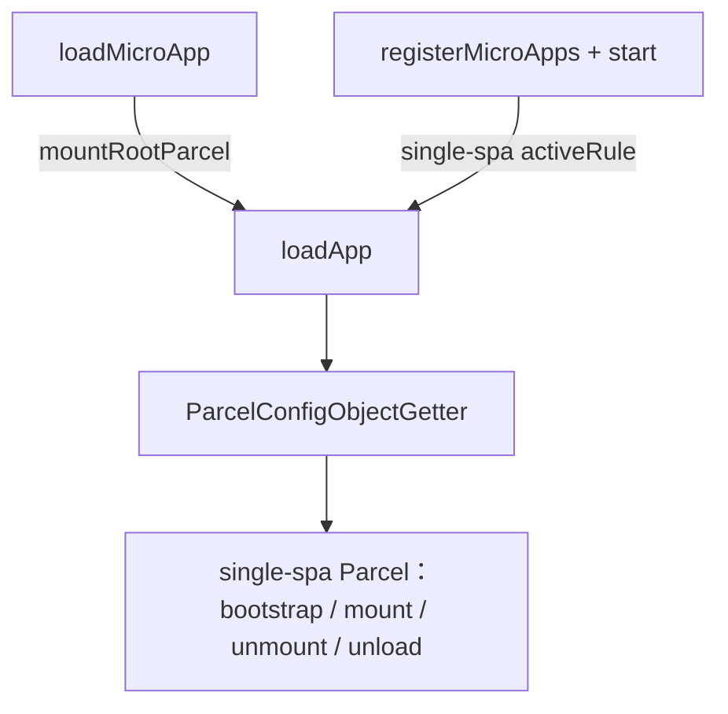
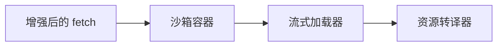
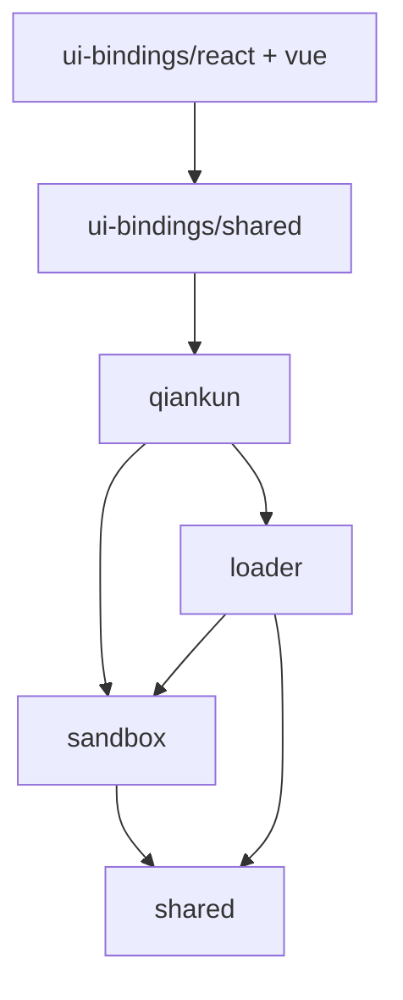

# 运行时编排原理

> 本页面向维护者说明运行时编排的实现细节。面向使用者的运行模型见[加载一个微应用实例](/zh-CN/concepts/architecture)。

本页说明 qiankun v3 加载和运行微应用的完整过程，包括总体编排逻辑、单个应用的加载流程、两种脚本执行方式，以及内部包之间的依赖关系。应用接入不要求了解这些实现；排查加载、挂载或沙箱副作用时，可以根据本文将公开 API 的行为对应到具体实现。

## 总体结构

从解析 HTML 入口到运行隔离后的微应用，核心流程均由 `loadApp`（`packages/qiankun/src/core/loadApp.ts`）编排。`loadApp` 完成加载准备后返回一个工厂函数，由该函数生成供 [single-spa](https://single-spa.js.org/) 执行挂载和卸载的 Parcel 配置。

微应用可以通过以下两种方式进入该流程，区别在于激活时机由谁控制：

- **命令式加载**：[`loadMicroApp`](/zh-CN/api/load-micro-app) 立即将微应用挂载到指定容器，并返回 `MicroApp` 句柄（即 single-spa Parcel）。调用方通过该句柄控制 `mount` 和 `unmount`。
- **路由驱动**：[`registerMicroApps`](/zh-CN/api/register-micro-apps) 将应用及其 `activeRule` 注册到 single-spa，再由 [`start`](/zh-CN/api/start) 开始监听路由。URL 变化时，single-spa 自动激活或停用相应应用。



两种方式最终都会调用 `loadApp`，因此后续的单应用处理流程完全一致。

## 单应用处理流程

对于每个微应用，`loadApp` 依次组织以下四个阶段，每个阶段由不同的内部包负责。



### 1. 增强 `fetch`

[`AppConfiguration`](/zh-CN/api/configuration) 中提供的 `fetch`（默认为 `window.fetch`）会依次经过 `@qiankunjs/shared` 中的三层装饰器：

```ts
const enhancedFetch = makeFetchCacheable(makeFetchRetryable(makeFetchThrowable(fetch)));
```

从内到外，各层职责如下：`makeFetchThrowable` 在响应状态码不属于 `200–399` 时抛出异常，`makeFetchRetryable` 为当前封装后的 fetch 实例提供共享的有限重试额度，`makeFetchCacheable` 负责请求去重和缓存。重试层不会判断错误是否具有临时性，因此网络异常和无效 HTTP 响应均可能消耗该额度，也不保证每个失败请求都会得到重试。

`enhancedFetch` 用于获取以下资源：

- 入口 HTML；
- 由 qiankun 主动获取并转换的资源，包括沙箱中的 Classic 脚本、ESM 模块和隔离样式；
- 重新挂载时不含脚本的 HTML。

图片和未启用隔离的样式表等浏览器原生请求不经过该函数。

### 2. 沙箱容器

当 `sandbox` 为 `true`（默认值）或对象时，`createSandbox`（`packages/sandbox`）会为 `window` 和 `document` 创建基于 Proxy 隔离膜的视图。应用代码运行在 `sandboxInstance.globalThis` 上，而非直接访问真实全局对象，因此全局写入会保存在当前应用的隔离环境中。隔离膜的行为以及补丁模块在卸载阶段的清理机制见 [JavaScript 沙箱实现](/zh-CN/internals/js-sandbox)。

ESM 引擎也在该沙箱容器中创建，并且仅存在于 `if (sandbox)` 分支。因此，设置 `sandbox: false` 会同时关闭原生 ESM 沙箱执行。

### 3. 流式加载器

`loadEntry(entry, container, opts)`（`packages/loader`）获取入口 HTML，并将其作为 `ReadableStream` 依次交给解码器、可选的 `streamTransformer`、`<head>` 虚拟化转换以及 `writable-dom`。虚拟化过程会将 `<head>` 改写为 `<qiankun-head>`，供沙箱作为应用级虚拟 `<head>` 使用。`writable-dom` 在数据到达时逐步将节点提交到真实 DOM，无需先将整个文档缓冲为字符串。详见 [HTML 入口流式加载原理](/zh-CN/internals/streaming-html-entry)。

### 4. 资源转译器

`<script>`、`<link>` 或 `<style>` 节点进入真实 DOM 前，加载器会先调用 `nodeTransformer`。默认实现通过 `transpileAssets`（`packages/shared/src/assets-transpilers`）按节点类型执行转换：Classic 脚本经包装后通过绑定沙箱作用域的 blob URL 执行；模块脚本会被标记并交给 ESM 引擎；启用[样式隔离](/zh-CN/concepts/style-isolation)后，`<style>` 和 `<link>` 节点还会按照 CSS `@scope` 的要求改写。

## 两种脚本执行方式

执行方式根据各脚本节点的类型分别确定，因此同一份 HTML 入口中可以同时包含 Classic 和 ESM 脚本。

| | Classic | ESM |
| --- | --- | --- |
| 触发条件 | `<script entry>`（UMD／全局构建） | `<script type="module">` |
| 执行方式 | 包装源码后，通过绑定隔离膜作用域的 blob URL 执行 | `EsmSandboxEngine` 获取模块，经词法分析器改写后逐个求值 |
| 应用导出 | `sandbox.latestSetProp`，即入口脚本最后赋值的全局变量 | 入口模块的 `export` 或 `export default { … }` |

**Classic 脚本**沿用 UMD／全局导出方式。入口脚本经过包装，通过绑定沙箱隔离膜的 blob URL 执行；qiankun 再从 `sandbox.latestSetProp` 所指向的全局变量中读取生命周期对象。

**ESM 脚本**（`<script type="module">`）由 `EsmSandboxEngine`（`packages/shared/src/esm-sandbox`）处理。引擎通过增强后的 `fetch` 获取模块，再使用 WASM 词法分析器改写源码，使全局变量访问经过隔离膜；随后通过动态注入的 `<script type="importmap">` 解析合成模块说明符，并按文档顺序求值。模块实例化和求值仍由浏览器原生 ESM 加载器负责，因此能够保留顶层 `await`、循环依赖和实时绑定等语义。Vite 开发服务器提供的未打包模块图也可通过此方式在沙箱内运行。详见 [ESM 沙箱实现](/zh-CN/internals/esm-sandbox)。

::: info Firefox 与动态 import map
ESM 沙箱依赖动态注入的 import map，而 Firefox 默认未启用所需能力。Chrome／Edge 133+ 和 Safari 18.4+ 已原生支持。ESM 沙箱的 e2e 测试在 Firefox 上标记为预期失败（expected failure），而非跳过（skip）。
:::

## 内部包依赖关系

qiankun v3 采用基于 pnpm 的单体仓库（monorepo）结构。`qiankun` 包是公共入口，其余包构成内部实现层。包之间采用以下单向依赖关系：



- `qiankun`：公共 API 及 `loadApp` 编排逻辑。
- `loader`：流式 HTML 入口加载器。
- `sandbox`：基于 Proxy 隔离膜的 JavaScript 隔离。
- `shared`：资源转译器、`fetch` 装饰器、模块解析器和 ESM 沙箱引擎。
- `ui-bindings`：基于 `qiankun` 实现的 [React](/zh-CN/ecosystem/react) 和 [Vue](/zh-CN/ecosystem/vue) `<MicroApp>` 组件。

::: warning 内部包不属于公共 API
除 `qiankun`、`@qiankunjs/react` 和 `@qiankunjs/vue` 外，`loader`、`sandbox`、`shared` 均属于实现细节，其导出可能在版本升级时发生变化。应用代码应仅依赖 [API 参考](/zh-CN/api/)中明确记录的公共接口。
:::

## 完整加载生命周期

`loadApp` 对单个微应用依次执行以下步骤：

1. **设置配置默认值。** 默认配置包括 `fetch = window.fetch`（随后会增强）、`sandbox = true`、`nodeTransformer = defaultNodeTransformer`。`sandbox` 传入对象时还会应用其自身的默认值：`incubatorContext = window`，`styleIsolation` 关闭。完整字段见 [AppConfiguration](/zh-CN/api/configuration)。
2. **初始化容器。** 清空容器，并设置 `data-name`、`data-version` 和 `data-sandbox-cfg`。重新挂载后容器上会出现 `data-mount-times`（值为挂载次数）；同名应用的第二个及后续实例会带上 `data-instance-id`。`instanceId` 由按应用名计数的计数器生成，用于区分同一应用的[多个实例](/zh-CN/cookbook/run-multiple-instances)。
3. **创建沙箱与 ESM 引擎。** 启用沙箱时，创建 Proxy 隔离膜，并使用应用名、实例 ID、入口 URL 和增强后的 `fetch` 构造 `EsmSandboxEngine`。
4. **流式加载入口。** `loadEntry` 使 HTML 依次经过流式处理和资源转译；Classic 脚本与模块脚本分别进入对应执行流程。模块脚本在流式处理阶段收集，输入流结束后再按文档顺序执行。
5. **解析生命周期。** `getLifecyclesFromExports` 依次尝试从导出对象、`exports.default`、`global[latestSetProp]`（Classic）和 `window[appName]` 中解析 `{ bootstrap, mount, unmount, update }`。如果均不符合生命周期对象要求，则抛出异常；其中 `update` 为可选函数。详见[生命周期解析原理](/zh-CN/internals/lifecycle-resolution)。
6. **组合内置扩展钩子和用户钩子。** 两个内置扩展钩子会在代理后的全局对象上设置 `__POWERED_BY_QIANKUN__` 和 `__INJECTED_PUBLIC_PATH_BY_QIANKUN__`。用户配置的[生命周期钩子](/zh-CN/api/lifecycles)（`beforeLoad`、`beforeMount`、`afterMount`、`beforeUnmount`、`afterUnmount`）会与内置逻辑组合。`beforeLoad` 在 `loadApp` 主体中执行，其余钩子分别加入 Parcel 的 `mount` 或 `unmount` 队列。
7. **返回 Parcel 配置。** 工厂函数生成 single-spa 的 `ParcelConfigObject`。`mount` 阶段依次执行：初始化或重建容器、激活沙箱、`beforeMount`、应用 `mount({ ...props, container })`、`afterMount`。`unmount` 阶段依次执行：`beforeUnmount`、应用 `unmount(...)`、停用沙箱、`afterUnmount`、清空容器。`unload` 阶段仅在完整销毁时执行，届时 `EsmSandboxEngine.dispose()` 会撤销 blob URL 并释放 ESM 执行域。

::: info `mount`、`unmount` 与 `unload`
`unmount` 仅停用应用，同时保留沙箱和 ESM 模块命名空间，以降低重新挂载的开销。对于 ESM 应用，重新挂载只会再次调用 `mount(props)`，不会重新执行模块顶层代码。只有 single-spa 执行完整销毁时触发的 `unload` 才会释放 ESM 引擎及其 blob URL。因此，框架实例应在 `mount()` 中创建，而不应在模块顶层创建。
:::

## `start()` 的附加行为

除启动 single-spa 路由外，[`start`](/zh-CN/api/start) 还会通过 `prepareEsmLexer()` 预初始化 ESM 引擎使用的 WASM 词法分析器，避免首个 ESM 微应用在关键加载阶段承担初始化开销。`start` 是幂等函数，仅接收 single-spa 的 `{ urlRerouteOnly }` 配置。

如果主应用尚未调用 `start()`，[`loadMicroApp`](/zh-CN/api/load-micro-app) 会自动调用一次。这可以确保主应用的 `pushState` 和 `replaceState` 正确触发 `popstate`，使命令式加载场景中的路由行为保持一致。

## 延伸阅读

- [加载一个微应用实例](/zh-CN/concepts/architecture)：面向使用者的整体运行模型。
- [HTML 入口](/zh-CN/concepts/html-entry-loading)：HTML 入口的公开约定。
- [JavaScript 隔离](/zh-CN/concepts/js-sandbox)与[原生 ESM 支持](/zh-CN/concepts/esm-sandbox)：应用可依赖的隔离行为。
- [微应用生命周期与 props](/zh-CN/concepts/lifecycle-and-props)：微应用需要满足的生命周期契约。
- [HTML 入口流式加载原理](/zh-CN/internals/streaming-html-entry)：流式处理、`<head>` 虚拟化和脚本分类。
- [JavaScript 沙箱实现](/zh-CN/internals/js-sandbox)：Proxy 隔离膜，以及补丁模块对副作用的清理和恢复机制。
- [ESM 沙箱实现](/zh-CN/internals/esm-sandbox)：原生 `<script type="module">` 如何通过隔离膜执行。
- [样式隔离实现](/zh-CN/internals/style-isolation)：CSS `@scope` 与 blob URL 样式表改写。
- [生命周期解析原理](/zh-CN/internals/lifecycle-resolution)：生命周期对象的解析与组合。
- [API 参考总览](/zh-CN/api/)：完整的公共 API。
