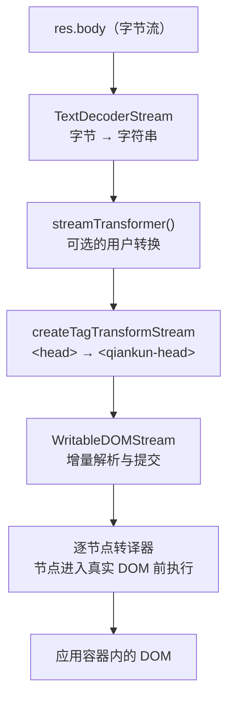

# HTML 入口流式加载原理

> 本页面向维护者说明流式加载器的实现细节。面向使用者的约定见 [HTML 入口](/zh-CN/concepts/html-entry-loading)。

qiankun 将微应用的 `index.html` 作为入口，通过流式解析、逐节点资源转换和增量 DOM 提交完成加载。主应用无需额外维护脚本和样式资源清单。本页介绍加载流程、入口 HTML 需要满足的约定及当前实现限制。

## HTML 入口

qiankun 中的 `entry` 是微应用 HTML 文档的 URL：

```ts
import { loadMicroApp } from 'qiankun';

const container = document.getElementById('subapp-container');
if (!container) throw new Error('subapp-container not found');

const microApp = loadMicroApp({
  name: 'app-react',
  entry: 'http://localhost:7101', // 微应用的 index.html
  container,
});
```

qiankun 将 HTML 文档作为微应用资源的唯一描述文件，并按照文档中的 `<script>`、`<link>` 和 `<style>` 声明加载资源，主应用无需同步维护 JavaScript 和 CSS 文件清单。新的页面会话或运行时缓存未命中时，qiankun 会从最新的 `index.html` 读取带哈希的资源文件名；同一页面内的重新挂载可能复用已缓存的入口和生命周期，因此不能指望通过重新挂载拿到新部署的版本。

`loadEntry(entry, container, opts)`（`packages/loader/src/index.ts`）负责处理 HTML 入口的全过程。它不会将资源直接插入主文档，而是在节点进入应用容器前交给沙箱和资源转译器处理。

## 流式加载的原因

浏览器在顶层导航中可以边接收 HTML 边解析和渲染，但传统的微应用加载通常先下载完整 HTML，再从字符串中提取脚本和样式，因此无法利用服务端的流式响应。

qiankun 3.0 之前的加载过程也是如此：完整下载 HTML 后，通过正则表达式提取 `<script>` 和 `<link>`，再逐项处理。v3 改用客户端流式处理，在接收 HTML 响应的同时转换节点并写入当前页面的 DOM，使首次加载和后续路由切换都可使用流式处理。

该实现主要带来两项改进：

- **缩短资源发现时间。** 外部脚本和样式一旦出现在当前数据块中，就可以开始处理，无需等待完整文档下载。解析方式也由正则表达式改为基于 `writable-dom` 的 DOM 遍历。
- **减少手动模拟浏览器行为。** 旧实现通过 `eval` 执行脚本，需要自行模拟 `<script>` 的 `load` 和 `error` 事件。v3 将转换后的脚本节点插入 DOM，由浏览器负责执行和事件派发。Classic 脚本使用 blob URL，模块脚本则由 [ESM 沙箱实现](/zh-CN/internals/esm-sandbox)处理。

::: tip 性能测试数据
在一项针对 500 KB HTML 的测试中，旧处理方式平均约需 500 ms，流式处理约需 300 ms，耗时降低约 40%。实际效果取决于文档结构、网络环境和浏览器实现。
:::

## 流式处理流程

qiankun 基于 `ReadableStream` 处理响应。网络字节到达后，HTML 会立即进入解析和 DOM 提交流程，而不是先缓冲为完整字符串。

获取 `res = await fetch(entry)` 后，响应体依次经过以下阶段：



`packages/loader/src/index.ts` 中的调用结构如下：

```ts
res.body
  .pipeThrough(new TextDecoderStream()) // 字节 → 字符串
  .pipeThrough(streamTransformer()) // 仅在提供转换器时执行
  .pipeThrough(createTagTransformStream(...)) // <head> → <qiankun-head>
  .pipeTo(
    new WritableDOMStream(container, null, (clone) => {
      /* 逐节点执行的钩子 */
    }),
  );
```

各阶段职责如下：

| 阶段 | 职责 |
| --- | --- |
| `TextDecoderStream` | 将原始字节解码为 UTF-8 字符串流 |
| `streamTransformer` | 可选的 `() => TransformStream<string, string>`，在解析前改写 HTML 文本，例如替换固定 URL；通过 [AppConfiguration](/zh-CN/api/configuration) 配置 |
| `createTagTransformStream` | 在字符串层执行标签改写，用于 [`<head>` 虚拟化](#head-virtualization) |
| `WritableDOMStream` | `writable-dom` 的项目分支（`packages/loader/src/writable-dom/`），负责增量解析 HTML；遇到同步脚本和样式表时阻塞以保持执行顺序，并在阻塞期间预加载其他资源 |

由于写入端按数据块提交内容，微应用 DOM 可以在整个 HTML 文档下载完成前开始构建。

### 逐节点转译

`WritableDOMStream` 的第三个参数是节点回调。每个节点从临时解析文档移入真实 DOM 前，加载器都会调用一次该回调。此时节点尚未激活，因此 `<script>` 不会提前执行，`<link>` 也不会向真实文档发起请求。

回调内部执行 `nodeTransformer(clone, transformerOpts)`。默认的 `defaultNodeTransformer` 将处理交给 `transpileAssets`，后者按标签类型分发：

- `SCRIPT` → `transpileScript`：Classic 脚本经包装后指向绑定沙箱作用域的 blob URL；模块脚本标记为 `data-esm="true"`，再交给 [ESM 沙箱实现](/zh-CN/internals/esm-sandbox)。
- `LINK` → `transpileLink`：启用[样式隔离](/zh-CN/concepts/style-isolation)时，改写外部样式表和预加载节点。
- `STYLE` → `transpileStyle`：仅在 `sandbox.styleIsolation` 开启时转换，否则保持原样。

也可以通过 [AppConfiguration](/zh-CN/api/configuration) 提供自定义 `nodeTransformer`。默认实现已经覆盖 `<script>`、`<link>` 和 `<style>` 节点。

## `<head>` 虚拟化 {#head-virtualization}

微应用运行时可能调用 `document.head.appendChild(...)` 注入样式或预加载代码分块。如果入口中的 `<head>` 直接映射到真实 `document.head`，这些节点会进入主应用的 `<head>`，并影响其他应用。

因此，qiankun 在构建 DOM 前先在字符串层改写 `<head>` 标签。`createTagTransformStream` 在 `packages/loader/src/index.ts` 中配置以下规则：

```ts
{ tag: '<head>',  alt: '<qiankun-head>' }
{ tag: '</head>', alt: '</qiankun-head>' }
```

微应用的 `<head>...</head>` 会转换为应用容器内的 `<qiankun-head>...</qiankun-head>` 自定义元素。标签名 `qiankun-head` 定义于 `packages/sandbox/src/consts.ts`。

随后，沙箱的动态追加（dynamic append）补丁将 `<qiankun-head>` 作为应用级虚拟 `<head>`。微应用向 `document.head` 追加节点时，补丁会将节点重定向到 `container.querySelector('qiankun-head')`（`packages/sandbox/src/patchers/dynamicAppend/common.ts`），而不是真实 `document.head`。这些节点因此被限制在应用容器中，并在卸载时随容器清理。

转换器会缓冲数据块，并对首次出现的标签执行 `String.prototype.replace`。如果数据块边界将 `<head>` 标签分割为两部分，转换器会保留缓冲内容，等待后续数据块补全；替换成功后再输出并清空缓冲区。

## `entry` 脚本约定

HTML 入口可能包含多个脚本，其中负责导出 `bootstrap`、`mount` 和 `unmount` 的脚本需要通过 `entry` 属性标识：

```html
<script src="/app.js" entry></script>
```

流式解析阶段会在 `packages/loader/src/index.ts` 中执行以下校验：

- **一份 HTML 只能包含一个 `entry` 脚本。** 如果第二个外部脚本也带有 `entry`，`loadEntry` 会抛出异常：

  > `QiankunError: You should not include more than 1 entry scripts in a single HTML entry`

- **只有外部脚本可以作为 `entry`。** 脚本必须包含 `src` 或 `data-src`；没有这些属性的内联脚本不能作为入口。

相关分类函数如下：

| 函数 | 判定条件 |
| --- | --- |
| `isExternalScript` | `tagName === 'SCRIPT'`，且包含 `src` 或 `data-src` |
| `isEntryScript` | 属于外部脚本，且包含 `entry` 属性 |
| `isDeferScript` | 属于外部脚本，且包含 `defer` 属性 |

通常无需手动添加 `entry`。[`@qiankunjs/bundler-plugin`](/zh-CN/ecosystem/bundler-plugin) 会为受支持的 Webpack 和 Vite 构建自动标记正确的入口脚本。

::: tip `entry` 属性的位置
Webpack UMD 构建会在 `runtime` 或 `main` 构建产物对应的脚本上添加 `entry`，Vite ESM 构建则在 `<script type="module">` 上添加该属性。两种情况均由插件处理，无需修改生成后的 `index.html`。
:::

### Classic 与 ESM 的入口处理

每个入口脚本根据自身类型进入相应流程：

- **Classic**（`<script src="..." entry>`，UMD／全局构建）：qiankun 为脚本绑定 `onload` 和 `onerror`。加载完成后，从沙箱中解析入口导出。
- **ESM**（`<script type="module" ... entry>`）：转译后添加 `data-esm="true"`，并移除 `src`，避免浏览器直接执行。脚本由 `EsmSandboxEngine` 处理，执行结果通过 `entryNamespacePromise` 返回。模块获取、改写和求值过程见 [ESM 沙箱实现](/zh-CN/internals/esm-sandbox)。

模块脚本不会在 HTML 流处理中执行。输入流结束后，qiankun 调用 `esmEngine.sealAndExecute()`，按文档顺序执行所有模块脚本。这与浏览器在文档解析完成后执行 `type="module"` 脚本的时机一致。

## `defer` 与阻塞期间预加载

`WritableDOMStream` 遇到同步脚本和样式表时会阻塞，以保证执行顺序。在等待当前资源时，它仍会预加载输入流中已发现的其他资源，避免网络连接空闲。

对于包含 `defer` 的外部脚本，加载器为每个脚本创建 `Deferred` 并加入 `prepareDeferredQueue` 维护的队列。入口 HTML 处理完成后，队列会依次完成这些 `Deferred`，以保持与浏览器原生 `defer` 语义一致。

## 应用导出解析

脚本执行完成后，两种执行方式通过不同来源返回生命周期对象：

- **Classic**：UMD 入口脚本将生命周期对象赋值给全局变量，例如 `window.<libraryName> = { bootstrap, mount, unmount }`。沙箱隔离膜使用 `latestSetProp` 记录脚本最后设置的全局属性。Classic 入口触发 `load` 事件时，`onEntryLoaded()` 以 `sandbox.globalThis[sandbox.latestSetProp]` 的值完成加载器 Promise。qiankun 会在调用应用自行注册的监听器前读取 `latestSetProp`，避免该值被后续写入覆盖。
- **ESM**：入口模块命名空间即生命周期导出的来源。引擎使用具名导出 `bootstrap`、`mount`、`unmount`，或 `export default { ... }`，以该模块命名空间完成 `entryNamespacePromise`。

如果输入流结束后没有找到显式 `entry` 脚本，加载器采用以下默认规则：

- 存在 ESM 模块脚本时，引擎优先选择第一个包含有效生命周期的已执行模块命名空间；如果没有符合条件的结果，再使用最后一个成功执行的模块。后一种回退适用于仅包含一个 `<script type="module" src="/src/main.ts">` 的常见 Vite `index.html`。
- 不存在 ESM 模块时，使用 Classic 执行方式记录的 `latestSetProp`。

随后，`getLifecyclesFromExports` 依次检查导出对象本身、`.default`、`latestSetProp` 对应的全局属性和 `window[appName]`。完整顺序见[生命周期解析原理](/zh-CN/internals/lifecycle-resolution)。

::: warning 空响应体
如果入口没有响应体，`loadEntry` 会抛出 `QiankunError: The response body of entry ... is empty`。空白响应或 HTTP 204 不能作为有效的微应用入口。
:::

### 增强后的 `fetch`

入口及转译器重新获取的所有资源均通过增强后的 `window.fetch`：

```ts
makeFetchCacheable(makeFetchRetryable(makeFetchThrowable(fetch)));
```

最内层的 `makeFetchThrowable` 在响应状态码不属于 `200–399` 时抛出异常；`makeFetchRetryable` 为当前封装后的 fetch 实例维护有限的重试额度；最外层的 `makeFetchCacheable` 负责同 URL 请求去重。可以通过 [AppConfiguration](/zh-CN/api/configuration) 的 `fetch` 选项替换底层实现，qiankun 仍会在其外部应用上述三层装饰器。

## 当前实现限制

- **`<head>` 仅进行首次出现的字符串替换。** `<head>` 到 `<qiankun-head>` 的转换通过一次 `String.prototype.replace` 完成。源码中的 `FIXME` 说明当前未处理不含 `<head>` 标签的非标准 HTML 数据块。标准构建产物不受影响，但非标准手写 HTML 可能无法完成 `<head>` 虚拟化。
- **尚未实现 `<body>` 虚拟化。** 源码中存在 `<body>` 到 `<qiankun-body>` 的转换代码，但当前已注释；`<head>` 与 `<body>` 的自动补全也未开启。只有 `<head>` 会被虚拟化，`<body>` 内容直接提交到应用容器。
- **`sandbox: false` 会停用部分导出解析。** `latestSetProp` 由沙箱隔离膜记录，ESM 引擎也仅在沙箱开启时创建。关闭沙箱后，两者均不可用，生命周期只能通过 `window[appName]` 兼容回退解析。详见 [JavaScript 沙箱实现](/zh-CN/internals/js-sandbox)。

## 延伸阅读

- [加载一个微应用实例](/zh-CN/concepts/architecture)：HTML 入口在整体运行模型中的位置。
- [JavaScript 隔离](/zh-CN/concepts/js-sandbox)与[原生 ESM 支持](/zh-CN/concepts/esm-sandbox)：两种脚本执行方式的公开行为。
- [微应用生命周期与 props](/zh-CN/concepts/lifecycle-and-props)：入口脚本需要导出的生命周期。
- [运行时编排原理](/zh-CN/internals/runtime-orchestration)：加载器在完整加载流程中的位置。
- [JavaScript 沙箱实现](/zh-CN/internals/js-sandbox)：`latestSetProp` 与动态 `<head>` 节点的作用域处理。
- [ESM 沙箱实现](/zh-CN/internals/esm-sandbox)：`type="module"` 入口的获取、改写和执行。
- [样式隔离实现](/zh-CN/internals/style-isolation)：流式加载中 `<link>` 和 `<style>` 节点的转换。
- [生命周期解析原理](/zh-CN/internals/lifecycle-resolution)：入口导出的解析规则。
- [`@qiankunjs/bundler-plugin`](/zh-CN/ecosystem/bundler-plugin)：构建阶段的入口脚本标记。
