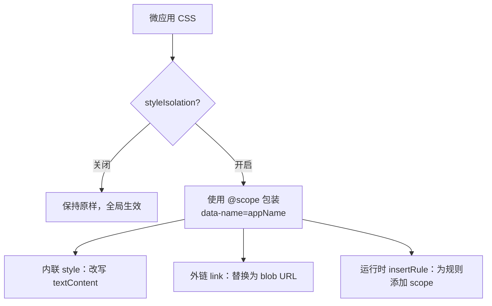

# 样式隔离实现

> 本页面向维护者说明样式改写的实现细节。面向使用者的行为与限制见[样式隔离](/zh-CN/concepts/style-isolation)。

样式隔离用于限制微应用 CSS 的作用范围，防止其影响主应用或其他微应用。qiankun v3 提供按应用启用的运行时隔离机制，底层使用浏览器原生的 CSS [`@scope`](https://developer.mozilla.org/en-US/docs/Web/CSS/@scope) 规则，而非 Shadow DOM。启用后，qiankun 会改写微应用引入的样式表，使其中的规则仅在当前应用容器内生效。

配置方式见 [AppConfiguration](/zh-CN/api/configuration) 和[启用 CSS 样式隔离](/zh-CN/cookbook/enable-style-isolation)。

## 基本机制

为应用设置 `sandbox: { styleIsolation: true }` 后，qiankun 会将该应用的 CSS 包装在与应用容器绑定的 `@scope` 块中：

```css
@scope ([data-name="your-app"]) {
  /* 经过改写的应用样式规则 */
}
```

作用域根节点固定为 `[data-name="<appName>"]`。qiankun 会在应用容器上设置 `data-name` 属性，并根据应用名生成选择器；当前不支持自定义作用域根节点。

隔离发生在 CSS 转换阶段，应用 DOM 仍位于主文档中，而不是 Shadow DOM。全局库、Portal 和 `document` 查询仍按 [JavaScript 隔离](/zh-CN/concepts/js-sandbox)中的规则运行。该机制仅限制微应用 CSS 向容器外部生效，不阻止主应用样式或浏览器默认样式影响微应用。



样式隔离默认关闭。未设置 `sandbox.styleIsolation` 时，`<style>` 和 `<link>` 节点不经过作用域改写。

## 内联 `<style>`

处理内联 `<style>` 时，qiankun 读取元素的 `textContent`，完成转换后再将结果写回原节点。除添加 `@scope` 外，转换还会执行以下处理：

- **将 `@font-face` 和 `@namespace` 移到 `@scope` 外部。** `@font-face` 位于作用域内时会导致字体加载失败，`@namespace` 则必须在文档级声明，因此两者保留在样式表顶部并全局生效。
- **重命名 `@keyframes`。** qiankun 为关键帧名称添加应用级前缀 `__qk_<appName>_<name>`，并同步改写 `animation` 和 `animation-name` 中的引用，避免不同应用使用同名关键帧。CSS `@scope` 只能限制选择器，无法隔离全局关键帧名称。
- **不重新解析 `url(...)` 中的相对路径。** 当前内联样式处理不会向转换器传入样式表的基准 URL。主应用与微应用的文档基准不同时，应使用绝对 URL、`data:` URL 或 `blob:` URL。
- **递归内联 `@import`。** 导入的样式表通过应用增强后的 `fetch` 获取，执行相同转换后内联，并使用已访问集合避免重复处理。内联样式中的导入地址不会相对微应用入口解析，因此应使用绝对 URL。

由于内联 `@import` 可能产生网络请求，qiankun 会先同步清空 `<style>` 的 `textContent`，等待转换完成后再写入已限定作用域的 CSS，避免未隔离的原始样式在请求期间短暂生效。

## 外部 `<link rel="stylesheet">`

浏览器原生加载外部样式表时，无法在收到响应后添加 `@scope`。因此，启用样式隔离后，qiankun 会阻止 `<link>` 发起原生请求，并改用 blob URL 加载样式：

1. 以基准 URL 解析 `href`，移除 `href` 属性，并将原始值保存在 `data-href` 中。浏览器因此不会加载未经隔离的样式表。
2. 使用应用增强后的 `fetch` 获取 CSS，并执行与内联样式相同的 `@scope` 转换。
3. 根据转换结果创建 `Blob`，再将对应的对象 URL 设置为原 `<link>` 元素的 `href`。

与内联样式不同，外链样式转换会将解析后的样式表 URL 作为基准地址传入。因此，`url(...)` 和 `@import` 中的相对地址会先相对外链样式表 URL 解析，再写入限定作用域后的 CSS。

该过程只替换 `href`，不会替换 `<link>` 节点，因此 `media`、`disabled`、`title`、`document.styleSheets` 条目以及 `onload`、`onerror` 等原生行为仍然有效。流式加载器也会继续将该节点视为待加载样式表，并在 blob URL 设置完成后接收 `load` 事件。

如果 CSS 获取或转换失败，qiankun 不会设置 blob `href`，而是在当前 `<link>` 上主动派发 `error` 事件并丢弃该样式表。此策略可以避免无法转换的 CSS 以全局样式形式加载。

转换结果先按 URL、再按应用作用域键缓存；对同一 URL 的并发请求也会去重。因此，多个应用共享同一外部样式表时，每个作用域根节点只需执行一次获取和转换。

## 运行时 CSSOM

通过 JavaScript 在运行时插入的样式不会经过 HTML 加载器，因此 qiankun 会在 CSSOM 层进行拦截。存在已启用样式隔离的应用时，`CSSStyleSheet.prototype.insertRule` 会安装带引用计数的补丁；最后一个此类应用卸载后，补丁会被移除。

如果样式表所属节点启用了隔离，传入 `insertRule` 的规则会先经过作用域包装和关键帧重命名，再交给原生实现。同步转换会跳过已经包含 `@scope` 的规则，并保持 `@font-face` 和 `@namespace` 全局生效。该机制适用于在运行时构造样式表的 CSS-in-JS 库和框架。

## 预加载改写

`<link rel="preload" as="style">` 预加载的响应只能被浏览器原生的样式请求复用；启用样式隔离后，样式表改由转译器通过 `fetch()` 获取，原有预加载会被浪费。因此，qiankun 会将其改写为 `as="fetch"`，并在未使用 `use-credentials` 时设置 `crossorigin="anonymous"`，使后续 `fetch()` 请求可以复用预加载响应。

启用 [ESM 沙箱](/zh-CN/concepts/esm-sandbox)后，还会执行另一个独立流程：qiankun 将 `rel="modulepreload"` 改写为 `rel="preload" as="fetch"`。ESM 引擎执行改写后的 blob URL，而不是原始模块 URL，因此该转换与样式隔离无关；节点的 `crossorigin` 设置会保留原有的模块预加载凭据语义。

## 要求与限制

::: warning 依赖原生 CSS `@scope`
该实现不包含兼容实现（polyfill）或降级方案，完全依赖浏览器对 CSS `@scope` 的原生支持。不支持 `@scope` 的浏览器无法实现样式隔离。启用前应确认目标浏览器范围。
:::

::: warning 外部样式表必须支持 CORS
外部样式表需要通过 `fetch` 获取并以 blob URL 加载，因此跨域样式表必须返回正确的 CORS 响应头。如果请求失败，qiankun 会丢弃样式表并输出控制台警告，不会以未隔离形式加载。微应用服务器必须为相关样式资源配置 CORS。
:::

::: info 已知限制
- **`@font-face` 冲突。** `@font-face` 需要保持全局生效，因此不同应用使用相同 `font-family` 名称时仍可能冲突。建议为每个应用使用不同的字体名称。
- **动态生成的关键帧名称。** 关键帧重命名属于静态文本转换。通过 JavaScript 字符串动态生成的动画名称不会同步改写，可能无法匹配转换后的关键帧。
:::

::: tip 与 qiankun 2.x 的区别
v3 使用本页所述的 `@scope` 与 blob URL 机制，并由单个布尔选项控制。2.x 中基于 Shadow DOM 的 `sandbox.strictStyleIsolation` 和 `sandbox.experimentalStyleIsolation` 已被移除，v3 仅提供 `sandbox.styleIsolation`。详见[从 qiankun 2.x 迁移](/zh-CN/cookbook/migrate-from-2x)。
:::

## 公开配置

| 选项 | 类型 | 默认值 | 说明 |
| --- | --- | --- | --- |
| `sandbox.styleIsolation` | `boolean` | `false` | 使用 `@scope` 开启运行时 CSS 隔离，将微应用样式限定在其容器（`[data-name="<appName>"]`）内 |

`styleIsolation` 按应用设置，位于应用配置的 `sandbox` 对象内。使用 [`loadMicroApp`](/zh-CN/api/load-micro-app) 时，将其作为第二个参数传入：

```ts
import { loadMicroApp } from 'qiankun';

const container = document.getElementById('subapp-viewport');
if (!container) throw new Error('subapp-viewport not found');

const microApp = loadMicroApp(
  {
    name: 'react-app',
    entry: '//localhost:7101',
    container,
  },
  {
    sandbox: { styleIsolation: true },
  },
);
```

完整字段见 [AppConfiguration](/zh-CN/api/configuration)，操作步骤见[启用 CSS 样式隔离](/zh-CN/cookbook/enable-style-isolation)。
