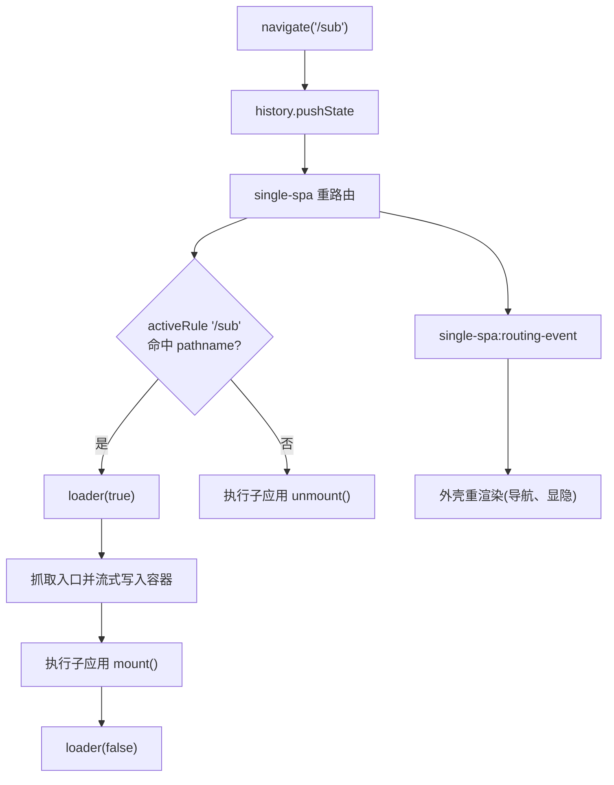

# 第二步 —— 搭建主应用

[第一步](/zh-CN/tutorial/build-the-micro-app)里，你已经把一个微应用跑在了 `//localhost:7100` 上。这一步来搭**主应用**(也就是基座、外壳):一个普通的 Vite 应用，负责注册微应用、根据 URL 决定它什么时候激活，并把它渲染进一个由主应用自己掌管的容器里。

这一页写完，你会得到一个这样的基座：

- 用 [`registerMicroApps`](/zh-CN/api/register-micro-apps) 注册微应用，再用 [`start`](/zh-CN/api/start) 启动 qiankun;
- 独占一个常驻的容器元素，微应用就挂载到它里面；
- 用几行手写的路由，靠 URL 驱动微应用的挂载和卸载；
- 微应用抓取、挂载的过程中，显示一个加载提示。

::: info 基座不是微应用
主应用就是一个普通应用。它**不用** `@qiankunjs/bundler-plugin`,HTML 入口的 script 标签上也**没有** `entry` 属性——那个属性只属于会被 qiankun 加载的应用。子应用这一侧的准备工作见 [让 Vite 应用接入 qiankun](/zh-CN/cookbook/prepare-a-vite-app)。
:::

## 建一个基座 Vite 应用

照常起一个 React + Vite 应用。需要的插件跟你平时写 Vite 应用没有任何区别。

::: code-group

```bash [terminal]
npm create vite@latest main -- --template react-ts
cd main
npm install qiankun
```

```ts [main/vite.config.ts]
import react from '@vitejs/plugin-react';
import { defineConfig } from 'vite';

export default defineConfig({
  // plain react() — no qiankun bundler plugin, the host is not a micro-app
  plugins: [react()],
  server: {
    port: 7099,
    strictPort: true,
  },
});
```

:::

HTML 入口就是标准的 Vite SPA 入口。注意 script 标签上没有 `entry` 属性。

```html [main/index.html]
<!doctype html>
<html lang="en">
  <head>
    <meta charset="UTF-8" />
    <title>qiankun host</title>
  </head>
  <body>
    <div id="root"></div>
    <!-- a normal SPA entry: no `entry` attribute here -->
    <script type="module" src="/src/main.tsx"></script>
  </body>
</html>
```

## 注册微应用

注册是基座的核心。给 [`registerMicroApps`](/zh-CN/api/register-micro-apps) 传一份数组，每个微应用一项，然后调用 [`start`](/zh-CN/api/start) 一次，只调一次。

```ts [main/src/register.ts]
import { registerMicroApps, start } from 'qiankun';

let registered = false;

export function registerAll(
  container: HTMLElement,
  onLoading: (name: string, loading: boolean) => void,
): void {
  // guard against double-invoke — React StrictMode runs effects twice in dev
  if (registered) return;
  registered = true;

  registerMicroApps([
    {
      name: 'react', // must match the window global the sub-app exposes
      entry: '//localhost:7100', // the sub-app dev server root (its index.html)
      container, // the persistent host element captured at registration time
      activeRule: '/sub', // qiankun mounts this app while the path starts with /sub
      loader: (loading) => onLoading('react', loading),
      configuration: {
        sandbox: true, // Proxy-membrane JS sandbox (default true)
        styleIsolation: true, // runtime CSS @scope isolation (default false)
      },
    },
  ]);

  start();
}
```

数组里的每一项都是一个 `RegistrableApp`。这里用到的字段：

| 字段 | 类型 | 说明 |
| --- | --- | --- |
| `name` | `string` | 应用的唯一名字。必须和子应用暴露的 window 全局 / library 名字一致(见下文)。 |
| `entry` | `string` | 子应用 HTML 入口的地址。v3 里就是个普通字符串——永远是一个 HTML 地址。 |
| `container` | `HTMLElement` | 应用挂载进去的 DOM 元素。是元素实例本身，不是选择器。 |
| `activeRule` | `string \| fn \| Array` | single-spa 的激活规则。命中 `location.pathname` 时应用挂载，否则卸载。 |
| `loader` | `(loading: boolean) => void` | 挂载前传 `true`、挂载后传 `false`——加载 UI 在这里驱动。 |
| `configuration` | `AppConfiguration` | 每个应用各自的配置。见 [AppConfiguration](/zh-CN/api/configuration)。 |

::: tip v3 的配置是按应用维度走的
qiankun 3.0 里没有通过 `start()` 传的全局配置。`start` 只收 `{ urlRerouteOnly? }`(single-spa 的选项)。其余的一切——`sandbox`、`styleIsolation`、`fetch`、`globalContext`、`nodeTransformer`、`streamTransformer`——都挂在每个应用各自的 `configuration` 对象上。完整清单见 [AppConfiguration](/zh-CN/api/configuration)。
:::

### 为什么 `name` 必须和子应用的全局对上

qiankun 加载完一个经典(UMD/全局)微应用后，要去找它的生命周期函数。这个查找的最后一道兜底就是 `window[name]`——以注册时的 `name` 为键取全局。所以一旦对不上，qiankun 就找不到 `bootstrap`/`mount`/`unmount`，直接抛错。

具体说，如果你注册的是 `name: 'react'`，那子应用就得把生命周期挂成 `window['react']`(经典路径)，或者从它的 ESM 入口模块里导出。如果你的打包工具设了 library 名字——比如 `@qiankunjs/bundler-plugin` 给 Webpack 生成的是 `output.library = { name: 'webpack-app', type: 'window' }`——那注册的 `name` 就必须等于这个 library 名字(`'webpack-app'`)，它常常和路由不是一回事。

::: warning `name` 是应用身份，不是路由
`name` 和 `activeRule` 各管各的。一个叫 `webpack-app` 的应用在 `/webpack` 上激活，完全没问题。`name` 要跟子应用的全局对齐，URL 的事交给 `activeRule`。
:::

## 提供一个常驻的容器

qiankun 在注册那一刻就把 `container` 的**元素引用**记下了，之后这个应用每次挂载、卸载都复用同一个元素。这带来一条硬规矩。

::: danger 容器绝对不能被卸载，也不能加 key
把容器 `<div>` 渲染一次，让它在基座的整个生命周期里一直待在 DOM 里。别条件渲染它，别把它塞进某条路由后面，也别给它一个会变的 React `key`——这几种做法任意一个都会把元素换成新的一个，而 qiankun 还在往那个已经脱离文档、失效的旧节点里写东西。表现出来就是：微应用"挂载"了，却永远不显示。
:::

用 ref 捕获这个元素，等它真进了 DOM 再去注册。

```tsx [main/src/App.tsx]
import { useEffect, useRef, useState } from 'react';
import { registerAll } from './register';
import { usePathname } from './router';

export default function App() {
  const pathname = usePathname();
  const containerRef = useRef<HTMLDivElement>(null);
  const [loading, setLoading] = useState(false);

  // register once the container exists; registerAll self-guards, so
  // StrictMode's double effect is harmless
  useEffect(() => {
    if (containerRef.current) {
      registerAll(containerRef.current, (_name, isLoading) => setLoading(isLoading));
    }
  }, []);

  const onSub = pathname.startsWith('/sub');

  return (
    <div>
      <nav>{/* navigation goes here — see below */}</nav>

      {/* the container stays mounted forever — qiankun holds this exact element */}
      <div ref={containerRef} id="subapp-container" hidden={!onSub} />

      {loading && <p>loading micro-app…</p>}
      {!onSub && <p>Pick a micro-app from the nav.</p>}
    </div>
  );
}
```

::: tip 藏起来，别删掉
没有微应用激活时，你可以把容器藏起来(`hidden`、`display: none`、高度设为零)，但不能把它从树里移除。藏起来元素引用还在；删掉了，下一次挂载就废了。
:::

## 接上路由

qiankun 建在 [single-spa](https://github.com/single-spa/single-spa) 上：URL 一变，single-spa 就重新核对每个应用的 `activeRule`，该挂的挂、该卸的卸。这件事用不着路由库，只要两样东西：

1. 一个**改** URL 的办法(`history.pushState`)，以及
2. 一个**响应** URL 变化的办法，好让你自己的外壳 UI(当前高亮的导航项、容器的显隐)跟着同步。

第二样，同时监听 `popstate`(浏览器前进 / 后退)和 `single-spa:routing-event`(single-spa 每次重路由后都会派发，包括 `pushState` 触发的那些)。

```ts [main/src/router.ts]
import { useSyncExternalStore } from 'react';

// single-spa patches pushState and emits its routing event after each reroute;
// listening to both keeps the shell in sync with every navigation
function subscribe(callback: () => void) {
  window.addEventListener('popstate', callback);
  window.addEventListener('single-spa:routing-event', callback);
  return () => {
    window.removeEventListener('popstate', callback);
    window.removeEventListener('single-spa:routing-event', callback);
  };
}

export function usePathname(): string {
  return useSyncExternalStore(subscribe, () => window.location.pathname);
}

export function navigate(path: string): void {
  if (window.location.pathname !== path) {
    window.history.pushState(null, '', path);
  }
}
```

跳转就只是一次 `pushState`，剩下的 qiankun 全包了。

```tsx [main/src/App.tsx (nav)]
import { navigate } from './router';

// inside <nav>:
<button type="button" onClick={() => navigate('/sub')}>
  Open micro-app
</button>
<button type="button" onClick={() => navigate('/')}>
  Home
</button>
```

点 **Open micro-app** 会 push 一个 `/sub`,single-spa 发现 `activeRule: '/sub'` 现在命中了，就把应用挂进你的容器。点 **Home** 会 push 一个 `/`，规则不再命中，single-spa 就把应用卸载，并跑它的 `unmount` 生命周期。

整条链路是这样：



## 驱动加载 UI

每个注册的应用都能带一个 `loader` 回调。qiankun 会在挂载前紧接着调它并传 `true`，挂载 resolve 后传 `false`，所以它天然就是接 spinner 或骨架屏的地方。你在 `register.ts` 里已经把它接好了，基座这边只要把这个信号变成 UI 就行。

```tsx [main/src/App.tsx (loading)]
// onLoading was passed into registerAll and stored in state:
const [loading, setLoading] = useState(false);

useEffect(() => {
  if (containerRef.current) {
    registerAll(containerRef.current, (_name, isLoading) => setLoading(isLoading));
  }
}, []);

// …later in the render:
{loading && <p>loading micro-app…</p>}
```

微应用不止一个时，按 `name` 给加载状态分键，让每个应用显示各自的提示：

```tsx
const [loadingApps, setLoadingApps] = useState<Record<string, boolean>>({});

registerAll(containerRef.current, (name, isLoading) => {
  setLoadingApps((prev) => (prev[name] === isLoading ? prev : { ...prev, [name]: isLoading }));
});
```

::: tip 看看 qiankun 往容器上写了什么
应用挂载时，qiankun 会在它的容器上打一些 data 属性，拿来做诊断很方便：`data-name`(应用名)、`data-version`(qiankun 版本)、`data-sandbox-cfg`(序列化后的沙箱配置)。想在外壳里做个状态徽标，用它们正合适。
:::

## 启动基座

照常渲染 `App`。入口文件里不用写任何 qiankun 相关的接线——注册发生在 `App` 的 effect 里。

```tsx [main/src/main.tsx]
import { StrictMode } from 'react';
import { createRoot } from 'react-dom/client';
import App from './App';

createRoot(document.getElementById('root')!).render(
  <StrictMode>
    <App />
  </StrictMode>,
);
```

`registerAll` 用 `registered` 标志给自己上了闩，所以 StrictMode 故意把 effect 跑两遍，也不会把应用重复注册、或者把 `start()` 调两次。`start()` 本身是幂等的，不过把注册也拦在一道闸后面，是更干净的写法。

## 小结

- 基座就是个普通 Vite 应用——不用 bundler 插件，script 上也没有 `entry` 属性。
- `registerMicroApps([...])` 声明每个应用；`start()` 跑一次把它们激活。
- 容器元素在注册时被捕获，必须一直活着——别加 key，别卸载。
- `name` 必须和子应用暴露的全局 / library 名字对上；`activeRule` 用 URL 驱动挂载和卸载。
- 路由就是 `history.pushState` 加上对 `popstate` 和 `single-spa:routing-event` 的监听。
- `loader(loading)` 把挂载 / 卸载的信号给你，拿去做加载提示。

接下来，[第三步 —— 连起来、跑起来、验证](/zh-CN/tutorial/run-and-verify) 会把两个 dev server 都启动，确认微应用能挂载、能卸载，并且稳稳待在沙箱里保持隔离。
