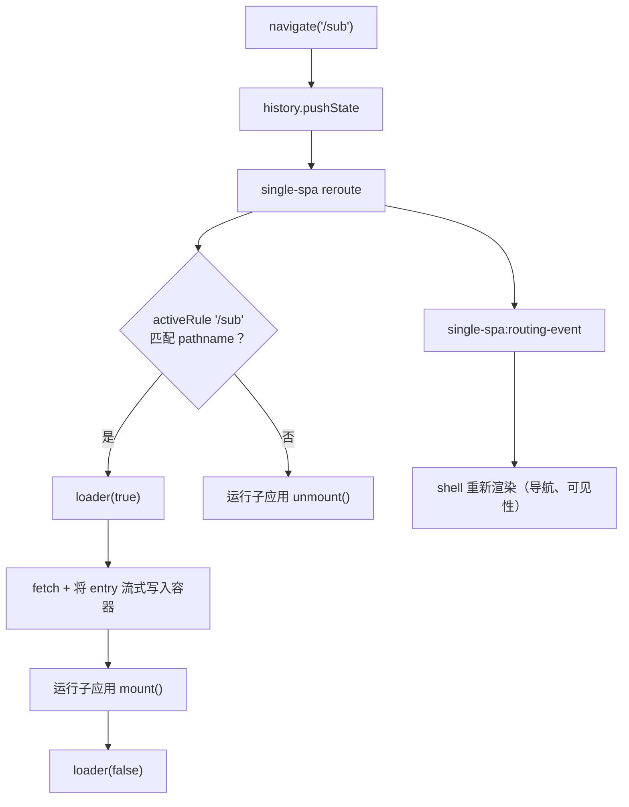

# 第 2 步 — 构建主应用

在[第 1 步](/zh-CN/tutorial/build-the-micro-app)中，你已经在 `//localhost:7100` 上暴露了一个微应用。现在你将构建**主应用**（即宿主，也称为 shell）：一个普通的 Vite 应用，它注册微应用，根据 URL 决定微应用何时激活，并把它渲染进一个由自己持有的容器中。

读完本页后，你将拥有一个具备以下能力的宿主应用：

- 通过 [`registerMicroApps`](/zh-CN/api/register-micro-apps) 注册微应用，并通过 [`start`](/zh-CN/api/start) 启动 qiankun；
- 持有一个供微应用挂载的、持久存在的容器元素；
- 用寥寥数行手写的路由逻辑，根据 URL 驱动 mount/unmount；
- 在微应用被拉取和挂载期间显示一个加载指示器。

::: info 宿主不是微应用
主应用是一个普通应用。它**不**使用 `@qiankunjs/bundler-plugin`，其 HTML 入口脚本也**不**带 `entry` 属性——该属性只用于那些将被 qiankun 加载的应用。子应用一侧的做法请参见[让 Vite 应用支持 qiankun](/zh-CN/cookbook/prepare-a-vite-app)。
:::

## 创建宿主 Vite 应用

搭建一个普通的 React + Vite 应用。它所需的插件，就是你在任何 Vite 应用中都会用到的那些。

::: code-group

```bash [terminal]
npm create vite@latest main -- --template react-ts
cd main
npm install qiankun
```

```ts [main/vite.config.ts]
import react from '@vitejs/plugin-react';
import { defineConfig } from 'vite';

export default defineConfig({
  // plain react() — no qiankun bundler plugin, the host is not a micro-app
  plugins: [react()],
  server: {
    port: 7099,
    strictPort: true,
  },
});
```

:::

HTML 入口就是标准的 Vite SPA 入口。注意 script 标签上没有 `entry` 属性。

```html [main/index.html]
<!doctype html>
<html lang="en">
  <head>
    <meta charset="UTF-8" />
    <title>qiankun host</title>
  </head>
  <body>
    <div id="root"></div>
    <!-- a normal SPA entry: no `entry` attribute here -->
    <script type="module" src="/src/main.tsx"></script>
  </body>
</html>
```

## 注册微应用

注册是宿主的核心。调用 [`registerMicroApps`](/zh-CN/api/register-micro-apps)，为每个微应用传入一项配置，然后恰好调用一次 [`start`](/zh-CN/api/start)。

```ts [main/src/register.ts]
import { registerMicroApps, start } from 'qiankun';

let registered = false;

export function registerAll(
  container: HTMLElement,
  onLoading: (name: string, loading: boolean) => void,
): void {
  // guard against double-invoke — React StrictMode runs effects twice in dev
  if (registered) return;
  registered = true;

  registerMicroApps([
    {
      name: 'react', // must match the window global the sub-app exposes
      entry: '//localhost:7100', // the sub-app dev server root (its index.html)
      container, // the persistent host element captured at registration time
      activeRule: '/sub', // qiankun mounts this app while the path starts with /sub
      loader: (loading) => onLoading('react', loading),
      configuration: {
        sandbox: true, // Proxy-membrane JS sandbox (default true)
        styleIsolation: true, // runtime CSS @scope isolation (default false)
      },
    },
  ]);

  start();
}
```

数组中的每一项都是一个 `RegistrableApp`。这里用到的字段如下：

| 字段 | 类型 | 说明 |
| --- | --- | --- |
| `name` | `string` | 唯一的应用名。必须与子应用暴露的 window 全局变量 / 库名一致（见下文）。 |
| `entry` | `string` | 子应用 HTML 入口的 URL。在 v3 中是一个普通字符串——始终为一个 HTML URL。 |
| `container` | `HTMLElement` | 应用挂载进的 DOM 元素。是元素实例，而非选择器。 |
| `activeRule` | `string \| fn \| Array` | single-spa 的激活规则。当它匹配 `location.pathname` 时，应用挂载；否则卸载。 |
| `loader` | `(loading: boolean) => void` | 挂载前以 `true` 调用、挂载后以 `false` 调用——在这里驱动你的加载 UI。 |
| `configuration` | `AppConfiguration` | 单个应用的选项。参见 [AppConfiguration](/zh-CN/api/configuration)。 |

::: tip v3 中 configuration 是按应用维度配置的
在 qiankun 3.0 中，不存在通过 `start()` 传入的全局配置。`start` 只接受 `{ urlRerouteOnly? }`（single-spa 的选项）。其他一切——`sandbox`、`styleIsolation`、`fetch`、`globalContext`、`nodeTransformer`、`streamTransformer`——都放在每个应用各自的 `configuration` 对象上。完整选项集记录在 [AppConfiguration](/zh-CN/api/configuration) 中。
:::

### 为什么 `name` 必须与子应用的全局变量一致

当 qiankun 加载完一个经典（UMD/全局）微应用后，它会去发现该应用的 lifecycle 函数。这个查找过程的最后一道兜底是 `window[name]`——即以注册的 `name` 为键的全局变量。因此一旦不匹配，qiankun 就找不到 `bootstrap`/`mount`/`unmount`，从而抛出错误。

具体来说，如果你注册的是 `name: 'react'`，那么子应用就必须把它的 lifecycle 暴露为 `window['react']`（用于经典路径），或从它的 ESM 入口模块中导出它们。如果你的 bundler 设置了库名——例如 `@qiankunjs/bundler-plugin` 为 Webpack 生成 `output.library = { name: 'webpack-app', type: 'window' }`——那么注册的 `name` 就必须等于那个库名（`'webpack-app'`），而它往往与路由不同。

::: warning `name` 是应用身份，而非路由
`name` 与 `activeRule` 是相互独立的。一个名为 `webpack-app` 的应用在 `/webpack` 上激活是完全合理的。让 `name` 与子应用的全局变量保持一致；用 `activeRule` 来对应 URL。
:::

## 提供一个持久的容器

qiankun 会在注册时捕获 `container` 的**元素引用**，并在该应用每一次 mount 和 unmount 时复用它。这引出了一条硬性规则。

::: danger 容器绝不能被卸载或加 key
一次性渲染出单个容器 `<div>`，并让它在宿主的整个生命周期内一直留在 DOM 中。不要条件式地渲染它，不要把它放在某个路由后面，也不要给它一个会变化的 React `key`——上述任何一种做法都会把该元素替换成一个新元素，而 qiankun 会继续往那个陈旧的、已脱离文档的节点里写内容。可见的症状就是：微应用"挂载了"却始终不显示。
:::

用一个 ref 来捕获该元素，并且只在它已存在于 DOM 中之后才进行注册。

```tsx [main/src/App.tsx]
import { useEffect, useRef, useState } from 'react';
import { registerAll } from './register';
import { usePathname } from './router';

export default function App() {
  const pathname = usePathname();
  const containerRef = useRef<HTMLDivElement>(null);
  const [loading, setLoading] = useState(false);

  // register once the container exists; registerAll self-guards, so
  // StrictMode's double effect is harmless
  useEffect(() => {
    if (containerRef.current) {
      registerAll(containerRef.current, (_name, isLoading) => setLoading(isLoading));
    }
  }, []);

  const onSub = pathname.startsWith('/sub');

  return (
    <div>
      <nav>{/* navigation goes here — see below */}</nav>

      {/* the container stays mounted forever — qiankun holds this exact element */}
      <div ref={containerRef} id="subapp-container" hidden={!onSub} />

      {loading && <p>loading micro-app…</p>}
      {!onSub && <p>Pick a micro-app from the nav.</p>}
    </div>
  );
}
```

::: tip 隐藏，而不是移除
当没有微应用激活时，你可以隐藏容器（`hidden`、`display: none`、零高度），但绝不能把它从树中移除。隐藏能让同一个元素引用保持存活；移除它则会破坏下一次 mount。
:::

## 接通路由

qiankun 构建于 [single-spa](https://github.com/single-spa/single-spa) 之上：当 URL 变化时，single-spa 会重新评估每个应用的 `activeRule`，并相应地 mount 或 unmount。为此你并不需要一个路由库——你只需要两样东西：

1. 一种**改变** URL 的方式（`history.pushState`），以及
2. 一种**响应** URL 变化的方式，好让你自己的 shell UI（当前激活的导航项、容器的可见性）保持同步。

对于第二点，同时监听 `popstate`（浏览器前进/后退）和 `single-spa:routing-event`（single-spa 在每次 reroute 之后发出，包括由 `pushState` 触发的那些）。

```ts [main/src/router.ts]
import { useSyncExternalStore } from 'react';

// single-spa patches pushState and emits its routing event after each reroute;
// listening to both keeps the shell in sync with every navigation
function subscribe(callback: () => void) {
  window.addEventListener('popstate', callback);
  window.addEventListener('single-spa:routing-event', callback);
  return () => {
    window.removeEventListener('popstate', callback);
    window.removeEventListener('single-spa:routing-event', callback);
  };
}

export function usePathname(): string {
  return useSyncExternalStore(subscribe, () => window.location.pathname);
}

export function navigate(path: string): void {
  if (window.location.pathname !== path) {
    window.history.pushState(null, '', path);
  }
}
```

于是，导航就只是一次 `pushState`；剩下的交给 qiankun。

```tsx [main/src/App.tsx (nav)]
import { navigate } from './router';

// inside <nav>:
<button type="button" onClick={() => navigate('/sub')}>
  Open micro-app
</button>
<button type="button" onClick={() => navigate('/')}>
  Home
</button>
```

点击 **Open micro-app** 会 push `/sub`，single-spa 发现 `activeRule: '/sub'` 现在匹配了，于是把应用挂载进你的容器。点击 **Home** 会 push `/`，规则不再匹配，single-spa 便卸载该应用并运行它的 `unmount` lifecycle。

端到端的流程：



## 驱动加载 UI

每个注册的应用都可以接收一个 `loader` 回调。qiankun 在挂载之前立即以 `true` 调用它，在 mount 完成后以 `false` 调用它，因此它是给 spinner 或骨架屏挂钩的天然位置。你已经在 `register.ts` 里接好了它；宿主只需把这个信号转换成 UI。

```tsx [main/src/App.tsx (loading)]
// onLoading was passed into registerAll and stored in state:
const [loading, setLoading] = useState(false);

useEffect(() => {
  if (containerRef.current) {
    registerAll(containerRef.current, (_name, isLoading) => setLoading(isLoading));
  }
}, []);

// …later in the render:
{loading && <p>loading micro-app…</p>}
```

当有多个微应用时，用 `name` 作为 loading 状态的键，好让每个应用显示各自的指示器：

```tsx
const [loadingApps, setLoadingApps] = useState<Record<string, boolean>>({});

registerAll(containerRef.current, (name, isLoading) => {
  setLoadingApps((prev) => (prev[name] === isLoading ? prev : { ...prev, [name]: isLoading }));
});
```

::: tip 查看 qiankun 往容器上写入了什么
当一个应用挂载时，qiankun 会在它的容器上打上一些可供诊断读取的 data 属性：`data-name`（应用名）、`data-version`（qiankun 版本）以及 `data-sandbox-cfg`（序列化后的 sandbox 配置）。它们很适合用来在 shell 里搭建一个状态徽标。
:::

## 启动宿主

像往常一样渲染 `App`。入口文件里不需要任何 qiankun 特有的接线——注册发生在 `App` 的 effect 内部。

```tsx [main/src/main.tsx]
import { StrictMode } from 'react';
import { createRoot } from 'react-dom/client';
import App from './App';

createRoot(document.getElementById('root')!).render(
  <StrictMode>
    <App />
  </StrictMode>,
);
```

由于 `registerAll` 用 `registered` 标志给自己加了防护，StrictMode 对 effect 有意为之的双次调用不会把应用注册两次，也不会把 `start()` 调用两次。`start()` 本身是幂等的，但把注册收拢在单一防护之后是更干净的模式。

## 小结

- 宿主是一个普通的 Vite 应用——没有 bundler 插件，其 script 上也没有 `entry` 属性。
- `registerMicroApps([...])` 声明每个应用；`start()` 运行一次以激活它们。
- 一个容器元素在注册时被捕获，并且必须永久存活——绝不加 key，绝不卸载。
- `name` 必须与子应用暴露的全局变量 / 库名一致；`activeRule` 根据 URL 驱动 mount/unmount。
- 路由就是 `history.pushState` 加上对 `popstate` 和 `single-spa:routing-event` 的监听。
- `loader(loading)` 给你提供 mount/unmount 信号，用于加载指示器。

接下来，[第 3 步 — 连接、运行并验证](/zh-CN/tutorial/run-and-verify) 会同时启动两个 dev server，并确认微应用能够挂载、卸载，并在 sandbox 内保持隔离。
