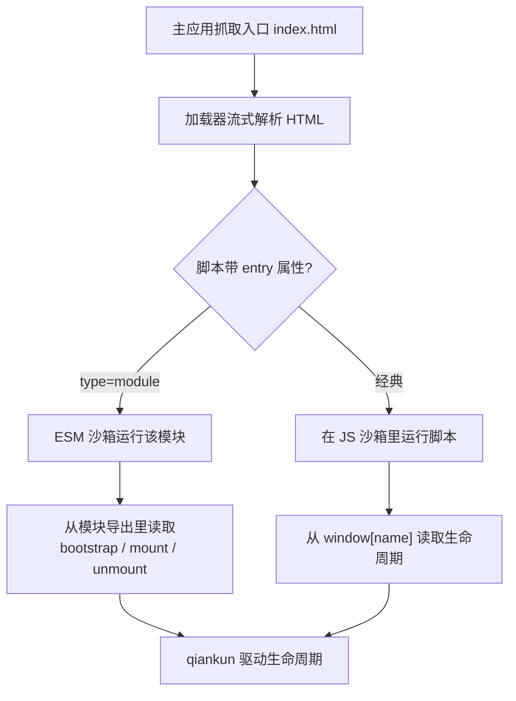

# 第一步 —— 搭一个微应用

一个 qiankun 微应用，本质上就是个普通的前端应用，只是额外导出了 `bootstrap`、`mount`、`unmount` 三个生命周期函数，并在入口脚本上做个标记，好让加载器找到它们。这一步的目标，是把一个全新的 Vite 应用改造成微应用，同时保证它还能独立跑起来；改完先单独验证一遍，再去 [第二步](/zh-CN/tutorial/build-the-main-app) 把它接进主应用。

下面用 Vite + React 演示。Vue 除了框架自身的几个调用不一样，其余完全一致，差异之处会就地标出来。如果你的微应用是 Webpack 构建的，看[让 Webpack 应用接入 qiankun](/zh-CN/cookbook/prepare-a-webpack-app)。

## 初始化一个 Vite 应用

照常创建一个 Vite 应用，再把 qiankun 的 bundler 插件装成开发依赖。

::: code-group

```bash [React]
npm create vite@latest react-app -- --template react-ts
cd react-app
npm install
npm install -D @qiankunjs/bundler-plugin
```

```bash [Vue]
npm create vite@latest vue-app -- --template vue-ts
cd vue-app
npm install
npm install -D @qiankunjs/bundler-plugin
```

:::

::: tip 想省事就用脚手架
`npm create qiankun` 直接生成一个开箱即用的 React 或 Vue 微应用，下面这些接线它都替你配好了。见 [create-qiankun](/zh-CN/ecosystem/create-qiankun)。
:::

## 配置 Vite 插件

把 qiankun 的 Vite 插件加到框架插件旁边。它挂在 `/vite` 这个子路径下，调用时不传任何参数。

::: code-group

```ts [React — vite.config.ts]
import { qiankun } from '@qiankunjs/bundler-plugin/vite';
import react from '@vitejs/plugin-react';
import { defineConfig } from 'vite';

export default defineConfig({
  plugins: [react(), qiankun()],
  server: { port: 7100, strictPort: true },
});
```

```ts [Vue — vite.config.ts]
import { qiankun } from '@qiankunjs/bundler-plugin/vite';
import vue from '@vitejs/plugin-vue';
import { defineConfig } from 'vite';

export default defineConfig({
  plugins: [vue(), qiankun()],
  server: { port: 7101, strictPort: true },
});
```

:::

`qiankun()` 插件只干两件事，别的一概不管：

- **CORS。** 它给开发用的 `server` 和 `preview` 服务器都设上 `cors: true` 和 `Access-Control-Allow-Origin: *`，这样主应用才能跨域抓到这个应用的入口 HTML 和它的模块依赖图。
- **入口标记。** 在 `build` 时，给产物 `index.html` 里的入口模块脚本加上 `entry` 属性(见下文)。开发模式下它什么都不做——ESM 沙箱靠生命周期导出来定位入口，不需要这个标记。

`server.port` 固定了主应用 `entry` 要指向的端口；`strictPort: true` 让 Vite 在端口被占用时直接报错退出，而不是悄悄换一个端口。

::: warning 每个应用都固定一个唯一端口
主应用是按开发服务器的 URL(比如 `//localhost:7100`)来注册微应用的。端口一旦漂移，主应用要么加载到别的应用，要么什么都加载不到。务必用 `strictPort: true` 把它钉死。
:::

Vite 插件不接受任何选项。Webpack 对应的是 `QiankunWebpackPlugin`(它只有一个选项 `packageName`)，见 [@qiankunjs/bundler-plugin](/zh-CN/ecosystem/bundler-plugin)。

## 写生命周期入口

改写应用的入口模块，让它导出三个生命周期，同时保留一条独立运行的分支。关键的一招，是把渲染逻辑抽成一个 `render(props)` 函数，qiankun 和独立运行两种模式都调它。

::: code-group

```tsx [React — src/main.tsx]
import React from 'react';
import ReactDOM from 'react-dom/client';
import App from './App';

declare global {
  interface Window {
    __POWERED_BY_QIANKUN__?: boolean;
    [key: string]: unknown;
  }
}

let root: ReactDOM.Root | undefined;

function render(props: { container?: Element } = {}) {
  const container = props.container?.querySelector('#root') ?? document.getElementById('root');
  if (!container) return;

  root = ReactDOM.createRoot(container);
  root.render(
    <React.StrictMode>
      <App />
    </React.StrictMode>,
  );
}

export async function bootstrap() {
  console.log('[react] bootstrap');
}

export async function mount(props: { container?: Element }) {
  render(props);
}

export async function unmount(_props: { container?: Element }) {
  root?.unmount();
  root = undefined;
}

if (window.__POWERED_BY_QIANKUN__) {
  // classic-mode fallback: expose the lifecycles on window under the registered app name
  window['react'] = { bootstrap, mount, unmount };
} else {
  render();
}
```

```ts [Vue — src/main.ts]
import { createApp } from 'vue';
import App from './App.vue';

declare global {
  interface Window {
    __POWERED_BY_QIANKUN__?: boolean;
    [key: string]: unknown;
  }
}

let app: ReturnType<typeof createApp> | undefined;

function render(props: { container?: Element } = {}) {
  const container = props.container?.querySelector('#app') ?? document.getElementById('app');
  if (!container) return;

  app = createApp(App);
  app.mount(container);
}

export async function bootstrap() {
  console.log('[vue] bootstrap');
}

export async function mount(props: { container?: Element }) {
  render(props);
}

export async function unmount(_props: { container?: Element }) {
  app?.unmount();
  app = undefined;
}

if (window.__POWERED_BY_QIANKUN__) {
  // classic-mode fallback: expose the lifecycles on window under the registered app name
  window['vue'] = { bootstrap, mount, unmount };
} else {
  render();
}
```

:::

### 每一块各自在干嘛

- **`bootstrap`** 只在应用第一次加载时跑一次。一次性的初始化放这里，但别塞太重的活。
- **`mount(props)`** 每次激活都会跑。它把应用渲染到 qiankun 给的那个 DOM 节点里。qiankun 会在 `props` 里注入 `container`(一个 `HTMLElement`)，和 single-spa 的标准 props 放在一起，所以 `mount` 收到的是 `{ ...customProps, container }`。
- **`unmount(props)`** 每次停用都会跑。它必须把应用彻底拆干净——React 调 `root.unmount()`,Vue 调 `app.unmount()`——并把持有的引用清空，好让下一次挂载从零开始。挂载没卸干净，重新挂载和[多实例](/zh-CN/cookbook/run-multiple-instances)都会出问题。

这三个函数都必须是 `async` 的(返回 `Promise`)。另外还支持一个可选的 `update` 生命周期，这里用不上。

### 定位挂载节点

```ts
const container = props.container?.querySelector('#root') ?? document.getElementById('root');
```

这一行在两种世界里都成立。被主应用托管时，`props.container` 是 qiankun 挂载应用用的那个元素，应用就渲染到它内部的 `#root` 里。独立运行时，`props.container` 不存在，于是回退到页面自己的 `#root`。Vue 用的是 `#app`；你的 `index.html` 里声明的是什么 id 就用什么。

::: danger props.container 是 qiankun 给的 —— 别写死全局选择器
在 qiankun 里，你的应用标签是活在主应用页面内部的，不在文档根节点上，而且同一个应用可能有好几个实例同时在页面上。永远往 `props.container` 里渲染，只有独立运行这一种情况才回退到全局的 `document.getElementById(...)`。被托管时还直接去抓 `document.getElementById('root')`，可能选中主应用的节点，或者选错实例。
:::

### 独立运行 vs 被托管：两分支写法

入口末尾这段，决定了应用以哪种方式启动：

```ts
if (window.__POWERED_BY_QIANKUN__) {
  window['react'] = { bootstrap, mount, unmount };
} else {
  render();
}
```

`window.__POWERED_BY_QIANKUN__` 是 qiankun 在你的代码跑起来之前，写到沙箱 `window` 上的一个标记。它不存在，说明应用是自己在跑，那就立刻渲染。它存在，说明 qiankun 在掌控，会自己去调那几个生命周期——这时候我们绝不能在这里调 `render()`。

既然已经 `export` 了生命周期，为什么还要写 `window['react'] = { ... }` 这一句？

- 走 **ESM 沙箱**(Vite 应用的默认路径，开发和生产都是)时，你用原生 ESM `export` 出去的 `bootstrap`/`mount`/`unmount`,**就是** qiankun 拿到的生命周期。这是主路径。
- `window['<name>']` 这一句是给**经典模式兜底**的。万一这个应用哪天走了经典(非 module)路径加载，qiankun 会从全局变量上读生命周期。这个全局变量的 key，必须和你在主应用里注册该应用时用的 `name` 对上(这里是 `react`)。

这两套机制，对应 qiankun 的两条执行路径——完整的来龙去脉见 [JS 沙箱](/zh-CN/concepts/js-sandbox)和 [ESM 沙箱](/zh-CN/concepts/esm-sandbox)。两条都留着，应用就能在任一路径下通用。

::: info Vue 的 esm-bundler 标志
用 Vite 8 构建的 Vue 应用，还应该在 `vite.config.ts` 里定义 `__VUE_OPTIONS_API__` 之类的标志。这是 Vue esm-bundler 的标准配置，不是 qiankun 的要求；见 [Vite 接入指南](/zh-CN/cookbook/prepare-a-vite-app)。
:::

## 在 index.html 里标记入口

加载器靠 `entry` 属性来挑入口脚本。你的 `index.html` 里必须有且只有一个 module 脚本带上 `entry` 标记：

```html [index.html]
<!doctype html>
<html lang="en">
  <head>
    <meta charset="UTF-8" />
    <meta name="viewport" content="width=device-width, initial-scale=1.0" />
    <title>React micro app · qiankun</title>
    <style>
      /* standalone-only page background; inside qiankun the host owns the page */
      body {
        margin: 0;
        background: #f7f8fa;
      }
    </style>
  </head>
  <body>
    <div id="root"></div>
    <script type="module" src="/src/main.tsx" entry></script>
  </body>
</html>
```

- **`type="module"`** 选的是 ESM 路径(ESM 沙箱)。经典入口不写这个。
- **`entry`** 是加载器认准的那个契约。开发模式下，Vite 会把这个它不认识的属性删掉，插件也不会再补回去——没关系，ESM 引擎靠生命周期导出就能找到入口。到 `build` 时，插件会把 `entry` 属性写回产物 `index.html`。
- 那段内联 `<style>` 设的页面背景**只在独立运行时生效**。在 qiankun 里，页面外壳归主应用管，所以别把 `body`/`html` 这类全局规则塞进你的组件样式里。

::: warning 入口脚本有且只有一个
一个 HTML 入口里，最多只能有一个带 `entry` 属性的脚本。出现第二个，加载器会抛 `QiankunError`。只有带 `src` 的外部脚本能当入口；页面上其他脚本照常加载。
:::



在 Webpack 下，入口的 script 标签不用你手写——`html-webpack-plugin` 会注入它，`QiankunWebpackPlugin` 会加上 `entry` 属性。见 [bundler-plugin 参考](/zh-CN/ecosystem/bundler-plugin)。

## 先让它独立跑起来

在扯上主应用之前，先确认这个应用完全靠自己也能正常工作。

```bash
npm run dev
```

在它的端口上打开应用(React 示例是 `http://localhost:7100`)。这里 `window.__POWERED_BY_QIANKUN__` 是 undefined，所以走 `else` 分支调 `render()`，你应该看到它跟一个普通 Vite 应用一模一样——路由、热更新，全都在。如果独立模式下渲染不出来，先把这个修好；被托管那条路径，底下用的是同一个 `render(props)`。

微应用能构建、能独立渲染、也导出了生命周期，就可以接着去 [第二步 —— 搭主应用](/zh-CN/tutorial/build-the-main-app)，把它注册并托管起来。
