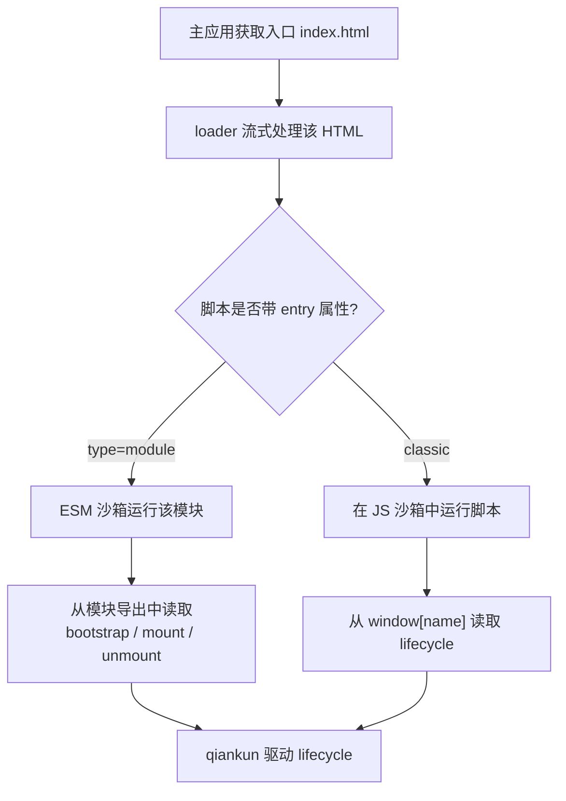

# 第 1 步 —— 构建微应用

一个 qiankun 微应用就是一个普通的 Web 应用，只是它额外导出三个 lifecycle 函数 —— `bootstrap`、`mount` 和 `unmount` —— 并标记自己的入口脚本，以便 loader 能够找到它们。在这一步中，你会把一个全新的 Vite 应用改造成既能作为微应用、又能独立运行的应用，并在把它接入主应用之前先独立验证一遍（接入见[第 2 步](/zh-CN/tutorial/build-the-main-app)）。

这里我们使用 Vite + React。Vue 除了框架调用不同之外完全一致，差异会在行内标注。对于 Webpack 微应用，参见[让 Webpack 应用适配 qiankun](/zh-CN/cookbook/prepare-a-webpack-app)。

## 初始化一个 Vite 应用

创建一个标准的 Vite 应用，并将 qiankun 的 bundler 插件安装为开发依赖。

::: code-group

```bash [React]
npm create vite@latest react-app -- --template react-ts
cd react-app
npm install
npm install -D @qiankunjs/bundler-plugin
```

```bash [Vue]
npm create vite@latest vue-app -- --template vue-ts
cd vue-app
npm install
npm install -D @qiankunjs/bundler-plugin
```

:::

::: tip 更推荐使用脚手架
`npm create qiankun` 会生成一个开箱即用的 React 或 Vue 微应用，下文所有的配置都已经就位。参见 [create-qiankun](/zh-CN/ecosystem/create-qiankun)。
:::

## 配置 Vite 插件

在框架插件旁边加入 qiankun 的 Vite 插件。它位于 `/vite` 子路径下，调用时不需要传入任何参数。

::: code-group

```ts [React — vite.config.ts]
import { qiankun } from '@qiankunjs/bundler-plugin/vite';
import react from '@vitejs/plugin-react';
import { defineConfig } from 'vite';

export default defineConfig({
  plugins: [react(), qiankun()],
  server: { port: 7100, strictPort: true },
});
```

```ts [Vue — vite.config.ts]
import { qiankun } from '@qiankunjs/bundler-plugin/vite';
import vue from '@vitejs/plugin-vue';
import { defineConfig } from 'vite';

export default defineConfig({
  plugins: [vue(), qiankun()],
  server: { port: 7101, strictPort: true },
});
```

:::

`qiankun()` 插件只做两件事，除此之外别无其他：

- **CORS。** 它会在开发 `server` 和 `preview` 服务器上都设置 `cors: true` 与 `Access-Control-Allow-Origin: *`，这样主应用就能跨域获取该应用的入口 HTML 及其模块依赖图。
- **入口标记。** 在 `build` 时，它会给产物 `index.html` 中的入口 module 脚本添加 `entry` 属性（见下文）。而在开发态 serve 时它什么都不做 —— ESM 沙箱会通过 lifecycle 导出来识别入口，因此不需要标记。

`server.port` 固定了主应用 `entry` 指向的端口；`strictPort: true` 让 Vite 在端口被占用时直接快速失败，而不是悄悄换用另一个端口。

::: warning 为每个应用分配固定且唯一的端口
主应用是通过微应用开发服务器的 URL（例如 `//localhost:7100`）来注册它的。如果端口发生漂移，主应用就会加载到错误的应用，甚至什么都加载不到。请务必用 `strictPort: true` 把端口钉死。
:::

Vite 插件不接受任何选项。对于 Webpack 的对应实现（`QiankunWebpackPlugin`，它唯一的选项是 `packageName`），参见 [@qiankunjs/bundler-plugin](/zh-CN/ecosystem/bundler-plugin)。

## 编写 lifecycle 入口

替换应用的入口模块，让它导出三个 lifecycle，同时保留独立运行的分支。关键手法是把渲染逻辑抽取成一个 `render(props)` 函数，qiankun 模式和独立模式都调用它。

::: code-group

```tsx [React — src/main.tsx]
import React from 'react';
import ReactDOM from 'react-dom/client';
import App from './App';

declare global {
  interface Window {
    __POWERED_BY_QIANKUN__?: boolean;
    [key: string]: unknown;
  }
}

let root: ReactDOM.Root | undefined;

function render(props: { container?: Element } = {}) {
  const container = props.container?.querySelector('#root') ?? document.getElementById('root');
  if (!container) return;

  root = ReactDOM.createRoot(container);
  root.render(
    <React.StrictMode>
      <App />
    </React.StrictMode>,
  );
}

export async function bootstrap() {
  console.log('[react] bootstrap');
}

export async function mount(props: { container?: Element }) {
  render(props);
}

export async function unmount(_props: { container?: Element }) {
  root?.unmount();
  root = undefined;
}

if (window.__POWERED_BY_QIANKUN__) {
  // classic-mode fallback: expose the lifecycles on window under the registered app name
  window['react'] = { bootstrap, mount, unmount };
} else {
  render();
}
```

```ts [Vue — src/main.ts]
import { createApp } from 'vue';
import App from './App.vue';

declare global {
  interface Window {
    __POWERED_BY_QIANKUN__?: boolean;
    [key: string]: unknown;
  }
}

let app: ReturnType<typeof createApp> | undefined;

function render(props: { container?: Element } = {}) {
  const container = props.container?.querySelector('#app') ?? document.getElementById('app');
  if (!container) return;

  app = createApp(App);
  app.mount(container);
}

export async function bootstrap() {
  console.log('[vue] bootstrap');
}

export async function mount(props: { container?: Element }) {
  render(props);
}

export async function unmount(_props: { container?: Element }) {
  app?.unmount();
  app = undefined;
}

if (window.__POWERED_BY_QIANKUN__) {
  // classic-mode fallback: expose the lifecycles on window under the registered app name
  window['vue'] = { bootstrap, mount, unmount };
} else {
  render();
}
```

:::

### 各部分的作用

- **`bootstrap`** 只在应用首次加载时运行一次。在这里做一次性的初始化，并保持轻量。
- **`mount(props)`** 在每次激活时运行。它把应用渲染到 qiankun 提供的 DOM 节点中。qiankun 会把 `container`（一个 `HTMLElement`）连同 single-spa 的标准 props 一起注入到 `props` 中，因此 `mount` 接收到的是 `{ ...customProps, container }`。
- **`unmount(props)`** 在每次停用时运行。它必须彻底销毁应用 —— React 用 `root.unmount()`，Vue 用 `app.unmount()` —— 并清空对它的引用，以便下一次 mount 从干净的状态开始。泄漏的 mount 会破坏重新挂载以及[多实例运行](/zh-CN/cookbook/run-multiple-instances)。

这三个函数都必须是 `async` 的（返回一个 `Promise`）。此外还支持一个可选的 `update` lifecycle，但这里用不到。

### 定位挂载节点

```ts
const container = props.container?.querySelector('#root') ?? document.getElementById('root');
```

这一行代码在两种场景下都能工作。被主应用托管时，`props.container` 是 qiankun 把应用挂载进去的那个元素，应用则渲染到它内部的 `#root` 中。独立运行时，`props.container` 不存在，于是回退到页面自身的 `#root`。Vue 用的是 `#app`；请使用你 `index.html` 中声明的那个 id。

::: danger props.container 由 qiankun 提供 —— 不要硬编码全局选择器
在 qiankun 下，你应用的标记位于主应用页面内部，而非文档根节点；而且同一个应用的多个实例可能同时存在于页面上。请始终渲染到 `props.container` 中，只有在独立运行时才回退到全局的 `document.getElementById(...)`。在被托管时直接使用 `document.getElementById('root')`，可能会选中主应用的节点或错误的实例。
:::

### 独立运行 vs 被托管：双分支模式

入口文件的末尾决定了应用如何启动：

```ts
if (window.__POWERED_BY_QIANKUN__) {
  window['react'] = { bootstrap, mount, unmount };
} else {
  render();
}
```

`window.__POWERED_BY_QIANKUN__` 是 qiankun 在你的代码运行之前，设置在沙箱化 `window` 上的一个标志位。当它不存在时，说明应用在独立运行，于是我们立即渲染。当它存在时，说明 qiankun 掌控着一切，会自行调用 lifecycle —— 此时我们绝不能在这里调用 `render()`。

既然我们已经 `export` 了 lifecycle，为什么还要做 `window['react'] = { ... }` 这个赋值？

- 在 **ESM 沙箱**（Vite 应用无论开发还是生产都走的默认路径）下，你原生 ESM `export` 出的 `bootstrap`/`mount`/`unmount` **就是** qiankun 拾取的 lifecycle。这是主要机制。
- `window['<name>']` 赋值是一个 **classic 模式的回退方案**。如果这个应用哪天走的是 classic（非 module）路径加载，qiankun 会从全局变量上读取 lifecycle。该全局变量的键名必须与你在主应用中注册该应用时所用的 `name` 一致（这里是 `react`）。

这两种机制分别对应 qiankun 的两条执行路径 —— 完整介绍参见 [JS 沙箱](/zh-CN/concepts/js-sandbox)和 [ESM 沙箱](/zh-CN/concepts/esm-sandbox)。同时保留两者能让应用在任意路径下都保持可移植性。

::: info Vue esm-bundler 标志
用 Vite 8 构建的 Vue 应用还应在 `vite.config.ts` 中定义 `__VUE_OPTIONS_API__` 等标志。这属于标准的 Vue esm-bundler 配置，而非 qiankun 的要求；参见 [Vite 配方](/zh-CN/cookbook/prepare-a-vite-app)。
:::

## 在 index.html 中标记入口

loader 通过 `entry` 属性来选出入口脚本。你的 `index.html` 需要恰好有一个 module 脚本，并标记 `entry`：

```html [index.html]
<!doctype html>
<html lang="en">
  <head>
    <meta charset="UTF-8" />
    <meta name="viewport" content="width=device-width, initial-scale=1.0" />
    <title>React micro app · qiankun</title>
    <style>
      /* standalone-only page background; inside qiankun the host owns the page */
      body {
        margin: 0;
        background: #f7f8fa;
      }
    </style>
  </head>
  <body>
    <div id="root"></div>
    <script type="module" src="/src/main.tsx" entry></script>
  </body>
</html>
```

- **`type="module"`** 选择 ESM 路径（ESM 沙箱）。classic 入口则不带它。
- **`entry`** 是 loader 所依据的契约。在开发态 serve 时，Vite 会剥离掉这个未知属性，且插件不会重新加回来 —— 这没有问题，因为 ESM 引擎会通过 lifecycle 导出来识别入口。在 `build` 时，插件会把 `entry` 属性写回到产物 `index.html` 中。
- 那段内联的 `<style>` **仅在独立运行时**设置页面背景。在 qiankun 内部，页面外壳由主应用掌控，因此请把应用级的 `body`/`html` 规则排除在组件样式之外。

::: warning 有且仅有一个入口脚本
一个 HTML 入口最多只能包含一个带 `entry` 属性的脚本。出现第二个会让 loader 抛出 `QiankunError`。只有外部脚本（带 `src`）才能作为入口；页面上的其他脚本会正常加载。
:::



在 Webpack 下，你无需手写入口脚本标签 —— `html-webpack-plugin` 会注入它，`QiankunWebpackPlugin` 会加上 `entry` 属性。参见 [bundler-plugin 参考](/zh-CN/ecosystem/bundler-plugin)。

## 独立运行验证

在引入主应用之前，先确认该应用完全独立时仍能正常工作。

```bash
npm run dev
```

在其端口上打开应用（React 示例为 `http://localhost:7100`）。由于此时 `window.__POWERED_BY_QIANKUN__` 是 undefined，`else` 分支会调用 `render()`，你应当看到它就是一个普通的 Vite 应用 —— 路由、热更新等等一应俱全。如果它在独立模式下无法渲染，请先修复这个问题；被托管路径正是构建在同一个 `render(props)` 之上的。

当微应用能够构建、能够独立渲染、并且导出了它的 lifecycle 之后，继续前往[第 2 步 —— 构建主应用](/zh-CN/tutorial/build-the-main-app)，去注册并托管它。
