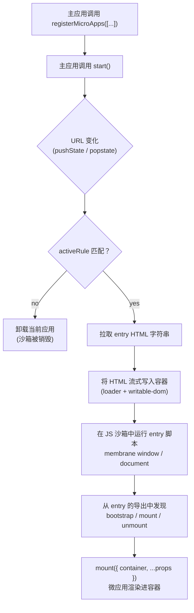

# 教程：搭建一个主应用和一个微应用

本教程将带你亲手搭建一套 qiankun v3 环境：一个在 URL 匹配某个路由时挂载**微应用**的**主应用**（host）。你将手动串联每一个环节——不借助脚手架——从而在使用自动化工具之前，先理解每一个运转的部件。

如果你只想直接生成一个现成的项目，请改用 [create-qiankun](/zh-CN/ecosystem/create-qiankun)。当你想弄清楚脚手架究竟生成了什么、以及为什么这么生成时，再回到这里。

## 你将构建什么

两个相互独立的 [Vite](https://vitejs.dev) 项目：

- 一个运行在端口 `7099` 上的**主应用**（host）。它渲染一层外壳——一个侧边栏加一个容器元素——并针对某个路由注册一个微应用。
- 一个运行在端口 `7100` 上的**微应用**（React 或 Vue，任选其一）。它导出 qiankun 生命周期函数，并使用 `@qiankunjs/bundler-plugin` 构建，以便其 HTML entry 被正确标记。

当你在主应用中导航到 `/sub` 时，qiankun 会拉取微应用的 `index.html`，将其流式写入主应用的容器，在 JS 沙箱中运行其 entry 脚本，并调用微应用的 `mount`。当你离开该路由时，qiankun 会调用 `unmount` 并销毁沙箱。这个微应用自身也能在 `http://localhost:7100` 独立运行。

### 最终形态

```
main (host)          http://localhost:7099
 ├── sidebar          nav link → history.pushState('/sub')
 └── #subapp-stage    ← qiankun mounts the micro-app here

sub  (micro-app)     http://localhost:7100
 └── #root            ← the micro-app renders its own tree here
```

## 架构

下面是你即将组装的流程。主应用只注册一次应用；此后每一次路由变化都会与各应用的 `activeRule` 进行匹配，被匹配到的应用会被流式加载并挂载到共享容器中。



有两点值得提前留意，因为它们会影响下面的每一步：

- 主应用交给 qiankun 的是一个**字符串 entry**（一个 HTML URL）和一个 **HTMLElement 容器**。拉取和流式加载由 qiankun 完成；你永远不会把一个预先拉取好的模板或组件交给它。
- 微应用的 HTML 必须恰好包含**一个 entry 脚本**——即导出生命周期的那个脚本。bundler 插件会为你标记它。若包含第二个 entry 脚本，loader 会抛出异常。

关于每一个箭头背后的概念——流式加载、沙箱、样式隔离——请参阅[架构总览](/zh-CN/concepts/architecture)。完成本教程并不需要这些知识。

## 前置条件

- Node `>= 20.19` 以及一个包管理器（本教程使用 `pnpm`，但在你自己的项目中 `npm`/`yarn` 同样适用）。
- 熟悉某个前端框架。微应用示例使用 React 和 Vue；任选其一。
- 两个空闲端口：主应用用 `7099`，微应用用 `7100`。

::: info 版本
本教程面向 qiankun `3.0.0-rc.21` 和 `@qiankunjs/bundler-plugin`。v3 API 与 qiankun 2.x 有相当大的差异——如果你在迁移一套现有环境，请结合[从 qiankun 2.x 迁移](/zh-CN/cookbook/migrate-from-2x)一起阅读。
:::

## 项目结构

你将创建两个平级目录，每个都是独立的 Vite 项目，拥有各自的 `package.json` 和开发服务器：

```
qiankun-tutorial/
├── main/            # the host — port 7099
│   ├── index.html
│   ├── vite.config.ts
│   └── src/
│       ├── main.tsx        # renders the shell, registers + starts qiankun
│       └── App.tsx         # sidebar + the #subapp-stage container
└── sub/             # the micro-app — port 7100
    ├── index.html          # one entry script, marked by the plugin
    ├── vite.config.ts      # uses @qiankunjs/bundler-plugin/vite
    └── src/
        └── main.tsx        # exports bootstrap / mount / unmount
```

这两个项目从不共享代码或构建产物。它们仅通过 HTTP 通信：主应用跨域拉取微应用的 entry URL，正因如此，微应用的开发服务器必须提供宽松的 CORS 响应头（在 Vite 一侧，bundler 插件会为你配置好这一点）。

## 路线图

本教程分为三步。请按顺序进行——微应用没跑起来之前，主应用没有任何东西可挂载；两者都启动之前，你也无法验证串联是否正确。

| 步骤 | 你要构建 | 关键 API |
| --- | --- | --- |
| [第 1 步 — 构建微应用](/zh-CN/tutorial/build-the-micro-app) | 微应用：`bootstrap`/`mount`/`unmount` 导出、一个带单个 entry 脚本的 `index.html`，以及 Vite bundler 插件。 | `@qiankunjs/bundler-plugin/vite`、`__POWERED_BY_QIANKUN__` |
| [第 2 步 — 构建主应用](/zh-CN/tutorial/build-the-main-app) | 主应用：一个持久的容器元素、带 `activeRule` 的 `registerMicroApps`，以及 `start`。 | [`registerMicroApps`](/zh-CN/api/register-micro-apps)、[`start`](/zh-CN/api/start) |
| [第 3 步 — 连接、运行与验证](/zh-CN/tutorial/run-and-verify) | 启动两个开发服务器，按路由导航，并在浏览器中确认 mount/unmount。 | 通过 `history.pushState` 路由、`single-spa:routing-event` |

### 第 1 步 — 搭建微应用

微应用就是一个普通应用，只是它额外导出三个异步生命周期函数，并且能渲染进 qiankun 交给它的容器。你将：

- 从 entry 模块导出 `bootstrap`、`mount` 和 `unmount`，被托管时渲染进 `props.container`，否则回退到独立运行时的 DOM。
- 加入 `@qiankunjs/bundler-plugin/vite`，它会配置 CORS 并标记那个唯一的 entry `<script>`，以便 loader 能找到生命周期。
- 保持该应用能在 `http://localhost:7100` 独立运行。

### 第 2 步 — 搭建主应用

主应用掌管页面，并决定哪个微应用可见。你将：

- 渲染一个稳定的容器元素（一个 `HTMLElement`），它在主应用的整个生命周期内保持挂载——qiankun 在注册时就捕获了这个引用。
- 调用 [`registerMicroApps`](/zh-CN/api/register-micro-apps)，传入微应用的 `name`、字符串 `entry`（`//localhost:7100`）、`container` 元素，以及一条 `activeRule` 路由。
- 调用一次 [`start`](/zh-CN/api/start) 以启用路由匹配。

### 第 3 步 — 串联并运行

两个项目都就绪后，你将启动两个开发服务器，点击一个把 `/sub` 压入历史记录的导航链接，然后看着 qiankun 把微应用流式加载进来。你将确认离开路由时它会被卸载，以及沙箱标志（`__POWERED_BY_QIANKUN__`）只在被托管时才会被设置。

## 关于两条不变量的说明

v3 契约中的两条规则会反复出现。现在就把它们内化，后面的步骤就会变得显而易见：

::: warning 字符串 entry，HTMLElement 容器
在 v3 中，`entry` 始终是指向微应用 HTML 的**字符串 URL**（例如 `//localhost:7100`），而 `container` 是一个 **`HTMLElement` 实例**（或一个由 qiankun 解析的选择器字符串）。2.x 的配置对象式 entry 形式和「传入模板」的形式都已移除。参阅 [AppConfiguration](/zh-CN/api/configuration) 和[类型参考](/zh-CN/api/types)。
:::

::: danger 恰好一个 entry 脚本
微应用的 HTML entry 必须恰好包含**一个**带 `entry` 属性的脚本——该脚本的导出即 qiankun 挂载的生命周期。bundler 插件会为你添加这个属性。如果有两个脚本携带 `entry`，loader 会抛出 `QiankunError`。切勿标记多于一个。
:::

准备就绪。从[第 1 步 — 构建微应用](/zh-CN/tutorial/build-the-micro-app)开始。
