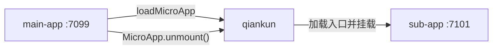

# 教程：搭建主应用和微应用

本教程将手动搭建一套精简的 qiankun 应用。你会创建两个相互独立的 React 应用，并通过 `loadMicroApp` 把其中一个挂载到另一个应用中。整个过程不使用 qiankun 脚手架，因此可以直接看到应用之间的契约，同时不引入路由编排或运行时实现细节。

如果只想尽快运行一个项目，请直接阅读[快速上手](/zh-CN/guide/getting-started)。

## 最终结构

- **main-app** 运行在 `http://localhost:7099`。它拥有一个 `HTMLElement` 容器，并决定微应用何时存在。
- **sub-app** 运行在 `http://localhost:7101`。它导出 qiankun 生命周期，也可以独立运行。



两个项目分别拥有自己的依赖、开发服务器和构建流程。运行时唯一的连接是微应用的 HTML 入口地址。

## 前置要求

- Node.js `>=20.19` 和 pnpm。
- 现代 Chromium 浏览器或 Safari。
- 两个空闲端口：`7099` 和 `7101`。

## 项目目录

```text
qiankun-tutorial/
├── main-app/       # React 主应用，端口 7099
└── sub-app/        # React 微应用，端口 7101
```

请在同一个 `qiankun-tutorial` 目录下创建这两个项目。它们不需要放在 monorepo 中。

## 三个步骤

| 步骤 | 结果 |
| --- | --- |
| [1. 搭建微应用](/zh-CN/tutorial/build-the-micro-app) | 配置 Vite 服务器，并导出 `bootstrap`、`mount` 和 `unmount`。 |
| [2. 搭建主应用](/zh-CN/tutorial/build-the-main-app) | 把微应用加载进 `HTMLElement`，并保留它的 `MicroApp` 句柄。 |
| [3. 运行并验证](/zh-CN/tutorial/run-and-verify) | 验证挂载、卸载和独立开发。 |

## 需要记住的契约

主应用提供：

- 应用的 `name`；
- 指向微应用 HTML 的 `entry` 字符串；
- 已经存在的 `HTMLElement` 类型 `container`。

微应用提供 `bootstrap`、`mount` 和 `unmount`。qiankun 连接两端，并向主应用返回一个句柄。当实例不再需要时，主应用必须调用这个句柄的 `unmount()` 方法。

从[第 1 步：搭建微应用](/zh-CN/tutorial/build-the-micro-app)开始。
