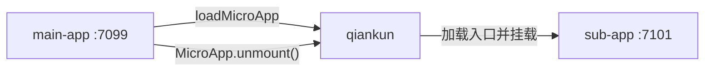

# 教程：搭建主应用和微应用

本教程通过手动搭建一套精简的 qiankun 应用，说明主应用与微应用之间的接入约定。教程将创建两个相互独立的 React 应用，并通过 `loadMicroApp` 将微应用挂载到主应用中。整个过程不使用 qiankun 脚手架，也不涉及路由编排或运行时实现细节。

如果只想尽快运行一个项目，请直接阅读[快速上手](/zh-CN/guide/getting-started)。

## 最终结构

- **main-app** 运行在 `http://localhost:7099`。它创建用于挂载的 `HTMLElement`，并管理微应用实例的生命周期。
- **sub-app** 运行在 `http://localhost:7101`。它导出 qiankun 生命周期，也可以独立运行。



两个项目分别管理依赖、开发服务器和构建流程。两个项目在运行时仅通过微应用的 HTML 入口地址产生关联。

## 前置要求

- Node.js `>=20.19` 和 npm。
- 基于 Chromium 的浏览器（Chrome、Edge 等）或 Safari。
- 两个空闲端口：`7099` 和 `7101`。

## 项目目录

```text
qiankun-tutorial/
├── main-app/       # React 主应用，端口 7099
└── sub-app/        # React 微应用，端口 7101
```

两个项目应创建在同一个 `qiankun-tutorial` 目录下，无需放进同一个 monorepo。

## 三个步骤

| 步骤 | 结果 |
| --- | --- |
| [1. 搭建微应用](/zh-CN/tutorial/build-the-micro-app) | 配置 Vite 服务器，并导出 `bootstrap`、`mount` 和 `unmount`。 |
| [2. 搭建主应用](/zh-CN/tutorial/build-the-main-app) | 将微应用加载到 `HTMLElement`，并保留对应的 `MicroApp` 句柄。 |
| [3. 运行并验证](/zh-CN/tutorial/run-and-verify) | 验证挂载、卸载和独立运行。 |

## 接入约定

主应用提供：

- 应用的 `name`；
- 指向微应用 HTML 的 `entry` 字符串；
- 一个已存在于页面中的 `HTMLElement`，作为 `container`。

微应用需要提供 `bootstrap`、`mount` 和 `unmount`。qiankun 根据双方提供的信息创建实例，并向主应用返回句柄。实例不再使用时，主应用必须通过该句柄调用 `unmount()`。

首先完成[第 1 步：搭建微应用](/zh-CN/tutorial/build-the-micro-app)。
