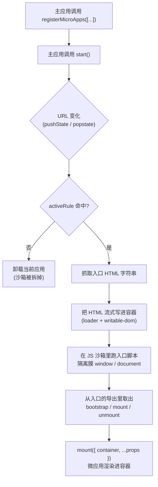

# 教程：搭一个主应用和一个微应用

这篇教程带你从零手搭一套 qiankun v3:一个**主应用**在 URL 命中某条路由时，把一个**微应用**挂载进来。每根线都自己接——不用脚手架——目的是在动用自动化之前，先把每个环节看明白。

只想要个现成项目，那直接用 [create-qiankun](/zh-CN/ecosystem/create-qiankun)。等你想搞清楚那套脚手架到底生成了什么、为什么这么生成，再回来看这篇。

## 你会搭出什么

两个互相独立的 [Vite](https://vitejs.dev) 项目：

- 一个跑在 `7099` 端口的**主应用**(基座)。它渲染一层外壳——一个侧边栏加一个容器元素——并把一个微应用注册到某条路由上。
- 一个跑在 `7100` 端口的**微应用**(React 或 Vue，你挑一个)。它导出 qiankun 的生命周期函数，并用 `@qiankunjs/bundler-plugin` 构建，好让它的 HTML 入口被正确标记。

当你把主应用导航到 `/sub`,qiankun 会去抓微应用的 `index.html`，流式写进主应用的容器，在 JS 沙箱里跑它的入口脚本，再调用微应用的 `mount`。导航离开时，qiankun 调 `unmount`，把沙箱拆掉。这个微应用本身也能独立跑在 `http://localhost:7100`。

### 最终形态

```
main (host)          http://localhost:7099
 ├── sidebar          nav link → history.pushState('/sub')
 └── #subapp-stage    ← qiankun mounts the micro-app here

sub  (micro-app)     http://localhost:7100
 └── #root            ← the micro-app renders its own tree here
```

## 架构

下面是你即将接起来的整条流程。主应用只注册一次；之后每次路由变化，都拿去和各个应用的 `activeRule` 匹配，命中的那个被流式加载进来、挂载到共享容器里。



有两点先摆在前面，因为下面每一步都受它俩支配：

- 主应用交给 qiankun 的是一个**字符串 entry**(一个 HTML 地址)和一个 **HTMLElement 容器**。抓取和流式写入都是 qiankun 干的；你不用递给它预先抓好的模板，也不用递组件。
- 微应用的 HTML 里必须**只有一个 entry 脚本**——就是那个导出生命周期的脚本。bundler 插件会替你标好。多放一个 entry 脚本，loader 会直接抛错。

每根箭头背后的概念——流式加载、沙箱、样式隔离——都在[架构概览](/zh-CN/concepts/architecture)里。这篇教程不需要它们你也能做完。

## 前置条件

- Node `>= 20.19`，加一个包管理器(本教程用 `pnpm`，你自己的项目里 `npm`/`yarn` 也行)。
- 熟悉一个前端框架。微应用示例用 React 和 Vue，挑一个。
- 两个空闲端口：主应用用 `7099`，微应用用 `7100`。

::: info 版本
本教程针对 qiankun `3.0.0-rc.21` 和 `@qiankunjs/bundler-plugin`。v3 的 API 跟 qiankun 2.x 差别很大——如果你是在迁移一套现成的接入，配合[从 qiankun 2.x 迁移](/zh-CN/cookbook/migrate-from-2x)一起看。
:::

## 项目结构

你会建两个平级目录，各自是一个独立的 Vite 项目，有自己的 `package.json` 和 dev server:

```
qiankun-tutorial/
├── main/            # the host — port 7099
│   ├── index.html
│   ├── vite.config.ts
│   └── src/
│       ├── main.tsx        # renders the shell, registers + starts qiankun
│       └── App.tsx         # sidebar + the #subapp-stage container
└── sub/             # the micro-app — port 7100
    ├── index.html          # one entry script, marked by the plugin
    ├── vite.config.ts      # uses @qiankunjs/bundler-plugin/vite
    └── src/
        └── main.tsx        # exports bootstrap / mount / unmount
```

这两个项目不共享代码，也不共享构建产物。它们只通过 HTTP 打交道：主应用跨域抓微应用的入口地址，所以微应用的 dev server 必须给出宽松的 CORS 头(Vite 这边 bundler 插件已经替你配好了)。

## 路线图

教程分三步。按顺序来——微应用没跑起来，主应用就没东西可挂；两边都没起来，你也没法验证接线对不对。

| 步骤 | 你要搭的 | 关键 API |
| --- | --- | --- |
| [第一步 — 搭微应用](/zh-CN/tutorial/build-the-micro-app) | 微应用：`bootstrap`/`mount`/`unmount` 导出、一个只含单个 entry 脚本的 `index.html`，以及 Vite bundler 插件。 | `@qiankunjs/bundler-plugin/vite`、`__POWERED_BY_QIANKUN__` |
| [第二步 — 搭主应用](/zh-CN/tutorial/build-the-main-app) | 主应用：一个常驻的容器元素、带 `activeRule` 的 `registerMicroApps`，以及 `start`。 | [`registerMicroApps`](/zh-CN/api/register-micro-apps)、[`start`](/zh-CN/api/start) |
| [第三步 — 接起来、跑起来、验证](/zh-CN/tutorial/run-and-verify) | 把两个 dev server 跑起来，按路由导航，在浏览器里确认挂载/卸载。 | 用 `history.pushState` 路由、`single-spa:routing-event` |

### 第一步 — 搭微应用

微应用就是一个普通应用，只是额外导出了三个异步生命周期函数，并且能渲染进 qiankun 递给它的容器。你要做的：

- 从入口模块导出 `bootstrap`、`mount`、`unmount`，被托管时渲染进 `props.container`，否则退回到独立运行时的 DOM。
- 加上 `@qiankunjs/bundler-plugin/vite`，它负责配好 CORS，并标记那个唯一的 entry `<script>`，好让 loader 找到生命周期。
- 保证这个应用自己也能独立跑在 `http://localhost:7100`。

### 第二步 — 搭主应用

主应用掌管整个页面，由它决定哪个微应用可见。你要做的：

- 渲染一个稳定的容器元素(一个 `HTMLElement`)，它在主应用的整个生命周期里都挂着——qiankun 在注册时就把这个引用抓住了。
- 调用 [`registerMicroApps`](/zh-CN/api/register-micro-apps)，传入微应用的 `name`、字符串 `entry`(`//localhost:7100`)、`container` 元素，和一条 `activeRule` 路由。
- 调一次 [`start`](/zh-CN/api/start)，激活路由匹配。

### 第三步 — 串起来跑

两个项目都就位后，你会启动两个 dev server，点一个把 `/sub` 压进 history 的导航链接，看着 qiankun 把微应用流式加载进来。你会确认：导航离开时它被卸载，并且沙箱标记(`__POWERED_BY_QIANKUN__`)只在被托管时才置上。

## 关于两条铁律

v3 契约里有两条规则会反复出现。现在就记牢，后面几步会觉得理所当然：

::: warning 字符串 entry,HTMLElement 容器
在 v3 里，`entry` 永远是指向微应用 HTML 的**字符串 URL**(比如 `//localhost:7100`),`container` 是一个 **`HTMLElement` 实例**(或者一个 qiankun 会去解析的选择器字符串)。2.x 那种配置对象形式的 entry、以及「传一个模板」的写法，都没有了。参见 [AppConfiguration](/zh-CN/api/configuration) 和[类型参考](/zh-CN/api/types)。
:::

::: danger 有且只有一个 entry 脚本
微应用的 HTML 入口必须**只**含一个带 `entry` 属性的脚本——那个脚本的导出，就是 qiankun 要挂载的生命周期。bundler 插件会替你加上这个属性。要是两个脚本都带 `entry`,loader 会抛 `QiankunError`。绝不要标记超过一个。
:::

准备好了。从[第一步 — 搭微应用](/zh-CN/tutorial/build-the-micro-app)开始。
