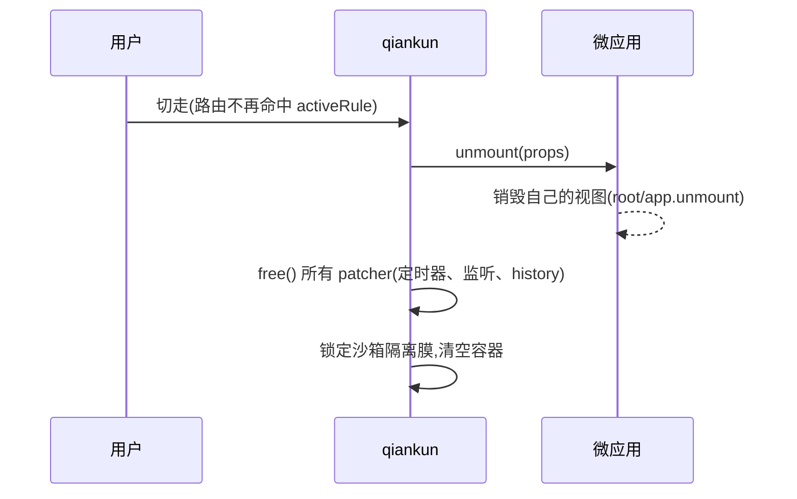

# 第三步 —— 接入、跑起来、验证

[第一步](/zh-CN/tutorial/build-the-micro-app)里你写好了一个微应用，[第二步](/zh-CN/tutorial/build-the-main-app)在主应用里把它注册了进来。这一步把两边的服务都启起来，看着微应用流式地灌进容器，再确认隔离和清理是真的在生效。最后收个尾：列一遍第一次跑最容易撞上的报错，以及接下来该往哪走。

## 把两个开发服务都启起来

主应用和每个微应用各跑各的开发服务，互不相干。在不同的终端里分别启动(或者用 monorepo 的一键脚本，把所有应用并行拉起来)。

::: code-group

```bash [main app]
# in the main app directory
npm run dev
# host on http://localhost:7099
```

```bash [micro-app (Vite)]
# in the micro-app directory
npm run dev
# sub-app on http://localhost:7100
```

```bash [monorepo (this repo)]
# builds packages first, then runs every example in parallel
pnpm start:example
# open http://localhost:7099
```

:::

打开主应用 `http://localhost:7099`，切到你用 `activeRule` 注册的那个路由(比如 `/react`)。qiankun 拿当前的 `window.location.pathname` 去和 `activeRule` 匹配，命中后抓取微应用的 HTML 入口，把它流式地灌进容器。

加载器不会等整份文档下载完再一次性写入，而是字节一到就往真实 DOM 里增量提交。所以脚本还在下载的过程中，你就能在 Elements 面板里看到微应用的标签一点点冒出来。这条流水线怎么运转的，见 [HTML 入口流式加载](/zh-CN/concepts/html-entry-loading)。

## 微应用的服务要放开 CORS

qiankun 用一个包装过的 `window.fetch`，从主应用这边去拉每个微应用的入口 HTML 和资源。微应用跑在另一个端口上，所以每个请求都是跨域的——微应用的开发服务必须带上 `Access-Control-Allow-Origin` 响应头，否则浏览器会拦掉这次 fetch，微应用永远加载不出来。

这个头怎么加，取决于你用的打包工具：

::: code-group

```ts [Vite — vite.config.ts]
import { defineConfig } from 'vite';
import { qiankun } from '@qiankunjs/bundler-plugin/vite';

export default defineConfig({
  // qiankun() handles dev/preview CORS headers and marks the entry script
  plugins: [qiankun()],
  server: { port: 7100, strictPort: true },
});
```

```js [Webpack — webpack.config.js]
const { QiankunWebpackPlugin } = require('@qiankunjs/bundler-plugin');

module.exports = {
  // ...
  plugins: [new QiankunWebpackPlugin()],
  devServer: {
    port: 7102,
    headers: { 'Access-Control-Allow-Origin': '*' },
    allowedHosts: 'all',
  },
};
```

```bash [Static HTML — http-server]
# --cors adds Access-Control-Allow-Origin: *
http-server . --cors -c-1 -p 7104
```

:::

Vite 的 `qiankun()` 插件会替你把 dev/preview 的 CORS 头设好。Webpack 和纯静态服务就得像上面那样手动加。完整的接入步骤见 [@qiankunjs/bundler-plugin](/zh-CN/ecosystem/bundler-plugin)、[让 Vite 应用接入 qiankun](/zh-CN/cookbook/prepare-a-vite-app) 和[让 Webpack 应用接入 qiankun](/zh-CN/cookbook/prepare-a-webpack-app)。

::: warning 第三方资源同样需要 CORS
入口里加载的东西——vendor 脚本、外链样式——走的是同一套跨域 fetch。那些不带 `Access-Control-Allow-Origin` 的公共 CDN 会直接把加载搞挂。把这类资源放到本地，或者从一个开了 CORS 的源去取。
:::

## 在容器上验证隔离

qiankun 初始化一个微应用时，会清空挂载元素，并往上面打几个 `data-*` 属性。想快速确认应用是不是按预期的隔离方式挂上去的，看这几个属性最省事。在浏览器的 Elements 面板里选中你的容器元素，读它的属性：

```html
<div
  id="subapp-container"
  data-name="react"
  data-version="3.0.0-rc.21"
  data-sandbox-cfg="true"
>
  <!-- the micro-app's streamed DOM lives here -->
</div>
```

| 属性 | 含义 |
| --- | --- |
| `data-name` | 挂在这里的应用注册时的 `name`。它同时也是样式隔离用的 `@scope` 根选择器 `[data-name="<name>"]`。 |
| `data-version` | 挂载这个应用的 qiankun 运行时版本。 |
| `data-sandbox-cfg` | 序列化后的沙箱配置。只要它存在且不是 `"false"`，就说明 JS 沙箱是开着的。 |

还有两个属性只在多实例场景下才会出现：`data-mount-times`(应用挂载超过一次之后)和 `data-instance-id`(同一个应用被同时加载进多个容器时)。这几个值在代码里也读得到，分别是 `el.dataset.name`、`el.dataset.version`、`el.dataset.sandboxCfg`。

想确认 JS 沙箱真的在隔离全局变量，趁微应用挂着的时候，在主应用页面的 console 里跑这一句：

```js
// A global the sub-app assigned to *its* window is invisible on the host window,
// because the sandbox membrane redirects writes to the app's own local target.
window.__SOME_SUBAPP_GLOBAL__; // → undefined on the host
```

读操作仍然会穿透到真实的主应用 `window`，所以微应用照样能拿到它从没碰过的原生浏览器 API——但它的写操作被关在里面出不来。隔离膜还会往沙箱里注入 `window.__POWERED_BY_QIANKUN__ = true`，让微应用能判断自己正跑在 qiankun 下面。完整模型见 [JS 沙箱](/zh-CN/concepts/js-sandbox)。

## 确认路由切走时干净卸载

从微应用的路由切走(切到另一个应用的路由，或者回到只属于主应用的页面)。qiankun 匹配到新路径，把应用卸载掉，并拆掉它先前搭起来的一切。一次正确的卸载会：

- 调用微应用的 `unmount(props)` 生命周期，让它销毁自己的视图(`root.unmount()`、`app.unmount()` 之类);
- 跑一遍每个 patcher 的 `free()`，清掉通过沙箱注册的定时器、摘掉 window 上的事件监听、还原对 `history` 的改动；
- 清空容器里的 DOM。



想查有没有泄漏，就看应用创建的定时器和监听在你离开路由之后还会不会触发。比如应用起的 interval 应该不再打日志了，它挂在 `window` 上的事件处理函数也不该再跑。要是它们还赖着，多半是应用在沙箱托管的那套 API 之外注册了副作用，或者它的 `unmount` 生命周期没把自己的视图清干净。

::: tip 一定要卸载
patcher 只有靠卸载时返回的 `free()` 才会还原自己的副作用。如果你用 `loadMicroApp` 命令式地加载，记得把返回的句柄留住，自己调 `unmount()`。不卸载会漏掉定时器和监听，重新挂载和[跑多个实例](/zh-CN/cookbook/run-multiple-instances)都会被搞坏。
:::

## 第一次跑常见的翻车点

| 现象 | 大概原因 | 怎么修 |
| --- | --- | --- |
| console 里入口请求被 CORS 拦掉，容器一直空着 | 微应用服务没带 `Access-Control-Allow-Origin` | Vite 用 `qiankun()`,Webpack 设 `headers` + `allowedHosts`，静态服务加 `--cors`(见上文)。 |
| `QiankunError: You should not include more than 1 entry scripts in a single HTML entry` | 入口 HTML 里有两个脚本都带了 `entry` 属性 | 有且只有一个脚本标 `entry`。打包插件会替你标好——别自己再手动加一遍。 |
| `QiankunError: You need to export lifecycle functions in <name> entry ...` | 找不到应用导出的生命周期，通常是 name 和全局变量对不上 | 注册用的 `name` 必须和微应用暴露的全局变量一致。一个 `output.library.name` 是 `webpack-app` 的 Webpack 应用，就得注册成 `name: 'webpack-app'`。把 `bootstrap`/`mount`/`unmount` 作为 ESM export 导出(或导出一个 `default` 对象)，或者 `window[name] = { bootstrap, mount, unmount }`。 |
| 应用一直挂不上，或者 qiankun 抓着一个失效的元素 | 注册时容器元素还不在 DOM 里，或者之后被替换 / 重新 key 过 | 等容器存在了再注册(比如放在 mount effect 里)，并且在应用的整个生命周期里让那个元素原样挂着——qiankun 在注册那一刻就把元素引用捕获住了。 |
| 微应用的样式漏到主应用(或者反过来) | 样式隔离没开(默认就是关的) | 用 `configuration: { styleIsolation: true }` 开启，再看[开启 CSS 样式隔离](/zh-CN/cookbook/enable-style-isolation)。 |

::: info Firefox 与 ESM 沙箱应用
ESM 沙箱这条执行路径依赖动态注入的 import map，而 Firefox 不支持。走 ESM 沙箱的微应用在 Firefox 上预期就是跑不起来的，开发和验证请用 Chromium 系的浏览器。走经典打包(UMD/global)方式的应用不受影响。见 [ESM 沙箱](/zh-CN/concepts/esm-sandbox)。
:::

## 接下来去哪

两个应用已经接上了、能流式加载、隔离到位、卸载时也会清理。往下走可以看：

- 把微应用的 CSS 限定在它自己的子树里 —— [开启 CSS 样式隔离](/zh-CN/cookbook/enable-style-isolation)。
- 用 `<MicroApp>` 组件声明式地渲染加载态和错误态 —— [React](/zh-CN/ecosystem/react) 或 [Vue](/zh-CN/ecosystem/vue)。
- 集中处理加载和运行时的失败 —— [处理加载与运行时错误](/zh-CN/cookbook/handle-errors)。
- 加快首屏、减少加载抖动 —— [优化加载与预加载](/zh-CN/cookbook/optimize-loading)。
- 查每一个选项和默认值 —— [API 参考](/zh-CN/api/index)，从 [registerMicroApps](/zh-CN/api/register-micro-apps)、[start](/zh-CN/api/start) 和 [AppConfiguration](/zh-CN/api/configuration) 开始。
