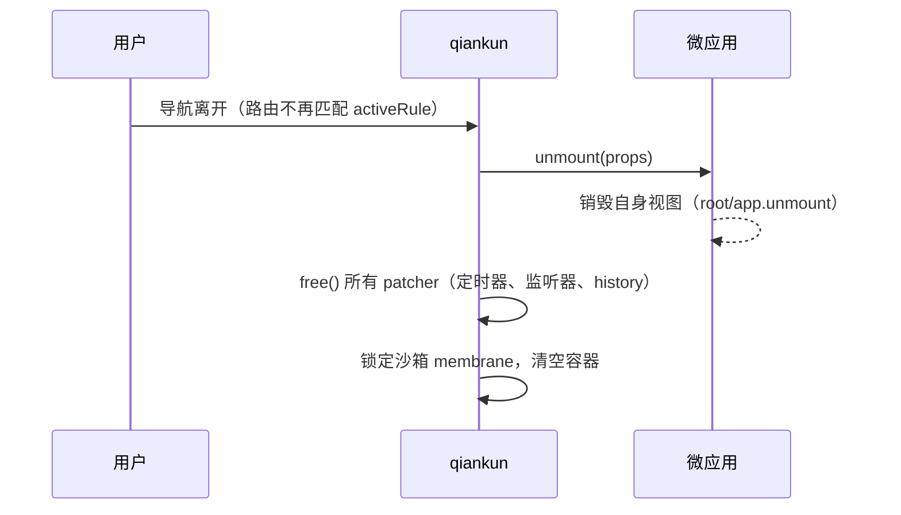

# 第三步 —— 接入、运行并验证

你已经在[第一步](/zh-CN/tutorial/build-the-micro-app)中构建了一个微应用，并在[第二步](/zh-CN/tutorial/build-the-main-app)中从主应用注册了它。这最后一步会同时启动两个服务器，观察微应用流式加载进容器，并验证隔离与清理是否真正生效。文末列出了你在首次运行时最可能遇到的问题，以及后续可以深入的方向。

## 同时启动两个开发服务器

主应用和每个微应用都作为独立的开发服务器运行。请在不同的终端中启动它们（或运行 monorepo 辅助脚本，一次性并行启动所有应用）。

::: code-group

```bash [main app]
# in the main app directory
npm run dev
# host on http://localhost:7099
```

```bash [micro-app (Vite)]
# in the micro-app directory
npm run dev
# sub-app on http://localhost:7100
```

```bash [monorepo (this repo)]
# builds packages first, then runs every example in parallel
pnpm start:example
# open http://localhost:7099
```

:::

在 `http://localhost:7099` 打开主应用，并导航到你用 `activeRule` 注册的路由（例如 `/react`）。qiankun 会将当前的 `window.location.pathname` 与 `activeRule` 进行匹配，拉取微应用的 HTML Entry，并将其流式加载进容器。

由于 loader 会随着字节到达而增量地把 HTML 提交到实时 DOM —— 而不是缓冲整个文档 —— 你可以在 Elements 面板中看到微应用的标记逐步出现，而此时它的脚本还在下载中。关于该管线的工作原理，参见 [HTML Entry 流式加载](/zh-CN/concepts/html-entry-loading)。

## 以宽松的 CORS 策略托管微应用

qiankun 使用一个经过装饰的 `window.fetch`，从主应用所在的源去拉取每个微应用的 Entry HTML 及资源。由于子应用运行在不同的端口上，每个请求都是跨域的，因此子应用的开发服务器必须发送 `Access-Control-Allow-Origin` 响应头。缺少它时，浏览器会阻止该 fetch，微应用将永远无法加载。

如何提供这个响应头取决于所用的 bundler：

::: code-group

```ts [Vite — vite.config.ts]
import { defineConfig } from 'vite';
import { qiankun } from '@qiankunjs/bundler-plugin/vite';

export default defineConfig({
  // qiankun() handles dev/preview CORS headers and marks the entry script
  plugins: [qiankun()],
  server: { port: 7100, strictPort: true },
});
```

```js [Webpack — webpack.config.js]
const { QiankunWebpackPlugin } = require('@qiankunjs/bundler-plugin');

module.exports = {
  // ...
  plugins: [new QiankunWebpackPlugin()],
  devServer: {
    port: 7102,
    headers: { 'Access-Control-Allow-Origin': '*' },
    allowedHosts: 'all',
  },
};
```

```bash [Static HTML — http-server]
# --cors adds Access-Control-Allow-Origin: *
http-server . --cors -c-1 -p 7104
```

:::

Vite 的 `qiankun()` 插件会自动为你设置 dev/preview 的 CORS 响应头。Webpack 和纯静态服务器则需要如上所示手动设置该响应头。完整配置参见 [@qiankunjs/bundler-plugin](/zh-CN/ecosystem/bundler-plugin)、[让 Vite 应用支持 qiankun](/zh-CN/cookbook/prepare-a-vite-app) 以及[让 Webpack 应用支持 qiankun](/zh-CN/cookbook/prepare-a-webpack-app)。

::: warning 第三方资源同样需要 CORS
Entry 加载的一切内容 —— vendor 脚本、外部样式表 —— 都以同样的跨域方式被拉取。省略 `Access-Control-Allow-Origin` 的公共 CDN 会导致加载失败。请将这些资源本地化，或从一个启用了 CORS 的源来托管它们。
:::

## 在容器上验证隔离

当 qiankun 初始化一个微应用时，它会清空挂载元素，并在其上打上若干 `data-*` 属性。检查这些属性是确认应用已按预期隔离方式挂载的最快方式。在浏览器的 Elements 面板中，选中你的容器元素并读取它的属性：

```html
<div
  id="subapp-container"
  data-name="react"
  data-version="3.0.0-rc.21"
  data-sandbox-cfg="true"
>
  <!-- the micro-app's streamed DOM lives here -->
</div>
```

| 属性 | 含义 |
| --- | --- |
| `data-name` | 挂载于此的应用所注册的 `name`。同时也是样式隔离所使用的 `@scope` 根选择器 `[data-name="<name>"]`。 |
| `data-version` | 挂载该应用的 qiankun 运行时版本。 |
| `data-sandbox-cfg` | 序列化后的沙箱配置。存在且不为 `"false"` 表示 JS 沙箱处于激活状态。 |

另外两个属性仅在多实例场景下出现：`data-mount-times`（当一个应用被挂载超过一次时）和 `data-instance-id`（当同一个应用同时被加载进多个容器时）。你也可以在代码中通过 `el.dataset.name`、`el.dataset.version` 和 `el.dataset.sandboxCfg` 读取相同的值。

要确认 JS 沙箱确实隔离了全局变量，可在微应用挂载期间于主应用页面的控制台中运行：

```js
// A global the sub-app assigned to *its* window is invisible on the host window,
// because the sandbox membrane redirects writes to the app's own local target.
window.__SOME_SUBAPP_GLOBAL__; // → undefined on the host
```

读取操作仍会穿透到真实的主应用 `window`，因此应用能看到它从未触碰过的真实浏览器 API —— 但它的写入会被隔离在内。membrane 还会在沙箱内部注入 `window.__POWERED_BY_QIANKUN__ = true`，以便子应用可以检测到自己正运行在 qiankun 之下。完整模型请阅读 [JS 沙箱](/zh-CN/concepts/js-sandbox)。

## 确认路由切换时的干净卸载

从微应用的路由导航离开（切换到另一个应用的路由，或返回仅属于主应用的页面）。qiankun 会匹配新的路径，卸载该应用，并拆除它所建立的一切。一次正确的卸载会：

- 调用子应用的 `unmount(props)` 生命周期钩子，使其销毁自己的视图（`root.unmount()`、`app.unmount()` 等）；
- 运行每个 patcher 的 `free()`，它会清除通过沙箱注册的定时器、移除 window 事件监听器，并还原 `history` 补丁；
- 清空容器的 DOM。



要发现泄漏，可以检查应用创建的定时器和监听器在你离开路由后是否不再触发。例如，应用启动的一个 interval 应停止打印日志，它的 `window` 事件处理函数也应不再运行。如果它们仍然存在，那么该应用很可能在沙箱所补丁的 API 之外注册了副作用，或者它的 `unmount` 生命周期钩子没有清理自己的视图。

::: tip 始终记得卸载
patcher 只有通过卸载时返回的 `free()` 才会还原其副作用。如果你以命令式方式使用 `loadMicroApp`，请保留返回的句柄并自行调用 `unmount()`。跳过卸载会泄漏定时器和监听器，并同时破坏重新挂载和[运行多个实例](/zh-CN/cookbook/run-multiple-instances)。
:::

## 首次运行的常见问题

| 现象 | 可能原因 | 修复方式 |
| --- | --- | --- |
| 控制台中 Entry 请求被 CORS 阻止；容器保持为空 | 子应用服务器未发送 `Access-Control-Allow-Origin` | Vite 使用 `qiankun()`，Webpack 设置 `headers` + `allowedHosts`，静态服务器使用 `--cors`（见上文）。 |
| `QiankunError: You should not include more than 1 entry scripts in a single HTML entry` | Entry HTML 中有两个脚本携带了 `entry` 属性 | 确保只有一个脚本标记了 `entry`。bundler 插件会为你标记 —— 不要再手动添加。 |
| `QiankunError: You need to export lifecycle functions in <name> entry ...` | 找不到应用导出的生命周期函数，通常是 name/global 不匹配 | 注册的 `name` 必须与子应用暴露的全局变量一致。一个 `output.library.name` 为 `webpack-app` 的 Webpack 应用必须以 `name: 'webpack-app'` 注册。请以 ESM 导出（或一个 `default` 对象）的形式导出 `bootstrap`/`mount`/`unmount`，或者赋值 `window[name] = { bootstrap, mount, unmount }`。 |
| 应用始终不挂载，或 qiankun 持有了一个陈旧的元素 | 注册时容器元素不在 DOM 中，或它后来被替换/重新 key 了 | 仅在容器存在之后再注册（例如在一个 mount effect 内部），并在应用的整个生命周期内保持那个确切的元素处于挂载状态 —— qiankun 在注册时就捕获了该元素引用。 |
| 微应用的样式渗漏到主应用（或反之） | 样式隔离未开启（默认关闭） | 通过 `configuration: { styleIsolation: true }` 开启，然后参见[启用 CSS 样式隔离](/zh-CN/cookbook/enable-style-isolation)。 |

::: info Firefox 与 ESM-sandbox 应用
ESM-sandbox 执行路径依赖于动态注入的 import map，而 Firefox 并不支持它。ESM-sandbox 微应用在 Firefox 上预期会失败；请使用基于 Chromium 的浏览器来开发和验证它们。经典（UMD/global）应用不受影响。参见 [ESM 沙箱](/zh-CN/concepts/esm-sandbox)。
:::

## 后续方向

你的两个应用已经接入、流式加载、隔离，并在卸载时完成清理。从这里出发：

- 将微应用的 CSS 限定在它自己的子树内 —— [启用 CSS 样式隔离](/zh-CN/cookbook/enable-style-isolation)。
- 使用 `<MicroApp>` 组件声明式地渲染加载与错误状态 —— [React](/zh-CN/ecosystem/react) 或 [Vue](/zh-CN/ecosystem/vue)。
- 集中处理加载与运行时失败 —— [处理加载与运行时错误](/zh-CN/cookbook/handle-errors)。
- 加快首屏渲染并减少加载卡顿 —— [优化加载与预加载](/zh-CN/cookbook/optimize-loading)。
- 查阅每一个选项及其默认值 —— [API 参考](/zh-CN/api/index)，从 [registerMicroApps](/zh-CN/api/register-micro-apps)、[start](/zh-CN/api/start) 和 [AppConfiguration](/zh-CN/api/configuration) 开始。
